---
hide:
  - toc
---

# 1. A Quick (and Hopefully Painless) Ride Through Python (with Cartoon Foxes)

 Ride Through Python 3 (with Cartoon Foxes)"){.center}

[TOC]

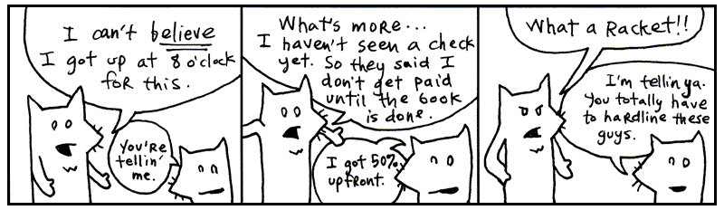

Yeah, these are the two. My asthma’s kickin’ in so I’ve got to go take a puff of
medicated air just now. Be with you in a moment.

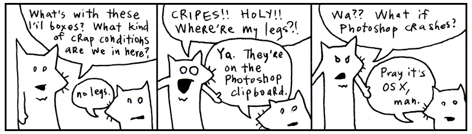

I’m told that this chapter is best accompanied by a rag. Something you can mop
your face with as the sweat pours off your face.

Indeed, we’ll be racing through the whole language. Like striking every match in
a box as quickly as can be done.


## Language and I MEAN Language

*

**Text and images were loving written and hand drawn by a human named _why and updated for Python 3*. 

My conscience won’t let me call Python a _computer_ language. That would imply
that the language works primarily on the computer’s terms. That the language is
designed to accommodate the computer, first and foremost. That therefore, we, the
coders, are foreigners, seeking citizenship in the computer’s locale. It’s the
computer’s language and we are translators for the world.

But what do you call the language when your brain begins to think in that
language? When you start to use the language’s own words and colloquialisms to
express yourself. Say, the computer can’t do that. How can it be the computer’s
language? It is ours, we speak it natively!

We can no longer truthfully call it a _computer_ language. It is _coderspeak_.
It is the language of our thoughts.

**Read the following aloud to yourself.**

```py
someList.reverse()
```

In English sentences, punctuation (such as periods, exclamations, parentheses)
are silent. Punctuation adds meaning to words, helps give cues as to what the
author intended by a sentence. So let’s read the above as: some_list reverse!

Which is exactly what Python will do, reverse some_list.

Try this one.

```py
print("Ho, Why Is You Here?" * 5)
```

Right, it reads as : _print
“Ho, Why Is You Here?” times five._

Which is exactly what this small Python program does. Flo Milli’s 
[existential question][1] will print five times on the computer screen.

**Read the following aloud to yourself.**

```py
if "aura" in "restaurant":
	print("aura you ready to learn python?")
```

Here we’re doing a basic reality check. Our program asks **if** (the condition) 
**aura** is in the word **restaurant** then print a phrase. Again, Python reads like English: 
_if aura is in the word restaurant, then print a phrase._

Ever seen a programming language use English so effectively? While this bit of code is stretched out into two lines so more complex than the previous examples and highlights Python's readability: using
a colon and indentation to introduce a new code blocks. We’re checking a condition in the above code, so why not make that easy to read what happens when that condition is met?

**Read the following aloud to yourself.**

```py
for word in ['toast', 'cheese', 'wine']:
	print(word.capitalize()) 
```

Reading out loud, we can get an idea of what the output 
will look like. Fully translated into English, 
you might read the above as: _for the words ‘toast’, ‘cheese’,
and ‘wine’, print the word capitalized._

The computer then courteously responds: `Toast`, `Cheese` and `Wine`.

At this point, you’re probably wondering how these words actually fit together.
Smotchkkiss is wondering what the dots, commas, and square brackets mean. I’m going to discuss
the various _parts of speech_ next.

All you need to know thus far is that Python is basically built from sentences.
They aren’t exactly English sentences. They are short collections of words and
punctuation which encompass a single thought. These sentences can form books.
They can form pages. They can form entire novels, when strung together. Novels
that can be read by humans, but also by computers.

<aside class="sidebar" markdown="1">
**Concerning Commercial Uses of the (Poignant) Guide**

This book is released under a Creative Commons license which allows unlimited
commercial use of this text. Basically, this means you can sell all these
bootleg copies of my book and keep the revenues for yourself. I trust my readers
(and the world around them) to rip me off. To put out some crappy Xerox edition
with that time-tested clipart of praying hands on the cover.

Guys, the lawsuits just ain’t worth the headache. So I’m just going to straight
up endorse authorized piracy, folks. Anybody who wants to read the book should
be able to read it. Anybody who wants to market the book or come up with special
editions, I’m flattered.

Why would I want the $$$? <span class="caps">IGNORE ALL OTHER SIDEBARS</span>:
I’ve lost the will to be a rich slob. Sounds inhuman, but I like my little
black-and-white television. Also my hanging plastic flower lamp. I don’t want to
be a career writer. Cash isn’t going inspire me. Pointless.

So, if money means nothing to the lucky stiff, why rip me off when you could
co-opt shady business practices to literally crush my psyche and leave me
wheezing in some sooty iron lung? Oh, and the irony of using my own works
against me! Die, Poignant Boy!

To give you an idea of what I mean, here are a few underhanded concepts that
could seriously kill my willpower and force me to reconsider things like
existence (spoiler alert).

**<span class="caps">IDEA ONE</span>: BIG <span class="caps">TOBACCO</span>**

Buy a cigarette company. Use my cartoon foxes to fuel an aggressive ad campaign.
Here’s a billboard for starters:


Make it obvious that you’re targeting children and the asthmatic. Then, once
you’ve got everyone going, have the **truth** people do an expose on me and my
farm of inky foxes.

> **Sensible Hipster Standing on Curb in Urban Wilderness**: He calls himself
> the lucky stiff.
>
> (Pulls aside curtain to reveal gray corpse on a gurney.)
>
> **Hipster**: Some stiffs ain’t so lucky.
>
> (Erratic zoom in. Superimposed cartoon foxes for subliminal Willy Wonka mind
> trip.)

Yo. Why you gotta dis Big Smokies like dat, Holmes?

**<span class="caps">IDEA TWO</span>: HEY, <span class="caps">FIRING
SQUAD</span>**

Like I said, start selling copies of my book, but corrupt the text. These
altered copies would contain numerous blatant (and libelous) references to
government agencies, such as the U.S. Marshals and the Pentagon. You could make
me look like a complete traitor. Like I have all these plans to, you know, kill
certain less desirable members of the U.S. Marshals or the Pentagon.

Not that there are any less desirable members of the U.S. Marshals or the
Pentagon. Yeah, I didn’t mean it like that.

Oh, crap.

Oh, crap. Oh, crap. Oh, crap.

Turn off the lights. Get down.

**<span class="caps">IDEA THREE</span>: BILLBOARDS, <span class="caps">PART
II</span>**

How about making fun of asthmatics directly?

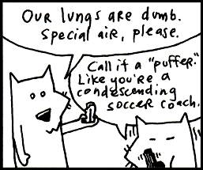

**<span class="caps">IDEA FOUR</span>: Macaulay <span class="caps">Culkin</span>**

Adapt the book into a movie. And since, you know, I’m a character in this book,
you could get someone like Macaulay Culkin to play me. Someone who’s at a real
low point in his career.

You could make it seem like I did tons of drugs. Like I was insane to work with.
Like I kept firing people and locking them in the scooter room and making them
wear outfits made of bread. Yeah, like I could actually be _baking_ people into
the outfits.

You could have this huge mold that I strap people into. Then, I pour all the
dough on them and actually bake them until the bread has risen and they’ve
almost died. And when the television crews come and I’m on Good Morning America,
they’ll ask, “So, how many people have you employed in the production of your
book?” And I’d respond, “A baker’s dozen!” and erupt into that loud maniacal
laughing that would force audience members to cup their hands over their ears.

Of course, in the throes of my insanity, I would declare war on the world. The
bread people would put up quite a fight. Until the U.S. Marshals (or the
Pentagon) engineer a giant robotic monkey brain (played by Burt Lancaster) to
come after me.

Here’s where you’ll make me look completely lame. Not only will I sacrifice all
of the bread people (the Starchtroopers) to save myself, not only will I
surrender to the great monkey brain like a coward, but when I narrowly escape,
I’ll yell at the audience. Screaming insistently that it’s _MY_ movie and no one
should see it any more, I’ll rip the screen in half and the film projector will
spin with its reel flapping in defeat. And that will be the end of the movie.
People will be _so_ pissed.

Now, I’ve got to thinking. See, and actually, Macaulay Culkin did a decent
voiceover in _Zootopia 2_. His career might be okay. You might not
want to use him. He might not do it.

Tell ya what. I’ll play the part. I’ve made a career out of low points :( `me.lower()`.
</aside>

## The Parts of Speech

Just like the white stripe (not the band) down a skunk’s back and the winding, white train of a
bride, many of Python’s parts of speech have visual cues to help you identify
them. Punctuation and capitalization will help your brain to see bits of code
and feel intense recognition. Your mind will frequently yell _Hey, I know that
guy!_ You’ll also be able to name-drop in conversations with other Pythonists.

Try to focus on the look of each of these parts of speech. The rest of the book
will detail the specifics. I give short descriptions for each part of speech,
but you don’t have to understand the explanation. By the end of this chapter,
you should be able to recognize every part of a Python program.

???+ info "Skimming this section is Recommended." 
	Treat this section as a speed run to get the gist of the language. You won't be fluent after reading it, but you'll learn enough to not be scared off by an example or two. You can always come back to reference specific parts of speech later in more detail.

### Variables

Any plain word can be a variable in Python. Variables may consist of
letters, digits and underscores.

`x`, `y`, `banana2`, `Rabbit`, or `phone_a_quail` are examples.

Variables are like nicknames. Remember when everyone used to call you Ham Bone Baby? 
People would say, “Get over here, Ham Baby!” And everyone miraculously
knew that Ham Baby was you.

With variables, you give a nickname to something you use frequently. For
instance, let’s say you run an orphanage. It’s a mean orphanage. And whenever
Daddy Warbucks comes to buy more kids, we insist that he pay us **one-hundred
twenty-one dollars and eight cents** for the kid’s teddy bear, which the kid has
become attached to over in the darker moments of living in such nightmarish
custody.

By convention, ordinary variables and functions use lowercase names with underscores between their words: `favorite_dragon`, `pizza_count`, `feed_rabbit`, or `teddy_bear_fee`.

```py
teddy_bear_fee = 121.08
```

Later, when you ring him up at the cash register (a really souped-up cash
register which runs Python!), you’ll need to add together all his charges into a
**total**.

```py
total = orphan_fee + teddy_bear_fee + gratuity
```

Those variable nicknames sure help. And in the seedy underground of child sales,
any help is appreciated I’m sure.

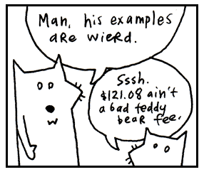

### Numbers

The most basic type of number is an _integer_, a **series of digits** which can
start with a **plus or minus sign**.

`1`, `23`, and `-10000` are examples.

Commas are not allowed in numbers, but underscores are. So if you feel the need
to mark your thousands so the numbers are more readable, use an underscore.

```py
population = 12_000_000_000
```

Python reads this exactly as 12000000000.

Decimal numbers are called _floats_ in Python. Floats represent real numbers using 
**a decimal place** or **scientific notation**.

`3.14`, `-808.08` and `12.043e-04` are examples.

### Strings

Strings are any sort of characters (letters, digits, punctuation) surrounded by
quotes. Both single and double **quotes** are used to create strings.

`"sealab"`, `'2021'`, or `"These cartoons are hilarious!"` are examples.

When you enclose characters in quotes, they are stored together as a single
string. (Note that single `'psychosomatic'` or double quotes `"psychosomatic"` are both fine to use.)

Think of a reporter who is jotting down the mouth noises of a rambling celebrity.
"I have been to certain concerts and certain festivals where people wear diapers so 
that they can be front row of the show," says Olivia Rodrigo, "and that's been an 
experience as a performer that I have smelled."

```py
olivia_diaper_quote = "I have been to certain concerts and certain festivals where \
people wear diapers so that they can be front row of the show, and that's been an \
experience as a performer that I have smelled."
```

So, just as we stored a number in the **teddy_bear_fee** variable (technically we don't store anything, 
we just bind a nickname to an object), now we’re nicknaming a collection of characters (a string)
with the **olivia_diaper_quote** variable. The reporter sends this quote to the printers, who just happen to use 
Python to operate their printing press.

```py
print(olivia_diaper_quote)
print(taylor_swift_quote)
print(diddy_debacle)
```

Python offers a nifty way to include variables with your strings using an f-string. To do this, put the letter f right before your opening quotation mark. Then, place your variable names inside curly brackets {} anywhere inside the text.

 
* `print(f'I am {your_mood} of hearing about Strings.')` 

* `print(f"Your teddy bear fee is ${teddy_bear_fee} and does not includes gratuity.")`

* `print(f"Taylor said '{taylor_swift_quote}.'")`

* `print(f"While Olivia countered with '{olivia_diaper_quote}'.")` 

Note we can include single quotes inside of double quotes with no problems.


### Functions

If variables are the nouns, then functions are the verbs. To a non-programmer, a function appears like magic. You call it and something magically falls out. 

```py
my_dinner = pull_rabbit_from_hat()
```

But functions are not magical but more like a magician's rabbit.They hop around and  give you something you need. Seeing inside the function, is like peeking into the magician's hat where he keeps all his secrets and props. 

In Python, we use the `def` keyword to define a new function and indentation to group a function.  Think of the `def` keyword as the lip of the magic hat (flipped upside down so you can see into the opening) and the indented code as the hat's contents. 

The Magician's Hat:
```
==def function():==
   |          |
   |funct code| 
   |          |
```

Here, first line `def hop_for_carrots():` is the brim of the hat. The indented function code that follows is the mysterious contents within the hat that only the magician can see. 

```py
def hop_for_carrots():
	hopping = True
    print("hopping around")
    return "carrots"

hop_for_carrots()
print("eat your carrots")
```

The indented function code `hopping = True`, `print("hopping around")`, and `return "carrots"` are all *inside* the magician's hat. The following lines `hop_for_carrots()` and `print("eat your carrots")` without indentation are *outside* the magician's hat and back in the main script.

Just like a magician's tricks, the little names created inside a function are rather impermanent in nature. When the function ends, the rabbit runs back into the hat, and those local names like `hopping` for the most part vanish with it.

There are also built-in functions like print() for printing and len() for getting length.

```py
print("See, no hand.")
len([1, 2, 3])
```

Since they are so common, they are automatically defined for you and always available. No need to use `def`. 

### Function Arguments

A function may require more information in order to perform its action. If we want the magic rabbit to get carrots, we should provide a number of carrots and how we want it to get them, as well.

Arguments are attached to the end of a function. The arguments are usually surrounded by **parentheses** and separated by **commas**.

`hop_for_carrots( 3 , "very fast")`

The above asks for 3 carrots and demands them very fast. 

The corresponding function would be defined like so: `def hop_for_carrots(num,speed):` with parameters num and speed that capture the arguments passed in.

Think of the arguments as an inner tube the method is pulling along, containing its extra instructions. The parentheses form the wet, round edges of the inner tube. The commas are the feet of each argument, sticking over the edge. The last argument has its feet tucked under so they don’t show.

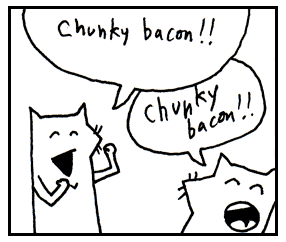

### Classes

Classes are the blueprints we use to to create objects. By style convention, classes created by users are capitalized in Python. 

We can think of a class as a factory that has become expert in churning out objects. 

* Class = the factor or blueprint e.g. Door
* object = the thing made e.g. front_door 

You can call the class name like a function when you want to create a new object (an instance): 
```py
back_door = Door()
```

In this case, the Door 'factory' cranks out a new door object. 

Python has to have an understanding of how to make a door that we can define in our class definition (not to mention a wealth of timber, lumberjacks, and those long, wiggly, two-man saws working behind the scenes in the factory).

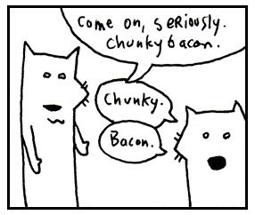

### Methods

Methods look *just* like functions. In fact, they are functions that belong to an object. So much like functions, they act as the verbs of an object or class! We'e already seen methods at work: `someList.reverse()`. You access an object's attributes and methods using **dot** notation. 

Here, **open** is the method. It is the action, the verb.
```py
front_door.open()
```

In some cases, you’ll see actions chained together. We’ve instructed the computer to open the front door and then immediately close it.
```py
front_door.open().close()
```

Here **open** is an action as well. We’re instructing the computer to test the door to see if it’s open.
```py
front_door.is_open()
```

Since a method is just a special type of function, they may require more information in order to 
perform its action. If we want the computer to paint the door, we should 
provide a color as well. Method arguments get attached to the end of a method with **parentheses**. These arguments provide more information for an object in order to perform its method action.

```py
front_door.paint( 3, 'red' )
```

The above paints the front door 3 coats of red.

Like a boat pulling many inner tubes, function with arguments can be chained.

```py
front_door.paint( 3, 'red' ).dry( 30 ).close()
```

The above asks to paint the front door with 3 coats of red, allow it to dry for 30 seconds, and then close the door.

This is called **method chaining**. Here's another example:

```py
text = "   hello, world!   "
clean_text = text.strip().upper()
print(clean_text)
```
> HELLO, WORLD!

With method chaining, each method does its work and returns an object, and the next method is called on that object. We can tell `strip` and `upper` are methods because the `()` that follow them. Chained together they first `strip` the text of surrounding white space and then make the text `upper` case. 

??? info "Special methods for setting up a new object" 
	When we called `Door('oak')` in the previous example, we told Python to instantly build a new, specific door based on that blueprint. To do so, Python creates a `Door` object and then calls in the setup crew `__init__`. 

	```py
	class Door:
		def __init__(material="wood", hinges=2, has_lock=False):
			self.material = material
			self.hinges = hinges
			self.has_lock = has_lock
			...
	```

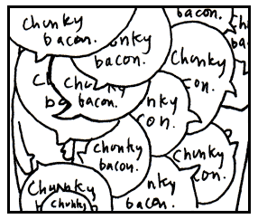

### Instance variables

Variables stored inside objects are called instance attributes (or instance variables). They belong to a particular object.

You can think of objects as little houses that you can walk into, each with its own furniture, decorations, and peculiar inhabitants.

Python's preference for instance attributes is quite sensible. In one house, you might have a dad who represents Archie, a traveling salesman and skeleton collector. In another house, dad could represent Peter, a lion tamer with a great love for flannel. The name dad exists in both houses, but it refers to a different person in each one.

Suppose we wander into an abandoned house at the end of Maple Street and discover a ghost dad rattling chains in the attic. We certainly don't want to confuse ghost dad with Archie or Peter. We want ghost dad to haunt only that spooky abandoned house.

Inside a method, we use `self` and a dot to access attributes belonging to the current object, such as `self.dad`. Outside the class, we use a variable that refers to the object, such as `spooky_house.dad`.

In both cases, the dot helps us enter the correct house and look up the correct attribute.

```py
print(spooky_house.dad)
```

> Ghost dad

```py
print(bills_house.dad)
```

> Billy the dad

Each house keeps track of its own dad, so they won't get mixed up.

Objects in Python are self-contained. Each object stores its own attributes and values. For house objects, we might find attributes such as dad, garage, mailbox, or pet_cat. Billy's house might have a pink flamingo mailbox, while Ghost Dad's house collect mail with a glowing pumpkin.


### Properties (@property)
When Python talks about properties, it doesn't mean the red plastic hotels you hoard in Monopoly to collect rent while your friends weep into empty teacups. In Python, a property is a special method wrapper that lets you access code like you would a simple variable (without using parentheses). 

You may think of property as a trench coat wearing detective like "Inspector Gadget" that can perform covert actions but remains disguised. Behind the scenes a property's methods can do many important things such as controlling access to an instance variable, type checking, enforcing strict input validation, dynamically calculate values, among other things

Whatever you can fit in that trench coat works!

Without getting into too many details (that comes later in the book), here's an example property from my neighbor Gerald's store, Door World that prevents negative `pocket_doors`:

```py
class Door:
	def __init__(self):
		self._pocket_doors = 0

	@property
	def pocket_doors(self):
		return self._pocket_doors

	@pocket_doors.setter
	def pocket_doors(self, value):
		if value >= 0:
			self._pocket_doors = value
		else:
			print("Hey! Get out of here raccoons!")

door_world = Door()
door_world.pocket_doors = -1     
#=> Hey! Get out of here raccoons!
print(door_world.pocket_doors)
#=> 0
```

Negative doors do not exist! At least, not yet (Note to self: new business idea). Half instance variable / half method, our property comes to rescue and stops nosy raccoons from setting negative doors. Our stealthy property does this by concealing an entire *setter method* that checks for negative values inside its trench coat!

### Lists

Lists are surrounded by **square brackets** and separated by
**commas**.

* `[0, 1, 2, 3]` is a list of numbers.
* `['coat', 'mittens', 'snowboard']` is a list of strings.

Think of it as a caterpillar which has been stapled into your code. The two
square brackets are staples which keep the caterpillar from moving, so you can
keep track of which end is the head and which is the tail. The commas are the
caterpillar’s legs, wiggling between each section of its body.

Once there was a caterpillar who had commas for legs. Which meant he had to
allow a literary pause after each step. The other caterpillars really respected
him for it and he came to have quite a commanding presence. Oh, and talk about a philanthropist! He was notorious for giving fresh leaves to those less-fortunate.

Yes, a list is a collection of things, but it also keeps those things in a
specific order.

We can also include different data types in a list and nest lists.

* `[12, [11, 10], [9]]` a nested list.
* `[42, "Hello World", True, [1, 2, 3]]` a single Python list containing four different data types.

### For loops

Give Python a bunch of things, and a `for` loop will march through them, handing each item to you as it goes.

```py
for snack in ["eggroll", "cookie", "banana", "chunky bacon"]:
    print(f"Blix ate a {snack}.")
```

"Python starts with `"eggroll"`, puts it into `snack`, and runs the indented code. Then it moves to `"cookie"` and does it again. Then `"banana"`. And finally `"chunky bacon"`. One `snack` at a time. March, march, march," I say. 

Blix stares into his empty bowl with relish, as if the snacks had already appeared there.

“I like Python. Good snake. Now, get me a banana.”

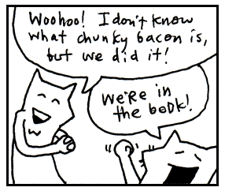


### List comprehensions

Square brackets are not just for lists. They can also be used for list comprehension, a way to build lists. List comprehension lets us build and modify lists within a single line of code, like a tiny factory hidden inside a pair of square brackets! 

Inside the tiny factory, a conveyor belt carries a steady stream of objects past a busy worker. The worker doesn't stop to admire each item or ask where they came from. No! The worker simply grabs each item, performs a small operation, and tosses it into a growing pile. 

This list comprehension `squares = [n * n for n in range(1,10)]` asks Python to make a list of squares from 1^2 up to 9^2. 

It reads like so (reading from right to left): "for each number in a range from 1 to 10 (not including 10), square the number (times a number by itself) and add it to our new list."

Starting to see the power of the tiny factory built inside square brackets? 

List comprehension aren't just a poor man's `for` loop. The list comprehension version is concise, easy to read, and also is often a bit quicker than a `for` loop. List comprehension become even more powerful when we add a filters and conditional expressions.

??? info "Generator expressions: Lazy Version of List Comprehension"
	Generator expressions are a lazy version of list comprehensions. They aren't evaluated until we ask for the result. We use parens instead of square brackets to create generator expressions. 

	```py
	numbers = (1,2,3,4) 
	times_by_two = (x*2 for x in numbers)
	next(times_by_two)
	```

	So `next` says to our lazy generator "Wake up you lazy bum and make with the next bit of data"

### Tuples and parentheses

In Python, code is surrounded by **parentheses for multiple reasons**.

One of the main uses is to create `tuples`, a built-in data collection. `Tuples` are very similar to a list, but with one key differences: `tuples` are immutable (unchangeable) and kind of like a locked list. 

Tuple: `my_tuple = (1, 2, 3)` 

Beside tuples, we have seen parentheses (parens) before when defining a function and passing arguments in a function call. Parens are also used in Python for grouping math, expressions, and code.

Here is a summary of the most common ways Python uses parens:

* Tuple: `my_tuple = (1, 2, 3)`
* Defining: `def greet(name, times):`
* Calling: `greet("Alice", 2)`
* Grouping Math: `(3 + 4) * 10`
* Multi-line code:
```py 
if (user_authenticated
        and user_has_permission
        and account_is_active):
    print("Welcome!")
```
* Clean multi-line strings (PEP 8 preferred style): 
```py
clean_string = ("I used chunky bacon in an example, " 
				"but never again!!!")
print(clean_string)
```

> I used chunky bacon in an example, but never again!!!

So when you see, parens think of a glittery multi-function see through Trapper Keeper, gather things and telling Python, "These, they belong together!” 

### Lambda functions

`Lambda` functions can be considered a bit advanced, but despite your funny looking ID, we'll let you into the `lambda` club early. 

Let's just say `lambda` is a alternative way to define functions when you don't plan to reuse it: 

* `add = lambda a, b: a + b`
* `multiply = lambda x, y: x * y`

And then use it like this: `add(3,4)`, `multiply(1,2)`. 

Lambda functions can be a little tricky to get the hang of, so if you didn't get everything, don't
worry. We'll go over them in much more detail in Chapter 4. 

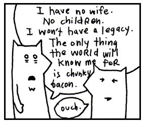

### Ranges

When you go out to the range in Python, nothing gets shot. A range, instead, is a a built-in class to form a sequence of numbers.

* `range(5)` is a range, representing 5 numbers: `0,1,2,3,4`.

We can think of a Python range as one of those long measuring tapes that snaps back into the case. Stretch it out, and you see every mark along its length. Let go, and it collapses into a compact 
package. 

So how does our tape measure look?

|0=1=2=3=4=|tape measure| 

That is, `range(5)` asks Python to pull out the tape measure to the `stop` point, `5`. The `stop` point is not part of the measured length and just marks "stop, that's far enough!"

??? question "Why Zero?"
	Did you notice that when we call `range(x)`, the sequence starts 
	from zero and stops just before `x`? Didn't we all learn to count starting from one to ten in kindergarten?
	
	Python programmers are more efficient than kindergartners. Ancient programmers looked up the empty night sky and said "There in the void of nothingness is the key to happiness. When I count, I'll be sure to include zero." Since then, we all count from zero (We'll get into the real reasons later in the book such as indexing and memory, but until then, trust me that it's better this way).

We can also give range a `start` as well as with the `stop` value. For example, `range(start, stop)`. Then range the spits back just the the numbers from `start` to `stop`, not including `stop`. 

```py
list(range(25, 29))
```

> [25, 26, 27, 28]

Python range objects are immutable, memory-efficient sequence objects. To the get the values, we have to explicitly ask for them using list function. Think of a range as a retractable tape measure. It knows where it starts, where it ends, and how to move between the markings, but it doesn't unroll the entire tape unless you ask.

Oh, and by the way, ranges can also count backwards `range(10, 0, -1)`, count evens only
`range(0, 10, 2)`, and even skip around bytes of data `range(0,len(data),8)` by adding third argument `step`. Why on earth would you want skip around like that? Ask Suzie who just performed a Jeté over the danger zone for her teams win in Himmel und Hölle.

After skipping, you may think it to be a good time for a nap. 

**BUT WAIT THERE'S MORE!**

### Dictionaries

A dictionary in Python is surrounded by **curly braces**. Dictionaries match words
with their definitions (or in Python speak, keys with values). Python does so with **curly braces** and **colons**.

`{'a' : 'aardvark', 'b' : 'badger'}` is an example.

The curly braces represent little book symbols. See how they look like little, 
open books with creases down the middle? They represent opening and closing our 
dictionary.

Imagine our dictionary has a definition on each of its pages. The commas
represent the corner of each page, which we turn to see the next definition. And
on each page: a word followed by an arrow pointing to the definition.

```py
person = { 'name' : 'Peter', 'profession' : 'lion tamer', 'great love' : 'flannel' }
```

In the example above, I stored personal information for Peter, the
lion tamer with a great love for flannel. Dictionaries are useful because they 
are very easy to search through. 

`print(f"{person['name']} is a {person['profession']} and loves {person['great love']}.")`

Now try to create your own person dictionary. It could be James, the computer programmer who loves cats, or Oscar, the grouch, who loves trash. Your imaginations is the limit!

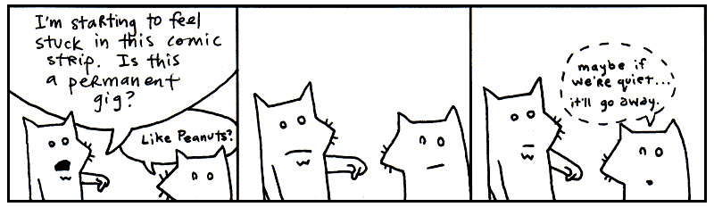

### Regular Expressions

Regular expressions (or *regexes*) are used to find words or patterns in text. 

Imagine if you had a little magnifying glass and held it over a book. You move the glass across the pages, and when it passes over a matching word, it starts blinking. You hold the regular expression over the book, right above the match, and it glows with the letters of the matching word.

Oh, and when you shine the glass over the right spot, the paper sneezes, _reg-ex match!_

`r"^\S+@\S+\.\S+$"`, `"[0-9]+"` and `r"^\d{3}-\d{3}-\d{4}"` are examples of regex patterns.

An `r` before the string tells Python to treat it as a raw string, useful when writing regex (raw strings treats backslashes `\` as *literal* characters for our matching syntax and don't get converted to special characters like tabs and new lines). 

The cool thing is that regex are a timeless skill used across most programming languages. Regardless of the language, the basic building blocks of regex are virtually identical (with some tweaks in syntax and semantics). 

Plus, regex are much faster than passing your hand over pages of a book. Instead, using a regular expression we can search volumes of books very quickly.

??? question "Want to see Regex in action?"

	A quick example, let's try to use a regex pattern to match a US phone number. We first need to know the expression for a digit which is `\d` and stands for a single decimal digit between 0 and 9. We can use the regex string `r"\d\d\d-\d\d\d-\d\d\d\d"` to match a US phone number! 

	Now, let's shorten that to `r"^\d{3}-\d{3}-\d{4}"`. This can be read as "three digits, a hyphen, three more digits, another hyphen, and four digits". 

	To put this pattern to use, we first need to import the regexes package with `import re` and then can use it like so: 

	```python
	import re
	phone_number = "123-456-7890"
	pattern = r"^\d{3}-\d{3}-\d{4}"
	match = re.match(pattern, phone_number)
	print(match)
	```

	What about handling (212)...?
	The above regex works pretty well but does not match a US phone number written with parentheses or without dashes. A more complete regex to match phone numbers would be: `r"^\(?\d{3}\)?[-\s]?\d{3}[-\s]?\d{4}$"` which matches all kinds of formats of US phone numbers `(123) 456-7890`, `123-456-7890`, and `1234567890` but not `123-4567-890` (wrong hyphen placement).

	Our new, more powerful pattern becomes: 
	`pattern = r"^\(?\d{3}\)?[-\s]?\d{3}[-\s]?\d{4}$"`

We'll go over regexes more later on in the book (or *will* we, read Chapter 6 to find out!). 

### Operators

You’ll use the following list of operators to do math in Python or to compare
things. Scan over the list, recognize a few. You know, addition `+` and
subtraction `-` and so on. Here are the most common ones:

	**  ~  *  /  //  %  +  -  &
	<<  >>  |  ^  >  >=  <  <=
	!=  ==  is
	in
	not  and  or
	+=  -=
	
??? info "Python Operators Quick Reference" 

	**Arithmetic Operators**
	Used to perform common mathematical operations.

	| Operator | Name | Description | Example |
	| :--- | :--- | :--- | :--- |
	| `+` | **Addition** | Adds two values together | `x + y` |
	| `-` | **Subtraction** | Subtracts the right value from the left value | `x - y` |
	| `*` | **Multiplication** | Multiplies two values | `x * y` |
	| `/` | **Division** | Divides the left value by the right value (always returns a float) | `x / y` |
	| `%` | **Modulus** | Returns the division remainder | `x % y` |
	| `**` | **Exponentiation** | Raises the left value to the power of the right value | `x ** y` |
	| `//` | **Floor Division** | Divides values and rounds down to the nearest whole number | `x // y` |

	**Assignment Operators**
	Used to assign values to variables, often combining assignment with an arithmetic operation.

	| Operator | Example | Equivalent To |
	| :--- | :--- | :--- |
	| `=` | `x = 5` | `x = 5` |
	| `+=` | `x += 3` | `x = x + 3` |
	| `-=` | `x -= 3` | `x = x - 3` |
	| `*=` | `x *= 3` | `x = x * 3` |
	| `/=` | `x /= 3` | `x = x / 3` |
	| `%=` | `x %= 3` | `x = x % 3` |
	| `//=` | `x //= 3` | `x = x // 3` |
	| `**=` | `x **= 3` | `x = x ** 3` |

	**Comparison Operators**
	Used to compare two values. They always evaluate to either `True` or `False`.

	| Operator | Name | Description | Example |
	| :--- | :--- | :--- | :--- |
	| `==` | **Equal** | Returns `True` if both values are equal | `x == y` |
	| `!=` | **Not equal** | Returns `True` if values are not equal | `x != y` |
	| `>` | **Greater than** | Returns `True` if the left value is greater than the right | `x > y` |
	| `<` | **Less than** | Returns `True` if the left value is less than the right | `x < y` |
	| `>=` | **Greater than or equal to** | Returns `True` if the left value is greater or equal | `x >= y` |
	| `<=` | **Less than or equal to** | Returns `True` if the left value is less or equal | `x <= y` |

	**Logical Operators**
	Used to combine conditional statements.

	| Operator | Description | Example |
	| :--- | :--- | :--- |
	| `and` | Returns `True` if **both** statements are true | `x < 5 and x < 10` |
	| `or` | Returns `True` if **at least one** of the statements is true | `x < 5 or x < 4` |
	| `not` | **Reverse** the result, returns `False` if the result is true | `not(x < 5 and x < 10)` |

	**Identity & Membership Operators**
	Used to compare objects or test if a sequence is present.

	| Operator | Type | Description | Example |
	| :--- | :--- | :--- | :--- |
	| `is` | **Identity** | Returns `True` if both variables point to the same object | `x is y` |
	| `is not` | **Identity** | Returns `True` if both variables do not point to the same object | `x is not y` |
	| `in` | **Membership** | Returns `True` if a sequence with the specified value is present | `x in y` |
	| `not in` | **Membership** | Returns `True` if a sequence with the specified value is not present | `x not in y` |

	**Bitwise & Set Operators**
	These operators perform bit-by-bit calculations on integers as well as *set operations*.

	| Operator | Name | Bitwise Action (Integers) | Set Action (Sets) | Example |
	| :--- | :--- | :--- | :--- | :--- |
	| `&` | **AND / Intersection** | 1 only if both bits are 1 | Returns elements common to both sets | `x & y` |
	| `|` | **OR / Union** | 1 if any of two bits is 1 | Returns all unique elements from both sets | `x | y` |
	| `^` | **XOR / Symmetric Difference** | The inverse of `|` | Returns elements in either set, but not both | `x ^ y` |
	| `-` | **Difference** | *n/a (Subtraction for numbers)* | Returns elements in the left set but not the right | `x - y` |
	| `~` | **NOT** | Inverts all the bits | *n/a* | `~x` |
	| `<<` | **Zero fill left shift** | Shift left by pushing zeros from the right | *n/a* | `x << 2` |
	| `>>` | **Signed right shift** | Shift right by pushing copies of the leftmost bit | *n/a* | `x >> 2` |


### Keywords

Python has a number of built-in words, imbued with meaning. These words cannot be
used as variables or changed to suit your purposes. Some of these we’ve already
discussed. They are in the safe house, my friend. You touch these and you’ll be
served an official syntax error.

    False   None    True    and     as      assert  async   await
    break   class   continue def     del     elif    else   except
    finally for     from    global  if      import  in     is
    lambda  nonlocal not    or      pass    raise   return try
    while   with    yield  match    case

Good enough. These are the illustrious members of the Python language. We’ll be
having quite the junket for the next three chapters, gluing these parts together
into sly bits of (poignant) code.

(One tiny exception: `match` and `case` are "soft" keywords meaning the *can* be used as variables to ensure backwards compatibility of old code, but it's definitely better to think of them as off limits when writing new code.)

I’d recommend skimming all of the parts of speech once again. Give yourself a
broad view of them. I’ll be testing your metal in the next section.

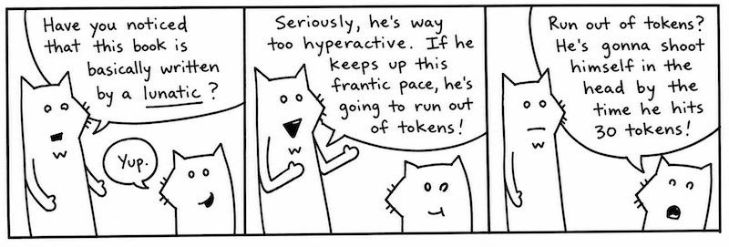

<aside class="sidebar" markdown="1">
### Seven Moments of Zen from My Life

1. 8 years old. Just laying in bed, thinking. And I realize. _There’s nothing
stopping me from becoming a child dentist._
2. 21\. Found a pencil on the beach. Embossed on it: _I cherish serenity._ Tucked
it away into the inside breast pocket of my suit jacket. Watched the waves come
and recede.
3. 22\. Found a beetle in my bathroom that was just about to fall into a heating
vent. Swiped him up. Tailored him a little backpack out of a leaf and a thread.
In the backpack: a skittle and a <span class="caps">AAA</span> battery. That
should last him. Set him loose out by the front gate.
4. Three years of age. Brushed aside the curtain. Sunlight.
5. 14\. Riding my bike out on the pier with my coach who is jogging behind me as
the sun goes down right after I clutched a 1v5 in Fortnite while my squad watched 
in disbelief.
6. 11\. Sick. Watching Bluey on television. For hours, it was Bluey.
And he was able to come right up close to my face. His head spun toward me with 
puppy-dog eye looking straight into mine. His face pulsed back and forth, up close, 
then off millions of miles away. Sound was gone. In fractions of a second, Bluey 
filled the universe, then blipped off to the end of infinity. I heard my mother’s 
voice trying to cut through the cartoon. Bwee, Buey, Bluoy, Boo-ya, Baby Race. 
It was a religious rave with a dog strobe and muffled bass of mother’s voice. 
(I ran a fever of 105 that day.)
7. 18\. Bought myself a labubu. A duck with gorgeous cinnamon  brown fur. Fed it 
for awhile. Gave it a bath. Forgot about it for almost a couple months. One day, 
while cleaning, I found a it at the bottom of my closet. Hey, little duck. Mad 
freaky, duck with webbed feet, but with no bill attached to the hoodie. Was it
just a costume or a lifestyle?
</aside>

## If I Haven't Treated You Like a Child Enough Already

I’m proud of you. Anyone will tell you how much I brag about you. How I go on
and on about this great anonymous person out there who scrolls and reads and
reads scrolls. “These kids,” I tell them. “Man, these kids got heart. I
never…” And I can’t even finish a sentence because I’m absolutely blubbering.

My heart glows bright red under my filmy, translucent skin and they have to administer 10cc of JavaScript 
to get me to come back. (I respond well to toxins in the blood.) Man, that stuff will 
kick the peaches right out your gills!

So, yes. You’ve kept up nicely. But now I must begin to be a brutal
schoolmaster. I need to start seeing good marks from you. So far, you’ve done
nothing but move your eyes around a lot. Okay, sure, you did some exceptional
reading aloud earlier. Now we need some comprehension skills here, Smotchkkiss.

**Say aloud each of the parts of speech used below.**

```py
print("You Still Here, Ho?" * 5)
```

You might want to even cover this paragraph up while you read, because your eyes
might want to sneak to the answer. We have the built-in function `print`, then 
parentheses followed by a _string_ `"You Still Here, Ho?` multiplied by 5.

**Say aloud each of the parts of speech used below.**

```py
if "aura" in "restaurant":
	print("aura you ready to go to the restaurant?")
```

If you were paying attention during the big list of keywords, you’ll know that `if` 
is a _keyword_ and `in` is an _operator_. We ask if the _string_ `"aura"` is in 
the _string_ `"restaurant"`.

**Say aloud each of the parts of speech used below.**

```py
for word in ['toast', 'cheese', 'wine']:
	print(word.capitalize()) 
```

This caterpillar partakes of finer delicacies. An _list_ starts this example.
In the list, three _strings_ `'toast'`, `'cheese'`, and `'wine'`. The whole
list is put through a for loop.

Inside of a loop, `word`, travels down its little
waterslide and the _method_ `capitalize` then capitalizes the first
letter of each word, which has become _variable_ `word`. This
capitalized _string_ is passed to built-in _method_ `print` so we can
see it on the screen.

Or if we were in a hurry, we could write it all in one line as such: 

```py
print([word.capitalize() for word in ['toast', 'cheese', 'wine']])
```

In the one-line example, we simply replace the for loop for a list comprehension. 
The output is nearly the same, except the list comprehension creates a brand new list and 
we print the entire capitalized list on one line, instead of 3. 
While it's a quick trick, list comprehensions can reduce readability of the code 
so are generally only used for simple tasks.

Look over these examples once again. Be sure you recognize the parts of speech
used. They each have a distinct look, don’t they? Take a deep breath, press
firmly on your temples. Now, let’s dissect a cow’s eye worth of code.

## An Example to Help You Grow Up

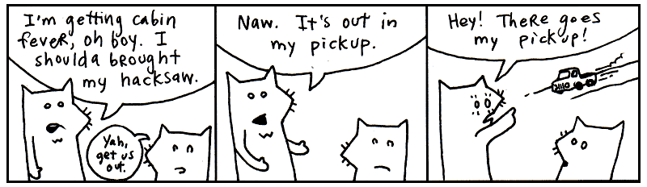

**Say aloud each of the parts of speech used below.**

```python
from urllib import request

response = request.urlopen("https://www.python.org/about/legal/")
print(response.read().decode("utf-8"))
```

The first line is an import statement. We have told Python to load the `request` module from `urllib`, part of Python's standard library, so we can retrieve web pages from the Internet.

There is no package to install. `urllib` comes with Python.

The next two lines go together. `request.urlopen(...)` sends an HTTP request and returns an HTTP response object, which we store in `response`.

Accessing `.read()` reads the response body. It gives us the page as **bytes**, so we then use `.decode("utf-8")` to turn those bytes into a Python string.

Doing okay? Just out of curiosity, can you guess what this example does? Hopefully, you’re seeing some patterns in Python. If not, just shake your head vigorously while you’ve got these examples in your mind. The code should break apart into manageable pieces.

You see it inside the block:

```python
response = request.urlopen("https://www.python.org/about/legal/")
```

We're using Python to get a web page. You've probably entered a URL with your web browser. A **URL**, or Uniform Resource Locator, is the address of a resource on the Internet.

The `request.urlopen()` function sends an HTTP request to a web server and asks for a resource. Conceptualize a bus driver who can drive across the Internet and bring back web pages for us. On his hat are stitched the words **HTTP**, the protocol we're using to ask the driver for the page.

The variable `response` is holding the package the driver brought back.

Now notice the dot:

```python
response.read()
```

The dot lets us access an attribute of the `response` object. Here, `read` is a **method**. The parentheses mean, *please perform this action now*.

Did you catch this pattern in the last line:

    _variable_ . _function_ ( _function arguments_ )

We have seen this pattern appears several times in this chapter. See how the basic dot-method pattern happens in a chain. The next chapter will explore all these sorts of patterns in Python. It’ll be good fun.

So `response.read()` asks the response object to give us the body of the response. What comes back is a sequence of bytes rather than a Python string.

That's why we immediately follow it with:

```python
response.read().decode("utf-8")
```

The `decode()` method converts those bytes into a string using UTF-8, the character encoding used by the web page.

The whole journey looks like this:

```python
response = request.urlopen("https://www.python.org/about/legal/")
print(response.read().decode("utf-8"))
```

First we ask the bus driver to fetch the page. Then we reach into the returned `response` object and ask for its contents with `.read()`. Finally, we decode those bytes into text and print the string.

So, what does the entire code do? The code downloads the HTML of the Python legal page and prints it to your terminal screen.

Specifically, the first line imports the tool needed to make the request. The second sends an HTTP request to the Python website and stores the response. And the final line reads the webpage's HTML, decodes it into a string, and prints it.


## And So, The Quick Trip Came To An Eased, Cushioned Halt

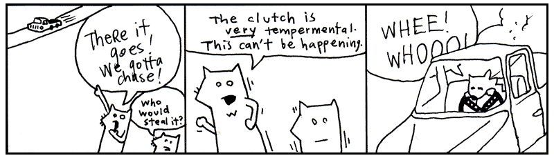


<p style="float:right" markdown="1">
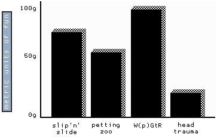
</p>

So now we have a problem. I get the feeling that you are enjoying this way too
much. And you haven’t even hit the chapter where I use jump-roping songs to help
you learn how to parse <span class="caps">XML</span>!

If you’re already enjoying this, then things are really going bad. Two chapters
from now you’ll be writing your own Python programs. In fact, it’s right about
there that I’ll have you start writing your own role-playing game, your own
cloud network, as well as a program that will pull genuine random numbers from 
the void.

....

!!! story ""

	And you know (you’ve got to know!) that this is going to turn into an obsession.
	First, you’ll completely forget to take the dog out. It’ll be standing by the
	screen door, darting its head about, as your eyes devour the code, as your
	fingers slip messages to the computer.

	Thanks to your neglect, things will start to break. Your mounds of printed
	sheets of code will cover up your air vents. Your furnace will choke. The trash
	will pile-up: take-out boxes you hurriedly ordered in, junk mail you couldn’t
	care to dispose of. Your own uncleanliness will pollute the air. Moss will
	infest the rafters, the water will clog, animals will let themselves in, trees
	will come up through the foundations.

	But your computer will be well-cared for. And you, Smotchkkiss, will have
	nourished it with your knowledge. In the eons you will have spent with your
	machine, you will have become part-CPU. And it will have become part-flesh. Your
	arms will flow directly into its ports. Your eyes will accept the video directly
	from <span class="caps">HDMI</span>-Ultra96 cable. Your lungs will sit just above the
	AI GPU, cooling it.

	And just as the room is ready to force itself shut upon you, just as all the
	overgrowth swallows you and your machine, you will finish your script. You and
	the machine together will run this latest Python script, the product of your
	obsession. And the script will fire up AI chainsaws to trim the trees, hearths to
	warm and regulate the house. Machine learning builder nanites will rush from your 
	script, reconstructing your quarters, retiling, renovating, chroming, polishing,
	disinfecting. Mighty androids will force your crumbling house into firm, rigid
	architecture. Great LLM pillars will rise, statues chiseled. You will have dominion
	over this palatial estate and over the encompassing mountains and islands of
	your stronghold.

	So I guess you’re going to be okay. What'dya say? Let’s get moving on this script
	of yours?

[1]: https://genius.com/albums/Flo-milli/Ho-why-is-you-here
