---
hide:
  - toc
---

# 3. A Quick (and Hopefully Painless) Ride Through Python (with Cartoon Foxes)

 Ride Through Python (with Cartoon Foxes)"){.center}

[TOC]

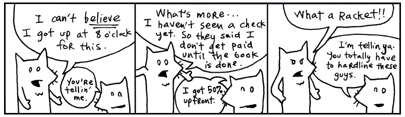

Yeah, these are the two. My asthma’s kickin’ in so I’ve got to go take a puff of
medicated air just now. Be with you in a moment.

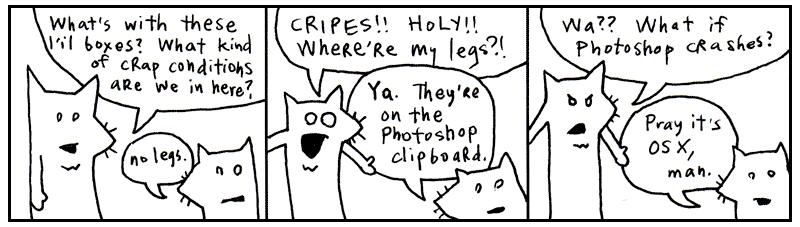

I’m told that this chapter is best accompanied by a rag. Something you can mop
your face with as the sweat pours off your face.

Indeed, we’ll be racing through the whole language. Like striking every match in
a box as quickly as can be done.


##1. Language and I MEAN Language


My conscience won’t let me call Python a _computer_ language. That would imply
that the language works primarily on the computer’s terms. That the language is
designed to accommodate the computer, first and foremost. That therefore, we, the
coders, are foreigners, seeking citizenship in the computer’s locale. It’s the
computer’s language and we are translators for the world.

But what do you call the language when your brain begins to think in that
language? When you start to use the language’s own words and colloquialisms to
express yourself. Say, the computer can’t do that. How can it be the computer’s
language? It is ours, we speak it natively!

We can no longer truthfully call it a _computer_ language. It is _coderspeak_.
It is the language of our thoughts.

**Read the following aloud to yourself.**

```py
someList.reverse()
```

In English sentences, punctuation (such as periods, exclamations, parentheses)
are silent. Punctuation adds meaning to words, helps give cues as to what the
author intended by a sentence. So let’s read the above as: some_list reverse!

Which is exactly what Python will do, reverse some_list.

Try this one.

```py
print("Ho, Why Is You Here?" * 5)
```

Right, it reads as : _print
“Ho, Why Is You Here?” times five._

Which is exactly what this small Python program does. Flo Milli’s 
[existential question][1] will print five times on the computer screen.

**Read the following aloud to yourself.**

```py
if "aura" in "restaurant":
```

Here we’re doing a basic reality check. Our program asks **if** (the condition) 
**aura** is in the word **restaurant**. Again, in English: _if aura is in the word
restaurant._

Ever seen a programming language use English so effectively? Python uses
colons and indentation to introduce new code blocks, enhancing the readability of 
the code. We’re checking a condition in the above code, so why not make that easy 
to read?

**Read the following aloud to yourself.**

```py
for word in ['toast', 'cheese', 'wine']:
	print(word.capitalize()) 
```

While this bit of code is stretched out into two lines so more compelx than 
the previous examples, reading out loud, we get an idea of what the output 
will look like. Python reads like English. Fully translated into English, 
you might read the above as: _for the words ‘toast’, ‘cheese’,
and ‘wine’, print the word capitalized._

The computer then courteously responds: `Toast`, `Cheese` and `Wine`.

At this point, you’re probably wondering how these words actually fit together.
Smotchkkiss is wondering what the dots and brackets mean. I’m going to discuss
the various _parts of speech_ next.

All you need to know thus far is that Python is basically built from sentences.
They aren’t exactly English sentences. They are short collections of words and
punctuation which encompass a single thought. These sentences can form books.
They can form pages. They can form entire novels, when strung together. Novels
that can be read by humans, but also by computers.


<aside class="sidebar" markdown="1">
### Concerning Commercial Uses of the (Poignant) Guide

This book is released under a Creative Commons license which allows unlimited
commercial use of this text. Basically, this means you can sell all these
bootleg copies of my book and keep the revenues for yourself. I trust my readers
(and the world around them) to rip me off. To put out some crappy Xerox edition
with that time-tested clipart of praying hands on the cover.

Guys, the lawsuits just ain’t worth the headache. So I’m just going to straight
up endorse authorized piracy, folks. Anybody who wants to read the book should
be able to read it. Anybody who wants to market the book or come up with special
editions, I’m flattered.

Why would I want the $$$? <span class="caps">IGNORE ALL OTHER SIDEBARS</span>:
I’ve lost the will to be a rich slob. Sounds inhuman, but I like my little
black-and-white television. Also my hanging plastic flower lamp. I don’t want to
be a career writer. Cash isn’t going inspire me. Pointless.

So, if money means nothing to the lucky stiff, why rip me off when you could
co-opt shady business practices to literally crush my psyche and leave me
wheezing in some sooty iron lung? Oh, and the irony of using my own works
against me! Die, Poignant Boy!

To give you an idea of what I mean, here are a few underhanded concepts that
could seriously kill my willpower and force me to reconsider things like
existence (Spoiler alert: _why commits digital suicide `os.kill(os.getpid(), signal.SIGTERM)`).

**<span class="caps">IDEA ONE</span>: BIG <span class="caps">TOBACCO</span>**

Buy a cigarette company. Use my cartoon foxes to fuel an aggressive ad campaign.
Here’s a billboard for starters:


Make it obvious that you’re targeting children and the asthmatic. Then, once
you’ve got everyone going, have the **truth** people do an expose on me and my
farm of inky foxes.

> **Sensible Hipster Standing on Curb in Urban Wilderness**: He calls himself
> the lucky stiff.
>
> (Pulls aside curtain to reveal gray corpse on a gurney.)
>
> **Hipster**: Some stiffs ain’t so lucky.
>
> (Erratic zoom in. Superimposed cartoon foxes for subliminal Willy Wonka mind
> trip.)

Yo. Why you gotta dis Big Smokies like dat, Holmes?

**<span class="caps">IDEA TWO</span>: HEY, <span class="caps">FIRING
SQUAD</span>**

Like I said, start selling copies of my book, but corrupt the text. These
altered copies would contain numerous blatant (and libelous) references to
government agencies, such as the U.S. Marshals and the Pentagon. You could make
me look like a complete traitor. Like I have all these plans to, you know, kill
certain less desirable members of the U.S. Marshals or the Pentagon.

Not that there are any less desirable members of the U.S. Marshals or the
Pentagon. Yeah, I didn’t mean it like that.

Oh, crap.

Oh, crap. Oh, crap. Oh, crap.

Turn off the lights. Get down.

**<span class="caps">IDEA THREE</span>: BILLBOARDS, <span class="caps">PART
II</span>**

How about making fun of asthmatics directly?

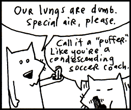

**<span class="caps">IDEA FOUR</span>: Macaulay <span class="caps">Culkin</span>**

Adapt the book into a movie. And since, you know, I’m a character in this book,
you could get someone like Macaulay Culkin to play me. Someone who’s at a real
low point in his career.

You could make it seem like I did tons of drugs. Like I was insane to work with.
Like I kept firing people and locking them in the scooter room and making them
wear outfits made of bread. Yeah, like I could actually be _baking_ people into
the outfits.

You could have this huge mold that I strap people into. Then, I pour all the
dough on them and actually bake them until the bread has risen and they’ve
almost died. And when the television crews come and I’m on Good Morning America,
they’ll ask, “So, how many people have you employed in the production of your
book?” And I’d respond, “A baker’s dozen!” and erupt into that loud maniacal
laughing that would force audience members to cup their hands over their ears.

Of course, in the throes of my insanity, I would declare war on the world. The
bread people would put up quite a fight. Until the U.S. Marshals (or the
Pentagon) engineer a giant robotic monkey brain (played by Burt Lancaster) to
come after me.

Here’s where you’ll make me look completely lame. Not only will I sacrifice all
of the bread people (the Starchtroopers) to save myself, not only will I
surrender to the great monkey brain like a coward, but when I narrowly escape,
I’ll yell at the audience. Screaming insistently that it’s _MY_ movie and no one
should see it any more, I’ll rip the screen in half and the film projector will
spin with its reel flapping in defeat. And that will be the end of the movie.
People will be _so_ pissed.

Now, I’ve got to thinking. See, and actually, Macaulay Culkin did a decent
voiceover in _Zootopia 2_. His career might be okay. You might not
want to use him. He might not do it.

Tell ya what. I’ll play the part. I’ve made a career out of low points :( `me.lower()`.
</aside>

## 2. The Parts of Speech

Just like the white stripe down a skunk’s back and the winding, white train of a
bride, many of Python’s parts of speech have visual cues to help you identify
them. Punctuation and capitalization will help your brain to see bits of code
and feel intense recognition. Your mind will frequently yell _Hey, I know that
guy!_ You’ll also be able to name-drop in conversations with other Pythonists.

Try to focus on the look of each of these parts of speech. The rest of the book
will detail the specifics. I give short descriptions for each part of speech,
but you don’t have to understand the explanation. By the end of this chapter,
you should be able to recognize every part of a Python program.

### Variables

Any plain word can be a variable in Python. Variables may consist of
letters, digits and underscores.

`x`, `y`, `banana2`, `Rabbit`, or `phone_a_quail` are examples.

Variables are like nicknames. Remember when everyone used to call you Ham Bone Baby? 
People would say, “Get over here, Ham Baby!” And everyone miraculously
knew that Ham Baby was you.

With variables, you give a nickname to something you use frequently. For
instance, let’s say you run an orphanage. It’s a mean orphanage. And whenever
Daddy Warbucks comes to buy more kids, we insist that he pay us **one-hundred
twenty-one dollars and eight cents** for the kid’s teddy bear, which the kid has
become attached to over in the darker moments of living in such nightmarish
custody.

By convention, ordinary variables and functions use lowercase names with underscores between their words: `favorite_dragon`, `pizza_count`, `feed_rabbit`, or `teddy_bear_fee`.

```py
teddy_bear_fee = 121.08
```

Later, when you ring him up at the cash register (a really souped-up cash
register which runs Python!), you’ll need to add together all his charges into a
**total**.

```py
total = orphan_fee + teddy_bear_fee + gratuity
```

Those variable nicknames sure help. And in the seedy underground of child sales,
any help is appreciated I’m sure.

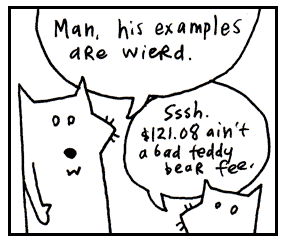

### Numbers

The most basic type of number is an _integer_, a **series of digits** which can
start with a **plus or minus sign**.

`1`, `23`, and `-10000` are examples.

Commas are not allowed in numbers, but underscores are. So if you feel the need
to mark your thousands so the numbers are more readable, use an underscore.

```py
population = 12_000_000_000
```

Python reads this exactly as 12000000000.

Decimal numbers are called _floats_ in Python. Floats represent real numbers using 
**a decimal place** or **scientific notation**.

`3.14`, `-808.08` and `12.043e-04` are examples.

### Strings

Strings are any sort of characters (letters, digits, punctuation) surrounded by
quotes. Both single and double **quotes** are used to create strings.

`"sealab"`, `'2021'`, or `"These cartoons are hilarious!"` are examples.

When you enclose characters in quotes, they are stored together as a single
string. (Note that single `'psychosomatic'` or double quotes `"psychosomatic"` are both fine to use.)

Think of a reporter who is jotting down the mouth noises of a rambling celebrity.
"I have been to certain concerts and certain festivals where people wear diapers so 
that they can be front row of the show," says Olivia Rodrigo, "and that's been an 
experience as a performer that I have smelled."

```py
olivia_diaper_quote = "I have been to certain concerts and certain festivals where \
people wear diapers so that they can be front row of the show, and that's been an \
experience as a performer that I have smelled."
```

So, just as we stored a number in the **teddy_bear_fee** variable (technically we don't store anything, 
we just bind a nickname to an object), now we’re nicknaming a collection of characters (a string)
with the **olivia_diaper_quote** variable. The reporter sends this quote to the printers, who just happen to use 
Python to operate their printing press.

```py
print(taylor_swift_quote)
print(olivia_diaper_quote)
print(diddy_debacle)
```
Python offers a nifty way to include variables with your strings using an f-string. To do this, put the letter f right before your opening quotation mark. Then, place your variable names inside curly brackets {} anywhere inside the text.

* `print(f'I am {mood} of hearing about Strings.') # I am bored of hearing about Strings.`
* `print(f"Your teddy bear fee is ${teddy_bear_fee} and does not includes gratity.")`
* `print(f"Taylor said '{taylor_swift_quote}'. While Olivia countered with '{olivia_diaper_quote}'.")` 

Note we can include single quotes inside of double quotes with no problems.


### Functions

If variables are the nouns, then functions are the verbs. To a non-programmer, a function appears like magic. You call it and something magically falls out. 

```py
my_dinner = pull_rabbit_from_hat()
```

But a functions are not magical but more like a magicians rabbit. They hop around and 
give you something you need. Seeing inside the funciton, is like peeking into the magicians
hat where he keeps all his secrets and props. 

In Python, functions to group together code. We use the `def` keyword to define a new function. The code that follows is indented so that Python knows it belongs to the function. Think of the
`def` keyword as the lip of the magic hat and the indented code as the hat's contents. 

```py
def hop_for_carrots():
    # Indented code block for the function body (inside the magician's hat)
	print("hopping around")
    return "carrots"
```

The above Python function defintion is shaped very much like a magician's hat flipped upside down so you can see into the opening. The first line `def hop_for_carrots():` is the brim of the hat. The indented function code that follows is the mysterious contents within the hat that only the magician can see. 

The Magician's Hat:
```
==def function():==
   |            
   |contents  
   |          
```

Just like a magician's tricks, the little names created inside a function are rather impermanent in nature. While the function is working, it has its own private collection of names. When the function vanishes back into the hat, those local names vanish with it. (The objects they pointed to might vanish too, unless some other part of the program is still holding on to them.)

```py
def hop_for_carrots(): # Entering the function
	hopping = True	   # creating variable hopping for the function
    return "carrots"   # top hat ends, local variables go 'Poof'
hop_for_carrots()	   # Running the function
print(hopping) # Pulls an error: `NameError: name 'hopping' is not defined`. Poof. The inner
			   # variable does not leak outside the magicians hat.
```
There are also built-in functions like print() and len() that can be used anywhere. 

```py
print("See, no hand.")
print(len([1, 2, 3])) # prints 3
```

### Function Arguments

Function arguments are attached to the end of a function. The arguments are usually surrounded by parentheses and separated by commas.

`range(1, 26)`

When we define a function, we call the variables that these arguments get assigned to parameters. 

For `def cat_sounds(cat_type, number_of_sounds):`, the parameters are `cat_type, number_of_sounds`. 

`x`; `x, y`; `number_toes, number_feet, number_wings` are more examples of function parameters.

```py

def add(x, y): 
	return x + y

print(add(3, 4)) # prints 7

```

When we call `add(3,4)`, `3, 4`, the arguments get assigned to `x, y` the parameters. 

Arguments are useful when a function requires more information in order to perform its action. For example, if we want to create a function to bring us carrots, we should provide how many carrots we want, and how fast we want them. 

`hop_for_carrots( 3 , "very fast")`

The above asks for 3 carrots and demands them very fast. 

Think of the arguments as an inner tube the method is pulling along, containing its extra instructions. The parentheses form the wet, round edges of the inner tube. The commas are the feet of each argument, sticking over the edge. The last argument has its feet tucked under so they don’t show.

Some functions (such as print) are part of the builtins module. These functions are used throughout Python. Since they are so common, they are automatically defined for you and always available to use.

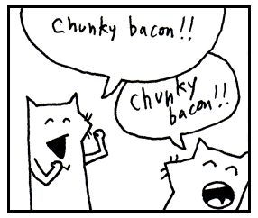

### Classes

Classes are the blueprints we use to to create objects. By style convention, classes created by users are capitalized in Python. 

* Class = the blueprint e.g. Door
* object = the thing made e.g. front_door 

We can think of a class as a factory that has become expert in churning out objects. In this case, 
for the Door 'factory' will make a new door, but needs to know what type of door to create.

```py
back_door = Door('oak')
```
 
 Note we use the convention that classes, such as `Door`, should begin with an upper case letter while objects, such as `back_door`, begin with a lower case letter.

Python has to have an understanding of how to make a door—as well as a wealth of
timber, lumberjacks, and those long, wiggly, two-man saws.

### Methods

Methods look *just* like functions. In fact, they are functions! Methods are functions that belong to a class. They are instructions tucked inside the class, ready for action whenever they need a little work done (that is the verbs of a class). Methods are usually attached to the end of objects variables by a **dot** and are followed by **parentheses**. 

You’ve already seen methods at work.
```py
someList.reverse()
```

Here, **open** is the method. It is the action, the verb.
```py
front_door.open()
```

In some cases, you’ll see actions chained together. We’ve instructed the computer to open the front door and then immediately close it.
```py
front_door.open().close()
```

Here **open** is an action as well. We’re instructing the computer to test the door to see if it’s open.
```py
front_door.is_open()
```

When you call a class, Python normally creates an instance and then calls its __init__ method to initialize it. It is usually defined at the
top of your Class definition like so: 
```py
class Door:
    def __init__(self):
		pass
```

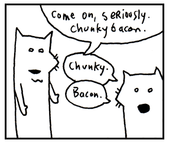

### Class Method

While regular methods are bound to a specific object e.g. `front_door.open()`, class methods are bound directly to the class itself `Door.french()`. The most common use case for a class method is as a "factory method." This offers an alternative way to create objects when the standard way isn't ideal. The syntax to call one is ClassName.class_method(). 

```py
secure_door = Door.fort_knox() # at 22,000 kilograms, these thick steel barriers  
							   # are enough to protect all your chunky bacon.
```

Here we have the Door class calling the fort_knox() class method to build an extra-secure door to protect your chunky bacon. Or for a in a Pony class, you might call `Pony.my_little()` class method to create a magical flying pink pony. 

We create these Class Methods using the `@classmethod` decorator when we need to add custom logic or preset configurations when creating new objects. Think of them as mini custom factories. 

### Method arguments

A method, just like a function may require more information in order to 
perform its action. If we want the computer to paint the door, we should 
provide a color as well.

Method arguments are attached to the end of a method with **parentheses** just like function arguments. 

```py
front_door.paint( 3, 'red' )
```

The above paints the front door 3 coats of red.

Like a boat pulling many inner tubes, function with arguments can be chained.

```py
front_door.paint( 3, 'red' ).dry( 30 ).close()
```

The above asks to paint the front door with 3 coats of read, allow it to dry for 30 seconds, and then close the door. This is called method chaining. Each method does its work and returns an object, and the next method is called on that object. Even though the last method has no arguments, you still must use parentheses to distinguish between calling the method to perform an action and referencing the method objects itself with its nickname (yes, even methods can be passed around in Python).


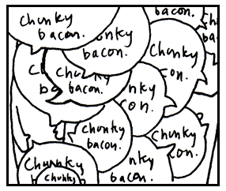


### Instance variables

Variables stored inside objects are called instance variables or instance attributes. They belong to a particular object. You can think of objects as little houses that you can walk into, each with its own furniture, decorations, and peculiar inhabitants.

Python's preference for instance attributes is quite sensible. In one house, you might have a dad who represents Archie, a traveling salesman and skeleton collector. In another house, dad could represent Peter, a lion tamer with a great love for flannel. The name dad exists in both houses, but it means something different in each one.

Instance attributes describe something that belongs to a specific house. Suppose we wander into an abandoned house at the end of Maple Street and discover a ghost dad rattling chains in the attic. We certainly don't want to confuse ghost dad with Archie or Peter. We want ghost dad to haunt only that spooky abandoned house.

That's why we use `self.`. It ties an attribute to a particular object, the house we're currently standing in.

```python
class House:
    def __init__(self, dad):
		# Instance variable: Unique to each instance
        self.dad = dad
```

Here, `self.dad` belongs only to that specific House object. Another house can have its own dad, and the two won't get mixed up. Each house keeps track of its own peculiar residents.

```py
spooky_house = House('ghost dad')
print(spooky_house.dad) # 'ghost dad'
bills_house = House('Billy the dad')
print(bills_house.dad)# 'Billy the dad'
```

Now you see the instance variable `self.dad` is specific to `spooky_house`. So we can 
access this variable by using the formula object.instance_variable e.g. `spooky_house.dad`. 

Any new house won't be associated 'ghost dad'. Since instance variables are unique to this one object, 
any other object won't have the same value. They belong only to a single object (house).

The same applies for any object, not just house. 

```py

class Door:
	def __init__(self, color):
		self.color = color
		
spooky_door = Door('black')		
tiny_door = Door('blue')

# spooky_door has its own instance variables, so is not effected by tiny_door
print(spooky_door.color) # 'black' 
print(tiny_door.color) # 'blue' 
```

### Class variables

Althought instance variables are the most common when defining variables within Classes, there are also class variables too. These are used to define attributes, but rather than defining an attribute for a single object, they are shared with many related objects of the same class in Python. 

```py

class Door:
    # Class variables: Shared by ALL doors
	WARRANTY_FINE_PRINT = "1 year money back guarantee. Void for French or Polish doors."
```

We call class variables by simply using the class name followed by a *dot* and the variable name e.g. `Door.WARRANTY_FINE_PRINT`. 

### Properties

When Python talks about `@property`, it isn't talking about the plastic estates you hoard in Monopoly to collect rent ruthlessly while your friends weep into their empty teacups. The `@property` decorator is a sensible way of exposing your instance variables to the outside world, while controlling how they can be accessed.

Imagine a nervous badger named Gerald that sells doors. Gerald gets in a new shipment of 5 `pocket_doors`. Normally, you just write `door_world.pocket_doors = 5`, that is `object.instance_variable = value` but what if his senile racoon neighbor comes over and sets `door_world.pocket_doors = -400`!? Gerald’s whole business would collapses. Negative hats do not exist (at least not yet, note to self: new business idea)!

The `@property` decorator comes to your rescue. Your instance variable wears a polite disguise (a decorator) which acts to conceal a method inside the variable's trenchcoat. While it appear as normal instance variables to the outside world (e.g. door_world.pocket_doors), inside, we are secretly triggering a custom methods which can correct the behaviors.

Without getting into too many details (we'll get to that soon), here's a quick example of how Gerald could stop his neighbor from bringing his business down: 

```py
Class Door()
	def __init__(self): 
		self._pocket_doors=0
		self._french_doors=0

    @property #getter
    def pocket_doors(self):
        return self._pocket_doors

    @pocket_doors.setter #setter
    def pocket_doors(self, value):
        if value >= 0:
			self._pocket_doors = value
        else:
			print("Get our of here racoons!")
```

To the outside world, the store still works the same: 
```py
print(door_world.pocket_doors) # 5
door_world.pocket_doors = 0 # sold out
door_world.pocket_doors = -1 # Get our of here racoons!
```

Execpt when we try to set negative number for `pocket_doors`, the business doesn't have to shut down.


### List

Lists are surrounded by **square brackets** and separated by
**commas**.

* `[0, 1, 2, 3]` is an list of numbers.
* `['coat', 'mittens', 'snowboard']` is an list of strings.

Think of it as a caterpillar which has been stapled into your code. The two
square brackets are staples which keep the caterpillar from moving, so you can
keep track of which end is the head and which is the tail. The commas are the
caterpillar’s legs, wiggling between each section of its body.

Once there was a caterpillar who had commas for legs. Which meant he had to
allow a literary pause after each step. The other caterpillars really respected
him for it and he came to have quite a commanding presence. Oh, and talk about a
philanthropist! He was notorious for giving fresh leaves to those
less-fortunate.

Yes, an list is a collection of things, but it also keeps those things in a
specific order.

We can also include different data types in a list and nest lists.

* `[12, [11, 10], [9]]` a nested list.
* `[42, "Hello World", True, [1, 2, 3]]` a single Python list containing four different data types.

### Sets

A Python `set` is a chaotic, exclusive club for your data. Python `set` hates posers, and will ignores them completely.

The VIP club is based inside a treehouse run by Barnaby, a highly opinionated owl. A normal Python list allows many of the same animals into the club, six `squirrel`s and one more wants to get it? The more the merrier! But Barnaby throws repeat visitors out in the name of creating diversity and profits. Once one shirtless hippie is in the treehouse, there is no room for another one. “Every member must be completely unique” is Barnaby’s first rule. **Total Anarchy** is the second. Once inside the treehouse, he doesn't care about where people were added or keep them in any particular order. He lets them dance freely, with no social constructs, no hierarchy, and no order to speak of. You cannot ask, “Who goes first? Who is the VIP?” because a Python set has no meaningful order. You simply ask whether someone is in the club.

```py
# A list allows duplicates and keeps order
waffle_line = ["badger", "badger", "fox", "badger"] 

# Barnaby's treehouse collapses them into unique entities
treehouse = set(["badger", "badger", "fox", "badger"])
print(treehouse) # {'fox', 'badger'} (The extra badgers vanished!)
```

The power of sets, of course, can't be seen in a tiny tree house but becomes obvious when the ambitious owl teams up with his rival Percival the squirrel to combine the two clubs.  

```py
barnaby_club = {"badger", "fox", "owl", "snail"}
percival_club = {"snail", "toad", "raccoon", "fox"}

super_club = barnaby_club | percival_club # quietly combines the two sets and removes duplicates (for those members that belong to both clubs)
```

When we combine the membership list with the "|" which mean 'or', a new combined set is created `super_club`, automatically removing duplicates. When they, inevitably, decide to split back up, Barnaby can easily make a set of members loyal to him `loyalists = barnaby_club - percival_club`, removing any trace of squirrel from his establishment. 


### List Comprehension

Square brakets can also be used for list comprehension which lets us build lists 
in a single line of code. Neat, like a tiny factory hidden inside a pair of square brackets!

A list comprehension works much like a factory conveyor belt carrying a steady stream of objects past a busy worker. The worker doesn't stop to admire them or ask where they came from. No! He simply grabs each one, performs a small 
operation, and tosses it into a growing pile.

Getting the picture? Hmm, let me think of an example. Imagine you work in busy pizza shop and you are running a promo where you double the number of toppings. You have a long list of pizza orders: 

`pizza_orders = ['chunky bacon','sausage','cheese','mushroom'] # pizza orders`

and you need to double them all. So you fire up your computer and write some topping doubling Python code.

```py 
promo_pizza_orders=[]
for pizza in pizza_orders: 						  # Why did the toppings have to squeeze together on the pizza? 
	promo_pizza_orders.append('double ' + pizza)  # There wasn't mush-room 
```

Phew, that was fun looping over all those orders and adding a 'double ' to the front of each. But with list comprehension, the above `for` loop become just one sexy line. Just fire up the conveyer belt and slap a double sticker, double time!

```py 
promo_pizza_orders = ['double ' + pizza for pizza in pizza_orders] #list comprehension to double toppings
```

The list comprehension version is not only more concise, but is often a bit quicker. It reads like so: return 'double' plus pizza for pizza in pizza_orders` and works exactly the same as the for loop above.

We can also do more complex condition logic, all within a list comprehension. We can either add an `if` statment to the end of the list comprehension to filter out items or the very beginning to modify values. 

Filtering: `[p for p in pizza_orders if "bacon" in p]` # all pizza orders with bacon related toppings

Modifying: `[if 'hawaiian' in p: 'gross, try again' else: p for p in pizza_orders]` # reject hawaiian pizza orders

Orders come in steady but we start runnning low on toppings. Boss asks if you can count how many chunky bacon orders
came in so he can know if we will run out soon. To do this, we'd filter with an if at the end.
```py 
count_chunky = len([p for p in pizza_orders if p.endswith("chunky bacon")]) # count chunky bacon orders
```

First we filter for the chunky bacon pizza orders and we find the length of the list.
 
Now, the obvious problems with double toppings is once you have them, people try to order the most expensive toppings to get their money's worth. Boss pulls me aside one day "Why, we can't be giving away double prosciutto. 
Chunky bacon, okay, but that prosciutto is imported from Tuscany, fuuggetaboutit. 
Just give em a lil' extra this time. They won't know the difference, capisce?" 
Proscuitto was robust, savory and had to be protected. Lucky for me, I did 
understand and Python did too. So I updated the topping doubling Python code with a modifying conditional expressions at the start: 

```py 
promo_pizza_orders = ['lil extra ' + p if 'prosciutto' in p else 'double ' + p for p in pizza_orders]
```

 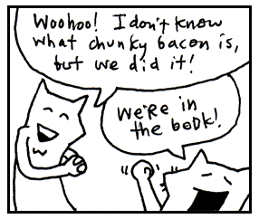
 

### Parentheses

In Python, code is surrounded by **parentheses for multiple reasons** such as 
forming a function, calling a function, including function arguments, defining tuples, or grouping math, 
expressions, and code.

Here we can see various examples: 
Defining: `def greet(name):`
Calling: `greet("Alice")`
Standard Tuple: `my_tuple = (1, 2, 3)`
Grouping Math: `(3 + 4) * 10`
Multi-line code: 
`if (user_authenticated` 
	`and user_has_permission`
	`and account_is_active):`


```py
print("Yes, I've used chunky bacon 
	   in my examples, but never again!")
```

Parentheses group expressions and can allow an expression to continue across lines.
When you see these two parentheses, remember that the code inside has been pressed into a single unit.

It’s like one of those little Hello Kitty boxes they sell at the mall that’s
stuffed with tiny pencils and microscopic paper, all crammed into a glittery
transparent case that can be concealed in your palm for covert stationery
operations. Except that parentheses don’t require so much squinting.

Parentheses can also be used to create generator expressions. Generator expressions are just lazy version of list 
comprehensions. They aren't evaluated until we ask for the result. 

```py
numbers = [1,2,3,4]
times_by_two = (x*2 for x in numbers) #generator expression with lazy evaluation 
next(times_by_two) # wake up you lazy bum and make with the numba's
```

### Lambda Function

Lambda function can be considered a bit advanced, but despite your funny looking ID, we'll let you into the 
lambda club early. 

Now, my friend Jimothy doesn't like chunky bacon buts loves clubbing. He goes on and on about the hottest 
new club, all I want to do is go home and watch Batman reruns and eat pickles. But he insists this new 
club is not like the last one. This one is so new it doesn't even have a name yet! "So there is no 
name?" I asked. "Yup, it's anonymous. It's a speakeasy, you have to know about it to get in." 

Naturally, I was confused. "What should we call it when we talk about it?" "y" he replies. "Why?" I 
reply back? He replies "Y!" only louder. We go round and round like this for a few minutes until he decides
he needs a symbol for the club. `Y` wasn't working. "Hmm, why not a little hat since it's a party." So we settled for λ or lambda, the 11th letter in the Greek alphabet, which looks just like a party hat when you have had enough drinks.

"HEY, BUT WAIT! Isn't  λ already used for eigenvalue in linear alegbra?!!!" I warned my friend after a double soco and lime, but he just told me to shut up, threw my coat at me, and asked me to leave :(.

So for example, my friend `a` and me `b` are heading the anonymous club with out a name, we could write it like 
this using an f-string as the output: 

`lambda a, b: f"{a} & {b} party"`

In the example above, a and b are the parameters. And after the parameters, we have a bit of code.
What's it do? The code reads as the parameters `a` and `b` on the left side of the colon goes in and 
the output expression on the right side of the colon, `f"{a} & {b} party"` comes out. 

```py
anon_club = lambda a, b: f"{a} & {b} party"
print(anon_club('Jimothy', 'Why'))  # Prints: Jimothy & Why party
```

So here what goes in are two arguments, and what comes out is the expression that declares that
a and b Party. 

The above code can be writen all in one line, if we use a parentheses to group together the lambda
 function and another parentheses for the function arguments.  

`(lambda a, b: f"{a} & {b} party")('Jimothy' , 'Why')` 

In the above lambda function, we can think of these function arguments as sliding down a party chute (An `a` goes down spread eagle, while the `b` with neatly crossed legs.) This chute acts as a passageway between lambda funciton arguments and the lambda expression.

The strings 'Jimothy' , 'Why' are passed through this chute into the function lambda funciton. In the example, the strings 'Jimothy' and 'Why' travel through this chute and become a and b inside the party, I mean function (how fun! look at them dance).

Here are a few more more familar examples: 

* `add = lambda a, b: a + b`
* `multiply = lambda x, y: x * y`
* `subtract = lambda u, w: u - w`
* `dougie = lambda x, y: x ? y # note throws error because Python 3 (nor I) is not sure how to do the Dougie, check back with Python 4` 

We would use them like so: `add(3,4) # 7`, `multiply(1,2) #2`, and `subtract(4,1) #3`. 

Lambda functions can be a little tricky to understand, so if you don't get everything, don't
worry. We'll go over them in more detail in Chapter 4. 

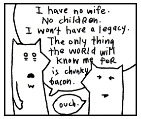

### Ranges

When you go out to the range in Python, nothing gets shot. A range, instead, is a a built-in class to form a sequence of numbers.

* `range(5)` is a range, representing the numbers 0,1,2,3,4.

We can think of a Python range as one of those long measuring tapes that snaps 
back into the case. Stretch it out, and you see every mark along its length. Let go, and it collapses into a compact 
package. 

The value inside the parens tells Python how long you want it to be: 
`range(5)`. 5 is the stop value meaing the last value in the range is 4.

So how does our tape measure look?

`0, 1, 2, 3, 4` or |0=1=2=3=4=|tape measure| 

That is, range pull out the tape measure to 5. 5 is the stopping point, not part of the measured length. It's the mark where your measure says, "That's far enough!" 

???+ question "Why 0?"
	Did you notice that when we call `range(x)`, the sequence starts 
	from `0` and stops just before `x`? Why, didn't we all learn to count starting from `1` in kindergarten? 

	But Python programmers are more efficient than kindergarteners! Ancient computer programmers looked at that 
	empty stretch of the tape measure between 0 and 1 and thought: 
	"There in the empty void is the meaning of life. I will include 0 in my counting." 

	So 0 is like a fun inside joke that only programmers get? Not exactly, there are real reasons we count from 0 but we'll get into that later in chapter 5 when we go over indexing.  

Now, range works just like a tape measure, but we don't always have to measure from the very end of the tape. We
can give range both a start and stop value and the just spit back that length of tape measure. 

Calling range(25,29) for instance would spit back 

`25, 26, 27, 28` or |25=26=27=28=|tape measure|. 

Remember, the stop value gets cut off, so it doesn't get included in our sequence. 

Python `range` objects are **immutable, re-iterable sequence objects** and are memory-efficient. You can think of them as a retractable tape measure: they describe a sequence without laying the entire tape measure out. This is a neat trick Python uses to save memory by storing only enough information to describe the sequence. 

A `range` supplies each value of the sequence as you iterate over it. Or if you want all the values in one go, you can use list():

```py
junebugs = range(2, 10)
print(list(junebugs)) # list() called to expand the range
```

> [2, 3, 4, 5, 6, 7, 8, 9]

 
Oh, and by the way, ranges can also count backwards `range(10, 0, -1)`, count evens only
`range(0, 10, 2)`, and even skip around bytes of data `range(0,len(data),8)` by adding third argument `step`. 

```py
for v in range(0, 10, 2):
     print(v , end=" ")
```
The output is `0 2 4 6 8 `, as we leap gracefully 🤸🏻‍♂️ over `1`, `3`, `5`, `7`, and `9`.

Why on earth would you need to jump around like that? Ask Suzie who just performed a Jeté over the danger zone for her teams win in Himmel und Hölle.

After skipping to 10 in Python, you may think it to be a good time for a nap. 

**BUT WAIT THERE'S MORE!**

### Dictionary

A dictionary in Python is surrounded by **curly braces**. Dictionaries match words
with their definitions (or in Python speak, keys with values). Python does so with **curly braces** and **colons**.

`{'a' : 'aardvark', 'b' : 'badger'}` is an example.

The curly braces represent little book symbols. See how they look like little, 
open books with creases down the middle? They represent opening and closing our 
dictionary.

Imagine our dictionary has a definition on each of its pages. The commas
represent the corner of each page, which we turn to see the next definition. And
on each page: a word followed by an arrow pointing to the definition.

```py
person = { 'name' : 'Peter', 'profession' : 'lion tamer', 'great love' : 'flannel' }
```

In the example above, I stored personal information for Peter, the
lion tamer with a great love for flannel. Dictionaries are useful because they 
are very easy to search through. 

`print(f"person['name'] is a {person['profession']} and loves {person['great love']}.")`

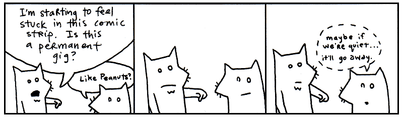

### Regular Expressions

Regular expressions are used to find words or patterns in text. An r before the string tells Python to treat it as a raw string, which is useful when writing regular expressions because raw strings treats backslashes `\` as literal characters instead of escape indicators (for example, `\n` is used to mean new line in regular Python strings).

The cool thing is that regular expression can be used across most programming languages. Regardless of the language, 
the basic building blocks of regular expressions are virtually identical across all modern platforms (with some tweaks in syntax and semantics).

`r"^\S+@\S+\.\S+$"`, `"[0-9]+"` and `r"^\d{3}-\d{3}-\d{4}"` are examples of regular expression patterns.

Imagine if you had a little magnifying glass and held it over a book. You move the glass across the pages, and when it passes over a matching word, it starts blinking. You hold the regular expression over the book, right above the match, and it glows with the letters of the matching word.

Oh, and when you shine the glass over the right spot, the paper sneezes, _reg-exp match!_

Regular expressions are much faster than passing your hand over pages of a book.
Python can use a regular expression to search volumes of books very quickly.

A quick example, let's try to use a regex pattern to match a US phone number. We first need to know the expression for a digit which is `\d` and stands for a single decimal digit between 0 and 9. We can use the regex string `r"\d\d\d-\d\d\d-\d\d\d\d"` to match a US phone number! 

Now, let's shorten that to `r"^\d{3}-\d{3}-\d{4}"`. This can be read as "three digits, a hyphen, three more digits, another hyphen, and four digits". 

??? tip Match US Phone Number with Parentheses and Optional Dashes
	The above regex works pretty well but does not match, a phone number written with parentheses or without dashes. A more complete regex to match phone numbers would be: `r"^\(?\d{3}\)?[-\s]?\d{3}[-\s]?\d{4}$"` which matches all kinds of formats of US phone numbers `(123) 456-7890`, `123-456-7890`, and `1234567890` but not `123-4567-890` (wrong hyphen placement).

In Python, we import the regular expressions package like so: `import re` and use it like so: 

```python
import re
phone_number = "123-456-7890"
pattern = r"^\d{3}-\d{3}-\d{4}"
match = re.match(pattern, phone_input)
print(match)
```

We'll go over regular expressions more later on in the book. 

### Operators

You’ll use the following list of operators to do math in Python or to compare
things. Scan over the list, recognize a few. You know, addition `+` and
subtraction `-` and so on. Here are the most common ones:

	**  ~  *  /  //  %  +  -  &
	<<  >>  |  ^  >  >=  <  <=
	!=  ==  is
	in
	not  and  or
	+=  -=
	
??? tip "A more complete Python Operator reference, grouped by category" 

	```text
	Arithmetic:
	+  -  *  /  //  %  **  @

	Comparison:
	==  !=  >  >=  <  <=

	Identity:
	is  is not

	Membership:
	in  not in

	Boolean:
	not  and  or

	Bitwise:
	&  |  ^  ~  <<  >>

	Assignment:
	=  +=  -=  *=  /=  //=  %=  **=  @=  &=  |=  ^=  <<=  >>=

	Assignment expression:
	:=
	```

### Keywords

Python has a number of built-in words, imbued with meaning. These words cannot be
used as variables or changed to suit your purposes. Some of these we’ve already
discussed. They are in the safe house, my friend. You touch these and you’ll be
served an official syntax error.

    False   None    True    and     as      assert  async   await
    break   class   continue def     del     elif    else   except
    finally for     from    global  if      import  in     is
    lambda  nonlocal not    or      pass    raise   return try
    while   with    yield  match    case

Good enough. These are the illustrious members of the Python language. We’ll be
having quite the junket for the next three chapters, gluing these parts together
into sly bits of (poignant) code.

I’d recommend skimming all of the parts of speech once again. Give yourself a
broad view of them. I’ll be testing your metal in the next section.

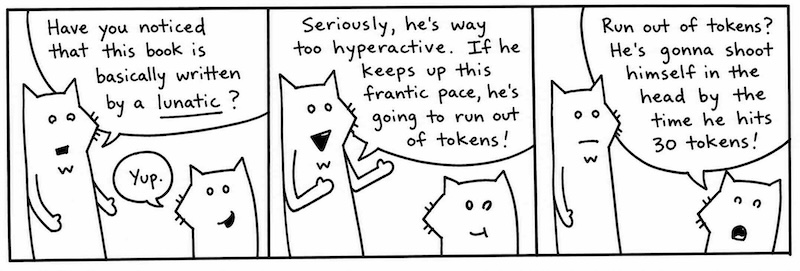

<aside class="sidebar" markdown="1">
### Seven Moments of Zen from My Life

1. 8 years old. Just laying in bed, thinking. And I realize. _There’s nothing
stopping me from becoming a child dentist._
2. 21\. Found a pencil on the beach. Embossed on it: _I cherish serenity._ Tucked
it away into the inside breast pocket of my suit jacket. Watched the waves come
and recede.
3. 22\. Found a beetle in my bathroom that was just about to fall into a heating
vent. Swiped him up. Tailored him a little backpack out of a leaf and a thread.
In the backpack: a skittle and a <span class="caps">AAA</span> battery. That
should last him. Set him loose out by the front gate.
4. Three years of age. Brushed aside the curtain. Sunlight.
5. 14\. Riding my bike out on the pier with my coach who is jogging behind me as
the sun goes down right after I clutched a 1v5 in Fortnite while my squad watched 
in disbelief.
6. 11\. Sick. Watching Bluey on television. For hours, it was Bluey.
And he was able to come right up close to my face. His head spun toward me with 
puppy-dog eye looking straight into mine. His face pulsed back and forth, up close, 
then off millions of miles away. Sound was gone. In fractions of a second, Bluey 
filled the universe, then blipped off to the end of infinity. I heard my mother’s 
voice trying to cut through the cartoon. Bwee, Buey, Bluoy, Boo-ya, Baby Race. 
It was a religious rave with a dog strobe and muffled bass of mother’s voice. 
(I ran a fever of 105 that day.)
7. 18\. Bought myself a labubu. A duck with gorgeous cinnamon  brown fur. Fed it 
for awhile. Gave it a bath. Forgot about it for almost a couple months. One day, 
while cleaning, I found a it at the bottom of my closet. Hey, little duck. Mad 
freaky, duck with webbed feet, but with no bill attached to the hoodie. Was it
just a costume or a lifestyle?
</aside>

## 3. If I Haven't Treated You Like a Child Enough Already

I’m proud of you. Anyone will tell you how much I brag about you. How I go on
and on about this great anonymous person out there who scrolls and reads and
reads scrolls. “These kids,” I tell them. “Man, these kids got heart. I
never…” And I can’t even finish a sentence because I’m absolutely blubbering.

My heart glows bright red under my filmy, translucent skin and they have to administer 10cc of JavaScript 
to get me to come back. (I respond well to toxins in the blood.) Man, that stuff will 
kick the peaches right out your gills!

So, yes. You’ve kept up nicely. But now I must begin to be a brutal
schoolmaster. I need to start seeing good marks from you. So far, you’ve done
nothing but move your eyes around a lot. Okay, sure, you did some exceptional
reading aloud earlier. Now we need some comprehension skills here, Smotchkkiss.

**Say aloud each of the parts of speech used below.**

```py
print("You Still Here, Ho?" * 5)
```

You might want to even cover this paragraph up while you read, because your eyes
might want to sneak to the answer. We have the built-in function `print`, then 
parenthsis followed by a _string_ `"You Still Here, Ho?` multiplied by 5.

**Say aloud each of the parts of speech used below.**

```py
if "aura" in "restaurant":
```

If you were paying attention during the big list of keywords, you’ll know that `if` 
is a _keyword_ and `in` is an _operator_. We ask if the _string_ `"aura"` is in 
the _string_ `"restaurant"`.

**Say aloud each of the parts of speech used below.**

```py
for word in ['toast', 'cheese', 'wine']:
	print(word.capitalize()) 
```

Or if we were in a hurry, we could write it all in one line as such: 

```py
print([word.capitalize() for word in ['toast', 'cheese', 'wine']])
```

This caterpillar partakes of finer delicacies. An _list_ starts this example.
In the list, three _strings_ `'toast'`, `'cheese'`, and `'wine'`. The whole
list is put through a for loop.

Inside of a loop, `word`, travels down its little
waterslide and the _method_ `capitalize` then capitalizes the first
letter of each word, which has become _variable_ `food`. This
capitalized _string_ is passed to built-in _method_ `print` so we can
see it on the screen.

In the one line example, we simply replace the for loop for a list comprehension. 
While it's a quick trick, list comprehensions reduce readability of the code 
significantly so are generally discouraged for anything complex.

Look over these examples once again. Be sure you recognize the parts of speech
used. They each have a distinct look, don’t they? Take a deep breath, press
firmly on your temples. Now, let’s dissect a cow’s eye worth of code.

## 4. An Example to Help You Grow Up

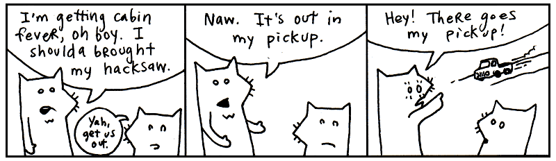

**Say aloud each of the parts of speech used below.**

```python
from urllib import request

response = request.urlopen("https://www.python.org/about/legal/")
print(response.read().decode("utf-8"))
```

The first line is an import statement. We have told Python to load the `request` module from `urllib`, part of Python's standard library, so we can retrieve web pages from the Internet.

There is no package to install. `urllib` comes with Python.

The next two lines go together. `request.urlopen(...)` sends an HTTP request and returns an HTTP response object, which we store in `response`.

Accessing `.read()` reads the response body. It gives us the page as **bytes**, so we then use `.decode("utf-8")` to turn those bytes into a Python string.

Doing okay? Just out of curiosity, can you guess what this example does? Hopefully, you’re seeing some patterns in Python. If not, just shake your head vigorously while you’ve got these examples in your mind. The code should break apart into manageable pieces.

You see it inside the block:

```python
response = request.urlopen("https://www.python.org/about/legal/")
```

We're using Python to get a web page. You've probably entered a URL with your web browser. A **URL**, or Uniform Resource Locator, is the address of a resource on the Internet.

The `request.urlopen()` function sends an HTTP request to a web server and asks for a resource. Conceptualize a bus driver who can drive across the Internet and bring back web pages for us. On his hat are stitched the words **HTTP**, the protocol we're using to ask the driver for the page.

The variable `response` is holding the package the driver brought back.

Now notice the dot:

```python
response.read()
```

The dot lets us access an attribute of the `response` object. Here, `read` is a **method**. The parentheses mean, *please perform this action now*.

Did you catch this pattern in the last line:

    _variable_ . _method_ ( _method arguments_ )

We have seen this pattern appears several times in this chapter. See how the basic dot-method pattern happens in a chain. The next chapter will explore all these sorts of patterns in Python. It’ll be good fun.

So `response.read()` asks the response object to give us the body of the response. What comes back is a sequence of bytes rather than a Python string.

That's why we immediately follow it with:

```python
response.read().decode("utf-8")
```

The `decode()` method converts those bytes into a string using UTF-8, the character encoding used by the web page.

The whole journey looks like this:

```python
response = request.urlopen("https://www.python.org/about/legal/")
print(response.read().decode("utf-8"))
```

First we ask the bus driver to fetch the page. Then we reach into the returned `response` object and ask for its contents with `.read()`. Finally, we decode those bytes into text and print the string.

So, what does the entire code do? The code downloads the HTML of the Python legal page and prints it to your terminal screen.

Specifically, the first line imports the tool needed to make the request. The second sends an HTTP request to the Python website and stores the response. And the final line reads the webpage's HTML, decodes it into a string, and prints it.


## 5. And So, The Quick Trip Came To An Eased, Cushioned Halt

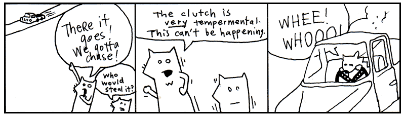

So now we have a problem. I get the feeling that you are enjoying this way too
much. And you haven’t even hit the chapter where I use jump-roping songs to help
you learn how to parse <span class="caps">XML</span>!

If you’re already enjoying this, then things are really going bad. Two chapters
from now you’ll be writing your own Python programs. In fact, it’s right about
there that I’ll have you start writing your own role-playing game, your own
cloud network, as well as a program that will pull genuine random numbers from 
the void.

<p style="float:right" markdown="1">
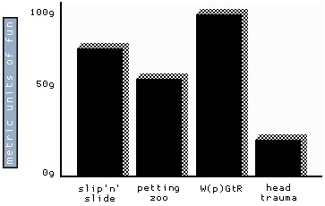
</p>

And you know (you’ve got to know!) that this is going to turn into an obsession.
First, you’ll completely forget to take the dog out. It’ll be standing by the
screen door, darting its head about, as your eyes devour the code, as your
fingers slip messages to the computer.

Thanks to your neglect, things will start to break. Your mounds of printed
sheets of code will cover up your air vents. Your furnace will choke. The trash
will pile-up: take-out boxes you hurriedly ordered in, junk mail you couldn’t
care to dispose of. Your own uncleanliness will pollute the air. Moss will
infest the rafters, the water will clog, animals will let themselves in, trees
will come up through the foundations.

But your computer will be well-cared for. And you, Smotchkkiss, will have
nourished it with your knowledge. In the eons you will have spent with your
machine, you will have become part-CPU. And it will have become part-flesh. Your
arms will flow directly into its ports. Your eyes will accept the video directly
from <span class="caps">HDMI</span>-Ultra96 cable. Your lungs will sit just above the
AI GPU, cooling it.

And just as the room is ready to force itself shut upon you, just as all the
overgrowth swallows you and your machine, you will finish your script. You and
the machine together will run this latest Python script, the product of your
obsession. And the script will fire up AI chainsaws to trim the trees, hearths to
warm and regulate the house. Machine learning builder nanites will rush from your 
script, reconstructing your quarters, retiling, renovating, chroming, polishing,
disinfecting. Mighty androids will force your crumbling house into firm, rigid
architecture. Great LLM pillars will rise, statues chiseled. You will have dominion
over this palatial estate and over the encompassing mountains and islands of
your stronghold.

So I guess you’re going to be okay. What'dya say? Let’s get moving on this script
of yours?


  [1]: https://genius.com/albums/Flo-milli/Ho-why-is-you-here