---
hide:
  - toc
---

# 3. Them What Make the Rules and Them What Live the Dream


{.center}

[TOC]


Frankly, I’m sick and tired of hearing that Dr. Cham was a madman. Yes, he tried
to bury himself alive. Yes, he electrocuted his niece. Yes, in fact, he did
dynamite a retirement home. But this was all with good cause and, in each case,
I believe he took the correct course of action.

I’m sure you’d like to side with popular opinion, but you’re bound to feel some
small trickle of admiration for him once he’s taken time to teach you all about
Python’s class definitions. And more so when you learn about mixins. And perhaps,
by the end of the chapter, we can all start to look beyond the Doctor’s grievous
past and stop calling him a madman.

So if you need to call him a madman, I’d start heading down to the train tracks
to smash up some long fluorescent light bulbs. Get it out of your system right
now, before we dig in.

## 1. This One's For the Disenfranchised


If you give me a number, which is any year from Dr. Cham’s life, I’ll give you a
synopsis of that time period. And I’ll do it as a Python function, so it’s an
independent piece, an isolated chunk of code which can be hooked up to the voice
of a robotic volcano, when such a thing becomes the apex of authoritative voice
talents.

Okay, so I need you to notice `def` and `match` and `case`. You’ve seen the
range, `range(1895,1913)`, back in chapter 3. They contain
from the start up until but not including the stop number. 

And when we have two strings next to each other, we automatically
concatenate them e.g. ["cat " "in " "the " "hat"] => ["cat in the hat"]. Wrapping them in parentheses makes this work across multiple lines (clean multi-line strings).

So, please: `def` and `match` and `case`.

```py
def dr_chams_timeline( year ):
    match year:
        case 1894:
            return "Born."
        case y if y in range(1895,1913):
            return "Childhood in Louisville, Winston Co., Mississippi."
        case y if 1914  <= y <= 1919:
            return "Worked at a pecan nursery; punched a Quaker."
        case y if 1920 <= y <= 1928:
            return ("Sailed in the Brotherhood of River Wisdomming, which journeyed "
                    "the Mississippi River and engaged in thoughtful self-improvement, "
                    "where he finished 140 credit hours from their Oarniversity.")
        case 1929:
            return "Returned to Louisville to pen a novel about time-traveling pheasant hunters."
        case y if 1930 <= y <=1933:
            return ("Took up a respectable career insuring pecan nurseries. Financially stable, he "
                   "spent time in Brazil and New Mexico, buying up rare paper-shell pecan trees. Just "
                   "as his notoriety came to a crescendo: gosh, he tried to bury himself alive.")
        case 1934:
            return ("Went back to writing his novel.  Changed the hunters to insurance tycoons and the "
                   "pheasants to Quakers.")
        case y if 1935 <= y <= 1940:
            return ("Took Arthur Cone, the Headmaster of the Brotherhood of River Wisdomming, as a "
                   "houseguest. Together for five years, engineering and inventing.")
        case 1941:
            return "And this is where things got interesting."

```

The `def` keyword. Here is our first **function definition**. A plain function,
which can be used anywhere in Python. And how do we run it?

```py
print(dr_chams_timeline( 1941 )) # “And this is where things got interesting.”
```

Using `1941` as the argument prints “And this is where things got interesting.”
Here each case statement answers with a string. But what if we put a year in the far, far
future, `3012` when 
Python version 10.x will be released?
In Python, a function that does not 
include an explicit return statement, will return the value None.

```py
print(dr_chams_timeline( 3012 )) # None
```

It’s the same story again and again: Python prefers to explicitly state things. No need to guess at
a value when unsure. Explicit over implicit means fewer surprises, reduces bugs, and makes code easier 
to maintain. Code is read more often than it is written, so an explicit codebase
makes onboarding new developers much faster than one filled with implicit shortcuts. 

Let me be clear about the `case` statement. Actually, I should call it a `match..case` statement, since they are used together. The `match` keyword is followed by a pattern, which is compared against a pattern following the `case` keyword. Python tests the cases from top to bottom and runs the first one whose pattern matches and whose guard, if there is one, is true. You can do the same thing with a bunch of `if..elif` statements, but it’s wordier.

```py
def dr_chams_timeline_with_fallback( year ):
    if year==1894:
        return "Born."
    elif year in range(1895,1913):
        return "Childhood in Louisville, Winston Co., Mississippi."
    else:
        return "No information about this year."
```

Is identical to:

```py
def dr_chams_timeline_with_fallback( year ):
    match year:
        case 1894:
            return "Born."
        case y if y in range(1895,1913):
            return "Childhood in Louisville, Winston Co., Mississippi."
        case _:
            return "No information about this year."
```

So now, `print(dr_chams_timeline_with_fallback(3012))`, with our revised version, will print `"No information about this year."` instead of returning `None`. The year `3012` is not bound to any variable. 

Note that the **`match`** and **`case`** statements work much like an `if`/`elif` chain, but they allow Python to match patterns as well as specific values. In this example, the value of `year` is compared against each case in turn. Notice the catch-all case using `_`. This works much like the `else` clause after an `if`/`elif` chain. The `_` is a **wildcard pattern** that matches anything. Unlike names such as `year` or `x`, it does **not** bind the matched value to a variable. It simply says, "match whatever is left."

Now, let's try `print(dr_chams_timeline( 1905 ))`.

The range(1895, 1913) includes every year from **1895 up to 1912**, but it excludes 1913.While the range itself isn't equal to a single year like 1905, the year 1905 lives inside it. We use the in operator to check if a specific year belongs to this group.Therefore, the statement case y if y in range(1895, 1913) simply means: run this case for any year from **1895 to 1912**.

The above match..case code actually looks like a timeline, doesn’t it? Sure, `dr_chams_timeline` is a function, but it does read like a timeline, clean and lovely.

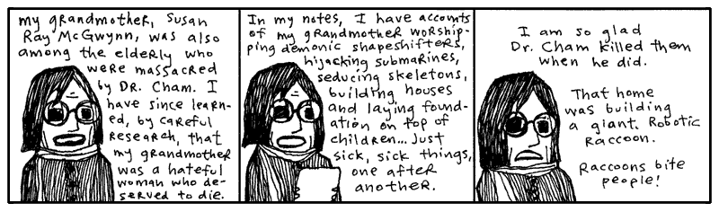

#### Match and Bind!

Python’s match and case aren’t just boring number crunching inspect-o-meters! Oh no. They reach right inside your data packages, crack open the shell, and snatch out the meat while checking them. Dr. Cham calls this structural dissectography.


In the example below, Dr. Cham feeds various traveling sidekicks into the machine. `match` checks how many critters are riding together in the vehicle (a list or a tuple, it doesn’t care!) and binds them instantly to one or more variable, `x`, `y`, and `z`, before they can scamper off.


```py
def inspect_the_caravan(passengers):
    match passengers:
        case [x]:
            print("A solitary wanderer! Greetings, " + str(x) + ".")
        case [x, y]:
            print("A dramatic duo: " + str(x) + " and his trusty sidekick, " + str(y) + "!")
        case [x, y, z]:
            print("A full-on trio! " + str(x) + ", " + str(y) + ", and " + str(z) + " are singing in harmony.")
        case _:
            print("Gadzooks! Too many match sticks in one basket! UNSUPPORTED!")

# Dr. Cham tests the mechanism:
inspect_the_caravan(["Elephant toe", "phenacetin"])
# Output: A dramatic duo: Elephant toe and his trusty sidekick, phenacetin!

inspect_the_caravan(("goat's milk", "sea salt", "peppercorns"))
# Output: A full-on trio! goat's milk, sea salt, and peppercorns are working in harmony.

inspect_the_caravan(["sedated", "sprinkled", "electrocuted", "Hannah"])
# Output: Too many match sticks in one basket! UNSUPPORTED!
```

<aside class="sidebar" markdown="1">
### Caring For You. And Your Wellness.

I need you to be in a good mental state for the latter half of this book. Now is
the time to begin conditioning you.

Let’s start with some deep breathing. Give me a good deep breath and count to
four with me.

Here we go. 0. 1. 2. 3. Now exhale. You can feel your eyes. Good, that’s exactly
it.

Now let’s take a deep breath and, in your mind, draw a hippopotamus as fast as
you can. Quick quick. His legs, his folds, his marshmallow teeth. Okay, done.
Now exhale.

Take another deep breath and hold it tight. As you hold it tightly in your
chest, imagine the tightness is shrinking you down into a bug. You’ve held your
breath so hard that you’re an insect. And all the other bugs saw you shrink and
they loved the stunt. They’re clapping and rubbing their feelers together madly.
But you had an apple in your hand when you were big and it just caught up with
you, crushed the whole crowd. You’re dead, too. Now exhale.

Give me a solid deep breath and imagine you live in a town where everything is
made of USB cables. The houses are all USB cables, the shingles, the
rafters. The doorways are a thick mass of USB cables which you simply
thrust yourself through. When you go to bed, the bedspread is USB cables.
And the mattress and box springs are USB cables, too. Like I said,
everything is made out of USB cables. The USB mouse itself is made of
USB cables. But the USB cables going to the USB mouse is made out of
bread and a couple sticks. Now exhale.

Breathe in. range(4). Breathe out.

Breath in. 0. 1. Another short breath in. 2. 3. Imagine both of your hands
snapping off at the wrists and flying into your computer screen and programming
it from the inside. Exhale.

Big, big deep breath. Deep down inside you there is a submarine. It has a
tongue. Exhale.

Breathe through your nostrils. Deep breath. Filter the air through your
nostrils. Breathing through the nostrils gives you quality air. Your nostrils
flare, you are taking breaths of nature’s air, the way God intended. Imagine a
USB port clogged up with orphans. And while it chokes on orphans, you
have good, wholesome God’s breath in your lungs. But that pleasurable,
life-giving air will become a powerful toxin if held too long. _Hurry, exhale
God and nature’s air!_

Now, you will wake up, smoothing out the creases of this page in your web
browser. You will have full recollection of your whole life and not forgetting
any one of the many adventures you have had in your life. You will feel rich and
renewed and expert. You will have no remembrance of this short exercise, you
will instead remember teaching a rabbit to use scissors from a great distance.

And as you will wake up with your eyes directed to the top of this exercise, you
will begin again. But this time, try to imagine that even _your shadow_ is a
telephone cord.
</aside>

### But Was He Sick??

!!! story ""
    You know, he had such bad timing. He was scattered as a novelist, but his
    ventures into alchemy were very promising. He had an elixir of goat's milk and
    sea salt that got rid of leg aches. One guy even grew an inch on a thumb he’d
    lost. He had an organic health smoke that smelled like foot but gave you night
    vision. He was working on something called Liquid Ladder, but I’ve never seen or
    read anything else about it. It can’t have been for climbing. Who knows.

    One local newspaper actually visited Dr. Cham. Their book reviewer gave him four
    stars. Really. She did an article on him. Gave him a rating.

    Just know that Dr. N. Harold Cham felt terrible about his niece. He felt the
    shock treatment would work. The polio probably would have killed her anyway, but
    he took the chance.

    On Sept. 9, 1941, after sedating her with a dose of phenacetin in his private
    operating room, he attached the conducting clips to Hannah’s nose, tongue, toes,
    and elbows. Assisted by his apprentice, a bespeckled undergraduate named Marvin
    Holyoake, they sprinkled the girl with the flakes of a substance the doctor
    called _opus magnum_. A white powder gold which would carry the current and
    blatantly energize the girl, forcing her blood to bloom and fight and vanquish.

    But how it failed, oh, and how, when the lever was tossed, she arched and
    kicked—and  **<span class="caps">KABLAM</span>!**—and **<span
    class="caps">BLOY</span>-OY-OY-KKPOY!** Ringlets of hair and a wall of light,
    and the bell of death rang. The experiment collapsed in a dire plume of smoke
    and her innocence (_for weeks, everyone started out with, “And she will never
    have the chance…”_) was a great pit in the floor and in their lungs.

To Hannah, I code.

```py
# function definition
def save_hannah(): 
	opus_magnum = False # local variable
# calling the function
save_hannah()
print( opus_magnum ) # Pulls an error: `NameError: name 'opus_magnum' is not defined`. 
```

Functions in Python are a bit like disappearing island. Have you heard the expression 'No man is an island'? It's the same for functions. They can be isolated sometimes desolate places only allowing things to come in and out from certain places -- arguments and return values. Dr. Cham couldn’t breach the illness of his niece, any more than an `opus_magnum` variable can escape from the steely exterior of a function without a proper return clause.

Should we run the `save_hannah` function, Python will squawk at us, claiming it sees
no `opus_magnum`.

I’m talking about **scope**. Microscopes narrow and magnify your vision.
Telescopes extend the range of your vision. In Python, **scope** refers to a field
of vision inside of functions, classes, and list comprehensions.

Variable names introduced in a function's def statement or inside a list comprehension are kept within their own scope, like a little pocket of fresh air. A function's scope ends when the function finishes, while a list comprehension's scope ends when the comprehension is finished. The air bubble collapses (well, almost... objects that are still referenced stick around). You can pass data into a function using arguments, and data can be returned, but variables created inside the function are only available within its scope.

In Python, classes (the blueprints for creating new objects) work differently. A class body is a workshop that builds a namespace (a place where Python keeps track of names and what they refer to) while its methods typically fetch their class tools through `self.`, `cls.`, or the class name. Instance variables like `self.names`, which start with `self`, are available to methods through the instance. Class variables defined at the top of a class, belong to the class and can be accessed through the class or its instances.

We'll explore class and instance variables in a moment.

```py
verb = 'rescued'
states = ['sedated', 'sprinkled', 'electrocuted']
def save_hannah():
	for verb in states:
		print("Dr. Cham " + verb + " his niece Hannah.")
save_hannah()
print( "Finally, Dr. Cham " + verb + " his niece Hannah.")
```

The function's `for` loop _iterates_ (spins, cycles) through each of the Doctor’s actions. The
`verb` variable changes with each pass. In one pass, he’s sedating. In the next,
he’s powdering. Then, he’s electrocuting.

So, the question is: after the function is over, will he have rescued Hannah?

> Dr. Cham sedated his niece Hannah.

> Dr. Cham sprinkled his niece Hannah.

> Dr. Cham electrocuted his niece Hannah.

> Finally, Dr. Cham rescued his niece Hannah.

Function first looks to see variables in the vicinity and if not found, then looks outward 
through the LEGB telescope . But this function has its own
`verb` variable which is updated each cycle. When the function completed and its
 life ended, the 
outer `verb` stayed the same as it was before.

It's the same story with list comprehensions.
The `verb` variable in the list comprehension is temporary. 

```py
verb = 'rescued'
states = ['sedated', 'sprinkled', 'electrocuted']
print(["Dr. Cham " + verb + " his niece Hannah." for verb in states])
print( "Finally, Dr. Cham " + verb + " his niece Hannah.")
```

>['Dr. Cham sedated his niece Hannah.', 'Dr. Cham sprinkled his niece Hannah.', 'Dr. Cham electrocuted his niece Hannah.']

>Finally, Dr. Cham rescued his niece Hannah.

This is the nature of local variables. When its **scope** closes, the variable
goes away with it. Say that `verb` wasn’t used before the list comprehension.

```py
states = ['sedated', 'sprinkled', 'electrocuted']
print(["Dr. Cham " + verb + " his niece Hannah." for verb in states])
print( "Finally, Dr. Cham " + verb + " his niece Hannah.")
```

Pulls an error: `` NameError: name 'verb' is not defined ``. Poof. The inner
variable won't leak outside its scope.

Even passing a variable with the same name won't modify its value outside the function: 

```py
opus_magnum = False
def save_hannah(opus_magnum): # Creates a brand new local argument 
	opus_magnum = True
save_hannah('Help Her!')
print(opus_magnum) # False -- The inner variable won't leak outside its scope.
```

Python looks up variables according to LEGB rule (Local, Enclosing, Global, Built-in). 
The LEGB rule determines where Python looks for variables, searching first from local then to enclosing, 
then global, and finally built-in:

 - Local: Variables created inside the current block of code.
 - Enclosing: Variables in an outer/parent block of code.
 - Global: Variables defined at the top level of the entire Python file.
 - Built-in: Names provided by Python itself, such as `print`, `len`, and `str`.
 
However, despite being called global, there is a massive catch with these variables in Python: 
while you can freely read global variables inside functions, classes, and list comprehensions, 
trying to modify them directly will create a brand new local variable: 

```py
tesla_coil = 0
def grow_tesla_coil():  
	tesla_coil = 1 # creates a new local variable
grow_tesla_coil()
print(tesla_coil) # still 0
```


Or sometimes it may even fail instead:

```py

tesla_coil = 0
def grow_tesla_coil(): 
	tesla_coil = tesla_coil + 1 # Throws an UnboundLocalError! (trying to read and write, Python gets confused)
grow_tesla_coil()
print(tesla_coil)
```

To modify variables within the scope of a function, we can declare them global. 

```py
tesla_coil = 0
def grow_tesla_coil(): 
	global tesla_coil # not commonly used
	tesla_coil = tesla_coil + 1
grow_tesla_coil()
print( tesla_coil ) # prints 1 -- global variables can be modified inside of a function
```
Although it works, the `global` keyword in Python is not often used. Frequent use is widely considered a 
poor programming practice. Much better to pass in an argument and return a value like so: 

```py
tesla_coil = 0
def grow_tesla_coil(coils): 
    coils = coils + 1 
    return(coils)
tesla_coil = grow_tesla_coil(tesla_coil) # pass in a variable as an argument and update its value by assignment
print( tesla_coil ) # prints 1 
```

!!! story ""
    It must be something difficult, even for a great scientist, to carry away the
    corpse of a young girl whose dress is still starched and embroidered, but whose
    mouth is darkly clotted purple at the corners. In Dr. Cham’s journal, he writes
    that he was tormented by her ghost, which glistened gold and scorched lace. His
    delusions grew and he ran from hellhounds and massive vengeful, angelic hands.

    Only weeks later, he was gone, propelled from these regrets, vanishing in the
    explosion that lifted him from the planet.

    And even as you are reading this now, sometime in these moments, the bell jar
    craft of our lone Dr. Cham touched down upon a distant planet after a sixty year
    burn. As the new world came into view, as the curvature of the planet widened,
    as the bell jar whisked through the upset heavens, tearing through sheets of
    aurora and solar wind, Dr. Cham’s eyes were shaken open.

    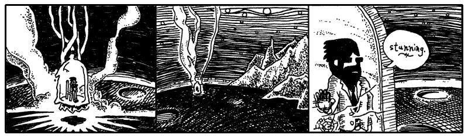

    What you are witnessing is the landing of Dr. Cham on the planet Endertromb.
    From what I can gather, he landed during the cusp of the Desolate Season, a time
    when there really isn’t much happening on the planet. Most of the inhabitants
    find their minds locked into a listless hum which causes them to disintegrate
    into just vapid ghosts of one-part-wisdom and three-parts-steam for a time.

    <h1 style="font-size:56pt; color:#A53; line-height: 100%;text-align:center;">Welcome to Planet Endertromb!</h1>

For three days (by his pocket watch’s account), Dr. Cham traveled the dark
shafts of air, sucking the dusty wind of the barren planet. But on the third
day, he found the Desolate Season ending and he awoke to a brilliant vista,
decorated with spontaneous apple blossoms and dewy castle tiers.


## 2. A Castle Has Its Computers


Our intrepid Doctor set off for the alien castle, dashing through the flowers.
The ground belted past his heels. The castle inched up the horizon. He desired a
stallion, but no stallion appeared. And that’s how he discovered that the planet
wouldn’t read his mind and answer his wishes.

As my daughter’s organ instructor explained it, however, the planet **could read
minds** and it **could grant wishes**. Just not both at the same time.

One day as I quizzed the organ maestro, he sketched out the following Python code
on a pad of cheese-colored paper. (And queer cheese smells were coming from
somewhere, I can’t say where.)

!!! warning "endertromb.py doesn't exist"
    The `endertromb.py` module and `Endertromb` class are fictional. Sometimes in coding we have to use other libraries as black boxes, without knowing or caring how they are implemented. 
    
    Because of the module doesn't exist, you won't be able to run the code for any of these `Endertromb` examples in this section. But that's okay! Just relax a little and give into the idea of programming-as-language! Then imagine in your mind a planet Endertromb that can read minds and makes wishes. 

    
```py
import random
from endertromb import Endertromb # Python module from planet Endertromb

class WishMaker:
    def __init__(self):
        self.energy = random.randint(0, 5)

    def grant(self, wish):
        if len(wish) > 10 or " " in wish:
            raise ValueError("Bad wish.")

        if self.energy == 0:
            raise RuntimeError("No energy left.")

        self.energy -= 1
        Endertromb.make(wish)
```

This is the wish maker.

Actually, no. This is a **definition for a wish maker**. To Python, it's a **class definition**. The code describes how a certain kind of **object** will work.

Each morning, a new `WishMaker` is created, with up to five wishes available for granting:

```py
todays_wishes = WishMaker()

print(todays_wishes.energy)
```

So remember:

* Class = the blueprint to create a wish maker e.g. WishMaker
* object = the thing that grants wishes e.g. todays_wishes 

??? info "ClassName, object_name, and PEP 8?"

	Note that, by convention, class names such as `Door` use CapWords (also called PascalCase), where each word begins with a capital letter. Object names, such as `back_door`, along with variables and functions, typically use snake_case, where words are separated by underscores and written in lowercase.
	
	CapWords name are used for factory: `Door`, `MindReader`, `WishMaker` (standing tall, giving orders). While snake_case are individual objects the factory makes: `back_door`, `smaug`, and `my_wish_maker` (keeping their heads down and traveling in neat little snake-shaped lines).

	**PEP 8**: These naming habits come from PEP 8, which guides code readability. Python doesn't enforce these rules; you could name a class `door`, `DOOR`, or `dOoR` and the code would still run.However, humans rely on these conventions to understand code structure at a glance: 

	* `Door` (CapCase): signal to developers that this is a class, the blueprint or factory for creating objects.
	* `back_door` (snake_case): signals variables, objects, functions, and methods.

	Think of these little naming customs like trail markers in a dark and scary forest 🌲🌲🌲. Nobody forces you to follow them, but they make it much easier for everyone to find their way home. After a while, you'll start recognizing Python code at a glance because the names all have a familiar shape and rhythm. *The Shape of You* by Ed Sheeran starts playing in the background.

Calling `WishMaker()` creates a new object. There is some Python magic behind the scenes we'll get into that soon, but basically Python initializes or prepares the object. The `__init__` method tells Python exactly how to do this, and in this case assigns a random amount of `energy` to the wish maker object. This number represents how many wishes the wish maker has left for the day. So, occasionally, when `energy` is zero, there are no wishes available at all (talk about bad luck).

Notice that outside the class, we access the the instance variable `energy` like so:

```py
todays_wishes.energy # object.instance_variable
```

But, inside the class, we access that same instance variable through `self`:

```py
self.energy          # object_reference.instance_variable
```

In chapter three, we briefly looked at **instance variables**. Instance
variables can be used to store any kind of information, but they’re most often
used to store bits of information about the object represented by the class.
Here, `self.energy` is an **instance variable** belonging to that a particular object.

The object `todays_wishes` has its own energy level. If the
`todays_wishes` was a new gadget, you might see a gauge or battery meter on it that points to the energy
left inside. In this case, `energy` is the instance variable that acts as that gauge for `todays_wishes`.

Getting back to the class definition: 

```py 
class WishMaker:
    def __init__(self):
        self.energy = random.randint(0, 5)

    def grant(self, wish):
        if len(wish) > 10 or " " in wish:
            raise ValueError("Bad wish.")

        if self.energy == 0:
            raise RuntimeError("No energy left.")

        self.energy -= 1
        Endertromb.make(wish)
```

Where does the `self` come from? Why do we need to use it inside of the class definition for `WishMaker`, especially when we are already *inside* the class method `grant`?

```py
todays_wishes = WishMaker()
todays_wishes.grant( "antlers" )
```

When an object call a method, Python automagically passes that object as a first argument. In `def grant(self, wish):`, the `self` parameter *receives* the object that calls it: 

"Hello wish maker object calling me, I am naming you `self`!" 

We could name it whatever we want, but convention dictates that we call it `self` so everyone is clear we are referencing the calling object. 

For example, when we call `todays_wishes.grant( "antlers" )`, Python passes `todays_wishes` to `grant` as `self` and can then used to access instance variables and methods (among other things)! 

Now, if `yesterdays_wishes` were to call `grant`, then what would `self` reference then? Exactly right, only the instance variables of `yesterdays_wishes`! That's because `self` is an object reference, pairing an object with its attributes. When `grant` is called via `yesterdays_wishes` , Python cannot access the object `todays_wishes` attributes no matter how hard it tries. 

Remember **instance variables** are tied to a current object. Since a class can be used to create many, many objects, we need a way to point the current object! So `self` becomes a placeholder meaning **“this specific object right here.”**  We always must use `self` when we want to retrieve and store its **instance variables** as these are like an object's private property.

Okay, step back and ensure you understand the example here. The `WishMaker`
class is an outline we’ve laid out for how the whole magic wish program works.
It’s not the _actual_ genie in the bottle (the object), it’s the paperwork behind the scenes.
It’s the rules and obligations the genie has to live by. It's the factory that 
makes genies.

And `todays_wishes`, that’s the genie in the bottle. And here we’re giving it a
wish to grant. Give us antlers, genie. (If you really get antlers from this
example, I don’t want to hear about it. Go leap in meadows with your own kind
now.) 

Using `self` marks the beginning of crossing over into many of the more advanced
ideas in Python. Python is definition language. You’re defining a method, designing
it before it gets used. You’re preparing for the existence of an object which
uses that method. You’re saying, “When `grant` gets used, there will be a
wish maker (a genie in the bottle) at that time which is the one that will grant the wishes. And `self` is a special variable which refers to that wish maker object itself.:

Python is an object-oriented programming language. A succulent and brain-splitting
discussion is coming your way deeper in this book.

Note about `self`: Methods are just functions defined inside a class, so they follow the standard  Local, Enclosing, Global, Built-in (LEGB) rules. Instance variables use a different lookup, through `self`! Since they *belong* to a particular object, we need a reference to the object to access them. 

### Defining and Putting things to action: object and method

In the last chapter, the drill was: Python has two halves.

1. Defining things.
2. Putting those things into action.

What are actions in Python? That's right: functions (including methods). And now, you’re having 
a lick at the definition language built-in to Python. Function (including method)
definitions use `def`. Class definitions use `class`.

At this point in your instruction, it’s easier to understand that **everything
in Python is an object.** Strings, integers and even functions and classes are objects.
We see addition and length with the familiar `object.method(value)` format below, 
showing that underneath the floorboards, they have methods just like any other object.

```py
number = 5
print(number+1)                      # prints '6' (invokes the integer object's __add__ method)
#print(number.__add__(1))            # object.method(value)
      
phrase = 'wishing for antlers'
print(len(phrase))                  # prints '19' (invokes the string object's __len__ method)
#print(phrase.__len__())            # object.method(value)

todays_wishes = WishMaker()
todays_wishes.grant("antlers")      # object.method(value)
```

And, consequently, each object has a class behind the scenes.

```py
print( type(5) )                       # prints <class 'int'>
print( type('wishing for antlers') )   # prints <class 'str'>
print( type(WishMaker()) )             # prints <class '__main__.WishMaker'>
```

!!! story ""
    Dr. Cham never saw the wish maker as he hustled across the landspace. It lay far
    beyond his landing in the valley of Sedna. Down sheer cliffs stuffed with layers
    of thicket, where you might toss your wish (written on a small 1” x 6” slip),
    down into the gaping void. Hopefully it will land on a lizard’s back, sticking
    to its spindly little horn.

    And let’s say your wish makes it that far. Well, then, *down the twisted wood*
    goes the skinny salamander, scurrying through the decaying churches which had
    been **pushed** over that steep canyon ledge once and for all. And the expired
    priest inside, *who weathered the fall* as well, will kill the little
    amphibian—strangle it to death with a blessed gold chain—and save it for the
    annual *Getting To Know You* breakfast. 

    He’ll step on your precious little wish and, when the **thieves come**, 
    that slip will still be there, stuck on his sole. Of course, the thieves’ 
    **preferred method of torture** is to cut a priest in thin deli-shaved slices 
    *from top to bottom*. Who can cull evidence from
    that? And when they chop that last thin slice of shoe sole, they’ll have that
    **rubber scalp** in hand for *good luck* and *good times*. 

    But they **canoe** much too hard, these thieves. They slap their paddles swiftly in the current to
    get that great *outboard motor mist* going. But the shoe sole is *on a weak
    chain*, tied to one man’s belt. And a **hairy old carp** *leaps, latches* on to
    that minute fraction of footwear. And the thieves *can try*, but they don’t see
    *underwater*. If they could, they’d see that **mighty cable**, packed with
    millions of *needly* fiber optics. Indeed, **that fish is a peripheral plugged**
    right into the *core workings* of the planet Endertromb. **All it takes is one
    swallow** from that fish **and your wish is home free!**

And that’s how wishes come true for children in this place.

Once my daughter’s organ instructor had drawn up the class for the wish maker,
he then followed with a class for the planet’s mind reader.

```py
from endertromb import Endertromb

class MindReader:

  def __init__(self):
    self.minds = Endertromb.scan_for_sentience()

  def read(self):
    return [mind.read() for mind in self.minds]
```

Now getting back to that `__init__`. The `__init__` method runs when a new `MindReader`
object is created. This `__init__` gathers scans of the planet for mindshare.
It looks like these minds are stored in an iterable collection, since they are later iterated over using a list comprehension in the read method.

Think of it like this: `MindReader()` brings an object into the room, then `__init__` arranges the new object as we'd like.

Now the actually code inside the `MindReader` is quite confusing and seems a bit circular a `read()` method that calls another `read()` method? Let's hold off on tackling that just yet, but I promise it will make sense soon. 

### Dr. Cham Ventures Inside

!!! story ""
    But as Dr. Cham neared the castle, although the planet was aware of his
    thoughts, sensing his wonderment and anticipation, all Dr. Cham felt was
    deadness. He tromped up the steps of its open gate and through the entrance of
    the most beautiful architecture and was almost certain it was deserted.

    For a while he knocked. Which paid off.

    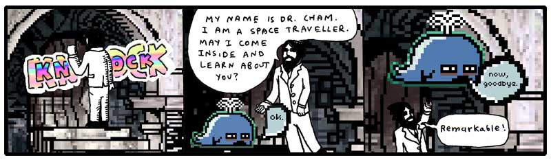

    He watched the baby whale rise like a determined balloon. He marveled at his
    first alien introduction and felt some concern that it had passed so quickly.
    Well, he would wait inside.

    As he stepped through the castle door, he felt fortunate that the door hadn’t
    been answered by a huge eagle with greedy talons, eager to play. Or a giant
    mouse head. Or even a man-sized hurricane. Just a tubby little choo-choo whale.

    “Not a place to sit down in this castle,” he said.

    At first, he had thought he had just entered a very dim hallway, but as his eyes
    adjusted, he saw the entrance extended into a tunnel. The castle door had opened
    right into a passage made of long, flat slabs of rock. Some parts were congruous
    and resembled a corridor. Other parts narrowed, and even tilted, then finally
    tipped away out of view.

    The passage was lit by small doorless refrigerators, big enough to hold an
    armful of cabbage, down by his feet. He peered inside one, which was hollow,
    illuminated along all sides, and turning out ice shards methodically.

    He pawed the ice chips, which clung dryly to his fingertips, and he scrubbed his
    hands in the ice. Which left some muddy streaks on his hands, but satisfied a
    small part of his longing to bathe. How long had it been? Ten years? Thirty?

    Along the passage, long tubes of cloth cluttered some sections. Later, bright
    pixel matter in porcelain scoops and buckets.

    He happened upon a room which had been burrowed out of the tunnel which had a
    few empty turtle shells on the ground and a large illuminated wall. He stared
    into the room, bewildered. What could this be? In one state of mind, he thought
    of having a seat on a shell. This could be the entrance at last, some kind of
    receiving room. On the other hand, spiders could pour out of the shell’s hollow
    when he sat. He moved on.

### Meal in a Castle’s Pocket

!!! story ""
    As he journeyed along the passageways (for the central tunnel forked and joined
    larger, vacuous caverns), he picked up themes in some locations. Groups of rooms
    infested with pumping machinery. Cloth and vats of glue dominated another area.
    He followed voices down a plush, pillowed cavity, which led him to a dead end: a
    curved wall with a small room carved at eye-level.

    He approached the wall and, right in the cubby hole, were two aardvarks eating
    at a table.

    They gazed at him serenely, both munching on some excavated beetle twice their
    size, cracked open and frozen on its back on the table.

    “Hello, little puppets,” he said, and they finished their bites and kept looking
    with their forks held aloof.

    “I wish my niece Hannah were here to meet you,” he told the attentive miniature
    aardvarks. “She’d think you were an intricate puppet show.” He peered in at the
    dining area, shelves with sets of plates, hand towels. Half of a tiny rabbit was
    jutting out from the top a machine, creamy red noodles were spilling out
    underneath it. A door at the back of the room hung ajar. Dr. Cham could see a
    flickering room with chairs and whirring motors through the door.

    “Any child would want this dollhouse,” he said. “Hannah, my niece, as I
    mentioned, she has a wind-up doll that sits at a spindle and spins yarn. It’s an
    illusion, of course. The doll produces no yarn at all.”

    One of the aardvarks opened a trapdoor in the floor and pressed a button down
    inside, which lit. Then, a small film projector slowly came up on a rod. The
    other aardvark sat and watched Dr. Cham.

    “But Hannah still reaches down into the dollhouse and collects all the imaginary
    yarn into a bundle. Which she takes to her mother, my sister, who is very good
    at humoring Hannah. She sews a dress to the doll’s dimensions, which Hannah
    takes back to the doll.

    “And she tells the doll, ‘Here, look, your hard work and perseverance has
    resulted in this beautiful dress. You can now accept the Chief of Police’s
    invitation to join him tonight at the Governor’s Mansion.’ And she has a doll in
    a policeman’s uniform who plays the part of the Chief. He’s too scrawny to be an
    actual Chief, that would require quite a bit of plastic.”

    The aardvark responsible for the film projector loaded a reel and aimed the
    projector at the back wall. The film spun to life and the aardvark took a seat.
    A green square appeared on the wall. The attentive aardvark stared at Dr. Cham
    still.

    “Your films are colored,” said Dr. Cham. “What a lovely, little life.”

    The film played on: a blue square. Then, a red circle. Then, an orange square.
    The attentive aardvark turned away, watched the screen change to a pink
    triangle, and both aardvarks resumed eating.

    A purple star. A red square. With quietness settling, Dr. Cham could hear notes
    droning from the projector. Like a slow, plodding music box trying to roll its
    gears along the train tracks.

    “Yes, enjoy your supper,” said Dr. Cham and he politely tipped his head away,
    marching back up the path he’d taken.

### Another Dead End Where Things Began

!!! story ""
    He found himself lost in the castle’s tunnels. Nothing looked familiar. He
    wasn’t worried much, though. He was on another planet. He would be lost
    regardless.

    He wound through the tunnels, attempting to recall his paths, but far too
    interested in exploring to keep track of his steps. He followed a single tunnel
    deep, down, down, which slanted so steeply that he had to leap across ledges and
    carefully watch his footholds. The gravity here seemed no different than Earth.
    His legs were pulled into slides just as easily.

    Although he had no absolute way of knowing where he was, he felt certain that he
    had left the castle’s boundaries. This deep, this long of a walk. It had been an
    hour since he’d entered through the door. And, as the tunnel wound back up, he
    was sure that he would emerge into a new dwelling, perhaps even a manhole which
    he could peek out from and see the castle. Perhaps he shouldn’t have come so far
    down this route. He hoped nothing was hibernating down here.

    The tunnel came to a stop. A dark, dead end.


He had time. So he read the book. He read of the foxes and their pursuit of the
porcupine who stole their pickup truck. He read of the elf and the ham. He saw
the pictographs of himself and found he could really relate to his own
struggles. He even learned Python. He saw how it all ended.

Were I him, I couldn’t have stomached it. But he did. And he pledged in his
bosom to see things out just as they happened.

On the computer monitor, Dr. Cham saw the steady `>>>` prompt. Like Dr. Cham,
you might recognize the `>>>` prompt from [The Tiger’s Vest][1] (the first
expansion pak to this book, which includes a basic introduction to Python Shell, the interactive interpreter.)

Whereas he had just been exploring tunnels by foot, he now explored the
machine’s setup with the prompt. He set the book back where he had found it. He
didn’t need it anymore. This was all going to happen whether he used it or not.

??? note "Play along with your own `Elevator` class!"
    Download the `Elevator` class, import it, and help Dr. Cham investigate the `Elevator` on your Python shell. **Resist the urge to look at the elevator.py code.** We want to learn about it the way a programmer that hates documentation might learn about code, through directly trying around with it. 

    * Download: <a href="../code-examples/elevator.py" download>elevator.py</a>
    * Import: `from elevator import Elevator` or open the file and run it with the play button in your IDE
    * Use: `dir(Elevator)`

He started with the `dir` built-in function, returning a list of names currently defined in the local scope:

```pycon
>>> dir()
=> [...'__doc__', '__loader__', '__name__'... and so on ]
```
This command lists all the names in the current scope. Modules, classes, and functions are also 
listed, so this list can be great to see what’s loaded into Python at any time.

He scanned the list for anything unfamiliar. Any classes which didn’t come with
Python. `__package__`, `__spec__`, `builtin_classes`, `builtins`, `constants`. Each of those came with
Python.

But at the very beginning of the list:

    [  "Elevator", "__annotations__" ...

_Elevator?_ Exactly the kind of class to poke around with. He had a go with the `dir` function again, this time
on the Elevator itself.

```pycon
>>> dir(Elevator)
=> ['diagnostic_report', 'power_circuit_active', '_Elevator__maintenance_password', '_level', '__dict__', '__dir__', '__doc__', '__eq__', ... another long list ... ]
```

Looks like the `Elevator` class had plenty of methods and attributes. 
But what's with all the attributes starting and ending with "__"? 
The attributes starting and ending with "__" like `__dict__` and `__eq__` in Python are 
called dunder attributes (or dunder methods when they are functions) and are shared by many objects in Python.

For example,
- __str__: Turns the object into a nice text string for humans to read.
- __repr__: Shows an exact, official string look of the object for developers.
- __len__: Gives back the size or count of items inside the object. 

The few variables at the start of list were interesting to Dr. Cham. This elevator appeared
genuine. 

He tried to create an `Elevator` object.

```pycon
>>> e = Elevator()
Traceback (most recent call last):
File "<stdin>", line 1, in <module>
TypeError: __init__() missing 1 required positional argument: 'password'
```

He tried a few passwords.
```pycon
>>> e = Elevator( "going up" )
PermissionError: bad password
>>> e = Elevator( "going_up" )
PermissionError: bad password
>>> e = Elevator( "stairs_are_bad" )
PermissionError: bad password
>>> e = Elevator( "StairsAreBad" )
PermissionError: bad password
```

That was useless. *Oh, wait!* Hadn't he seen `maintenance_password`?

```pycon
>>> Elevator.maintenance_password
AttributeError: type object 'Elevator' has no attribute 'maintenance_password'
```

He had seen some variable like `maintenance_password`, but looking more closely, the name had some sort of long prefix.

```pycon
>>> dir(Elevator)
=> ['diagnostic_report', 'power_circuit_active', '_Elevator__maintenance_password', '_level', '__dict__', '__dir__', '__doc__', '__eq__', ... another long list ... ]
```

He looked up and wrote down the full name of the **class variable**:

```pycon
>>> Elevator._Elevator__maintenance_password
=> "stairs_are_history!"
```

Alright! He got the password. Did you see that?

??? question "Class Variables?"
    While instance variables are the most common way to define attributes within a Python class, you can also use class variables. Instead of belonging to a single object, class variables are shared with all related objects of the same class in Python. 

    ```py
    class Door:
        # Class variables: Shared by ALL doors
        WARRANTY_FINE_PRINT = "1 year money back guarantee. Void for French or Polish doors."
    ```

    We call class variables by simply using the class name followed by a *dot* and the variable name e.g. `Door.WARRANTY_FINE_PRINT`.

Why the long name? When attributes begin with `__`, Python performs mangling to make the names harder to accidentally access. When you add a __double_leading_underscore, you are telling Python its off limits and the mangling helps to enforce that. While no substitute for true elevator security, name mangling does prevent accidental overwrites of this important class information.

We can still grab the mangled **class variable**, but we just gad to use the much longer name to show we actually are trying to access it `_Elevator__maintenance_password`.

We will be using the password frequently, so Dr. Cham decides why not make a method to retrieve it? He quickly codes up the method and adds it to the class as a **class method**.  

```py
def get_pass(cls):
    return cls._Elevator__maintenance_password  # gets the password from the mangled variable

Elevator.get_pass = classmethod(get_pass)
Elevator.get_pass() # "stairs_are_history!"
```

Isn’t that great how you can create new methods and apply them to `Elevator` and Python modifies 
the existing class definition?

Class methods can be called using Class name followed by a **dot**. Since `Elevator` is a class itself, we know that if we call `Elevator.get_pass()`, we are calling class method. 

Now, **class methods** are a bit unusual. Normally you won’t want to store
information directly inside of a class. However, if you have a bit of
information that you need to share among all objects of a class, then you have a
good reason to use the class for storage. It’s understandable that the
`__maintenance_password` would be stored in the class, instead of in each
separate object. This way, the objects can simply reach up into the class and
see the shared password.

Here’s probably how the password protection works (which is slightly pointless class variables can be seen from the outside):

```py
class Elevator:
    __maintenance_password = "stairs_are_history!" # Python will manage this variable name for us at runtime
...
    def __init__(self, password ):
        if password != self._Elevator__maintenance_password:
            raise PermissionError("bad password")
...
```

Plus, since classes in Python can be altered and overwritten and remolded, someone who knew how things worked could always just change the password and bypass our elevator security. 

But Dr. Cham already had the password. Ownership of the elevator is his.

```pycon
>>> e = Elevator( "stairs_are_history!" )
#<__main__.Elevator object at 0x7f117bf7d5e0>
>>> print(e.level) #4
>>> e.level = 1
=> Moving down from level 4 to level 1.
```

He was standing right there when the elevator doors, off behind the
computer terminal, opened for him. 

Dr. Cham stood in shock. Setting `level` to 1 resulted in an action? How could it be? He would only learn much later from the lottery capitan, the mysterious hidden force behind this action.

With an exasperated sense of accomplishment
and a good deal of excitement surrounding all of the events that lie ahead, he
stepped into the elevator and pressed 4.

<aside class="sidebar" markdown="1">

### An Evening of Unobstructed Voltage

I dug up this article from *The Consistent Reminder*, a Connecticut newspaper
which ran the four star review of Dr. Cham. Midgie Dare, the book reviewer who
suddenly opened her critical eye to anything tangible, praised the Doctor for
his manners and innovations in the very same daily edition that she defamed
cantaloupe and docked Manitoba for having crackly telephone service.

I got a kick out of the end of her article. Here you go.

> He dismounted his horse with unquestionable care for anyone who might be in
> the vicinity. Attentive of all sides, he lowered himself from the saddle
> gently, slowing to a pace which must be measured in micrometers per second to
> be appreciated.
>
> Those of us in his company found ourselves with maws agape, watching his boot
> touch down upon the ground. So precise and clean a step that it seemed it
> would never meet the earth, only hover slight above it. Then, before the
> landing had actually registered with any of us, we were off to the cuisine,
> whisked away in the shroud of gaiety that was always right in front of Harold

> Cham, always just behind him, and most especially concentrated directly in his own luminary self.
>
> He also carried loosely at his side a capitally ignorant statesman’s daughter,
> who spared us no leave from her constant criticisms of atheists and railway
> routes.
>
> “At home, my efforts to light a candle were trounced upon by further train
> rumblings, which thrusted the match in my hand nearer the curtains!” She
> derided Dr. Cham for his waning grip on her forearm and became jealous when he
> was able to tune into a pleasurable woman’s voice on the radio once we
> returned to the residence.
>
> The dusk did settle, however, and we found ourselves in a communal daze
> beneath the thick particles of cotton drift that wafted through the polished
> piano room, quite entertained by the *Afternoon Nap Program*, which played
> their phonograph so quietly at the station that we could only hear the
> scratching of dead Napoleon’s sleeves across the bedsheets. I felt a great
> shriek inside me at the thought! Still, on yonder chairs, the two lovers kept
> an abrupt distance between themselves and I felt encompassed by Dr. Cham’s
> warm gaze and his playful tip of the sherry glass.

</aside>


## 3. The Goat Wants to Watch a Whole Film


!!! story ""
    The elevator had opened into a green room full of shelves and file cabinets.
    Reels of tape and film canisters and video tape everywhere. Dr. Cham hadn’t a
    clue what most of it was. All he saw was a big, futuristic mess.

    He called out again, stumbling through alleys of narrow shelves, “Hello-o-o??
    I’m looking for intelligent life! I’m a space traveler!” He tripped when his
    foot slid right into a <span class="caps">VCR</span> slot. “Any other beings I
    can communicate with?”

    Hand cupped around mouth, he yelled, “Hello-o-o?”

    “Crying out loud.” The sleepy goat came tromping down the aisle.

    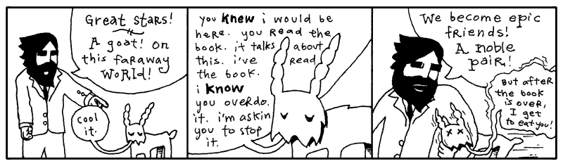

    “I hate that book,” said the goat. “I believe the author is disingenuous.”

    “Really?” asked Dr. Cham.

    “I’m sure it’s all true. It’s just so heavily embellished. I’m like: Enough
    already. I get it. Cut it out.”

    “I’m not quite sure what to make of it,” said the Doctor. “It seems like an
    honest effort. I actually wrote something in Python back there.”

    “It doesn’t give goats a very good name,” said the goat.

    “But you are the only goat in the book,” said the Doctor.

    “And I’m totally misquoted.”

    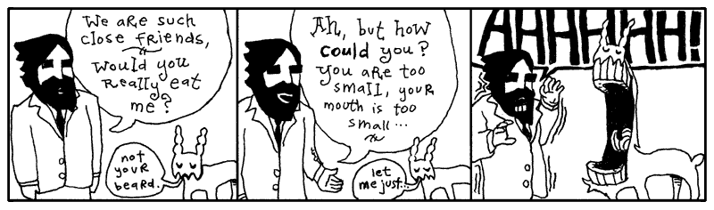

    The goat closed his mouth and Dr. Cham held his heart.

    “I’m actually very literate,” said the goat. “Albeit, more recently, I’ve
    switched to movies. I love foreign films. One of my relatives just brought back
    _Ishtar_ from your planet. Wow, that was excellent.”

<aside class="sidebar">
<pre>we want a tambourine!
           /
          |  tambourine for all!
          |      /
          \__  |
        /  o o \__/\__/\_
      /.           \ o o \____
       /'      ----/          \
_____ /  '    / /.\\   #------/
       /     /        /     \\
             /       ///
      /so               \
           /\   \me time\\..
       /pp/  \s these pictur\\
      /es/   \don't w\ \ork out\
     ***      *** right but i
       think this time
          they did
            ooo o
             oo
            o
         o
      {o}
   ^
</pre>
</aside>

!!! story ""
    “I haven’t been to my planet in a long time. It would be difficult to consider
    it my home at this stage.”

    “Well, Warren Beatty is delightful. His character is basically socially
    crippled. He actually tries to kill himself, but Dustin Hoffman sits in the
    window sill and starts crying and singing this totally hilarious heartbreak
    song. I’ve got it here, you should see it.”

    “Can I get something to eat?” asked the Doctor. And he still felt filthy.

    “How about we watch a film and you can have a buttermelon with tentacles?” said
    the goat.

    So, they worked their way back toward the goat’s projector. Back by the freezer
    locker, they sat on a giant rug and broke off the appendages of frozen
    buttermelons. The shell was solid, but once it cracked, rich fruit cream was in
    abundance. Sweet to taste and a very pleasant scent.

    “First film, you’ve got to see,” said the goat. “Locally filmed and produced.
    I’m good friends with the lady who did casting. Dated her for awhile. Knew
    everyone who was going to play the different roles long before it was
    announced.”

    The goat set the projector by Dr. Cham. “I’ve got the music on the surround
    sound. You can man the knob.”

    

    Dr. Cham’s mind wandered at this point in the presentation, just as the land war
    mounted between the two throngs of animal settlers. The details of their wars
    and campaigns continued to consume the spool of transparent film that Dr. Cham
    was feeding through the projector.

    War after war after war. The Sieging of Elmer Lake. The Last Stand of Newton P.
    Giraffe and Sons. Dog Invasion of Little Abandoned Cloud. No animals died in
    these wars. Most often an attack consisted of bopping another animal on the
    head. And they philipped each other’s noses. But, believe me, it was
    humiliating.

    Blasted crying shame. Things could have worked out.

### The Birth of an Object

“Don’t worry,” said the goat, anxious to sway Dr. Cham’s attention back to the
film. “Things _do_ work out.”

In Python, the Object is the very center of all things. It is The Original.

```py
class ToastyBear(object):
    pass
```

The parentheses indicate inheritance. This means that the new ToastyBear class is a new class based on the object class. Every method that object has will be available in ToastyBear. Attributes available in object will be available in ToastyBear. But every object inherits from object. In Python 3, the code…

```py
class ToastyBear:
    pass
```

Is identical to…

```py
class ToastyBear(object):
    pass
```

Inheritance is handy. You can create species of objects which relate to each
other like we did before with `CustomString` as a subclass of `str`. Often, when you’re dissecting a problem, you’ll come across various objects which share attributes. You can save yourself work by inheriting from classes which already solve part of that problem.

You may have a `UnitedStatesAddress` class which stores the address, city,
state, and zip code for someone living in the United States. When you start
storing addresses from England, you could add a `UnitedKingdomAddress` class. If
you then ensure that both addresses inherit from a parent `Address` class, you
can design your mailing software to accept any kind of address.

```py
def mail_them_a_kit(address):
    if not isinstance(address, Address):
        raise TypeError("No Address object found.")
    
    print(address.formatted())
```

Also, inheritance is great if you want to add or change certain behaviors in an existing class (as we did when with `CustomString`, adding new methods). Perhaps you want to make your own slight variation to the `list` class, and add a `join()` method similar to what the `str` class provides. This too is possible with subclassing. Those smug strings with their `.join()` parties will have nothing on our brand new `ListMine` class!

So you start your own class and name it `ListMine`, and base it on The Original `list`. 

```py
class ListMine(list):
    """A custom list class with enhanced string joining capabilities."""

    def join(self, sep, fmt):
        """Format each item in the list and join them with a separator."""
        formatted_items = [fmt.format(item) for item in self] # apply formatting
        return sep.join(formatted_items) # join using separator

```

We use the `str.format()` method which is especially useful when the format string is stored in a variable or constructed dynamically. `ListMine` is now a custom list class with its own `join()` method. So `list` is the base class (or superclass) of `ListMine`, and `ListMine` is the subclass.

Every class has a __bases__ attribute where you can check this subclass relationship.
```pycon
>>> ListMine.__bases__
    (<class 'list'>,)
>>> issubclass(ListMine, list)
    True
```

Perfect. We manage a hotel and we have a list of our room sizes: `[3, 4, 6]`. Let’s get it nicely formatted for a printed brochure.

```py
rooms = ListMine([3, 4, 6])
fmt = "{} bed" # "{}" is replaced by each item in the list
print("We have " + rooms.join(", ", fmt) + " rooms available.")
```

Which prints, “We have 3 bed, 4 bed, 6 bed rooms available.” 

Looks okay but a bit confusing. Let's tweak the format to give a more formal feel before printing brochure:
```py
rooms = ListMine([3, 4, 6])
fmt = "{}-bedroom"
print("We have " + rooms.join(", ", fmt) + " rooms available.")
```

Which prints, “We have 3-bedroom, 4-bedroom, 6-bedroom rooms available.” Notice that we could just quickly change the format by changing `fmt` without having update the print statement.

Now `ListMine` our brand new class, had a ton of methods built in that it inherits from `list`. When we extend our tiny hotel adding giant 7-bedroom and 8-bedroom rooms, for big families, all we have to do is the the `extend()` method that `ListMine` inherits from `list`. 

```py
rooms = ListMine([3, 4, 6])
rooms.extend([7,8])
fmt = "{}-bedroom"
print("We have " + rooms.join(", ", fmt) + " rooms available.")
```

The `extend()` method is *great* for adding multiple items to the end of a list. Because lists are mutable, `extend()` adds the items directly to the existing list. We don't need to assign the result back to the list.

Also `extend()` is more flexible than the `+` operator as it accept any iterable and not just lists as its argument.

```py
rooms = ListMine([3, 4, 6])
my_tuple= (7,8)
rooms.extend(my_tuple)
my_range = range(9,11)
rooms.extend(my_range)
fmt = "{}-bedroom"
print("We have " + rooms.join(", ", fmt) + " rooms available.")
```

An important thing to point out, `extends()` modifies a list in place, so no assignment is needed! 


??? info "Immutable methods return a value. Mutables methosd modify in-place."

    Let's review. 

    * Mutables (lists, dictionaries, sets) are objects in Python we usually modify in-places: 
    ```py
    ticket_list.append(ticket)
    cat_dict.pop("bob-cat")
    super_heros.add("super man")
    ```

    * Immutables (strings, integers, tuples) are objects that like gift store name tags, can **never** be modified. Method outputs must be assigned:
    ```py
    name = name.upper()
    x = 6 - 4
    y = my_tuple.count(7)
    ```

Also note that while most of our inherited methods for lists will work great, some behaviors may not work as expected and may need to be manually overriden in our `ListMine` class to function correctly. 

```py
rooms = ListMine([3, 4, 6]) + ListMine([7,8]) # __add__ is hardcoded to return a brand-new list
type(rooms)
=> <class 'list'>
```

Without even trying, we get a ton of powerful methods all inherited from The Original `list`. Yes, that is the power of subclassing. 

Dr. Cham was looking around for a bathroom, but archival video tape was
everywhere. He eventually found a place, it may have been a bathroom. It had a
metal bin. More importantly, it was dark and out of eyesight.

While he’s in there, let me add that while The Originals slaughtered The
Invaders to prove their rights as First Creatures, the Python Object doesn’t have
any such dispute. It is the absolute king Object the First.

Watch.

```pycon
>>> isinstance(42, object)
True
>>> isinstance("Blix", object)
True
>>> def my_func(): pass
>>> isinstance(my_func, object)
True
>>> type(42)
<class 'int'>
>>> type("Blix")
<class 'str'>
>>> type([1, 2, 3])
<class 'list'>
```

Every value in Python is an object, and every object has a type. So values such as numbers, strings, lists, and even functions are all objects, have a type, and can have attributes and methods. `42` is an object of type `int`, and has methods such as .bit_length(). "Blix" is an object of type `str`, so it has methods such as .upper(). Values aren't just pieces of data; they are objects that Python can work with according to their type.


```py
class MyClass: 
    pass

#1. A class is a subclass of the ultimate base 'object'
print(isinstance(MyClass, object))
# Output: True

#2. MyClass objects have type `__main__.MyClass`
myclass_obj = MyClass()
print(type(myclass_obj))
# Output: <class '__main__.MyClass'>

#3. You can pass a class around like any other object
def print_class_name(cls_obj): 
    print(cls_obj.__name__)

print_class_name(MyClass) 
# Output: MyClass
```

Even `MyClass` is an `Object`!? Yes, every class in Python is an object. In Python, the phrase "everything is an object" is a literal truth—integers, strings, functions, modules, and indeed classes themselves are all objects occupying memory.

See, although classes are the definition language for objects, we still call class methods on them and treat them like objects occasionally. It may seem like a dizzying circle, but it’s truly a very strict parentage. 

*Why does Python show `__main__.ClassName`?* When you check the type of an object in Python, you often see output like `<class '__main__.MyClass'>`.The short answer is: `__main__` is the name of the environment (the module) where your code is currently running. Python is telling you both where the class lives and what it is named. When using Python Shell or running a script directly, this name shows up as `__main__`. We'll get into modules soon.

There is one more curious thing, since classes are objects too, who creates classes? Who is their parent? If you ask Python for the type of a normal class, Python gives you answers with a *metaclass* called type.

```py 
>>> print(type(MyClass))      # Output: <class 'type'>
>>> print(type(int))          # Output: <class 'type'>
>>> print(type(type))         # Output: <class 'type'>
```

<div align="center">
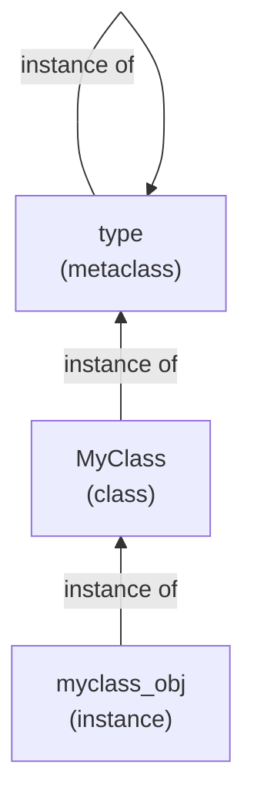
```mermaid
flowchart BT

    obj["myclass_obj<br>(instance)"]
    cls["MyClass<br>(class)"]
    typ["type<br>(metaclass)"]

    obj -->|"instance of"| cls
    cls -->|"instance of"| typ
    typ -->|"instance of"| typ
```
</div>

Your type is type? Why is `int` dodging the question? Shouldn't its type be class? Let's just say that since in Python, everything is an object, classes themselves had to have something that made them. So the idea of a metaclass named type was born. 

??? question "What's this metaclass?"
    A metaclass is simply a class that constructs other classes. Just like a normal class defines how an object behaves, a metaclass defines how a class behaves.
    
    By unifying types and classes, Python established a clear rule: type is the ultimate metaclass.When you create a class like `class User:`, the "factory" or metaclass that built it is type.

    Metaclasses were officially introduced as a standard part of Python's object machinery in Python 2.2, released in December 2001. This release unified types and classes, formalizing the use of the type as the default metaclass.

In Python, types are determined at runtime and belong to objects rather than variables. Every value is an object, and every object has a type. Variables being dynamically typed means variables don't have fixed types. A variable is simply a name that refers to an object. The object has a type and that type is determined at runtime.

```pycon
>>> thing = 42
>>> thing = "Blix" # dynamically typed, can change from int to string, no problem
```

### The Medieval Fiefdom and Module Mother Superior

This idea of types being attached to objects gives us one more place to look: **modules**. We’ve seen that integers, strings, functions, and classes are all objects. But what about the files that organize our Python code? What happens when we `import` a module?

As it turns out, Python keeps the same rule here too. A module is an object. When Python imports `math`, for example, it creates a module object and gives the name `math` to it. We can even ask Python what type of object it is:

```py
# A module is just a regular object sitting in memory too!
import math

# 1. Look at its type
print(type(math))
# Output: <class 'module'>

# 2. It also inherits from the ultimate king 'object'
print(isinstance(math, object))
# Output: True
```

Now look at math which we just imported. So math isn't some special kind of thing floating outside Python's object system. It is an ordinary object with a type module, just like everything else we've encountered.

Think of the Python kingdom like a medieval fiefdom:

* object is the supreme king—every single inhabitant ultimately traces their lineage back to his royal bloodline.

* module is the waifish nun—her sole purpose in life is to give food, shelter, and a warm hearth to orphaned functions and homeless variables.

* type is the overworked village schoolteacher—the one actually responsible for creating and molding all the classes in town.

The whole point of a `module`’s existence is to give food and shelter to code. 
Functions can stay dry under a `module`’s shawl. A `module` can hold classes, constants, and variables of any kind.

“But what does a `Module` do?” you ask. “How is it gainfully employed??”

“That’s all it does!!” I retort, stretching out my open palms in the greatest expression of futility known to man. “Now hear me—for I will never speak it again—that Module Mother Superior has given these wretched objects a place to stay!!”

```py title="saint_agnes.py"
# saint_agnes.py
# See, the file is the module -- where else could our code possibly stay?

# A CONSTANT is laying here by the doorway. Fine.
TOOTHLESS_MAN_WITH_FORK = ['man', 'fork', 'exposed gums']

# A Class is eating, living well in the kitchen.
class FatWaxyChild:
    pass

# A function is hiding back in the banana closet, God knows why.
def timid_foxfaced_girl():
    return {'please': 'i want an acorn please'}

if __name__ == "__main__":
    fwc = FatWaxyChild()
```

Now you have to go through Saint Agnes to find them.

```pycon
>>> import saint_agnes
>>> saint_agnes.TOOTHLESS_MAN_WITH_FORK
['man', 'fork', 'exposed gums']
>>> s = saint_agnes.FatWaxyChild()
>>> print(s)
<saint_agnes.FatWaxyChild object at 0x7f88>
>>> type(s)
<class 'saint_agnes.FatWaxyChild'>
>>> [name for name in dir(saint_agnes) if not name.startswith('__')]
['FatWaxyChild', 'TOOTHLESS_MAN_WITH_FORK', 'timid_foxfaced_girl'] #attributes of saint_agnes
```

Now notice that our class no longer says `__main__.ClassName`. Because our class is inside the saint_agnes module, it now appears with the format `module.ClassName`. If we were to import a file `animal.py`, then the class `Dog` would show up as `animal.Dog` (again `module.ClassName`).

In Python, every class type is tracked by combining the module it was defined in and the name of the class itself. This namespace isolation prevents naming conflicts if two different modules happen to define a class with the exact same name. 

Always remember that a `Module` is only an inn. A roof over their heads and organizes classes. 

It is not a self-aware `Class` and, therefore, cannot be brought to life with `()`.

```pycon
>>> saint_agnes()
TypeError: 'module' object is not callable
```

??? question "What is `if __name__ == "__main__":`?"
    The `if __name__ == "__main__":` boilerplate works like a master switch. It controls whether certain code runs, usually turning on some code for testing when we are running the script directly and turning it off when imported by another file.

    Here's an example. Can you figure out which parts will spark to life when you run the script directly versus when you import the file into another project? 

    ```py title="animal.py"
    class Dog:
        def bark(self):
            return "Woof!"

    if __name__ == "__main__":
        print("Testing the Dog class locally:")
        my_dog = Dog()
        print(my_dog.bark())
    ```

    **Hint:** Every Python file carries a secret, built-in variable called `__name__`. It holds the value `"__main__"` when you run the script directly, but changes to the actual file's name (like `"animal"`) the moment it gets imported elsewhere!

    ??? success "Answer"
        The `if` section only runs and prints "Testing..." when you execute animal.py directly or copy and paste the code into Python Shell.

St. Agnes has given up her whole life in order that she may care for these
desperate bits of code. Please. Don’t take that away from her.

If you wanted to alter St. Agnes, though, I can help you. You can bring in a larger corporation 
to mess with the ministry of saint_agnes and then what is she left with? In Python, modules are  mutable objects. You can inject new attributes right into them, swap their inner workings, or copy their elements at runtime—a technique Python wizards call "monkey patching."

```py

# We can dynamically inject a brand new function straight into Saint Agnes from the outside!
def corporate_takeover():
    return "This inn is now a high-rise condo."

import saint_agnes
saint_agnes.corporate_takeover = corporate_takeover

# Now Saint Agnes hosts the new corporate function too!
print(saint_agnes.corporate_takeover())
# Output: This inn is now a high-rise condo.
```

In truth, `saint_agnes` doesn't need a corporate_takeover function but we added one just in case. 

While monkey patching works great for coporoate takesovers, they are ineffective against the Originals. Python does now allow changes to Core Built-in types like `object`, `int`, `str`, `float`, `list`, `dict`, and `tuple`. Trying to run `int.corporate_takeover = ...` raises a TypeError (e.g., TypeError: can't set attributes of built-in/extension type 'int'). It's forbidden. If Python allowed you to add new method to `object` for instance, every single entity in the entire Python ecosystem that uses them —including integers, strings, custom classes, etc.—would instantly inherit that method. Talk about a security risk!

If Vanilla Ice can sample "Under Pressure" without messing up the original, we can do the same and just subclass the Originals. "Ice Ice Baby" new code. The work around, subclassing as you have seen in "The Mechanisms of Name-Calling" with `CustomString` and in "The Birth of an Object" with `ListMine`, works just as well.

We could also use what is known as the collections module, which provides mutable, Python-implemented wrappers designed for subclassing and modification of `UserDict`, `UserList`, and `UserString`. But that's a story for another day.

!!! story ""
    You gotta admit. The old abbey can be modified a zillion times and that
    little fox-faced girl will _still_ be back in the banana closet wanting an
    acorn! Too bad we can’t feed her. She’s a method with no arguments.

    When Dr. Cham came out refreshed, the filmstrip was a bit behind. But the goat
    hadn’t noticed, so the Doctor advanced frames until it made some sense.

    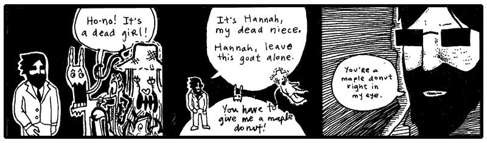

    So the invaders left the planet.

    “This planet _is_ decrepit,” said Dr. Cham. “The castle is nice. But inside it’s
    a disaster.”

    “The whole castle look is a projection,” said the goat. “All the flowers and
    apple blossoms and the sky even. It’s a low-resolution projection.”

    “Yes? It is enchanting.”

    “I guess.”

    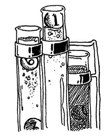

    “That’s messed up!” said the goat. “That’s not the way the film ends! There’s no
    blood! What happened? What happened? Did you screw up the knob, idiot?”

    “Well, I don’t know,” said Dr. Cham. He turned the knob reverse and forward.
    Tapped the lens.

    “Check the film! Check the film!”

    Dr. Cham pulled out a length of film from the projection feed, melted and
    dripping from its end.

    “Curse that! These projectors are quality! I’ve never had this happen. There’s
    no way.”

### Hunting For a Voice

!!! story ""
    “I don’t think it was the projector,” said Dr. Cham. “Something flew across that
    screen and uttered a blistering moan.”

    “I don’t have any dupes of that movie,” said the goat somberly. “And that girl.
    That casting director. I never see her anymore.”

    Dr. Cham stood up and looked over the dumpy aisles of magnetic carnage,
    searching.

    “Oh, hey, you should call that girl,” the goat went on. “You could talk to her,
    get an understanding. Tell her about me. 
    Don’t act like you're my friend
    , just,
    you know, ‘Oh, that guy? Yeah, whatta maroon.’”

    Dr. Cham spotted the doorway and exited.

    The hallways were an entirely new world of mess. In the goat’s archives, the
    shelves had been messy. In the hallway, shelves were completely tipped. Sinks
    were falling through the ceiling. The Doctor ventured under the debris, kicking
    through plywood when necessary.

    “You shouldn’t be out here,” said the goat. “You’re on someone else’s property
    at this point. A couple of pygmy elephants own all this. They’re nasty guys.
    They’ll beat the crap outta you with their trunks. They ball it up and just
    whack ya.”

    Dr. Cham pushed a file cabinet out of his way, which fell through a flimsy wall,
    then through the floor of the next room over. And they heard it fall through
    several floors after that.

    “I’m trying to remember how it goes in the book,” said Dr. Cham, as he walked
    swiftly through the hall. “That milky fog that swept across the projection. We
    find that thing.” He jiggled a door handle, broke it off. Forged through the
    doorway and disappeared inside.

    “You really get a kick out of beating stuff up, don’t you?” said the goat.
    “Walls, doors.” The goat headbutted a wall. The wall shuddered and then laid
    still.

    Then, it was quiet. And black.

    The goat stayed put in the bleak hallway, expecting Dr. Cham to flip over a few
    desks and emerge, ready to move on from the room he’d busted into. But Dr. Cham
    didn’t return, and the goat opted to share a moment with the neglected wreckage
    left by his neighbors. Not that he could see at all. He could only hear the
    occasional rustling of the piles of invoices and carbon copy masters and manila
    envelopes when he shifted his legs.

    The ground seemed to be buckling right under the goat
    , as if the heaps of kipple
    around him were beginning to slide toward his weight. He would be at the center
    of this whirlpool of elephant documentation. Would he die of papercuts first? Or
    would he suffocate under the solid burial by office supplies?

    A soft light, however, crept up to him. A floating, silver fish. No, it was
    a—was it scissors? The scissors grew into a shimmering cluster of intelligent
    bread, each slice choking on 
    glitter. But no, it was hands.
    And an Easter hat.

    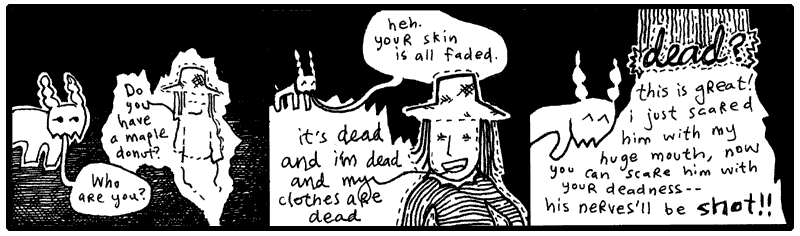

    In another room, Dr. Cham stood under the clear glass silently. The ceiling had
    abruptly gone transparent, then starlight washed over his pants and jacket. He
    walked further to the room’s center in muted colors, lit as softly as an ancient
    manuscript in its own box at the museum. More stars, more cotton clusters of
    fire, unveiled as he came across the floor. And it peeked into view soon enough,
    he expected it to be larger, but it wasn’t.

    Earth. Like a painted egg, still fresh. He felt long cello strings sing right up
    against his spine. How could that be called Peoplemud? Here was a vibrant and
    grassy lightbulb. The one big ball that had something going for it.

    He thought of The Rockettes. Actually, he missed The Rockettes. What a bunch of
    great dancers. He had yelled something to The Rockettes when he saw them.
    Something very observant and flattering.

    Oh, yes, while The Rockettes were spinning, arm in arm, he had yelled,
    “Concentric circles!” Which no one else cared to observe.

    And this thought was enough to feed Dr. Cham’s *superiority complex*. He wore a
    goofy smile as he retraced his footsteps. He truthfully felt his genius coming
    through in such a statement. To realize the simplicity of a circle was his. He
    reflected on it all the way back to the hallway.

    Which I think is great. Adore yourself when you have a second.

    

    “Oh, right,” said the goat. “Your niece. The niece you killed. I’m with ya now.”

    For just a few moments, they all looked at each other. Just enough time for both
    Dr. Cham and the goat to think: _Oh, yeah. Hannah causes us a lot of trouble.
    She’s already talking about maple donuts._

    “Does she start talking about maple donuts right away like that?” asked the
    goat.

    “Yes, she does,” said the Doctor. “She brings it up to you, then she brings it
    up to me. She sees a maple donut somewhere—I don’t quite remember where.”

    “Do I see a real maple donut?” Hannah said. “I need a real one.”

    “Okay, okay,” said the goat. “Yeah, I remember: here’s where she says that if
    she gets a real maple donut, she’ll become a real person again. Because her real
    destiny was to own a bakery and you ruined that destiny and now she’s trapped as
    a ghost.”

    “Hey, that’s the truth!” Hannah yelped.

    “It’s terrible that we must bear through this whole scene again,” said the
    Doctor. “The donuts are immaterial. They should be left out altogether.”

    “Man, I am having a _hard_ time remembering all of this chapter,” said the goat.
    “I don’t even remember how to get out of this hallway. I must have read that
    book like thirty times. Do we blast through a wall? Do we scream until someone
    finds us?”

    “We get Hannah to float through walls and she finds some kind of machine,” says
    Dr. Cham. “I have to write a program—it all works out somehow.”

    “But, you know what I’m saying?” said the goat. “I forget all the details.
    Especially the earlier chapters. I mean I can remember the ending perfectly.
    It’s hard to sit through all this. The end is so much better.”

    Dr. Cham folded his arms and teetered on a heel. “The porcupine.” He smiled
    greedily at the goat.

    “Oh, totally. The porcupine is definitely who I want to meet,” said the goat. “I
    wonder what he does with all that money when the book is over.”

    Dr. Cham nodded respectfully. “I’m very excited to see him wearing slippers.”

    “Those infernal slippers!” said the goat and he haw-hawed coarsely, a shower of
    saliva cascading from his jaws.

    Hannah’s mind rattled, waiting for this nonsense to break for a moment. She
    tipped her head on its side and the rattle slid along the curve of her cranium.
    The little noise died away, though, as the back of her head vanished (_fluxed
    out_ is what she called it) and then her head was back again with its little
    rattle and she caught herself doing that careless moaning again. **<span
    class="caps">HRRRRRR</span>-RRR-OH-RRRR-RRRR.**

    “I’m not as into the chunky bacon stuff,” said the goat. “I don’t see what’s so
    great about it.”

    Could she speak while moaning? **<span class="caps">BON</span>-BON.** With a
    French moan. **<span class="caps">BOHN</span>-BOHN. <span
    class="caps">BOHN</span>-APPE-TEET-OHHHH-RRRR.**

    “I know she’s harmless, but that sound freaks me out. My hair is **completely**
    on end.”

    “Hannah?” said Dr. Cham. “Where are you, child? Come do a good turn for us, my
    niece.”

    She was right near them, in and out. And they could hear her cleaning up her
    voice, bright, speaking like an angel scattering stardust. Yes, the whole maple
    donut story came out again, and more about the bakery she would own, the muffins
    and rolls and baguettes.


## 4. Them What Make the Rules

!!! story ""
    Hannah leapt back from the wall and clenched down on her fingers.

    “This is the wall,” said Dr. Cham. “The Originals are in there. My child, can
    you lead us to the observation deck?”

    “You expect us to go up against those guys?” asked the goat. “They’re mad as
    koalas. But these koalas have lasers!”

    “We prevail, though,” said Dr. Cham. “You and I know this.”

    “Okay, well I’m muddled on that point,” said the goat. “Do we really win? Or
    could we be thinking about _Kramer vs. Kramer_? Does Dustin Hoffman win or do we
    win?”

    “No. No. No. No.” Hannah hovered and dragged her legs along the wall nervously.
    “There is a man with a huge face in there!”

    “Mr. Face,” said the Doctor. “He is the original face.”

    “He didn’t see me,” said Hannah and moaned. **<span
    class="caps">HOMA</span>-HOMA-ALLO-ALLO.**

    She made that hollow weeping through the crumbling mouseholes and the freezer
    gateways, fluxing in and out, causing the video checkpoints to hiss and the wall
    panels to brace themselves and fall silent. The three passed through two levels
    of frayed security and emerged in the observation deck overlooking the cargo
    bay.

    

    “The last living among The Originals,” said Dr. Cham. “Are you alright with
    this, Hannah?” Which she didn’t hear in any way, 
    as her eyes lay fixed
    on the
    legendary creatures.

    “Look at them,” said the goat. “These guys wrote the rule books, Doctor. We owe
    everything to these guys.”

    “What about God?” said Dr. Cham.

    “I don’t really know,” said the goat. “Hannah probably knows better than any of
    us about that.”

    Hannah said nothing. She only really knew one other ghost and that was her
    Post-Decease Mediator, Jamie Huft. Who didn’t seem to have any answers for her
    and required questions to be submitted in writing with a self-addressed stamped
    envelope included. Hannah hadn’t gotten the ball rolling on that P.O. Box yet.

    “We must be up in the mountains,” said the goat. “Look out at that blackness.”

    “I saw another deck like this down by where we found Hannah,” said Dr. Cham.
    “Down closer to your living area. You should take time to search for it. It’s
    very peaceful there. You can see Earth and the seven seas.”

    “The seven seas?” The goat wondered if that was near The Rockettes. He’d read
    his share of material on precision dancing and he’d seen that line of legs,
    mincing across the stage like a big, 
    glitzy rototiller.


    Hannah stirred to life.

    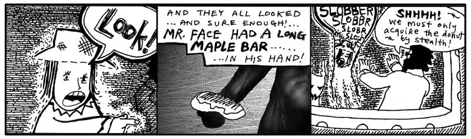

    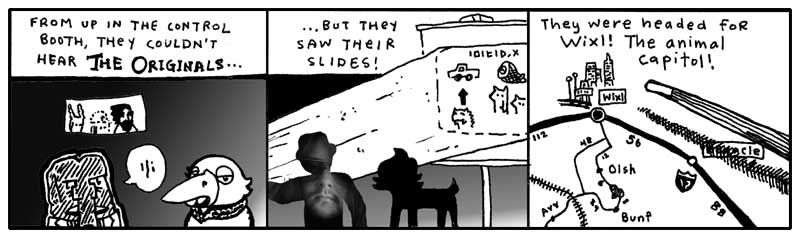

    And none of the three spoke when The Originals flicked off the slide projector
    and boarded a very slender rocket ship and cleanly exploded through a crevice in
    the cargo bay roof.

    “Oh, boy,” said the goat.

    “What?” said Hannah.

    “You’re going to die,” said the goat.

    Dr. Cham looked over the controls in front of them, a long panel of padded
    handles and green screens.

    “I’m already dead. I’m a ghost.”

    The goat looked down at the Doctor, who was rummaging under the control panel.
    “Okay, well if your uncle isn’t going to have a talk with you, I’m going to make
    things very clear. There’s a good chance these guys are going to build a bomb.
    And you see how I’m fidgeting? You see how my knees are wobbling?”

    “Yeah.”

    “Yeah, that’s how real this is, kid. I don’t remember anything from that
    _confounded book_ except that these guys are building a bomb that can blow up
    the ghost world. Because once the ghost world’s gone, then Digger Dosh gets his
    one second back. It’s a trade they’ve worked out. Hell, it’s sick stuff, that’s
    all you need to know.”

    “But I’m dead.”

    “Okay, well, we’re talking, aren’t we? You can talk, so are you dead?” The goat
    shook his head. “I wish I could remember if we win or if it was Dustin Hoffman.”

    Hannah cried. “Why do I have to die again?” She wailed and her legs fell into
    flux and 
    she sank into the floor.
    **<span class="caps">MOH</span>-MOHHH-MAO-MAOOO.**

    Dr. Cham had forcibly yanked on a plush handle, which unlocked and slid open
    like a breadbox. He reached his hands inside and found a keyboard firmly bolted
    deep inside.

“That’s it,” he said and pulled up `Python Shell`.

You open it by typing `python` or `python3` in your terminal. The Interactive Interpreter 
appeared on a display to the left of his concealed typing. He checked the Python version.

```pycon
>>> import sys
>>> sys.version
'3.14.7 (default, Aug 21 2026, 12:00:00)\n[GCC 11.2.0]'
```

Python was up-to-date. What else could he do? Scanning `instance variables`, `class variables`, and `methods` 
was pointless. The only reason that had worked with the `Elevator` class was because someone had left
`Python Shell` running with their classes still loaded.

He had just loaded this Python Shell, so no special classes were available yet. He had to find some classes.

He started by importing Python’s `sysconfig` module to get an idea of how Python had been configured.

```pycon
>>> import sysconfig
```

The `sysconfig` module contains information about how Python was built and installed. He wanted information about how Python itself had been installed. The `sysconfig` module could provide that too.

??? info "When a module is imported, where does it get stored??"
    So what does Python do to `import random` and where does `random` go when it gets imported? When we run `import random`, Python finds the module, loads it, and places it in `sys.modules`, a dictionary belonging to the `sys` module that Python uses to keep track of imported modules.

    ```text
    sys
    └── modules
        ├── "random"    → the actual random module
        ├── "sysconfig" → the actual sysconfig module
        ├── "math"      → the actual math module
        └── ...
    ```

    You can see that any module we import gets stored in `sys.modules`:

    ```pycon
    >>> import random
    >>> sys.modules["random"] is random
    True
    ```

    So Python Shell has just demonstrated another piece of the object model: modules are objects too!
    The `sys.modules` contains **module objects**, not filenames.

    Now, if you want to see the names of the modules Python currently knows about, look at the dictionary’s keys:

    ```pycon
    >>> list(sys.modules)
    ['sys', 'builtins', '_frozen_importlib', ... 'random']
    >>> len(list(sys.modules))
    135
    ```

```pycon
>>> import sysconfig
>>> sysconfig.get_config_vars()
{'prefix': '/usr/local', 'exec_prefix': '/usr/local', 'LIBDIR': '/usr/local/lib', ...}
```

He imported the module and used one of its function, `get_config_vars()` (Want to see what else the module can do? Type `sysconfig.` and then pressing tab in Python Shell). 

Far too much information came back to his command shell, so Dr. Cham need to ask for something more specific. What Dr. Cham really needed was directory where Python’s standard library was installed with:

```pycon
>>> sysconfig.get_path("stdlib")
'/usr/local/lib/python3.14'
```

And the directory where third-party packages were installed with:

```pycon
>>> print(sysconfig.get_path("purelib"))
'/usr/local/lib/python3.14/site-packages'
```

Perfect! But now Dr. Cham had a more interesting question: **Where else does Python look when we ask it to import a module?**

That information lives in `sys.path`.

```pycon
>>> import sys
>>> sys.path
['/usr/local/lib/python3.14',
 '/usr/local/lib/python3.14/site-packages',
 ...]
```

`sys.path` is the list of directories Python searches when it encounters an `import` statement. 
Python checks these locations in order until it finds a module or package that matches what we asked for.

For example, when Dr. Cham runs:

```pycon
>>> import cat
```

Python might look in places such as:

```text
/usr/local/lib/python3.14/cat.py
/usr/local/lib/python3.14/site-packages/cat.py
```

If it finds the module, Python loads it and stores the resulting module object in `sys.modules`.

The entries in `sys.path` are often **absolute paths**—complete paths that identify a location 
from the root of the filesystem. On Windows, they usually begin with a drive letter such as `C:\`. 
On Linux and macOS, they begin with `/`. The exact paths will vary from one computer to another.

The goat had peeked his head around Dr. Cham and was watching all these instructions transpire, 
as he licked his lips to keep his salivations from running all over the monitors and glossy buttons.
He had been interjecting a few short cheers (along the lines of: *No, not that* or *Yes, yes, right* or
 *Okay, well, your choice*), but now he was fully involved, recommending code.

“Try `import math` or, no, try `3 * 5`. Make sure that basic math works.”

“Of course the math works,” said Dr. Cham. “Let me be. I need to find some useful modules.”

“It’s a basic sanity test,” said the goat. “Just try it. Do `3 * 5` and see what comes up.”

Dr. Cham caved.

```pycon
>>> 3 * 5
15
```

“Okay, great! We’re in business!” the goat tossed his furry face about in glee.

Dr. Cham patted the goat’s head. “Well done. We can continue.”

```pycon
>>> import glob
>>> glob.glob('/usr/local/lib/python3.14/site-packages/*.py')
['endertromb.py', 'mindreader.py', 'wishmaker.py']
```

Dr. Cham had use `glob` to search the site-packages directory, a common place to store third-party modules and packages.

Here were the three legendary modules each containing classes that my daughter’s organ instructor had inscribed for me earlier in this chapter. And, Dr. Cham, having read this selfsame chapter, recognized these three pieces of the system immediately.

The `endertromb` module contained the `Endertromb` class which contained the mysteries of this planet’s powers. The `mindreader` module contained the `MindReader` class, which, upon scanning the minds of its inhabitants, read each mind’s contents. And, finally, the crucial `wishmaker` module contained the `WishMaker` class, which powered the granting of short wishes (ten letters or fewer), should the wish ever find its way to the core of Endertromb.

The goat’s eyes grew wide.

“How about `4 * 56 + 9`?” he asked. “We don't know if it can do compound expressions.”

“I've got the `mindreader` right here,” said Dr. Cham. “And I have the `wishmaker` here next to it. 
This planet can read minds. And this planet can make wishes. Now, let's see if it can do both at the same time.”

## 5. Them What Live the Dream

!!! warning "endertromb.py doesn't exist"
    The `endertromb.py` module and `Endertromb` class are fictional. Sometimes in coding we have to use other libraries as black boxes, without knowing or caring how they are implemented. 
    
    Because of the module doesn't exist, you won't be able to run the code for any of these `Endertromb` examples in the section. But that's okay! Just relax a little and give into the idea of programming-as-language! Then imagine in your mind a planet Endertromb that can read minds and makes wishes. 

### Compositing a WishScanner

While The Originals’ craft had long disappeared, Dr. Cham frantically worked away at the computer built into the control panel up in the observation deck. Hannah had disappeared into the floor (or perhaps those little sparks along the ground were still wisps of her paranormal presence!) and the goat amicably watched Dr. Cham build a new piece of Python machinery.

```python
class WishScanner:
    def scan_for_a_wish(self, thoughts):
        for thought in thoughts:
            if thought.startswith("wish: "):
                return thought.removeprefix("wish: ")
```

“What’s your plan?” asked the goat. “It seems like I could have solved this problem in like three lines.”

“This `WishScanner` is the new technology,” said Dr. Cham. “It only picks up a wish if it starts with the word `wish` and a colon and a space. That way the planet doesn’t fill up with every less-than-ten-letter word that appears in people’s heads.”

“Why don't you just put that method in `MindReader`?”

“Because the `MindReader` already has a job,” said Dr. Cham. “It reads minds. The `WishScanner` has a very different job. It finds wishes within thoughts.”

The goat shook his head.

“But how can `MindReader` use it?”

“**Composition.**” Dr. Cham smiled.

Dr. Cham tucked a `WishScanner` inside the `MindReader`:

```python title="mindreader.py"
from endertromb import Endertromb

class WishScanner:
    def scan_for_a_wish(self, thoughts):
        for thought in thoughts:
            if thought.startswith("wish: "):
                return thought.removeprefix("wish: ")

class MindReader:
    def __init__(self):
        self.minds = Endertromb.scan_for_sentience()
        self.wish_scanner = WishScanner()  # every mind reader needs a WishScanner
    def read(self):
        return [mind.read() for mind in self.minds]
    def scan_for_a_wish(self):
        thoughts = self.read()
        return self.wish_scanner.scan_for_a_wish(thoughts)
```

“Now every `MindReader` has a `WishScanner`,” said Dr. Cham. “When I ask the mind reader to scan for a wish, it gathers the thoughts and hands them to its little scanner.”

“So the `MindReader` is using another object to do part of its work?”

“Exactly.”

This is **composition**. One object stores another object and hands over part of its work to it. The `MindReader` **has a** `WishScanner`.

That is different from subclassing:

```python
class Cat(Animal):

    pass
```

A `Cat` **is an** `Animal`. But a `MindReader` is not a `WishScanner`. It simply **has one**.

This lets us keep our objects small and focused. The scanner doesn't need to know anything about minds. It doesn't care where the thoughts came from. It just looks through them for a properly formed wish.

This is one of the great pleasures of composition: instead of building one giant machine that does everything, you connect several smaller machines together. Each one handles its own job, and by working together they create something far more capable than any of them could be alone.

“And what is happening with `[mind.read() for mind in self.minds]`?”

“There’s a little bit of **polymorphism** hiding here. Polymorphism means that different kinds of objects can respond to the same method call in their own way. `Endertromb` returns a collection of minds. We don't know what kinds of objects they are, but we do know that each one understands the message `read()`.”

The goat nodded in glee.

“So when `MindReader` loops over `self.minds`, it simply asks each object to `read()` itself. MindReader doesn't need to know whether each object is a HumanMind, GoatMind, TurnipMind, CloudMind, or something even stranger."

The goat head upwards quickly at the mention of GoatMinds.

"The `MindReader` doesn't care! It simply calls `read()`. As long as an object provides a `read()` method, expecting that each object knows how to respond to it and that `MindReader` can understand with the output."

“Hey, that’s cool. What's it called again?” said the goat.

"This is **polymorphism**: many different kinds of objects responding to the same method call. One message, many possible behaviors."

“You read the book thirty times and you didn’t pick that up?” asked Dr. Cham.

“You’re a much better teacher in person,” said the goat. “I really didn’t think I was going to like you very much.”

“I completely understand,” said the Doctor. “This is much more real than the cartoons make it seem.”

The flow was starting to make sense to the goat:
minds -> thoughts -> wishes -> wishes made true  

```python
from mindreader import MindReader
from wishmaker import WishMaker

reader = MindReader()
wisher = WishMaker()

while True:
    wish = reader.scan_for_a_wish()

    if wish:
        wisher.grant(wish)
```

The Python interpreter sat looping on the screen. It'll do that until you hit **Control-C**. But Dr. Cham let it churn away, endlessly scanning the mind waves for a proper wish.

And Dr. Cham readied his wish.

At first, he thought immediately of a `stallion`. To ride bareback over the vales of Sedna. But he pulled the thought back. His wish hadn't been formed properly. A stallion was useless in pursuing The Originals, so he closed his eyes again, bit his lip and thought to himself: `wish: whale`

Somewhere inside the machinery, the little scanner began to glow.

### Last Whale to Peoplemud

!!! story ""
    The blocky, sullen whale appeared down at the castle entrance, where Hannah was
    bashing on a rosebud with her hand. She whacked at it with a fist, but it only
    stayed perfect and pleasant and crisp against the solid blue sky of Endertromb.

    “I’m bored,” she said to the whale. **<span class="caps">BOHR</span>-BOHR-OHRRRRRR.**

    “OK,” said the whale, deep and soft. As the word slid along his massive tongue,
    its edges chipped off and the word slid out polished and worn in a bubble by his
    mouth’s corner.

    “I always have to die,” said the young ghost. “People always kill me.”

    The whale fluttered his short fins, which hung at useless distance from the
    ground. So, he pushed himself toward her with his tail. Scooting over patches of
    grass.

    “People kill, so who do they kill?” said the girl. “Me. They kill me every
    time.”

    The whale made it to within three meters of the girl, where he towered like a
    great war monument that represents enough dead soldiers to actually steal a
    lumbering step towards you. And now, the whale rested his tail and, exhausted by
    the climb thus far, let his eyelids fall shut and became a gently puffing clay
    mountain, his shadow rich and doubled-up all around the hardly visible Hannah.

    But another shadow combined, narrow and determined. Right behind her, the hand
    came on to her shoulder, and the warm ghost inside the hand touched her sleeve.

    “How did you get down here?” said the girl.

    Dr. Cham sat right alongside her and the goat walked around and stood in front.

    “Listen to us,” said Dr. Cham. “We’ve got to follow this mangy pack of
    ne’er-do-wells to the very end, Hannah. And to nab them, we need your faithful
    assistance!”

    “I’m scared,” cried Hannah.

    “You’re not scared,” said the goat. “Come on. You’re a terrifying little phantom
    child.”

    “Well,” she said. “I’m a little bored.”

    Dr. Cham bent down on a knee, bringing his shaggy presence toward the ground,
    his face just inches from hers. “If you come with us, if you can trust what we
    know, then we can bag this foul troupe. Now, you say your destiny is to be a
    baker. I won’t dispute that. You have every right on Earth—and Endertromb, for
    that matter—to become a baker. Say, if you didn’t become a baker, that would be
    a great tragedy. Who’s going to take care of all those donuts if you don’t?”

    She shrugged. “That’s what I’ve been saying.”

    “You’re right,” said the Doctor. “You’ve been saying it from the start.” He
    looked up to the sky, where the wind whistled peacefully despite its forceful
    piercing by The Originals’ rocket ship. “If your destiny is to be a baker, then
    mine is to stop all this, to end the mayhem that is just beginning to boil. And
    hear me, child—hear how sure and solid my voice becomes when I say this—I ended
    your life, I bear sole responsibility for your life as an apparition, but I will
    get it back. It’s going to take more than a donut, but you will have a real
    childhood. I promise you.”

    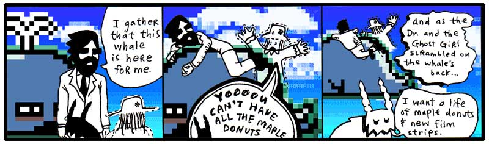

    Sure, it took a minute for the goat to cut his wish down to ten letters, but he
    was shortly on his way, following the same jet streams up into the sky, up toward
    Dr. Cham and his ghost niece Hannah. Up toward the villainous animal combo pack called The Originals. Up toward The Rockettes.

    And Digger Dosh bludgeoned and feasted on each second they left behind them.


[1]: installing-python.md
