---
hide:
  - toc
---

# 4. Floating Little Leaves of Code

{.center}

[TOC]

 

I’ve never seen the ham do anything but leak juice. Today, our business in
Ambrose Caverns is with the elf. He is a crucial part of the next lessons. Let’s
all make him feel welcome. Go start warming up your listening hats! (And please
change out of those ridiculous stirrup pants.)

A prompt warning: this lesson is much slower. Stay with it. This will be a long,
deep breath. The most crucial stage of your instruction. It may seem like you’re
not learning much code at first. You will be learning concepts. By the end of
this chapter, you will know Python’s beauty. The coziness of the code will become
a down sleeping bag for your own solace.


## 1. The Leaf as a Status Symbol in Ambrose

Alright, Elf. Give us a quick rundown of the currency issues you’ve faced there
in your kingdom.


Yeah, that’s not the way I remember it. This Elf was paging me constantly. When
I refused to call him back, he somehow left a message on my pager. Meaning: it
beeped a couple times and then printed out a small slip of paper. The slip said
something to the effect of, “Get down here quick!” and also, “We’ve got to rid
the earth of this scourge of entrepreneurial caterpillars, these twisted insect
vikings are suffocating my blue crystals!”

Lately, the exchange rate has settled down between leaves and crystals. One
tree-grown note is worth five crystals. So the basic money situation looks like
this:

```py
blue_crystal = 1
leaf_tender = 5
```

This example is, like, _totally_ last chapter. Still. It’s a start. We’re
setting two _variables_. The **equals sign** is used for _assignment_.

Now `leaf_tender` represents the number `5` (as in: five blue crystals.) This
concept right here is **half of Python**. We’re _defining_. We’re _creating_. This
is half of the work. Assignment is the most basic form of defining.

You can’t complain though, can you Elf? You’ve built an empire from cashing your
blue crystals into the new free market among the forest creatures. (And even
though he’s an elf to us, he’s a tall monster to them.)

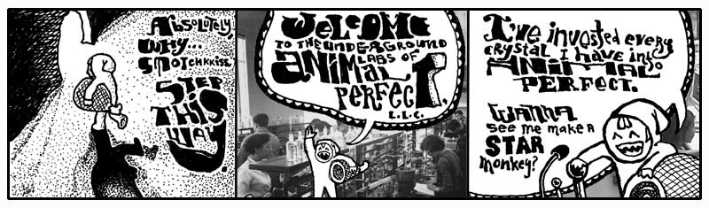

<aside class="sidebar" markdown="1">
### The Scarf Eaters

I hate to intrude upon your instruction, but I’ve already walked all over it
enough to warrant some further disregard. Can I go over my next project with
you?

I’ve pledged to write another book. (_Trombones_.) The good news is that I won’t
actually be writing any of it. You won’t have to endure any more of this inane
blathering.

It’s over between me and words. I’d love to stick around and exploit them each,
one after another, but it’s all becoming quite predictable, wouldn’t you say?
Eventually, they will all be used and I’d have to come up with fake words and
that would be way too cnoofy.

Now. The deal isn’t cut yet, but I’m in negotiations with Anna Quindlen to do my
ghost writing. We’re tag-teaming on a book that’s going to blow the (Poignant)
Guide right out of your hands. To put it bluntly, the Guide will be worthless.
You won’t be able to pile enough pomegranates on top of the thing.

So this new book. The Scarf Eaters. It’s a coming-of-age novel. But it’s also a
beginner’s guide to Canva. It’s like Judy Blume crossed Praystation. It’s like 
0sil8 starring Hillary Duff.

I don’t want to give away the plot at all, but to tug your appetite I’ll just
say this: one kid talks to his dead brother in ActionScript. More to come.
</aside>

Nonono. Hang on a sec. You’re not ready for what the Elf here is doing in his
caves. You’ll think it’s all positively inhumane, naughty, sick, tweeested, yada
yada.

### Now You’re Going to Hear the Animal Perfect Mission Statement Because This Is A Book And We Have Time And No Rush, Right?

Back, back, way back before speedboats, I owned a prize race horse who took a
stumble on the track. She did ten front flips and crashed into a guy who was
carrying a full jar of mayonnaise. We had blood and mayonnaise up and down the
track. Needless to say, she was a disaster.

The vet took one look at her and swore she’d never walk again. Her legs were
gone and the vet wouldn’t allow a legless horse to just sit around. We’d need to
put her down. He swore his life and career on it, insisting we divide into two
parallel lines. The people who could not refute the doctor’s claims on one side;
those too stubborn to accept his infallible medical reasoning on the other. The
Elf, his pet ham, and I were the only ones in that second line.

So while the others heaped up trophies and great wreaths around the horse,
bidding it a fond farewell before the bullet came to take him home, the Elf and
I frantically pawed the Internet for answers. We took matter into our own hands,
cauterizing her leg wounds with live crawdads. It worked great! We now had a
horse again. Or at least: a horse body with a crustaceous abdominal frosting.

She scurried everywhere after that and lived for years in pleasantly moist
underground cavities.

Animal Perfect is now the future of animal enhancement. They build new animals
and salvage old-style animals for parts. Of course, they’ve come a long ways.
When Animal Perfect started, you’d see a full-grown bear walk into Animal
Perfect and you’d see a full-grown bear with sunglasses walk out. Completely
cheesy.

Stick around and you’ll see a crab with _his own jet pack_. That’s a new 2024
model jetcrab.

But now, the whole operation is up and running. And the cleanliness of the place
is astonishing. All the equipment is so shiny. Everything is in chrome. Oh, and
all the staff have concealed weapons. They’re trained to kill anyone who enters
unannounced. Or, if they run out of bullets, they’re trained to pistol whip
anyone who enters unannounced.

Elf, make me a starmonkey.


Some imaginary Python for you:

```py
pipe.catch_a_star()
```

Variable `pipe`. Method `catch_a_star`. A lot of Pythonists like to think of
methods as a message. Whatever comes before the dot is handed the message. The
above code tells the `pipe` to `catch_a_star`.

This is the **second half** of Python. Putting things in motion. These things you
define and create in the first half start to _act_ in the second half.

1. Defining things.
2. Putting those things into action.

So what if the star catching code works? Where does the star go?

```py
captive_star = pipe.catch_a_star()
```

See, it’s up to you to collect the miserable, little star. If you don’t, it’ll
simply vanish. Whenever you use a method, you’ll always be given something back.
You can ignore it or use it.

_If you can learn to use the answers that functions, methods, and operators give you back,
then you will **dominate**._

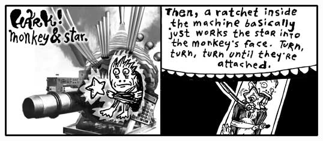

Quickly then.

```py
starmonkey = ratchet.attach( captive_monkey, captive_star )
```

The `ratchet` gets an `attach` message. What needs to be attached? The _method
arguments_: the `captive_monkey` and the `captive_star`. We are given back a
`starmonkey`, which we have decided to hang on to.

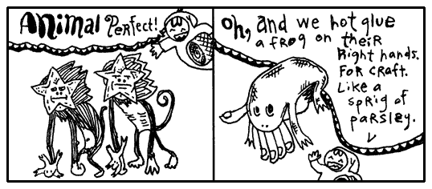

This is turning out to be such a short, little proggie that I’m just going to
put it all together as one statement.

```py
starmonkey = ratchet.attach( captive_monkey, pipe.catch_a_star() ) + deco_hand_frog
```

See how `pipe.catch_a_star` is right in the arguments for the method? The caught
star will get passed right to the ratchet. No need to find a place to put it.
Just let it go.

## 2. Small and Nearly Worthless

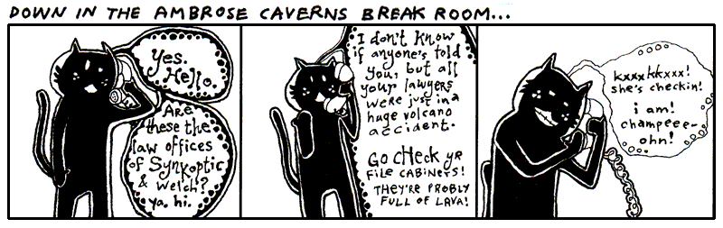

The hotel here in Ambrose is no good at all. The beds are all lumpy. The
elevator is tiny. One guy put all his bags in the elevator and found out there
wasn’t room for him. He hit the button and chased up the stairs after it all.
But the stairwell turned out to be too narrow and his shoulders got wedged going
up.

The soap mini-bars they give you are sized down for elves, so it’s impossible to
work up a lather. I hate it. I keep mistaking them for contact lenses.

I turned on the faucet and nothing came out. Thing is: Ambrose is a place with
magical properties, so I took a chance. I put my hands under the spigot.
Invisible, warm wetness. I felt the hurried sensation of running water, darting
through my fingers. When I took my hands away, they were dry and clean.

It was an amazing nothingness to experience. It was just like `None`.

### None

In Python, `None` represents an emptiness. It is **without information**, standing in when we have
nothing useful to report. It isn’t zero. Zero is a number.

It’s Python’s own walking dead, a flatlined keyword. You can’t add to it, it
doesn’t evolve. But it’s terribly popular. This skeleton’s smiling in all the
pictures.

```py
plastic_cup = None
```

The above `plastic_cup` is **empty**. You could argue that the `plastic_cup`
contains something, a `None`. The `None` represents the emptiness, though, so go
ahead and call it empty.

Some of you who have programmed before will be tempted to say the `plastic_cup`
is **undefined**. How about let’s not. When you say a variable is undefined,
you’re saying that Python simply has no recollection of the variable, it doesn’t
know the var, it’s absolutely non-existent.

But Python is aware of the `plastic_cup`. Python can easily look in the
`plastic_cup`. It’s **empty**, but not **undefined**.

### True

I saw `True` at the hotel buffet tables today. I cannot stand that guy. His
stance is way too wide. And you’ve never met anyone who planted his feet so hard
in the ground. He wears this corny necklace made out of shells. His face exudes
this brash confidence. (You can tell he’s exerting all of his restraint just to
keep from bursting into Neo flight.)

To be honest, I can’t be around someone who always has to be right. This True
is always saying, “A-OK.” Flashing hang ten. And seriously, he loves that
necklace. Wears it constantly.

As you’d suspect, he’s backstage at everything on the `if` event schedule.

`if True: print("Hugo Boss") ` acts like `print("Hugo Boss")`.

Now that you’ve met `True`, can you guess what comes next?

### False 
<p style="float:left" markdown="1">
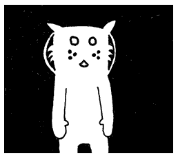
</p>

_The cat Trady Blix. Frozen in emptiness. Immaculate whiskers rigid. Placid eyes
of lake. Tail of warm icicle. Sponsored by a Very Powerful Pause Button._

The darkness surrounding Blix can be called **negative space**. Hang on to that
phrase. Let it suggest that the emptiness has a negative connotation. In a
similar way, `False` has a slightly sour note that it whistles.

`if False: print("Hugo Boss") ` will never `print("Hugo Boss")`!

But for those of us like the dark-side, we can flip the charge with a not: 

`if not False: print("Hugo Boss") ` will always `print("Hugo Boss")`!

<aside class="sidebar" markdown="1">
### Make Your Own Starmonkey!

1. Turn a mug upside-down. 
2. Attach an apple with a rubber band. 
3. Shove car keys into the sides of the apple. 
4. Glue star face. 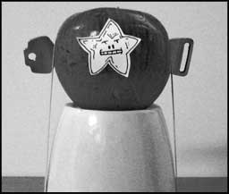

You have two complementary star faces waiting in your account.

Standard, placid.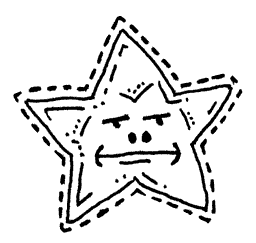

Eating chalk.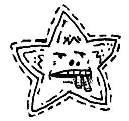
</aside>

### Double Equal sign

Occasionally, `if` will haul out the velvet ropes to exercise some crowd
control. The **double equals** gives the appearance of a short link of ropes,
right along the sides of a red carpet where only matches can be admitted.

```py
if approaching_guy == "Tom":
    print("That necklace is classic.")
```

The double equals is simply **an equality check**. Do the gentleman at both ends of
this rope appear to match?

In this way, you control who `if` lets in.


**The double equals sign is an operator.** Can you guess how it works?

```py
approaching_guy == "Kevin"
```

It checks whether the values on both sides are an exact match, such as:

```py
5 == 5
"Kevin" == "Kevin"
```

Now, do you remember what you need to do to **dominate** in Python?

*Use the answers the operators give you.*

```py
if approaching_guy == "Kevin":
    print("Kevin is here.")
```

In the above, how is the operator being used? Take the expression `approaching_guy == "Kevin"`. 
It evaluates to `True` whenever `approaching_guy` is set to `"Kevin"`. Match.
When `approaching_guy` is set to `"John"`, there is no match. The operator evaluates to `False`. 
A shake of the head. That answer is handed to `if`, who refuses to admit a `False`. 
The `print()` statement never sees realization.

### Truthiness

Now, here's a strange little secret. Python isn't nearly as obsessed with `True`
and `False` as you might think.

Generally speaking, **almost everything in Python has a positive charge to it**. This
spark flows through strings, numbers, regexps, all of it. For example, all of the following wear the white cloak of truth: `True`, `8`, `"Kevin"`, `[1,2,3]`, `str`, and `{1:"cat",2:"dog"}`.

You can test that charge with an `if` keyword *without using an operator.* (Just like `def` and `for` code blocks, indented code indicated inside of the `if` statement.)

```py
if approaching_guy:
    print(f"{approaching_guy} is coming!!")
```

Or try this solo example: 

```py
if plastic_cup:
	print("Plastic cup is on the up 'n' up!")
```

If `plastic_cup` is `True`, `4`, `"a non-empty string"`, `["a list"]`, `{1:"dict"}`, or any other truthy object, you'll see the message "Plastic cup is on the up 'n' up!". 

??? tips "Testing Truthiness with bool"

    If you are uncertain if a value is truthy or falsy, the built-in `bool`
    function can help us test and see. 

    ```pycon
    >>> bool('cat')
    True
    >>> bool("no")
    True
    >>> bool(range(2))
    True
    >>> bool(False)
    False
    ```

### Falsiness 

Only a few keywords wear a shady cloak of darkness: `None`, `False`, zero, and empty containers like `""`,`[]`,`()`,`{}`, all draggin’ us down.

Continuing the above example: 

```py
if plastic_cup:
    print("Plastic cup is on the up 'n' up!")
```

If `plastic_cup` contains `None`, `False`, zero, or an empty container, you won’t see anything print to the screen. They’re not on the `if` guest list. So `if` isn’t going to run
any of the code it’s protecting.

But `None`, `False`, zero, and empty containers need not walk away in total **shame**. They may be of questionable character, but `if` followed by `not` caters to the bedraggled. The `if not` 
keywords have a policy of **only allowing those with a negative charge in**.

Who is on the negative guest list? The falsey (evaluating to False) values `None`, `False`, zero, and empty containers.

```py
if not plastic_cup: # None, False, 0, [], and "" are allowed in
    print("Plastic cup is on the down low.")
```

You can also use `if` and `if not` in **a single line of code**, if
that’s all that needs to get done.

```py
if plastic_cup: print("Yeah, plastic cup is up again!")
if not plastic_cup: print("Hardly. It's down.")
```

And another nice trick: use `and` to add a variety of tests.

```py
if plastic_cup and not glass_cup: print("We're using plastic 'cause we don't have glass.")
```

This trick is a gorgeous way of expressing, _Do this only if **a is true and
b isn’t true**_.

Truth testing is not just for an `if` condition. We can also test truth value with a `while` condition. 

```py
countdown = 10
# The loop runs as long as countdown is truthy (not zero)
while countdown:
    print(countdown)
    countdown = countdown - 1
# exits at zero
print("Blastoff! Plastic cup is going up!")
```

??? information "Full list of falsey values"
    `None` is falsey (evaluating to False), just as 0 (integer), 0.0 (float), 0j (complex), and empty collections like "", [], or {}. Often `None` is a very useful case that we can test for.

    The following is a complete list of values considered falsey and will evaluate to False when tested in an if statement:

    **Constants**

    * False
    * None

    **Numbers**

    * 0
    * 0.0
    * 0j          # complex zero
    * Decimal(0)
    * Fraction(0, 1)

    **Sequences and Collections**

    * ""          # empty string
    * b""         # empty bytes
    * bytearray() # empty bytearray
    * []          # empty list
    * ()          # empty tuple
    * {}          # empty dict
    * set()       # empty set
    * frozenset() # empty frozenset
    * range(0)    # empty range

    We can confirm what empty strings and list and zero are falsey using `bool`:
    ```pycon
    >>> bool("")
    False
    >>> bool([])
    False
    >>> bool(0.0)
    False
    ```

### Again, I Want You to Dominate

Let's take an example, setting `email` based on my location. 

```py
at_hotel = True
if at_hotel:
    email = "why@hotelambrose.com"
else:
    email = "why@drnhowardcham.com"
print(email)
```

In the case of `at_hotel` being True, Python assigns my Hotel Ambrose email address to `email`. If `at_hotel` is `False`, my e-mail address at Dr. N. Howard Cham’s office is assigned, where I take my apprenticeship.

Above we checked for truthiness `if at_hotel`, but for the darkness lovers, we can check for falsehood **first**.
```py
if not at_hotel:
    email = "why@drnhowardcham.com"
else:
    email = "why@hotelambrose.com"
```

You can also use an **if expression** to choose between two values in a single line:

```py
email = "why@hotelambrose.com" if at_hotel else "why@drnhowardcham.com"
```

This does just the same as the above code, but in just one line.

??? tip "Using a fallback value"

    There is one more way we could write this code, with a fallback email address instead of `else`. 

    ```py
    email = "why@drnhowardcham.com"  # fallback email

    if at_hotel:
        email = "why@hotelambrose.com"
    ```

    We set my email as `why@drnhowardcham.com` (default email because I am known to always be at the office). When I finally returned to the hotel, and `at_hotel` becomes `True` , then we update the `email`. 

Now, here’s a real question: what if `at_hotel` is None in the above example? Which address
is set? `None` evaluates to False. So the fall back email is used "why@drnhowardcham.com".

Let's go ahead and create a plan handle `None` in a more elegant manner than guessing. 

```py
if at_hotel is None:
    email = ""
    print("No clue if he's in the hotel.")
elif at_hotel: #truthy
    email = "why@hotelambrose.com"
    print("Definitely in.")
elif not at_hotel: # falsy
    email = "why@drnhowardcham.com"
    print("He's out.")
else:
    print("The system is on the freee-itz.")
```

You can see `None` here means we are not sure where he is. The code `at_hotel is None` asks “Are you None? Are you without information?” Because we don't know, we assign my email to an empty string. 

If `at_hotel` does not match with `None`, we go through the rest of the remaining `elif` blocks. We check for a positive charge (True, non-empty lists, non-empty strings, etc.), check for a negative charge (False, empty lists and empty strings, etc.), and finally an else. 

Note: it's a good habit to use `else` statements, but the `else` code is unreachable here. We've already checked for None (first branch), truthy (second branch), and falsy (third branch) - there's no more possibilities! The "freee-itz" message is dead code that is never reached.

If you’re doing okay at this point, then you’re in tip-top shape for the rest of
the book. You have seen some pretty tough code in the last few examples. You
strong fellow.

### Is there anybody home?

As we mentioned, Python also has a useful idea called **truthiness**. When Python expects a condition, many values can behave like `True` or `False`.

For example, consider if in the previous example `at_hotel` was set to None, and email gets set as an empty string:

```py
email = ""

if email:
    print("Email set! Send away.")
else:
    print("No email, panic!")
```

Because `email` is falsy, Python treats it as `False` and runs the `else` block. The same would happen if `email` were an empty list, 0, or `False`. 

Checking for truthiness is a rather useful shortcut to check if a container is non-empty or an integer is non-zero: 

```py
crew_member = ["Mark", "John"]
if crew_member:
    print("Let's embark!")
```

or even

```py
crew_count = len(crew_member)
if crew_count:
    print("Let's embark!")
```

instead of explicitly asking:

```py
if crew_member != []:
    print("Let's embark!")
```

Truthiness makes for much cleaner and readable code and makes the Python language feel wonderfully natural!

## 3. Chaining Delusions Together


You finish reading the above comic and retire to your daybed for reflection.
It’s one of those canopy affairs which is always logjammed with pillows. You sit
atop the pile, gazing out upon the world. You see the tall smokestacks belching
wide spools of fume and haze. The tangled concourses of freeways smattered with
swift, shimmering traffic is but a gently pulsing eye muscle from your vantage
point.

It is all so fantastic. How the colors of the horizon spread across the
landscape as a great mix of butter and grease with a tablespoon of vanilla
extract.

Yet, for all of the beauty which beckons for your attention, the images of the
Elf and his Olympic Hopeful return. And more especially, that order for
**55,000** starmonkeys. _55,000 starmonkeys_, you think. _Fifty-five Thousand_.

You think of just the number itself. _55,000_. It’s walking down a road. It
might be in a forest, you don’t know for sure as your eyes are fixed right on
the number itself. It’s stopping and talking to people. To tennis players, to a
men’s choral group. There is merriment and good feeling. When it laughs, its
lower zeros quiver with glee.

You want to talk to it. You want to skip along that forest trail with it. You
want to climb aboard a jet bound to Brazil with it. And after five days and four
nights at the leisureful Costa do Sauipe Marriott Resort & Spa, to marry it, to
bear a family of 55,000 starmonkeys with it. To take possession of Nigeria with
it.

With a flying leap, you dismount your pillow tower of isolation. Scrambling with
the key, you unlock your roll top desk and pull out a sheet of paper, holding it
firmly upon the desk. You begin scribbling.

> _Take possession of Nigeria with my new 55,000 starmonkeys_... _Over it, build
> Nigeria-sized **vegetarians only** casino and go-cart arena_... _Wings… we
> could have our own special sauce on the wings that’s different_... _Mustard +
> codeine = Smotchkkiss’ Starry Starmonkey Glow Sauce_... _Franchise, franchise…
> logos_... _Employee instructional videos_... _When you give the customer
> change, let them reach inside the frog on your hand to get it_... _If they
> have no change, at least put their reciept some place where they have to touch
> the frog_... _We’re leveling the playing field here_... _Advertise cheap
> pizza, let’s make our money off soda_... _Collect all 4 frosted glasses_...

Wow, the ideas are really coming out. You literally had to smack yourself to
stop. We need to put these in a safe place. Actually, we should store them on
your computer and mangle the words. You look out the window and watch for <span
class="caps">FBI</span>. I’m going to start this script.

#### The Angry Script

```py
angry_plans = input("Type and be ANGRY: ").upper()
```

Let this script be your confidante. It will ask for angry plans and puts the whole rant in an all-caps. 
The `input` function is **built into Python** like 
`print`. This method `input` will pause Python to let you type. When you hit _Enter_, 
`input` will then stop paying attention to your keyboard punchings and answer back 
to Python with a string that contains everything you typed.

<aside class="sidebar" markdown="1">
### Get Ahead with The Tiger’s Vest

[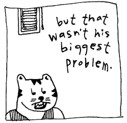][1]

Want to start using Python alongside your reading? Split your attention and head
off to [The Tiger’s Vest (Installing Python and using REPL)][1], a trite mini-chapter which will aid you in installing Python. In addition to learning about ice guns hooked to bells, you will learn about Python REPL (or enhanced IPython), which gives you instant feedback as you code, and the built-in help() function, a teaching aid that come with Python which will really speed you up in your learning.
</aside>

The `upper` method is then used on the string that `input` is giving back. The
`upper` method is part of the `str` (string) class. Which means that **anything
which is a string has the `upper` method available**. More on classes in the
next chapter, for now just know that **a lot of methods are only available for
certain types of values** e.g. string has `upper`, list has `append`, etc. 

I don’t think `upper` is going to cut it to get their attention. The authorities 
need to feel the “Angry Ranting” before the starmonkeys start can touch down in 
Lagos.

Maybe if we uppercase all letters in the string that will get their attention
and add exclamation points at the end!!!

```py
angry_plans = input().upper() + "!!!" # 3 exclamations means serious business
```

Now “Angry Ranting” becomes “ANGRY RANTING!!!”

### Your Repetitiveness Pays Off

You hand me a legal pad, doused in illegible shorthand. Scanning over it, I
start to notice patterns. That you seem to use the same set of words repeatedly
in your musings. Words like _starmonkey_, _Nigeria_, _firebomb_. Some phrases
even. _Put the kibosh on._ That gets said a lot.

Let us disguise these foul terms, my brother. Let us obscure them from itching
eyes that cry to know our delicate schemes and to thwart us from having great
pleasure and many go-carts. We will replace them with the most innocent
language. New words with secret meaning.

I start up a word list, a Python `Dictionary`, which contains these oft seen and
dangerous words of yours. In the Dictionary, each dangerous word is matched up against
a code word (or phrase). The code word will be swapped in for the real word.

```py
CODE_WORDS = {
  'starmonkeys' : 'Phil and Pete, those prickly chancellors of the New Reich',
  'catapult' : 'chucky go-go', 'firebomb' : 'Heat-Assisted Living',
  'Nigeria' : "Ny and Jerry's Dry Cleaning (with Donuts)",
  'Put the kibosh on' : 'Put the cable box on',
  'Hammer' : 'Technology'
}
```

The words which are placed before a `colon` are called **keys**. The words after
the `colon`, the definitions, are often just called **values**. The `colon`
is just like a tiny two-dot bridge that lies between keys and their meanings.

Notice the double quotes around `Ny and Jerry's Dry Cleaning (with Donuts)`.
Since a single quote is being used as an apostrophe, we can’t use single quotes
around the string. (Although, you can use single quotes if you put a backslash
before the apostrophe such as: `'Ny and Jerry\'s Dry Cleaning (with Donuts)'`.)

Should you need to look up a specific word, you can do so by using the **square
brackets** method.

`CODE_WORDS['catapult']` will answer with the string `'chucky go-go'`.

Look at the square brackets as if they are a wooden pallet with a label on it. 
The label on this particular pallet is `'catapult'`. A forklift could slide its prongs into each 
side of the pallet and bring it down from a shelf back in the warehouse. The label on the pallet is  
the *key* (what we placed before the `colon` e.g. **'catapult'** : 'chucky go-go'). We are asking Python to find that key and bring 
back its corresponding *value* (what we placed after the `colon` e.g. 'catapult' : **'chucky go-go'**).

If you’ve never been to a warehouse, you could also look at the brackets as handles. 
Imagine an industrious worker putting on his work gloves and hefting the key back to your custody. 
If you’ve never used handles before, then I’m giving you about thirty seconds to find a handle and 
use it before I blow my lid.

As with many of the other operators you’ve seen recently, the brackets are a shortcut. We can also use a method 
to do the look up in a similar way.

`CODE_WORDS.get('catapult')` will also answer with the string `'chucky go-go'`.

### Making the Swap

I went ahead and saved the Dictionary of code words to a file called **wordlist.py**.

```py
from wordlist import CODE_WORDS

 # Get evil idea and swap in code words
idea = input("Enter your new idea: ")

for real, code in CODE_WORDS.items(): #loop over codes
    idea = idea.replace(real, code) 

 # Write the gibberish to a new file (overwrites file if already there)
idea_name = input("File encoded. Please enter a name for this idea: ").strip()
with open(f"idea-{idea_name}.txt", "w", encoding="utf-8") as f: # Opens the file and automatically closes it when finished
    f.write(idea)
	
```

Script starts by pulling in our word list. Like `if` and `for`, `import` is a Python keyword that acts as a porter for 
our modules department. The statement from wordlist `import CODE_WORDS` goes searching for a module named 
wordlist,usually a file called `wordlist.py`. Once it finds the module, it politely retrieves `CODE_WORDS` 
and carries it back to us, ready for use.

After that, there are two sections. I am marking these sections with comments,
the lines that start with **pound** (#) symbols. Comments are **useful notes** that
accompany your code. Folks who come wandering through your code will appreciate
the help. When going through your own code after some time has passed, comments
will help you get back into your mindset. 

I like comments because I can skim a big pile of code and spot the highlights.

As the comments tell us, the first section asks you for your evil idea and swaps
in the new code words. The second section saves the encoded idea into a new text
file.

```py
for real, code in CODE_WORDS.items(): #loop over codes
    idea = idea.replace(real, code) 
```

You see the `for` method? The `for` method is all over in Python. It’s available
to use with Lists, Dictionaries, even Strings. Here, our `CODE_WORDS` dictionary 
is kept in a Dictionary. This `for` method will hurry through **all the pairs of 
the Dictionary**, one dangerous word matched with its code word, handing each coded
pair to the `replace` method for the actual replacement.

In Python, `replace` is used to search and replace. Here, we want to find all the 
occurrences of a dangerous word and replace with its safe code word. With `replace`, 
you provide the **word to find as the first argument**, then the **word to put in 
its place as the second argument**.

Why do we have to assign the answer of `replace` method back to the idea?? 
Doesn’t replace already replace the text? You might think the line would read:
`idea.replace( real, code )` without assignment. But with string methods we always need to hang on to its answer.
When a method is done, we return a newly altered string and need to catch it. 
Finally, when you assign it to `idea`, you overwrite the old string.

Remember in Python strings cannot change. They are fixed. Python does not have a change-in-place string methods. 
Instead, both normal string replacement and any new string method returns a fresh (new born) string, 
leaving the old string alone. (Python stays calm and quiet, never destroying your personal property.)

### Text Files of a Madman

Let us now save the encoded idea to a file. (Oh, I forgot we are still doing this spy stuff.)

```py
# Write the gibberish to a new file (overwrites file if already there)
idea_name = input("File encoded. Please enter a name for this idea: ").strip()
with open(f"idea-{idea_name}.txt", "w", encoding="utf-8") as f: # Opens the file and automatically closes it when finished
    f.write(idea)
```

This section starts by asking you for a name by which the idea can be called.
This name is used to build a file name when we save the idea.

The `strip` method is for Strings. This method **trims spaces and blank lines**
from the **beginning and end** of the string. This will remove the _Enter_ at
the end of the string you typed. But it’ll also handle extra spaces if you
accidentally left any. 

After we have the idea’s name, we open a new, blank text file. Normally, we would check the 
filename to make sure the user hasn't slipped a path or other troublesome characters into 
idea_name, but for our example, we'll trust the user, which is ourselves. The file name 
is built by adding strings together. If you typed in `'mustard-plus-codeine'`, then
our math will be: `'idea-' + 'mustard-plus-codeine' + '.txt'`. Python presses
these into a single string. `'idea-mustard-plus-codeine.txt'` is the file.

We’re using the function `open` to open up the file object stream. Up until now, we’ve 
used several built-in functions to do our work. We hand the `print` method a
string and it prints the string on your screen. One secret about built-in functions
like `print`: they are all stored inside a hidden module called builtins. You can 
call them explicitly by writing builtins.print() instead of just print().

```py
import builtins
builtins.print( "55,000 Starmonkey Salute!" )
```

What does this mean? Why does it matter? It means `builtins` is at the center of Python’s universe. 
Wherever you are in your script, `builtins` is right beside you. You don’t even need to spell `builtins` 
out for Python. Python knows to check there.

Most functions are more specialized than `print()` or `input()`. Take `open()`, for example. 
It opens a file and returns a file object. The creator of Python, the handsome Guido van Rossum, 
gave us built-in tools for working with files, allowing us to `open`, `read`, `write`, and `close` files from the 
earliest versions of Python.

* `content = f.read()` reads the entire file and returns a string containing all of its text.

* `f.write(idea)` writes the contents of `idea` to the file.

* `f.close()` closes the file.

There is an important distinction here. `open()` is a **built-in function**, so you can call it without 
importing anything. But `read()`, `write()`, and `close()` are **methods of the file object** returned by `open()`.
These file-object methods are part of Python’s built-in file-handling machinery, provided by the 
`io` module. They are some of Python’s core tools for working with streams of data.
So, while you can safely call built-in functions such as `print()`, `input()`, and `open()`, 
you’ll need to `open()` a file and get a file object before you 
can use methods such as `read()`, `write()`, and `close()`.

```py
idea_name = input("File encoded. Please enter a name for sassy ideas file: ").strip()
with open( 'sassy_ideas-' + idea_name + '.txt', 'w', encoding="utf-8") as f: # Opens the file and automatically closes it when finished
    f.write(idea)
# File automatically closes here
```

We pass three arguments into `open`. The first is the **file name to open**. The second is a string 
containing our **file mode**. We use `'w'`, which means to write to a file (creating or overwriting). 
The third argument is the encoding type. We are using "utf-8" which is a good default encoding to use, as it handles characters from many (human) languages. Encoding simply tells Python how to translate the text into bytes when it saves the file.

Some other file mode options are: 

* `'x'` to write without overwriting existing files, 
* `'r'` to read from the file, and
* `'a'` to add to the end of the file.

The file is opened for `w` or writing and we are handed back the file in variable `f`,
which can be seen **sliding down the chute into our `with` Context Managers**. 
Inside the context manager, we write to the file. When the context manager 
finishes, our file is closed as well automatically.

### Settle Down, Your Ideas Aren’t Trapped

Here, let’s get your ideas back to their original verbiage, so you can ruminate
over their brilliance.

```py
from glob import glob
# Assuming CODE_WORDS is defined in a separate wordlist.py file
from wordlist import CODE_WORDS

# Print each idea out with the words fixed
for file_name in glob("idea-*.txt"):
	with open(file_name, "r", encoding="utf-8") as f:
		idea = f.read()

	for real, code in CODE_WORDS.items(): #decoding the encoded message
		idea = idea.replace(code, real) # replace the code word with the real word. 

	print(idea)
```

By now, you should be up to snuff with most of this example. I won’t bore you
with all of the mundane details and the `for` loop is almost the same as when we encoded the ideas, but here we replace the code words with the real ones. See if you can figure out how it works on your own.

But what's this stuff with `glob` at the top of the loop: `glob("idea-*.txt")`? 

The `glob` function is a scruffy, over-eager bloodhound living inside Python’s `glob` module. 
The `glob` function searches a directory for files. 
When you think of `glob`, think of a globe and spinning a spherical map to search the 
whole folder for your files. Can you start to see the shiny, glinting gorgeousness of Python?

So with `glob("idea-*.txt")` we’re using `glob` to get files in the current directory which match `'idea-*.txt'`. The `glob` method uses the **asterisk** as a wildcard. We’re
basically saying, “Match anything that starts with _idea-_ and ends with
_.txt_.” The globe spins off to the directory and comes back with a list
of all matching files. That **list of files** `glob` returns will come in the form of `List`, with a
`String` for each file found. 

??? question "Try this example and guess what glob is doing:"
    Here we check the current directory, write out some reports and then perform a glob search. 
    Try and guess what the glob is searching for before running the code yourself.

    ```py
    from pathlib import Path
    from glob import glob

    # Get and print the current working directory
    print(Path.cwd())
    with open("report_1.txt", "w", encoding="utf-8") as file:
        file.write("hello")
    with open("report_3.txt", "w", encoding="utf-8") as file:
        file.write("there")
    with open("report_4.txt", "w", encoding="utf-8") as file:
        file.write("why")
    reports = glob("report_[123].txt")
    print(reports)
    ```

    If you are still curious and want to play more with your `glob`, try these:

    ```pycon
    >>> from glob import glob
    # 1. Get all files and folders in the current directory
    >>> print(glob('*'))
    # 2. Get all .txt files in a specific folder
    >>> print(glob('documents/*.txt'))
    # 3. Looks for `document.txt` file in current directory 
    >>> print(glob("document.txt"))
    # 4.  Looks for all txt documents in the current directory
    >>> document = glob("*.txt")
    # 5. Searches your current directory and every single folder inside it to find all files ending in `.pdf`.
    >>> all_pdfs = glob("**/*.pdf", recursive=True) 
    ```

### List Comprehensions

So you take a part time job a pizza shop to fund your Python education. Boss calls you in and wants you run a promotion to double toppings on orders already placed. 

Normally you would use a `for` loop:

```py 
pizza_orders = ['chunky bacon','sausage','cheese','mushroom', 'margarita']
promo_pizza_orders=[] 		
for pizza in pizza_orders: 	   
    promo_pizza_orders.append('double ' + pizza)   
```

We loop over a list of pizza order and  'double ' at the start of each order. But that's a lot of code just to update a list and boss wanted the new orders stat. 

With list comprehension, the above code become just one line. Fire up list comprehension the conveyer belt, and updated order come in double time!

```py 
promo_pizza_orders = ['double ' + pizza for pizza in pizza_orders]
```

The above list comprehension reads from right to left like so: "for each `pizza` in `pizza_orders`, add to the list: 'double ' + `pizza`". The list comprehension reduces 3 lines with a `for` loop to a single line of code!

We can also add more complex condition logic, making a list comprehension more powerful . 

There are two main ways to do this, filtering with if OR modifying with a conditional expression.
Filtering adds the `if` to the end and Modifying uses a conditional expression at the beginning. 

* Filtering: `[p for p in pizza_orders if "bacon" in p]` # all pizza orders with bacon related toppings

* Modifying: `['gross, try again' if 'hawaiian' in p else p for p in pizza_orders]` # reject all hawaiian pizza orders

Orders came in steady for our double topping pizzas, but soon we were low on toppings. 

Boss asks "How's many chunky bacon orders we's got, why?" Too many to count by hand! So I fired up the old Python and started counting orders using a handy list comprehension and let the snake take care of it! 

```py
promo_orders = ['double chunky bacon','double prosciutto','double sausage','double cheese','double mushroom','double chunky bacon', 'double cheese','double prosciutto', 'double meat lovers']
count_chunky = len([p for p in promo_orders if p.endswith("chunky bacon")]) # count chunky bacon orders
```

Boss pulls me aside later that day "_why, we can't just be giving away Prosciutto. Chunky bacon, okay, but this Prosciutto is imported from Tuscany, fuuggetaboutit. 
Give em a lil' extra this time, capisce?"

Prosciutto was robust, savory and had to be protected with a modifying conditional expression. 

```py 
promo_orders = [p.replace('double','lil extra') if 'prosciutto' in p else p for p in promo_orders]
```

Now as a reward for completing the examples, a pizza joke: 

??? danger "Why did the toppings have to squeeze together on the pizza?"
    There wasn't mush-room! 

## 4. The Miracles of Lambda and Sorted

### My Friend Jimothy

Now, my friend Jimothy doesn't like chunky bacon pizza but loves clubbing. He goes on and on about the hottest new club that has no name, but all I want to do is go home and watch Batman reruns, eat pickles, and play with my cat Blix. 

_why: "What's the place called?"

Jimothy: "It's here today, gone tomorrow. It won't stick around long enough to bother with names. Kinda reminds me of my dad. Maybe that's why I party so much?"

So after a good cry, we settled on using a little party hat symbol to represent the nameless club. λ or `lambda`, the 11th letter in the Greek alphabet, looks just like a party hat when you have had 6 soco and limes. **The `lambda` club was born.**

??? info " Where does `lambda` really come from?"
	This book is filled with many truths, but I hate to break it to you, there is no `lambda` club in real life (or at least if there is, you aren't invited to it)! 
	
	The word `lambda` in programming languages originally comes from Alonzo Church’s Lambda Calculus, invented in the 1930s. In his notation, the Greek letter lambda (λ) denotes binding a variable in a function. A function like `f(x) = x + 2`, was written as `λ x . x + 2`. This translates to "a function that takes `x` and returns `x + 2`.
	
We can use our new functions like so: `add(3,4) # 7`, `multiply(1,2) # 2`, and `party('Jimothy', '_why') # Jimothy & _why will party`. 

We could also call a function without assigning a name using parentheses: 
`(lambda a, b: a + b)(3,4)`, `(lambda x, y: x * y)(1,2)`, and `(lambda a, b: f"{a} & {b} will party")("Jimothy","_why")`

#### Partying at the `lambda` club!

So Jimothy and _why head to the `lambda` club.
Inside, they find a tiny dance floor that appears every evening and vanishes before sunrise.

```py
anon_club = lambda a, b: f"{a} & {b} party hard"
print(anon_club('Jimothy', '_why'))
```

> Jimothy & _why party hard

What sorcery does this conjure, creating a party out of thin air? But wait, we are just defining a function, similar to how we did before with `def`:

```py
def anon_club(a, b):
    return f"{a} & {b} party hard"

print(anon_club('Jimothy', '_why')) # Jimothy & _why party hard
```

"Here we see a function defined. It has three parts, the function name, parameters, and code," says Jimothy.

```py
def function_name(parameters):
    code
```

"A `lambda` is the same idea, just written as an expression," Jimothy adds.

```py
lambda parameters: code
```

"So we're just writing a function a different way?" asks _why.

"Exactly," says Jimothy. "The difference is that a `lambda` is usually a temporary worker. You use `def` for functions you'll reuse. You use `lambda` for quick jobs that only need doing once."

In fact, we can create the function and call it immediately:

```py
(lambda a, b: f"{a} & {b} party hard")('Jimothy', '_why')
```

The first parentheses contain the `lambda` function. The second contain the arguments. `'Jimothy'` becomes `a`, `'_why'` becomes `b`, and the expression after the colon is evaluated:

```py
f"{a} & {b} party hard"
```

which produces:

> Jimothy & _why party hard

The `lambda` club appears at night with its tiny dance floor, throws one quick party (look at them dance in there), and disappears into the night.

### Blix is my cat

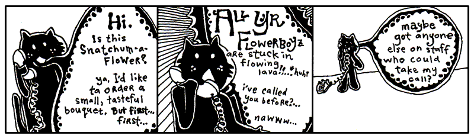

<aside class="sidebar" markdown="1">
### Excerpt from The Scarf Eaters

(_from Chapter V: A Man in Uniform_.)

In April, the callow lilies came back. They stretched their baby angel wings out
and reached for the world. Gently, their tendrils caressed the sullen fence
posts until even they lilted lovelier.

From her bedroom window, Lara watched the lilies exude their staunch femininity.
She slipped the tassels of a fresh, carpathian, embroidered scarf into her mouth
and ate slowly. The long cloth slid down her throat and tickled as it snaked
along her esophagus. She giggled and burped.

Oh, how the flora drew her in. Looking at flowers went so well with being a
teenage girl. She wanted to paint them, so she opened a new Canva template. A
blank movie this time.

She set her cursor loose in the garden of the canvas. White lines sprouted 
beneath shorter yellow ones. She gathered the white lines into a group, tucked 
them neatly into a layer named “Cry, Baby Angel, Cry,” and saved the design 
among her favorite elements, ready to bloom again in another project.

She felt a warm chill as she moved the long, white petals to her canvas’s
Brand Kit. It felt so official. _I choose you. I name you. Dwell in the comfort 
of my palace forevermore._

Heh. She laughed. Colorado Springs was hardly a “palace.”

Since they had moved, Dad had only been home once. He had barged through the
front door in full uniform and had given quite a start to both Lara and her
mother. Her mother had even dropped a head of lettuce—which head she had just
finished washing—in a pitcher of Lick-M-Aid.

The pitcher was just wide enough for the lettuce and it lodged in there pretty
good. Dad came over and yanked at the moist head for sometime until declaring it
<span class="caps">COOKED</span>, in a voice both bemused and then crestfallen.
He tossed the clotted spout in the trash bin.

It was only later that day that Lara’s mother realized that she could have
simply halved the lettuce with an electric knife. Dad laughed and slapped his
forehead. He then went around and slapped Lara’s forehead, and her mother’s too,
affectionately.

“We just weren’t thinking, were we?” is what he said. “And who dares blame us?
We’re a real family today. And we shouldn’t have to do anything else on the day
we got our family back.”

Lara’s smile reflected across the glass of her monitor. She chose the text tool
and in 42 point serif typed: “Dad.” She created a path for it and let it tween
off the right side of the screen. She cried long after it was gone.
</aside>

Since you and I are becoming closer friends as we share this time together, I
should probably let you in on a bit of the history going on here. It’s a good
time for a break I say.

First, you should know that Blix is my cat. My second pet to Bigelow. Granted,
we hardly see each other anymore. He’s completely self-sufficient. I’m not
exactly sure where he’s living these days, but he no longer lives in the
antechamber to my quarters. He emptied his savings account about seven months
ago.

He does have a set of keys for the house and the Seville. Should he ever find
himself stranded, I will gladly step away from our differences and entertain his
antics around the house again.

Make no mistake. I miss having him around. Can’t imagine he misses my company,
but I miss his.

### A Siren and A Prayer

I first saw Blix on television when I was a boy. He had a starring role on a
very gritty police drama called _A Siren and A Prayer_. The show was about a
god-fearing police squad that did their jobs, did them well, and saw their share
of miracles out on the beat. I mean the officers on this show were _great_ guys,
very religious, practically clergy. But, you know, even clergymen don’t have the
good sense to kill a guy after he’s gone too far. These guys knew where to draw
that line. They walked that line every day.

So, it was a pretty bloody show, but they always had a good moral at the end.
Most times the moral was something along the lines of, “Wow, we got out of that
one quick.” But there’s serious camaraderie in a statement like that.

The show basically revolved around this one officer. “Mad” Dick Robinson. People
called him Mad because he was basically insane. I can’t remember if he was
actually clinically insane, but people were always questioning his decisions.
Mad often blew his top and chewed out some of the other officers, most of whom
had unquestionable moral character. But we all know it’s a tough world, the
stakes are high out there, and everyone who watched the show held Mad in great
regard. I think everyone on the squad grew quite a bit as people, thanks to
Mad’s passion.

The officers couldn’t do it all themselves though. In every single episode, they
plead with a greater force for assistance. And, in every single episode, they
got their tips from a cat named Terry (played by my cat Blix.) He was just a
kitten at the time and, as a young boy tuning into _A Siren and A Prayer_, I
found myself longing for my own crime-sniffing cat. Terry took these guys down
the subway tunnels, through the rotting stench of abandoned marinas, into
backdoors of tall, industrial smokestacks.

Sometimes he was all over an episode, darting in and out, preparing traps and
directing traffic. But other times you wouldn’t see him the whole episode. Then
you’d rewind through the whole show and look and look and look. You’d give up.
He can’t be in that episode.

Still, you can’t bear to let it go, so you go comb through the whole episode
with the jog on your remote, combing, pouring over each scene. And there he is.
Way up behind the floodlight that was turned up too high. The one that left Mad
with permanent eye damage. Why? Why burn out the retinas of your own colleague,
Terry?

But the question never got answered because the series was cancelled. They
started to do special effects with the cat and it all fell apart. In the last
episode of the show, there is a moment where Terry is trapped at the top of a
crane, about to fall into the searing slag in the furnace of an iron smelt. He
looks back. No going back. He looks down. Paws over eyes (_no joke!_), he leaps
from the crane and, mid-flight, snags a rope and swings to safety, coming down
on a soft antelope hide that one of the workers had presumably been tanning that
afternoon.

People switched off the television set the very moment the scene aired. They
tried changing the name. First it was _God Gave Us a Squad_. _Kiss of Pain_.
Then, _Kiss of Pain in Maine_, since the entire precinct ended up relocating
there. But the magic was gone. I went back to summer school that year to make up
some classes and all the kids had pretty much moved on to football pencils.

### Lambda

A couple years ago, I started teaching Blix about Python. When we got to this part
this part of the lessons, he said to me, “Lambda functions remind me of Mad Dick 
Robinson who was always good with the ladies.”

“Oh?” I hadn’t heard that name in a while. “I can’t see how that could be.”

“Well, people say lambda functions can be difficult to understand.”

“They’re not difficult,” I said. ““A lambda is a compact little function-making machine. 
It often appears for one quick job, though you can keep it around if you insist on adopting it.”

Blix began licking his fur, ignoring me.

I added, "Just like a function, with lambda we have arguments that are passed in and the 
function code or expression that gets evaluated. Just like a function, we use a colon to separate the two." 

Blix shook his head not understanding anything. 
 
"For `lambda x: x.lower()`, we could read it as take x and give back lowercase x.
You try to read this function."

```py
(lambda x: x * 2)(4)  # return 8
```

"Umm. take x and give back x times 2. Seems dumber than Mad Dick Robinsons."

"Exactly. Why not just write 4*2? Well Lambda is useful as a shortcut when we 
want to multiply numbers by two many times." 

```py
times_by_two = lambda x: x * 2
times_by_two(1) # gives 2
times_by_two(4) # gives 8
times_by_two(2) # gives 4
times_by_two(8) # gives 16
```

"That seems awfully...silly? Why not just define a function or list comprehension?" said Blix, remembering the assembly line from Chapter 3.

"You mean like this? `[n*2 for n in [1,4,2,8]]`?"

"Ah yes! That seems like a less dumb way to double a bunch of numbers."

"Yes, but back on topic. The power of the **lambda function** comes when you just want to make a quick one-off calculation. It works sort of like a disposable function, that you use once and never use again.”

"Like a one night stand?" asked Blix. 

"Well, I guess you could think of it like that but lambda is more like one pocket-sized trick, for small expressions. If you need a suitcase full of statements, give it a proper `def`.”

"Yeah, yeah, suitcase. Right... I have a perfect use case then! Write me a lambda function to help expedite my dating! I have a long list of profiles. Can you help me narrow them down to ones open to.. you know..."

"What?"

"You know..."

"Cheap flings? I don't think Python was meant for that..."

"Just make with the code already!"

```py title="profiles.py"
profiles = [
    "Looking for something casual, fun dates, and picnics and lasagna.", 
    "I'm looking for marriage and a litter of kittens. Only serious cats please.", 
    "I'll be visiting the neighborhood so short-term works great!", 
    "I am looking for Mr. Purfect. He needs to have all his shots."
]
```

```py
from profiles import profiles
# Define the lambda function rule
is_open_to_hookups = lambda bio: "casual" in bio.lower() or "short-term" in bio.lower()

# Test profiles for tags by running the lambda function and print the results
results = filter(is_open_to_hookups, profiles)
print(list(results))
```

"Ah! Hmm. `lambda bio:` and `filter`? What's that...? Well, I don't really care. Did I get any matches?"

"Blix, try to understand the code first. The lambda function takes in an argument bio and checks if the words `casual` or `short-term` are in the bios. We then apply this to your list of potential suitors or suitresses using `filter` to filter and return the matches, and voilà, we get a list of... eligible mates."

"I see, I see... this thing will really amp up my dating life!" said Blix pressing the pads of his fingers together, 
lost in deep thought.

"Python *helping* someone's dating life??? Now getting back to Mad Dick Robinsons. Mad was just an officer, sworn to uphold his duty,” I said. “But he was a real miracle to watch out in the field. 
Now, this example shows a pick up line from the show that Mad Dick used to get dates" 
I pointed to an example I’d written down for him using lambda.

```py
re_wire = lambda x, y: x.replace("Mad Dick", y)
blix_line_1 = re_wire("Mad Dick: Do you why call me Mad Dick? Do you want to?", "Blix")
print(blix_line_1)
```

"Hmm, that line didn't seem to translate very well." replied Blix shaking his head in defeat.

"We can run a bunch of lines at once and pick a good one:"

```py
re_wire = lambda x, y="Blix": x.replace("Mad Dick", y)
terrible_lines = [
"Mad Dick: You look lost. Come sit on my lap. I'll teach you to drive stick.", 
"Mad Dick: Girl, you passed my fitn-ass test.",
"Mad Dick: Hey there are you a fire alarm? Because I'm Mad Dick and I'd pull you right now."]

blix_lines = list(map(re_wire, terrible_lines))
print(blix_lines)
```

“You can do that? Set `y="Blix"`? Cool! I am y?"

"Calm down Blix. We are just are replacing `Mad Dick` from his famous lines with `Blix` using a lambda function and so we set one of the parameter's default value to 'Blix'."

"Ah I see, so lambda is a sort of placeholder function?” he said. 

I nodded yes. 

“Okay, but could we maybe try an example from my social life? What about my toys?" He extended a paw towards the dirty sock and toy mouse across the room. 

I tried to explain "that's my sock, not your toy..." but it was no use. It belonged to Blix now.

I scribbled an example on the page. 

```py
kitty_toys = [{"name": "sock", "fabric": "cashmere"}] + \
             [{"name": "mouse", "fabric": "calico"}] + \
             [{"name": "eggroll", "fabric": "chenille"}]

#get the fabrics
fabrics = list(map(lambda toy: toy["fabric"], kitty_toys))
```

"The backslashes tell Python that there is _more of this line to come_, 
so that all that code is treated as if it were a single line." 

Blix nods attentively.

"We could also use parentheses to spread the code across multiple lines. This looks cleaner and is the preferred approach."

```py
kitty_toys = ([{"name": "sock", "fabric": "cashmere"}] + 
              [{"name": "mouse", "fabric": "calico"}] + 
              [{"name": "eggroll", "fabric": "chenille"}])
```

“This is a small miracle,” he said. “I can’t deny its beauty. Look, there are my
`kitty_toys`, laid out for me to see.”

Blix had also been taught the Dictionary, with curly braces on each end which look like small, open books with words in the dictionary 
matched up with its definition by a colon. (Be beholden: `{'blix': 'cat', 'why' : 'human'}`.)

“Sure, now, I apologize if your list of toys looks a bit confusing.” I said. Like you, Blix had learned about the List, the caterpillar stapled into the code, with square brackets on each side and each item separated by commas. Here is one:`[1, 2, 3]`.

“Yes, vexing,” he said. “It has square brackets like it’s a List, but inside colons like 
it’s a Dictionary. I don’t think you’re going to get away with that.”

“It does seem a bit odd, doesn’t it?” I said, tease-nudging him with a
spoon. “I’ve done your kitty toy list in a mix of the two. I’m using a shortcut.
Which is: **A bunch of Lists each with a single Dictionary inside it.**“

“Oh, I see,” he said. “You criss-crossed ‘em. How neat!”

“Yes, yes, you’re on it,” I said. He was also very good with a protractor. “I
have three Lists, each with a Dictionary inside. Notice the plus signs? I’m adding
them into one big List."

"Here’s another way of writing it…” I jotted down.

```py
kitty_toys = [
	{"name": "sock", "fabric": "cashmere"}, 
    {"name": "mouse", "fabric": "calico"},
    {"name": "eggroll", "fabric": "chenille"}
	]
```

A list of chew toys: or more specifically three dictionaries each
describing a toy. The first toy is described as `{"name": "sock", "fabric": "cashmere"}`, 
the second as `{"name": "mouse", "fabric": "calico"}` and so on. A List of Dictionaries!

```py
fabrics = list(map(lambda toy: toy["fabric"], kitty_toys))
```
"But first see this line to get the fabrics of each toy? We are using `map()` to apply the function to each item in a list i.e. `map(function,list)`. Here's an easier example."

```pycon
>>> map(int, ["1","2","3"])
=> [1,2,3]
```

"Ah, `map()`, good good. The string become integers."

"Yes! Getting back to the toys, we use `map()` to get the fabric for each toy in our list of dictionaries. In Python, `lambda` functions are often used with `filter()`, `map()`, and `sorted()`,  higher-order functions which accept other a function as one of their arguments."

"Huh, functions that need other functions? Alright. What about moving eggroll to the top of the list?" 

### Sorting and Iterating to Save Lives

“Let’s sort your toys by name now,” I said. “Then, we’ll print them out in that order.”

```py
sorted_toys = sorted(kitty_toys, key=lambda toy: toy["name"])
```

“How does sorting work?” asked Blix.

“I can tell `sorted()` is a built-in function, but what's all that gobbledygook in the arguments? And `lambda`?? Not again!”

“The `sorted()` function takes an iterable as its first argument and returns a new sorted list. But before Python can sort the toys, it needs to know *what* to sort by. Should it sort by size? name? price? weight? favorite chewability rating?”

Blix nodded.

“That’s where the `key=` argument comes in. Think of `key=` as a way to tell `sorted()` what value to use when ordering and comparing items.”

```py
sorted_toys = sorted(kitty_toys, key=lambda toy: toy["name"])
```

“Now let's break down the lambda. The part before the colon, `toy`, is the parameter. The part after the colon, `toy["name"]`, is the expression whose value is returned. 

So, `lambda toy: toy["name"]` means: 'For each toy, get its `name` for sorting.' Python goes through the list, gets the name from each toy, and sorts the toys alphabetically by name. We use the lambda because it's short and we're only going to use it once.”

“So the lambda tells `sorted()` to sort by each toy's name?””

“Exactly.”

Blix looked thoughtfully at his eggroll.

After some thought, Blix concludes, "I get it. Python compares the names, puts them in alphabetical order, and returns a new sorted list of toy.”

"Bravo! Now let's print out those toys!"

```py
sorted_toys = sorted(kitty_toys, key=lambda toy: toy["name"])
for toy in sorted_toys:
    print(f"Blixy has a {toy['name']} made of {toy['fabric']}")
```

"Oh great! And remind me, what's that `for` thing?”

"You remember that episode when Mad...” 

“Episode?” he said. Yeah, he can’t understand the concept of TV dramas. Yeah,
I’ve tried explaining.

“Or, yeah, remember that one _eyewitness account_ we watched where Mad was
trying to talk down that crazy spelling bee contestant from the ledge of a
college library?”

“I remember it better than you because I was riding in a remote control plane.”
Yep, it was one of those episodes.

“Do you remember how Mad got the guy to come down?” I asked.

“People in spelling bees love letters,” said Blix. “So what Mad did was a genius
move on his part. He started with the letter A and gave reasons, for all the
letters of the alphabet, why the guy should walk back down the building and be
safe on the ground.”

”’A is for the Architecture of buildings like this,’” I said, in a gruff Mad
voice. ”’Which give us hope in a crumbling world.’”

”’B is for Big Guys, like your friend Mad the Cop,’” said Blix. ”’Guys who help
people all the time and don’t know how to spell too great, but still help guys
who spell really great.’”

“See, he went through all the letters, one at a time. He was _iterating_ through
them.” _It Err Ate Ing._

“But the guy jumped anyway, Why. He jumped off on letter Q or something.”

”’Q is for Quiet Moments that help us calm down and think about all of life’s
little pleasures, so we don’t get all uptight and starting goofing around on
tiptoes at the very edge of a big, bad building.’”

“And then he jumped,” said Blix. He shook his head. “You can’t blame Mad. He did
his best.”

“He had a big heart, that’s for sure,” I said, patting Blix on the shoulder.

“As for your for, it **starts at the top** of the list and goes through each item, 
one at a time. So toy takes turns being each item in the list. For each toy, we look up its name and 
fabric in the dictionary, then print them out.”

“Okay, so toy takes turns being each of the different toys I have. But now I have them all in order.”

“That’s right,” I said. “You know how I’ve really been harping on using the answers that functions 
give you? Here, we’re simply using the sorted list that sorted() gives us.”

### An Unfinished Lesson

“That’s good enough for today,” said Blix. “Can I have a fresh saucer of milk,
please?”

I filled his saucer to the brim and he guzzled from it for some time while I
took a poker and jabbed at coals in the fireplace. My mind wandered and I
couldn’t help but think further of lambda. I wondered what I would teach Blix
next.

I probably would have taught him about `continue`. When you are iterating through a
list, you may use `continue` to **skip on to the next item**. Here we’re counting
toys that have a non-eggroll by skipping those that do with `continue`.

```py
non_eggroll = 0
for toy in kitty_toys:
    if toy['name'] == 'eggroll':
        continue
    non_eggroll = non_eggroll + 1
```

I could also have taught him about `break`, which **kicks you out of an iterating 
loop**. In the code below, we’ll print out each of the toy dictionaries until we hit
the toy whose fabric is lycra (Blix's new cuddle whale toy is made with lycra). The `break` will cause the loop to abruptly end, leaving out any further items in the iterable.

```py
kitty_toys.append({"name": "cuddle whale", "fabric": "lycra"})
kitty_toys.append({"name": "giraffey", "fabric": "silk"})

for toy in kitty_toys:
    if toy['fabric'] == 'lycra':
        break
    print(toy)
```

I never got to teach him such things. I continued poking away at a particularly
stubborn coal which was caught in the iron curtain of the fireplace and
threatened to drop on my antelope skin rug.

As I hacked away ferociously at the black stone, Blix slipped away, presumably
on the bus bound for Wixl, the very bustling metropolis of the animal economies.
Who knows, he may have first stopped in Ambrose or Riathna or any of the other
villages along the way. My instincts say that Wixl was definitely his final
stop.

Without any student to instruct and coax along, I found myself quite lonely,
holed up in the estate. In the stillness of the dead corridors, I began to
sketch out a biography in the form of this guide.

I worked on it whenever I found myself bored. And when I wasn’t bored, I could
always switch on _The Phantom Menace_ to get me in the mood.

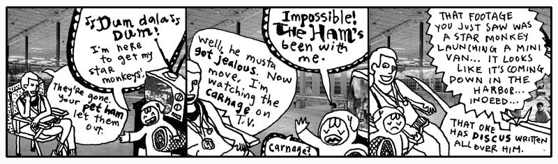

[1]: installing-python.md