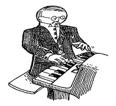
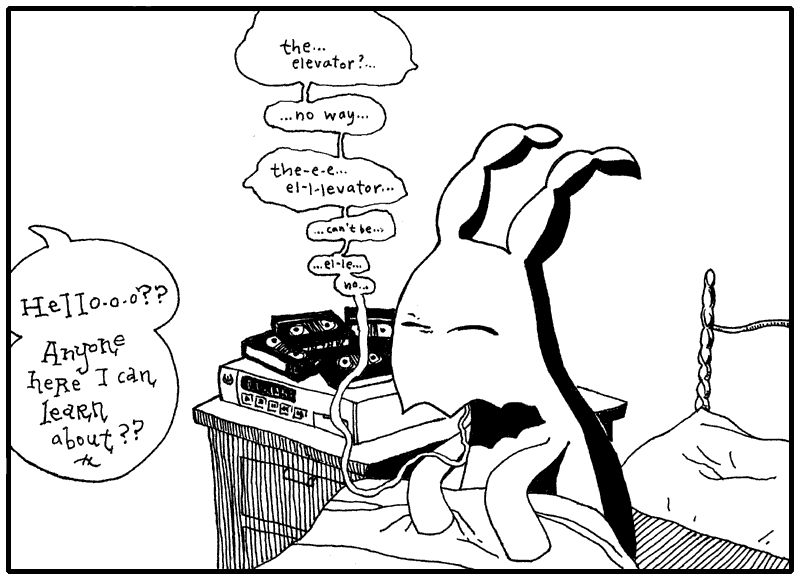
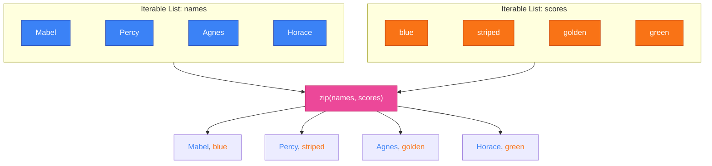

---
hide:
  - toc
---

# 4. Advanced Organ Instructing

{.center}


[TOC]

!!! story ""
    My modest grasp of the history and climate of Endertromb has been assembled from
    hanging around my daughter’s organ instructor, who grew up on the planet. What kind of organs he instructed, I did not know.

    I frequently drill my daughter’s organ instructor in order to ensure that he can
    keep appointments adequately. That he can take house calls at odd hours and
    promptly answer emergency calls. When he finally revealed to me that he was an
    alien whose waking day consisted of five-hundred and forty waking hours, I was
    incredibly elated and opened a contractual relationship with him which will last
    into 2060.

## 1. The Story of My Daughter's Organ Instructor

!!! story ""
    I know you may be alarmed to hear that I, the elusive _why, have a daughter. You think my writing
    is indicative of a palsied or infantile mind. Well, please rest. I don’t have a
    daughter. But I can’t let that stop me from sorting out her training.

    As I was related these elaborate histories of the planet Endertromb, I found
    myself wandering through hallways, running my fingertips along the tightly
    buttoned sofas and soaking myself in the saturated bellowings of the pipes, as
    played by my daughter’s organ instructor. His notes resounded so deep and hollow
    in the walls of his manor that I began to casually mistake them for an ominous
    silence, and found it even easier to retreat into deep space with my thoughts.
    To think upon the ancient planet and its darker philosophies: its flesh temples,
    tanned from the dermal remains of its martyrs; its whale cartels, ingesting
    their enemies and holding them within for decades, dragging them up and down the
    staircases of ribs; its poison fogs and its painful doorways; and, the atrocious
    dynasties of The Originals, the species which claims fathership to all of the
    intelligent beings across the universe.

    But, eventually, I’d hear those pipes of a higher octave sing and I’d be back in
    the very same breezy afternoon where I’d left.

    How interesting that even the breeze of our planet is quite a strange thing to
    some outsiders. For he had also told me of the travelers from Rath-d, who
    ventured to Earth five centuries ago, but quickly dissipated in our air currents
    since they and their crafts and their armor were all composed of charcoal.

    I had sat at the organ, listening to his faint tales of his colony, while he
    punctuated his symphonies to greater volumes and the story would disappear for
    awhile, until the coda came back around. He spoke of him and his brothers
    piling into the hollow of his mother’s tail and tearing the waxy crescent tissue from
    the inner wall. Juicy and spongy and syrupy soap which bleached their mouths and
    purged their esophagus as it went down. They chewed and chomped the stuff and it
    foamed. After they ate, they blew bubbles at each other, each bubble filled with
    a dense foam, which they slept upon. And early in the morning, when mother
    opened her tail again, she watched serenely as her babies lay cradled in the
    stew of dark meatballs and sweet, sticky froth.

    He spelled out all the tastes of Endertromb. Of their salmon’s starchy organs,
    which cooked into a pasta, and its eyes which melted into rich cream. Of their
    buttermelon with tentacles. And he was just beginning to appreciate the
    delicacies as a child, only to be lifted from a schoolyard by a pair of upright
    pygmy elephants who reached at him, through the heavens, and snatched upon his
    collar with a vast length of crane.

    They transplanted him on Earth, led him from their craft, trumpeting their
    snouts loudly for the city of Grand Rapids to hear, then left, weeping and
    embracing each other.

    “But, strangely (em-pithy-dah), I learned upon, played upon (pon-shoo) the
    organs on my home (oth-rea) planet,” he said.

    My daughter’s organ instructor speaks these extra words you see in parentheses.
    Who knows if they are from his native tongue or if they are his own soundful
    hiccups. He keeps another relic from Endertromb as well: he has twelve names.

    “No, (wen-is-wen),” he said. “I have one name (im-apalla) which is said (iff)
    many-many different ways.”

### Mumble-Free Earplugs

<p style="float:right" markdown="1">

</p>


I call my daughter's organ instructor, Paij-ree, in the morning and Paij-plo in the later evening. Since it is day as I write, I will call him Paij-ree here.

So I told Paij-ree, “Paij-ree, I am writing a book. To teach the world Python.”

“Oh, (pill-nog-pill-yacht) nice,” he said. He’s known Python longer than I have,
but still: *I* will be my daughter’s Python instructor.

And I said, “Paij-ree, you are in the book. And the stories of your planet.” I
talk to him like he’s E.T. I don’t know why. Just like how I said next, “And
then maybe someday you can go home to your mom and dad!”

To which he said, “(pon-shoo) (pon-shoo) (em-pithy-dah).” Which is his way of
speaking out loud his silence and awe.

He wanted to see what I’d written, so I showed him this short method I’ve
written for you.

```py
def wipe_mutterings_from(sentence):
    while '(' in sentence:
        open_idx = sentence.find('(')
        close_idx = sentence.find(')', open_idx) # Find the matching closing parenthesis starting from the open position
        if close_idx != -1:
            muttering = sentence[open_idx:close_idx + 1]
            sentence = sentence.replace(muttering, '')
    return sentence
```

“Can you see what this does, Paij-ree? Any old Smotchkkiss can use this method
to take all the incoherent babblings out of your speaking,” I said.

And I fed something he said earlier into the method.

```py
what_he_said = """But, strangely (em-pithy-dah),
  I learned upon, played upon (pon-shoo) the
  organs on my home (oth-rea) planet."""

what_he_said = wipe_mutterings_from( what_he_said )
print(what_he_said)

```

And it came out as a rather plain sentence.

    But, strangely ,
    I learned upon, played upon the
    organs on my home planet.

“You shouldn’t use that (wary-to) while loop,” he said. “There are lovelier,
(thopt-er), gentler ways.”

In the `wipe_mutterings_from` method, I’m basically searching for opening
parentheses. When I find one, I scan for a closing paren which follows it. Once
I’ve found both, I replace them and their contents with an empty string. The
`while` loop continues until all open parentheses are gone. The mutterings are
removed and the method ends.

“Now that I look at this method,” I said. “I see that there are some confusing
aspects and some ways I could do this better.” Please don’t look down on me as
your teacher for writing some of this code. I figure that it’s okay to show you
some sloppy techniques to help you work through them with me. So let’s.

Okay, **Confusing Aspect No. 1**: This method cleans a string. But what if we
accidentally give it a `File`? Or a number? What happens? What if we run
`wipe_mutterings_from( 1 )`?

If we give `wipe_mutterings_from` the number 1, Python will print the following
and exit.

	Traceback (most recent call last):
	  File "<stdin>", line 1, in <module>
	  File "<stdin>", line 2, in wipe_mutterings_from
	TypeError: argument of type 'int' is not iterable

What you see here is a rather twisted and verbose (but at times very helpful)
little fellow called the **backtrace**. He’s a wound-up policeman who, at the
slightest sign of trouble, immediately apprehends any and all suspects, pinning
them against the wall and spelling out their rights so quickly that none can
quite hear it all. But it’s plain that there’s a problem. And, of course, it’s
all a big misunderstanding, right?

When Python reads you these Miranda rights, listen hardest to the end. The last
line is often all you need. In this first line is contained the essential
message. And in the above, the last line is telling us that integer type is
not iterable. Remember, when we were talking about the `upper` method in 
the last chapter? Back then, I said, “**a lot of methods are only available 
with certain types of values**.” Both `upper` and `in` work with strings 
but are meaningless and unavailable for numbers.

To be clear: the method tries to use the number. The method will start with
`sentence` set to 1. Then, it hits the second line: `while '(' in sentence:`. 
The `in` operator does not work with integer numbers because they are not iterable. 
Great, the backtrace has shown us where the problem is. I didn’t expect 
anyone to pass in a number, so I’m using methods that don’t work with numbers.

**See, this is just it.** Our method is its own little pocket tool, right? It
acts as its own widget independent of anything else. To anyone out there using
the `wipe_mutterings_from` method, should they pass in a number, they’ll be
tossed this panic message that doesn’t make sense to them. They’ll be asked to
poke around inside the method, which really isn’t their business. They don’t
know their way around in there.

Fortunately, we can throw our own errors, our own **exceptions**, which may make
more sense to someone who inadvertently hands the wrong object in for cleaning.

```py
def wipe_mutterings_from(sentence):
    if not hasattr(sentence, "__contains__"):
        raise TypeError(f"cannot wipe mutterings from a {type(sentence).__name__}")
    while '(' in sentence:
        open_idx = sentence.find('(')
        close_idx = sentence.find(')', open_idx)
        if close_idx != -1:
            muttering = sentence[open_idx:close_idx + 1]
            sentence = sentence.replace(muttering,'')
    return sentence
```
	
This time, if we pass in a number (again, the number 1), we’ll get something
more sensible.

	Traceback (most recent call last):
	  File "<stdin>", line 1, in <module>
	  File "<stdin>", line 3, in wipe_mutterings_from
	TypeError: cannot wipe mutterings from a int

The `hasattr` function is really nice and I plead that you never forget it’s
there. The `hasattr` checks any object to be sure that it has a certain
method or attribute. It then gives back a `True` or `False`. In the above case, the incoming
`sentence` object is checked for an `__contains__` method. If no `__contains__` method
is found, then we raise the error.

You might be wondering why the code is using a string `"__contains__"` to represent the method. A string is used 
when you want to refer to and pass around method names. 

Now, **Confusing Aspect No. 2**: Have you noticed how our method changes the sentence?

Did you see this line `sentence = sentence.replace(muttering,'')` of the mutterings function? Why do we have to assign the result back to the same variable with `sentence =`, instead of just calling `sentence.replace(muttering, '')` on its own?

Python strings are immutable which means once a string object is created in memory, its contents cannot be changed or modified.

**It’s bad manners to change strings in place so Python made it impossible.**

Immutability of strings has a number of advantages like memory optimization, 
thread safety, and security. Not to mention making dictionaries more reliable
because the contents can't be modified 
separately
.

Now getting back to our mutterings: 

```py
something_said = "A (gith) spaceship."
something_said = wipe_mutterings_from( something_said ) # catch what the method returns or lose it!
print(something_said)
```

In the first line of the above code, the `something_said`
variable contains the string `"A (gith) spaceship."`. But, after the method
invocation, on the third line, we print the `something_said` variable and by
then it contains the cleaned string `"A  spaceship."`.

We have to grab the answer from `wipe_mutterings_from` and store it back into something_said? 

Remember that variables are just nicknames. When you do `original = "Hello, World!"`, 
Python creates a new string and then gives that string a nickname. 

Likewise, when you see `new_world_order = original`, you see Python gives the same string a new nickname. 
This is handy inside your method because now `new_world_order` is a nickname for the same string that you can
use as well. But if we change `new_world_order`, we do so **without changing the string `original`**.

Python automatically makes copies of strings as needed, keeping track of multiple variables 
referencing
 the same
string and only creates new strings when you modify the string. All that is done for you by your loyal servant Python, 
so that you don't have to worry about it!

You may note we use the same variable `something_said` throughout and lose the old string. 
You’ll see plenty of examples of variable names being reused.

```py
x = 5
x = x + 1
# x now equals 6

y = "Endertromb"
y = len(y)
# y now equals 10

z = "__contains__"  
z = hasattr("my string", z)
# z now equals True
```

??? info "Immutable Strings are like gift shop name tags keychains, Permanent"

    Python strings are immutable. This means they cannot be changed, just like those gift shop name tag keychains you can purchase at checkout.

    Once you pick up a name tag keychain that says "BRAD", it's permanently stamped into solid acrylic—you can't just pop off the "BR" and snap on a "CH" willy-nilly to turn it into "CHAD". You go back to the rack and grab a completely new tag.

    ```py
    my_name = "BRAD"
    my_new_name = my_name.replace('BR','CH') # replace method returns a new string
    ```

    The method `replace` leaves my_name as "BRAD" and answers back with a new string We must grab the response, screaming as we descends newly born from `replace`. The Miracle of Life! Remember to grab the slippery new string or you lose it, FOREVER.

    To modify a string in-place just to remix it, would be like destroying a *baby's first words video*
    in an attempt to make a **Goo Goo Gaa Dub Step**. That would be hurtful to the baby and Python does not 
    take joy in hurting babies.

**If you can’t get to an object through a variable (nickname), 
then Python will figure you are done with it and will get rid of it.**
Periodically, Python automatically sends out its **garbage collector** to set these objects
free that are no longer used. Every object is kept in your computer’s memory until the garbage collector
gets rid of it. 


<aside class="sidebar" markdown="1">
An Excerpt from The Scarf Eaters 2

(_from Chapter <span class="caps">VII</span>: When Push Comes to Shove—or
Love_.)

“Never say my name again!” screamed Chester, and with the same gusto, he turned
back to the **File > Publish Settings…** dialog to further optimize his movie
down to a measly 15k.
</aside>

Oh, and one more thing about immutable strings. Strings are not the only immutables in Python. 
`int`, `float`, `complex` (complex numbers, not psychological complexes that many Python users have), 
`bool` (`True` and `False`), `tuple`, `range`, `frozenset` (think frozen peas), and `bytes` (python bytes 🐍)
are all immutable meaning these are things that Python won’t let you alter. I mean, imagine if you could 
change `False` to be `True`. The whole thing becomes a lie.

Because we aren't sure whether the arguments of a function are mutable or immutable, modifying an object in place 
may or may not be possible in the function. In any case, it’s poor etiquette to change objects that your function is given as arguments. 
For consistency, we should always try to return a new object, rather than modify these variables in place.


Perhaps **Confusing Aspect No. 3** is a simple one. I’m using those square
brackets on the string. 

```py
muttering = sentence[open_idx:close_idx + 1]
```

I’m treating the string like it’s a list. I can do that. Because strings have a `[]` method which is implemented behind the scenes by `__getitem__`.

When used on a string, the square brackets will extract part of the string.
Again, slots for a forklift’s prongs. The string is a long shelf and the
forklift is pulling out a slab of the string.

Alright, the last **Confusing Aspect No. 4**: this method can be sent into an
endless loop. You can give this method a string which will cause the method to
hang and never come back. Take a look at the method. Can you throw in a muddy
stick to clog the loop?

```py
def wipe_mutterings_from(sentence):
    if not hasattr(sentence, "__contains__"):
        raise TypeError(f"cannot wipe mutterings from a {type(sentence).__name__}")
    while '(' in sentence:
        open_idx = sentence.find('(')
        close_idx = sentence.find(')', open_idx)
        if close_idx != -1:
            muttering = sentence[open_idx:close_idx + 1]
            sentence = sentence.replace(muttering,'')
    return sentence
```

Here, give the muddy stick a curve before you jam it.

```py
muddy_stick = "Here's a ( curve."
wipe_mutterings_from( muddy_stick )
```

Why does the method hang? Well, the `while` loop waits until all the open
parentheses are gone before it stops looping. And it only replaces open
parentheses that have a matching closing parentheses. So, if no closing paren is
found, the open paren won’t be replaced and the `while` will never be satisfied.

How would you rewrite this method? You might want to add a `if close_idx != -1: ... else: break` to end the looping when no `)` is found. Me, I know my way around Python, so I’d use a
regular expression matching the pattern `r"\([-\w]+\)"`.

```py
import re
def wipe_mutterings_from( sentence ):
    if not hasattr(sentence, "__contains__"):
        raise TypeError(f"cannot wipe mutterings from a {type(sentence).__name__}")
    return re.sub(r"\([-\w]+\)", "", sentence)
```

Do your best to think through your loops. It’s especially easy for `while` loops to get out of hand. Best to use an iterator. And we’ll get to
regular expressions in time.

In summary, here’s what we’ve learned about writing methods:

1. Don’t be surprised if people pass unexpected objects into your methods. If
   you absolutely can’t use what they give you, `raise` an error.
2. It’s poor etiquette to change objects your method is given. It's better to return a new
object.
3. Watch for runaway loops. Rely on `while` only when necessary.

### Indexing and Lookups with Brackets

As we have seen before, the square brackets attached to an object (e.g. names[3], cat_toy["name"], name[1:]) can be used to lookup parts inside any List, Dictionary or String objects, as these objects provide a __getitem__ method.

For strings, lists, and dictionaries, we use square brackets attached to an object like so:

```py
word[0] # string
shopping_list[2] # list
phone_book["Alice"] # dictionary
```

The value inside the brackets is like a label we've slipped to our fork lifts operator between the two fork lift's prongs `["Alice"]`. He reads the label and find the corresponding item to fetch for us.

* For strings and lists, the label is usually an integer position, such as 0 or 5. We can also use slices, such as 1:4, to ask for a whole range of items at once.
* For dictionaries, the label is called a key. Rather than looking up an item by position, a dictionary looks it up by name. Keys are often strings, but they can also be numbers, tuples, and other immutable objects.

And for mutable objects like `List` and`Dictionary`, Python provides the `__setitem__` method, 
called by `obj[idx]=value` or `obj[key]=value`. This allows square brackets to be used in assignments on the left-hand side of the equals sign to change specific parts of those objects e.g. `names[3]="Joanna"`.

Let's try some examples using what we've learned. 

```py
# Strings
my_str = "A string is a long shelf of letters and spaces. Guacamole!"
print( my_str[0] )         # prints 'A'
print( my_str[0:-1] )      # prints 'A string is a long shelf of letters and spaces. Guacamole'
print( my_str[1:-2] )      # prints ' string is a long shelf of letters and spaces. Guacamol'
print( my_str[:3] )        # prints 'A s'
print( my_str[-10] )       # prints Guacamole!
print( 'shelf' in my_str ) # prints True
#my_str[0] = "The"         # Would throw an error because strings are immutable

# Lists
my_squares = [1,2**2,3**2,88**2]
print( my_squares[0] )     # prints 1
print( my_squares[0:2] )   # prints [1, 4]
print( my_squares[:3] )    # prints [1, 4,9]
my_squares[0] = 5          # lists are mutable
print(my_squares)          # prints [5, 2, 3, 7744]

# Dictionaries
my_cat_dict = {2:"cat",4:"kitten",5:"lion"}
print( my_cat_dict[2])           # prints cat
my_cat_dict[4] = "bob-cat"       # dictionaries are mutable
print (my_cat_dict)              # prints {2: 'cat', 4: 'bob-cat', 5: 'lion'}
```

So whenever you see square brackets, imagine a label placed right between the prongs where the worker can see it. The object reads the label, finds the requested item, and hands it back to you. 

### Side Quest: The Mystery of the Zero

Now didn't we say that Python Programmers are more efficient than kindergartners?
But there isn't a Chapter 0 in this book, and no `0th` of June. Why then does Python start counting 
from zero in ranges and use zero for indexing elements in lists too?

The first index of a list is always at zero e.g. `print(junebugs[0])`. The same is true with strings. 
For example, `cat_language = "meow"`, we access the first letter using the index of zero: 
`cat_language[0]`. 

If you want to know more about why Python and other programming languages counts from zero, 
continue the Side Quest: The Mystery of Zero. Otherwise, skip to the next section [Zipper free Zippers](#zipper-free-zippers).

Jesse, an expert on 8-bit scrolls, questioned this count from zero tradition. "Seems like a lot of nonsense putting zeroes all over my code. I don't want to use '0's" 

Fair point Jesse.
Since kindergarten we have received anti-zero indoctrination in our lessons, but that ends today. 
Because counting from zero is not just cool and rebellious but practical too.

But are you going to believe some random guy on the internet whose name is a question? 
We created an example to prove it to Jesse, using his own 8-bit scrolls. 
Counting from zero makes 
moving these scrolls into computer memory
a breeze.

Jesse provides us with his scroll of enlightenment file encoded in binary, that is 0s and 1s. 

``` title="scrolls.py"
# a list of bits, that is, data encoded in '1's and '0's
scroll = [0,1,1,1,0,1,1,1,
            0,1,1,0,1,0,0,0,
            0,1,1,1,1,0,0,1] 
```

And we coded up a program to store the bit in memory. 

```py
from scrolls import scroll
ADDRESS = 1028 
memory = [0] * 10000 
# initialize empty memory

for offset in range(len(scroll)):  
    memory[ADDRESS+offset] = scroll[offset]
print(memory[ADDRESS:ADDRESS+len(scroll)])
```

Remember `range(num)` gives a sequence of integers starting at 0 and stopping just before `num`. 
So what this code does is import scrolls of enlightenment and then store each bit to memory starting
from the address `1028` with `range(len(scroll))` counting our offsets.

| 1028 (ADDRESS) + 0 (offset) | 1028 + 1 | 1028 + 2 | 1028 + 3 | 1028 + 4 | 1028 + 5 | 1028 + 6 | 1028 + 7 |
| :---: | :---: | :---: | :---: | :---: | :---: | :---: | :---: |
| 0 | 1 | 1 | 1 | 0 | 1 | 1 | 1 |

The first bit is stored at the ADDRESS, index `1028`, 
with offset of 0
, the second bit
is stored at index `1029` (index `1028` with an offset of 1), and so on. There is no need to subtract by 1 like we would 
have to do if we had counted from 1. The math 
when we count starting from 0
is just easier. Jesse wags his tail. Yes, 
Jesse is a dog that speaks binary. 

Now that you learned to count and index like a **real** programmer, and my heart fills with bright, glowing 1s. 

!!! warning "Decoding the Scroll"
    Now, this is a scroll of enlightenment after all, so read its ancient knowledge at your own risk. 
    But if we want to graduate and learn Python, we read its secret contents could help. 

    We can decode the scroll gracefully using the `join()` method that comes free with all Python strings. The basic usage of `join()` is `"separator".join(list_of_strings)`. So, here
    we call `join()` like so: `separator_string.join(list_of_strings)`. 

    ```py
    from scrolls import scroll
    bytes_strings = ["".join(str(b) for b in scroll[i:i+8]) for i in range(0, len(scroll), 8)]
    decoded = "".join(chr(int(b, 2)) for b in bytes_strings)
    print(decoded)
    ```

    What are we doing here? We group bits into bytes, convert to byte strings, decimal code, characters (via Unicode lookup), and finally reveal the decoded strings. The first scary looking line converts the 24 integers into 3 strings, each with 8 characters. Finally we ask python to do is join all the numbers using an empty string separator e.g. `"".join(...)`.

    For Jesse's scroll data, the list comprehension after `bytes_strings = ` evaluates to: 
    `["01110111", 
    "01101000", 
    "01111001"]`

    The heavy lifting of the decode is performed in the second line using `int(byte_str, 2)`. 
    Here, Python converts each binary (base-2) string into a integer (base-10). 
    The `chr()` function then converts that integer into its corresponding character based on the Unicode standard.

    Note, instead of storing our scrolls as a list of bits and convert said list to strings, 
    integers, and characters, we could have originally stored our data as Unicode integers 
    and then used the built-in datetype `bytes` and its `decode` method to turn Unicode integer codes into characters: 

    ```py
    # Stores a sequence of raw bytes
    scroll = bytes([119, 
                    104, 
                    121]) 
    # Decode bytes
    print(scroll.decode('utf-8'))
    ```
    Did the secret message held within the 
    scroll of enlightenment really answer all your 
    questions or did it actually *burn* the questions away, altogether?

### Zipper free Zippers

In the Kingdom of Tromb, in a remote corner of Endertromb, the royal librarian kept a spreadsheet contain two important rows of data.

The first row contained the names of everyone invited to the annual Moonlight Garden Party:

names = ["Mabel", "Percy", "Agnes", "Horace"]

The second list contained the colors assigned to them:

baskets = ["blue", "striped", "golden", "green"]

The librarian had a very good reason for using a spreadsheet: he was previously an accountant and had kept the habits of lining data up into rows. 

But now the annual garden party was about to begin, and the royal librarian needed to tell the workers what color sashes belonged to which person's table.

He could have matched them by hand:

```text
Mabel  → blue
Percy  → striped
Agnes  → golden
Horace → green
```

But he was Royal librarian and was taught that for royalty, it was better not to get your hands dirty.

So he used the `zip()` function takes items from two two rows and pairs them together, like a zipper joining two sides of his "Shelf control" sweatshirt.

```py
for name, basket in zip(names, baskets):
    print(name, basket)
```

The result was exactly what he needed:

```text
Mabel blue
Percy striped
Agnes golden
Horace green
```

The two lists had not been changed. `zip()` simply brought their corresponding items together, one pair at a time.

So the royal librarian kept his head by using `zip()`, literally. For Mabel was known for her quick temper and only blue could sooth her trouble soul. Anges demanded everything around him to be gilded, Percy liked zebras, and Horace would be satisfied by nothing but the colors of nature. 

We can understand `zip()` better by visualizing the two lists getting zipped up together, like a zipper brings two sides of your fly together as one: left, right, left, right. 


```mermaid
flowchart TD
    subgraph N["Iterable List: names"]
        direction LR
        names0["Mabel"]
        names1["Percy"]
        names2["Agnes"]
        names3["Horace"]

        names0 ~~~ names1
        names1 ~~~ names2
        names2 ~~~ names3
    end

    subgraph S["Iterable List: scores"]
        direction LR
        scores0["blue"]
        scores1["striped"]
        scores2["golden"]
        scores3["green"]

        scores0 ~~~ scores1
        scores1 ~~~ scores2
        scores2 ~~~ scores3
    end

    Z["zip(names, scores)"]

    N --> Z
    S --> Z

    Z --> P1["<span style='color:#3b82f6'>Mabel</span>, <span style='color:#f97316'>blue</span>"]
    Z --> P2["<span style='color:#3b82f6'>Percy</span>, <span style='color:#f97316'>striped</span>"]
    Z --> P3["<span style='color:#3b82f6'>Agnes</span>, <span style='color:#f97316'>golden</span>"]
    Z --> P4["<span style='color:#3b82f6'>Horace</span>, <span style='color:#f97316'>green</span>"]

    classDef input fill:#3b82f6,color:#fff,stroke:#1e40af;
    classDef output fill:#f97316,color:#fff,stroke:#c2410c;
    classDef zipbox fill:#ec4899,color:#fff,stroke:#be185d;

    class names0,names1,names2,names3 input;
    class scores0,scores1,scores2,scores3 output;
    class Z zipbox;
```

*Key Behaviors of `zip()`*

* The zip() function creates an iterator (a temporary object), stepping through one value at a time. 
Wrap it with list() to view all paired tuples at once. 

* The zip() function stops when the shortest sequence runs out of items.

```py
letters = ['a', 'b', 'c']
numbers = [1, 2]

combined = list(zip(letters, numbers)) #temporary iterator becomes a list
print(combined) 
```

The above code outputs: 
>[('a', 1), ('b', 2)] 

The third letter `c` isn't included because there are only 2 numbers.

### The Mechanisms of Name-Calling: Subclassing

!!! story ""
    <p style="float:right" markdown="1">
    
    </p>

    Forthwith there is a rustling in the trees behind Paij-ree’s house and it turns
    out to be a man falling from the sky. His name is Doug and he sells cats.

    So, just as he comes into to view, when his shadow (and the shadows of the cats
    tied to his foot) obscures the bird on the lawn that we’re trying to hit with a
    racquetball, as he’s squeezing a wisp of helium from his big balloon, we shout,
    “Hello, Doug!”

    And he says, “Hello, Gonk-ree! Hello, Why!”

    Paij-ree checks his pockets to be sure he has the dollar-twenty-seven he’ll need
    in order to buy the three cats he’ll need to keep the furnace stoked and the
    satellite dish turning. These cats generate gobs of static once Paij-ree tosses
    them in the generator, where they’ll be outnumbered by the giant glass rods,
    which caress the cats continually—But, wait! 
    
Did you see how the cat broker called him Gonk-ree? And he calls him Gonk-ree in the morning and Gonk-plo at night.

So the suffix is definitely subject to the sunlight. As far as I can tell, the
prefix indicates the namecaller’s relationship to Paij-ree.

So, `str`, **one of the core classes of Python**, cannot be changeed, so we instead subclass `str` to create a `CustomString` that will help us make sense of these names.

```py
class CustomString(str):
    # Class variable holding the syllable dictionaries
    SYLLABLES = [
        {
            'Paij': 'Personal', 
            'Gonk': 'Business', 
            'Blon': 'Slave', 
            'Stro': 'Master', 
            'Wert': 'Father', 
            'Onnn': 'Mother'
        },
        {
            'ree': 'AM', 
            'plo': 'PM'
        }
    ]

    def name_significance(self):
        '''Translates hyphen-separated syllables into their full meanings.'''
        parts = self.split('-')
        signif = [mydict.get(p, p) for p, mydict in zip(parts, self.SYLLABLES)]
        return ' '.join(signif)

# Usage:
name = CustomString("Paij-ree")  # Input a single hyphenated word 
print(name.name_significance())  # Output: Personal AM
```

When you build a new Class based on an existing one, we call this subclassing.
Here we are `CustomString` on top of the built in class `str` using the code `class CustomString(str):`. We can use our `CustomString` just as we would a normal string. 

```py 
name = CustomString("Paij-ree")  # Input a single hyphenated word 
print(name.upper())  # Output: PAIJ-REE
```

So what does `CustomString` add that the `str` class doesn't already have? 
Two things: a class variable and a **method**.

* class variables: `SYLLABLES` variable is a list of dictionaries that can now be used inside the CustomString class. Any variables writen outside a method (inside the class body but outside of any methods) are class variables.

* method: the new method is `name_significance` and this new method can be used with any
CustomString. 

```py
name = CustomString("Paij-ree")
print(name.name_significance()) 
#=> Personal AM
```

As you can see, Paij-ree is a personal name. A name friends use in the early hours.

Now, to fully understand how `name_significance` works, we are going to need a quick tutorial 
on two powerful Python functions: `zip()` and `get()`. But before we get to those, make sure you see the lines of code which uses `self`. As we saw in Chapter 3 with instance variables, `self` represents the object whose method you are calling. I like to look at the `self` as referencing to the **object**.


To see `self` in action, let’s try making a new method which breaks up a string on its dashes
and add it to our CustomString class.

```py

def dash_split(self):
    return self.split( '-' ) # self represent the CustomString that calls this method
CustomString.dash_split = dash_split
```

The method then can be used with any `CustomString`.

```py
CustomString("Gonk-plo").dash_split()
#=> ['Gonk', 'plo']
```

“I know zippers are a bit dangerous,” I said, when I passed this one under
Paij-ree’s nose. “I hope nobody gets hurt.”

“Every Smotchkkiss must taste what this (kep-yo-iko) danger does,” Doug said.
“Dogs and logs and swampy bogs (kul-ip), all must be tasted.” And he took a swig
of his Beagle Berry marsh drink.

Of course, Doug was right. All must be tasted.

*Understanding. our  `CustomString`*

In the `name_significance` method we see:

```py
zip(parts, self.SYLLABLES)
```

* `parts`: `['Paij', 'plo']` (the divided name parts)
* `self.SYLLABLES`: `[dict1, dict2]` (dictionaries for relationship type and time of day)

When evaluated, zip() pairs 'Paij' (prefix to `-`) with dict1 and 'plo' (suffix to `-`) with dict2, allowing us to process both matching pieces simultaneously. Left, right, left right, pairing them up, one by one, in perfect order, just like the zipper on Paij-ree's "Getting Organ-ized" hoodie.

Next, we perform a safe lookups with mydict.get(p, p)

At the beginning of the list comprehension, we see `mydict.get(p, p)` performs a dictionary lookup (similar to `mydict[p]`). The key difference is the second argument: it acts as a fallback value if the key isn't found.

This guarantees that every syllable is translated if present, or safely left unchanged if missing.

```py
# 'Paij' is in dict1, so it becomes 'Personal'; 'roo' is not in dict2, so it falls back to 'roo'
name = CustomString("Paij-roo")
print(name.name_significance()) 
# Output: Personal roo

# Neither 'Pooj' is in dict1 nor 'rei' is in dict2, so both fallback values are used
name = CustomString("Pooj-rei")
print(name.name_significance()) 
# Output: Pooj rei
```

Finally, the last line of the `name_significance` method joins the list of strings back together as a single string using the `join()` method. The basic syntax is separator_string.join(list_of_string).

Here's a quick example: 
```py
' '.join(["candle", "soup", "mackarel"])
# "candle soup mackarel"
```

!!! story ""
    I say Paij-ree’s property is a very charming section of woods when it’s not
    raining cats and Doug. For many days, Paij-ree and I camped in tents by the
    river behind his house, subsisting on smoked blackbird and whittling little
    sleeping Indians by the dusklight. On occasion he would lose a game of spades
    and I knew his mind was distracted, thinking of Endertromb. All of this must
    have been stirring inside of him for some time. I was the first ear he’d ever had.

    “I just came from Ambrose,” I said. “Sort of my own underground home, a place
    where elves strive to perfect animals.”

    He mumbled and nodded. “You can’t be (poth-in-oin) part of (in) such things.”

    “You think we will fail?”

    “I (preep) have been there before,” he said. And then, he spoke of the
    Lotteries.


## 2. The Theft of the Lottery Captain


<p style="float:right" markdown="1">

</p>

And now, Paij-ree’s stories of the Lotteries.

On Endertromb, the organist’s father invented the lottery. The idea came while
he was praying to Digger Dosh.

!!! story ""
    Digger Dosh is sort of like their God. But ten times scarier. This guy dug an
    infinitely deep tunnel straight through the planet and came out dead. But he’s
    really not dead. He’s really just _one second_ behind them. And he eats time.

    It’s kind of complicated because Digger Dosh totally kills people. But I guess
    if you do what he says, it’s not so bad. Maybe I’ll talk about it later. It’s
    such a pain to talk about because it’s so scary and yet one of my friends
    actually believes the whole thing. I get kind of choked up—not like I’m crying,
    more like I’m choking.

Anyway, once while praying, three numbers came to Paij-ree’s father.

He then asked his mind, “What are these numbers?”

And his mind played a short video clip of him selling all kinds of numbers. And,
for years and years, traveling and selling numbers.

And he asked his brain, “People will buy numbers?”

And his brain said, “If they buy the right three numbers, give them a prize.”

At which he imagined himself launching off a ski jump and showering people with
presents. No question: he would be an icon.

So he went and did as his brain said and sold numbers. The father’s simple
lottery consisted of three unique numbers, drawn from a set of 25 numbers.

```py
import random
from datetime import datetime

class LotteryTicket:
    NUMERIC_RANGE = range(1, 26)  # Numbers 1 to 25

    def __init__(self, *picks):
        if len(picks) != 3:
            raise ValueError("three numbers must be picked")
        elif len(set(picks)) != 3:
            raise ValueError("the three picks must be different numbers")
        elif any(p not in LotteryTicket.NUMERIC_RANGE for p in picks):
            raise ValueError("the three picks must be numbers between 1 and 25")
        
        self._picks = picks
        self._purchased = datetime.now()

    @property
    def picks(self):
        return self._picks

    @property
    def purchased(self):
        return self._purchased
```

Yes, the `LotteryTicket` class contained the three numbers and the
time when the ticket was bought. The allowed range of numbers
(from **one** to **twenty-five**) is kept in the constant `NUMERIC_RANGE`.

The `__init__` method here can have any number of arguments passed in. The
**asterisk** before the `picks` argument means that **any arguments will be collected
into a Tuple**. Having the arguments collected as a Tuple means we can iterate over the
arguments, for example with a list comprehension.

This class contains three definitions: the `__init__` method definition (`def`) and two 
property definitions (`picks` and `purchased`). All three are **really just method
definitions** though. 

Did you see the line `elif len(set(picks)) != 3:`? Here we are using Python's built-in data type `set` to get a unique version of the picks and then take its length, making sure `picks` contains three unique numbers. We'll go over `set` in more detail in a bit, just hang tight for now. 

Did you see the `@property` that comes before `def picks(self):` and `def purchased(self):`? What we have here is a `@property` decorator The `@property` decorator often acts as wrapper methods for instance variables, such as `_picks`, which can be used **outside of the class itself**. This variable that we don't want the public to directly access is called a **backing variable**.

Paij-ree’s father wanted to code a machine which could read the numbers and the date of purchase from the ticket. In order to do that, those instance variables must be accessible, and as we'll see `@property` allows us to do this in as safe way. 

We'll explain more about `@property` soon, so don't worry if it still doesn't make complete sense. 

Let’s create a random ticket and read back the numbers:

```py
ticket = LotteryTicket( random.randint(1, 25), random.randint(1, 25), random.randint(1, 25) )
print( ticket.picks )
```

Running the above, I just got: `(23, 14, 20)`. You will get an error if two of
the random numbers happen to be identical.

However, I can’t change the lottery ticket’s picks from outside of the class.

```py
ticket.picks = [2, 6, 19]
```

I get an error: `AttributeError: property 'picks' of 'LotteryTicket' object has no setter`.
This is because when we defined `picks` with @property, we only gave the reader, but no writer method is defined. That’s fine, though. We don’t want the numbers or the date to change just yet.

Note that if we had instead returned a list, a sneaky individual could try to change his ticket like so: 
```py
ticket.picks.append(3)
```
But because we return an immutable tuple, `_picks` is encapsulated and protected from the outside world.

So, what is `ticket`? `ticket` is an _object_, an instance of the `LotteryTicket` class.
 Make a `ticket` with `LotteryTicket()`. Each ticket has its own `_picks` and its own
`_purchased` instance variables, accessible using a property getter. Making sense?

The lottery captain would need to draw three random numbers at the close of the
lottery, so we’ll add a convenient class method for generating random tickets. Class methods are often used as
factory methods for creating special versions of an object. Think of them as mini custom factories.

??? question "Tell me more about Class Methods!?"
    While regular methods are bound to a specific object, such as `front_door.open()`, class methods are bound directly to the class itself, such as `Door.fort_knox()`. One common use for a class method is as a "factory method." This provides an alternative way to create objects when the standard way isn't ideal. The syntax is `ClassName.class_method()`.

    ```py
    secure_door = Door.fort_knox()  # At 22,000 kilograms, these thick steel barriers
                                    # are enough to protect all your lottery tickets.
    ```

    Here, the `Door` class calls the `fort_knox()` class method to build an extra-secure door to protect your lottery tickets. Or, in a `Pony` class, you might call `Pony.my_little()` to create a magical flying pink pony. Think of class methods as mini custom factories.

    We create class methods using the `@classmethod` decorator. 
    ```py
    class Pony:
        def __init__(self, color, magical):
            self.color = color 
            self.magical = magical

        @classmethod 
        def my_little(cls):
            return cls("pink", True)

    pony = Pony.my_little()
    ```

    The class method allows us to add custom logic or preset configurations when creating new objects.


```py
class LotteryTicket():
    ...
    @classmethod
    def new_random(cls):
        return cls(random.randint(1, 25), random.randint(1, 25), random.randint(1, 25))     
```

Here you see new_random, is a class method (you can tell by the `@classmethod` 
that precedes it). It takes in argument `cls` so that `cls` becomes an alias for the `LotteryTicket` class (just like `self` represents objects in regular methods). When we call `cls(...)`, we create a new instance of your class  i.e. `cls(...)` is equivalent to `LotteryTicket()` and creates a new object of type `LotteryTicket`. 
Because this class method creates a new `LotteryTicket` object, it is called a "factory method". 

So `random.randint(1, 25)` asks Python for a random integer from 1 to 25. We call it three times. 

But oh, no. But we have that stupid error that pops up if two of the random numbers
happen to be identical. If two numbers are the same, 
the `__init__` throws a `ValueError` (Remember we need three unique picks so we used `set` to check for uniqueness: `elif len(set(picks)) != 3: raise ValueError("the three picks must be different numbers")`).

The trick is going to be restarting the method if an error happens. We can use
Python’s `except ValueError` to handle the error and `continue` to start the `while True` loop over.

```py
class LotteryTicket:
    ...
    @classmethod
    def new_random(cls):
        while True:
            try:
                return cls(random.randint(1, 25), random.randint(1, 25), random.randint(1, 25))
            except ValueError:
                continue
```

Better. It may take a couple of times for unique numbers to fall together right, but
it’ll happen. The wait will build suspense, huh?

Now a quick note about exceptions. Inside an exception handler, you can also give the exception a name:

```pycon
>>> while True:
...     try:
...         LotteryTicket(random.randint(1, 25), random.randint(1, 25), random.randint(1, 25))
...     except ValueError as error:
...         print(error)
...         break
<__main__.LotteryTicket object at 0x102a4d010>
<__main__.LotteryTicket object at 0x102a4c710>
"the three picks must be different numbers"
```

And if you need the traceback, Python's `traceback` module can provide it:

```pycon
>>> import traceback
>>> while True:
...     try:
...         LotteryTicket(random.randint(1, 25), random.randint(1, 25), random.randint(1, 25))
...     except ValueError:
...         print("start traceback" + "-"*30)
...         traceback.print_exc()
...         print("end traceback" + "-"*30)
...         break
```

The lottery captain kept a roster of everyone who bought tickets, along with the
numbers they drew.

```py
class LotteryDraw:
    def __init__(self):
        self.tickets = {} # store tickets in a dictionary {customer:list of tickets}
    def buy(self, customer, *tickets ):
        self.tickets.setdefault(customer, []).extend(tickets)

```

The complicated bit of code in the buy method sets a default empty list for new customers. 

Let's read it in English:
```py
self.tickets.setdefault(customer, []).extend(tickets)
```

All together we are asking Python to: "Get the customer's ticket list, set it to an empty list if not found, and then extend the list by adding the new tickets to the end."

Let's break it down: 

**1. `.setdefault()`**

We use `setdefault()` to retrieve a dictionary value and, if necessary, create it first. 

The `setdefault()` method is shortcut can seem a little strange at first, but if you can really plant it in your head, it's a great time-saver. You're simply making sure a dictionary entry exists before using it. *Set a default as needed and gimme.*

Here, `setdefault(customer, [])`, we ask for the customer's tickets, and if not found, set them to an empty list.

**2. `.extend()`**

We use the `list` method `extend()` to add our new tickets to end of our existing ticket list. Since we are accepting multiple tickets (an iterable) to the end of the list, `extend()` is the correct method to use. 

Yal-dal-rip-sip was the first customer.

```py
august_lotto = LotteryDraw()
august_lotto.buy('Yal-dal-rip-sip',
    LotteryTicket( 12, 6, 19 ),
    LotteryTicket( 5, 1, 3 ),
    LotteryTicket( 24, 6, 8 ) )
```

When it came time for the lottery draw, Paij-ree’s father (the lottery captain)
added a bit of code to score a ticket.

```py
class LotteryTicket:
    def score(self, final):
        count = 0
        for note in final.picks:
            if note in self.picks:
                count += 1
        return count
```


The `score` method compares a `LotteryTicket` against a random ticket, which
represents the winning combination. The random ticket is passed in through the
`final` variable. The ticket gets one point for every winning number. The point
total is returned from the `score` method.
```pycon
>>> ticket = LotteryTicket.new_random()
>>> winner = LotteryTicket( 4, 5, 19 )
>>> ticket.score( winner )
    => 2
```

But why stop there? The Paij-ree had tasted the fruits of his work and had 
gone mad with power. 
The order lottery numbers are drawn
 doesn't matter, and the numbers on your lottery ticket
are all different. And all value must be unique: 
you can't ask for a ticket with the same number three times
 like `4, 4, 4`.

Python's `set` built-in data collection matches the lottery's requirements. While lottery tickets can be stored in a list, with many tickets sold repeating the same numbers, lottery numbers (`picks`) must be unique (there is only one lotto ball with each number) and the order doesn't matter so a `set` is a better choice.
So Paij-ree further optimized the `LotteryTicket` class to a clean and concise code that would impress even his severe father. 


??? question "What's a set?"
    The Python built-in `set` collection is like a chaotic, exclusive club for your data. `Sets` hate posers. If the same value shows up twice, only one of them gets past the velvet rope.

    A normal Python `list` would happily admit six squirrels and then welcome a seventh. The more the merrier. But Barnaby has different ideas. If a visitor shows up wearing the exact same name tag as someone already inside, Barnaby escorts them right back down the ladder.

    * "The first rule is that every member must be completely unique," he hoots. 

    * "The second rule is *Total Anarchy*."

    Once creatures are inside the treehouse, Barnaby doesn't line them up, assign them seats, or keep track of who arrived first. Everyone mingles freely among the branches. There are no rankings, no pecking order, and no VIP sections. Because of this, you can't ask a `set`, "Who's first?" or "Who's at position number three?" A Python `set` has no meaningful order. Instead, you ask a much simpler question: "Is this creature in the club?" And that is exactly the sort of question a `set` loves to answer.

    ```py
    # A list allows duplicates and keeps order
    waffle_line = ["badger", "badger", "fox", "badger"] 

    # Barnaby's treehouse collapses them into unique entities
    treehouse = set(["badger", "badger", "fox", "badger"])
    print(treehouse) # {'fox', 'badger'} (The extra badgers vanished!)
    ```

    The power of `sets`, of course, can't be seen in a tiny tree house but becomes obvious when the ambitious owl teams up with his rival Percival the squirrel to combine the two clubs.  

    ```py
    barnaby_club = {"badger", "fox", "owl", "snail"}
    percival_club = {"snail", "toad", "raccoon", "fox"}

    super_club = barnaby_club | percival_club # quietly combines the two sets and removes duplicates 
    ```

    When we combine the membership list with the '|' which means 'or' or 'union', a new combined set is created `super_club`, automatically removing duplicates. 

    When the two clubs, inevitably, decide to split back up, Barnaby can easily make a `set` of members loyal to him using '-' which means 'difference': `barnaby_loyalists = barnaby_club - percival_club`, removing any trace of squirrel-loyalists from his establishment. 

    We can also use '&' which means 'and' or 'intersection' to narrow the membership down to those that belong to both clubs when if we want to look out for potential spies in the future `barnaby_club & percival_club`. But that's a story for another day. 

    ??? info "Set Operators"
        Used to perform mathematical set operations between Python `set` objects. 

        | Operator | Mathematical Name | Description | Example | Method Equivalent |
        | :--- | :--- | :--- | :--- | :--- |
        | `|` | **Union** | Returns all unique elements present in either set | `set1 | set2` | `set1.union(set2)` |
        | `&` | **Intersection** | Returns only the elements present in both sets | `set1 & set2` | `set1.intersection(set2)` |
        | `-` | **Difference** | Returns elements in the left set that are not in the right set | `set1 - set2` | `set1.difference(set2)` |
        | `^` | **Symmetric Difference** | Returns elements in either set, but not in both (inverse of `|`) | `set1 ^ set2` | `set1.symmetric_difference(set2)` |
        | `<=` | **Subset** | Returns `True` if all elements of the left set are in the right set | `set1 <= set2` | `set1.issubset(set2)` |
        | `<` | **Proper Subset** | Returns `True` if the left set is a subset of, but not equal to, the right set | `set1 < set2` | *No direct method* |
        | `>=` | **Superset** | Returns `True` if all elements of the right set are in the left set | `set1 >= set2` | `set1.issuperset(set2)` |
        | `>` | **Proper Superset** | Returns `True` if the left set is a superset of, but not equal to, the right set | `set1 > set2` | *No direct method* |

        !!! warning "Operator vs. Method Constraint"
            When using these **operators**, both sides of the expression **must** be actual Python `set` objects. If you use the **method equivalents** (like `.union()`), the argument can be any iterable, such as a list or a tuple.

The final function looks like so: 

```py
import random
from datetime import datetime

class LotteryTicket:

    NUMERIC_RANGE = range(1, 26)  # Numbers 1 to 25

    def __init__(self, *picks):
        self._picks = set(picks)
        if len(self._picks) != 3:
            raise ValueError("Must pick 3 unique numbers")
        if not self._picks.issubset(LotteryTicket.NUMERIC_RANGE):
            raise ValueError("All picks must be numbers between 1 and 25")

        self._purchased = datetime.now()

    def __call__(self):
        print(f"{self._picks} bought on {self._purchased:%A, %B %d, %Y}")

    @property
    def picks(self):
        return frozenset(self._picks)

    @property
    def purchased(self):
        return self._purchased

    @classmethod
    def new_random(cls):
        # random.sample guarantees 3 unique numbers without needing a try/except loop
        return cls(*random.sample(cls.NUMERIC_RANGE, 3))

    def score(self, final): 
        # Set intersection (&) finds overlapping picks instantly
        return len(self.picks & final.picks)
```

Because we are using Python's built-in `set` collection, where all members of a set must be unique,
we have access to all its self-explanatory methods including `issubset` and `intersection` 
(accessed using the `&` operator).

Now look at the picks method and you'll see the `@property` decorator really shine:
```py
@property
def picks(self):
    return frozenset(self._picks)
```

The leading underscore in `_picks` is a Python convention meaning "internal use only." If we had returned the backing variable `_picks` directly, a ticket holder could alter their ticket after it had been issued, especially if the ticket is a mutable object. While Python doesn't truly prevent access  to instance variables, the `@property` decorator lets us place a bouncer in front of them. 

Instead of exposing the `set` directly, the `picks` property returns 
a frozenset. A frozenset behaves much like a regular set, except it is immutable—it cannot be modified after it
is created. This protects the ticket's numbers from accidental or mischievous changes. Attempting to modify the `frozenset` 
as we would a `set`, results in an error.

```pycon
>>> myticket.picks.add(15)
AttributeError: 'frozenset' object has no attribute 'add'
```

Also, we added a `__call__()` method and we updated the `new_random()` factory method to select random numbers using `random.sample()`.

In Python, we can make our objects callable by defining __call__().

```pycon
>>> ticket = LotteryTicket.new_random()
>>> ticket()
=> {8, 19, 22} bought on Tuesday, August 04, 2026
```

The `new_random()` method selects a unique combination of numbers without needing a try and catch loop.  The code `random.sample(cls.NUMERIC_RANGE, 3)` reads like so: 'pick a unique random sample from the NUMERIC_RANGE with length 3.' 

You will see how brilliant Paij-ree is, in time. His father commissioned him to
finish the lottery for him, while the demand for tickets consumed the lottery
captain’s daylight hours. Can’t you just imagine young Paij-ree in his stuffy
suit, snapping a rubber band in his young thumbs at the company meetings where
he proposed the final piece of the system? Sure, when he stood up, his dad did
all the talking for him, but he flipped on the projector and performed all the
hand motions.

```py
class LotteryDraw:
    def __init__(self):
        self.__tickets = {} # store tickets in a dictionary {customer:list of tickets}

    def buy(self, customer, *tickets ):
        self.__tickets.setdefault(customer, []).extend(tickets)    

    @classmethod
    def rules(cls):
        return f"Pick 3 numbers from 1 to {len(LotteryTicket.NUMERIC_RANGE)}."

    def play(self):
        final = LotteryTicket.new_random()
        winners = {}
        for buyer, ticket_list in self.__tickets.items():
            for ticket in ticket_list:
                my_score = ticket.score(final)
                if my_score > 0:
                    winners.setdefault(buyer, []).append((ticket, my_score))
        self.__tickets = {}
        return winners

def rules(cls):
    return f"Pick 3 *unique* numbers from 1 to {len(LotteryTicket.NUMERIC_RANGE)}."

LotteryDraw.rules = classmethod(rules)
```

His father’s associates were stunned. What was this? (Paij-ree knew this was
just more method definition—they would all feel completely demoralized
when he told them so.) They couldn’t understand how he changed the rules on the fly up
there! Yes, Paij-ree was adding a classmethod to teach people the rules.

_Infants. This is child's play!_, thought Paij-ree, although he held everyone of those men in very high
esteem. He was just a kid and kids are tough as a brick’s teeth.

Using `@classmethod` allows you to add new class methods 
to a class definition.
 But Paij-ree

simply used `LotteryDraw.rules = classmethod(rules)` to use updated rules, and the new
`rules` method was added directly to the class, as a class method.


When you see the pattern `class.method = classmethod(method)`, believe in your heart, _I’m adding directly to the
definition of `obj`._

The budding organ instructor remembered that `__tickets` indicates a class or method variable is private and forces 
Python to mangle the instance variable so that it would be difficult to access. But he also threw in a tricky syntax worth examining. In
the seventh line, a winner has been found.

```py
winners.setdefault(buyer, []).append((ticket, my_score))
```

Just like in the `buy` method, we use `setdefault()` to retrieve a dictionary value and, if necessary, create it first. You can read the code something like this:
> Give me whatever is stored under `buyer`. If nothing is stored there yet, set a default (empty list) and return it.

Once we have the buyer's list of winning tickets, we call `append()`, which adds `(ticket, my_score)` to the end of the list. 

Both `append()` and `extend()` are useful ways to add to the end of a list, `append()` for a single item, and `extend()` for adding an iterable (looping over it and adding each). 

Here, a buyer's winning tickets are stored in `winners[buyer]` as a list of `tuples` so `append()` is the correct method to use as we only want to add a single tuple to the end of the list: `customer_tickets.append((ticket23, 2))` => `[(ticket1, 1), (ticket5, 3),(ticket23, 2)]`.

??? question "When to use append() versus extend()?"

    * Use `append()` to **add a single item:**
    `list.append(item)` takes a single object and adds it to the end of the list as a single element.

    * Use `extend()` to **add multiple item** *(looks for an iterable):*
    `list.extend(iterable)` iterates over its argument and appends every element from that iterable individually.

    Imagine you have a shopping cart and want to add more items. 
    
    Use `append()` when you want to add **one item at a time** to the list and modifies the list in place:

    ```py
    cart = ["apples", "bread"]
    cart.append("milk")
    print(cart)
    # ['apples', 'bread', 'milk']
    ```

    Use `extend()` when you have **another list of items** and want to add them all to the list:

    ```py
    cart = ["apples", "bread"]
    cart.extend(["milk", "eggs"])
    print(cart)
    # ['apples', 'bread', 'milk', 'eggs']
    ```
    
    Like `append()`, the `extend()` method modifies the list in place, so no assignment is necessary.

    !!! warning "A word of caution when using append!"
    
        Let's say we used `append()` anyways in the last example: 
        ```py
        cart = ["apples", "bread"]
        cart.append(["milk", "eggs"])
        print(cart)
        # ['apples', 'bread', ['milk', 'eggs']]
        ```
        
        A single item `["milk", "eggs"]` is added to the end of the list resulting in a list containing another list.

        So, think of it this way: **`append()` adds one thing (takes whatever), while `extend()` adds all the things (takes an iterable).**


```pycon
>>> winners_dict = august_lotto.play()
>>> for winner, tickets in winners_dict.items():
...     print(f"{winner} won on {len(tickets)} ticket(s)!")
...     for ticket, score in tickets:
...         picks = ", ".join(map(str, sorted(ticket.picks)))
...         print(f"    {picks}: {score}")
```

The output is: 

    Gram-yol won on 2 ticket(s)!
        14, 20, 25: 1
        11, 12, 22: 1
    Tarker-azain won on 1 ticket(s)!
        13, 15, 21: 2
    Bramlor-exxon won on 1 ticket(s)!
        2, 6, 14: 1

Say for example Gram-yol wanted to know quickly what his total score was. Well, we could manually add it up, or use a quick list comprehension function to check: 

```pycon
>>> player1 = 'Gram-yol'. # loves to gamble
>>> sum(ticket[1] for ticket in winners_dict.get(player1, [])) # 2
>>> player2 = 'Gram-zuron' # believes gambling is a sin, so never plays
>>> sum(ticket[1] for ticket in winners_dict.get(player2, [])) # 0
```

This code again harnesses the power of `get()` to grab the tickets corresponding with 'Gram-yol' and sum the scores, but if 'Gram-zuron' had no 
tickets, and thus no winners, we fall back on an empty list. The fallback kid saves the day yet again. 

The money rolled in as Paij-ree's father sold record numbers of numbers to all the townsfolk. 

!!! story ""
    But these salad days were not to continue forever for Paij-ree and his father. His
    father often neglected to launder his uniform and contracted a moss disease on
    his shoulders. The disease gradually stole his equilibrium and his sense of
    direction.

    His father still futilely attempted to keep the business running. He spiraled
    through the city, sometimes tumbling leg-over-leg down the cobbled stone, most
    often slowly feeling the walls, counting bricks to the math parlors and
    coachmen stations, where he would thrust tickets at the bystanders, who hounded
    him and slapped him away with long, wet beets. Later, Paij-ree would find him in
    a corner, his blood running into the city drains alongside the juices of the
    dark, splattered beets, which juice weaseled its way up into his veins and stung
    and clotted and glowed fiercely like a congested army of brake lights fighting
    their way through toll bridges.

### A Word About the @property Decorator (Because I Love You and I Hope For Your Success and My Hair is On End About This and Dreams Really Do Come True)

Earlier, I mentioned that `@property` adds **reader** or **getter** methods, but not
**writer** or **setter** methods.
```pycon
>>> ticket = LotteryTicket.new_random()
>>> ticket.picks = 3
AttributeError: property 'picks' of 'LotteryTicket' object has no setter
```

The `@property` decorator acts as a gatekeeper. The outside world can look at a ticket's `picks` through the `picks` property, but it cannot assign a new value unless we explicitly provide a setter.

Not having a setter method is perfectly fine in this case, since Paij-ree's father didn't want 
the ticket's numbers to be changed after it was purchased.

But if we were interested in having instance variables which had **both readers and writers**, 
we would use `@variable.setter`.

```py
class LotteryTicket:
...
    @property
    def picks(self):
        return frozenset(self._picks)

    @picks.setter # bind this setter function to the picks property
    def picks(self, value):
        self._picks = value
...
```

Holy cats! Look at that setter method for a moment. It looks like a new method definition for
`picks` preceded with `@picks.setter` decorator. This method **intercepts outside assignments** to instance variables.Sometimes you can simply assign arguments to instance variables. Other times, you may want to put a guard at the door yourself, checking values more closely before letting them through. 

Also note that the `setter` method doesn't return anything! Because property setters are called via assignment statements (e.g., obj._value = value), Python ignores any value the setter returns. 

It was Paij-ree’s father, the lottery capitain, who revealed the trick to Dr. Cham. Dr. Cham could finally understand how the `Elevator` class worked: how `e.level = 1` could trigger an action behind the scenes. 

Here's the `@property` getter and setter methods for `level` from the `Elevator` class: 

```py
class Elevator:
...

    @property
    def level(self):
        return self._level

    @level.setter
    def level(self, destination):
        """Move the elevator to ``destination`` and return a status message."""
        self._validate_level(destination)
        if not type(self).power_circuit_active:
            raise RuntimeError("power circuit is inactive")
        if self.doors_open:
            self.close_doors()
            #raise RuntimeError("close the doors before moving")
        if destination == self._level:
            print(f"Already at level {self._level}.")
            return

        direction = "up" if destination > self._level else "down"
        self.moving = True
        start = self._level
        print( f"Moving {direction} from level {start} to level {destination}.")
        self._level = destination
        self.moving = False
        self.open_doors()
```

The getter looks familar, returning a backing variable `_level`. But look at the long `setter` function that takes in two arguments `self` and `destination`? There is complex validation and error checking that must go on for safe elevator operator before the backing variable can be set to the parameter `destination` and the elevator doors can be opened.

You won't need `@property` getters and setters this elaborate most of the time. Often, a plain instance variable is perfectly adequate. But Python gives you plenty of these escape hatches and little alleyways when you need to sneak into the machinery and make it do something unusual.

And I'm also preparing you for metaprogramming, which, if you can smell that dragon, is ominously near.

<aside class="sidebar" markdown="1">
Another Excerpt from The Scarf Eaters

(_from Chapter <span class="caps">VIII</span>: Sky High_.)

“I know you,” said Brent. “And I know your timelines. You couldn’t have done
this Flash piece.”

“So, you’re saying I’m predictable?” said Deborah. She opened her hands and the
diced potatoes stumbled like little, drunk sea otters happily into the open
crockpot.

“You’re very linear,” said Brent. He took up a mechanical pencil, held it
straight before his eyes, gazing tightly at it before replacing it in the pencil
holder on the counter. “Do you even know how to load a scene? How to jump
frames? This movie I saw was all over the place, Deb.”

She heaped five knit scarves and a single bandanna into the slow cooker and set
it on high. She closed the lid, leaving her hand resting upon it.

“What is it about this movie?” Deborah asked. “You go to Flash sites all the
time. You played the Elf Snowball game for two seconds, it didn’t interest you.
You didn’t care for Elf Bowling games even. And you weren’t even 
fazed by
 that
Hit The Penguin flash game. Elf versus Penguin? Don’t even ask!

“Now this movie comes along and you can’t get a grip.” She walked over and

sidled up
 next to him. “Yo, bro, it’s me. Deborah. What happened when you saw
that movie?”

“Everything,” said Brent, his eyes reflecting a million worlds. “And: nothing.
It opened with a young girl riding upon a wild boar. She was playing harmonica.
The harmonica music washed in and out, uneasy, unsure. But she rode naturally,
as if it wasn’t anything of a big deal to ride a wild boar. And with Flash,
riding a wild boar really isn’t a big deal.”

Deborah unclasped her bracelet and set it on the counter by the crockpot.

“The bottom of the movie started to break up, an ink puddle formed. The boar
reared up, but his legs gave way to the all the dark, sputtering ink.”

“Dark clouds converged. Hardcore music started to play. Secret agents came out
of the clouds. <span class="caps">CIA</span> guys and stuff. The animation
simply rocked.

“And then, at the very end of the movie, these words fade upon the screen. In
white, bold letters.”

“Sky high,” said Deborah.

“How did you know?” Brent’s lip quivered. Could she be trusted?

“There is no room left in the world,” she said. “No room for Scarf Eaters, no
room for you and I. Here, take my hand.”
</aside>

Paij-ree was an enterprising young Endertromaltoek. He hammered animal bones
into long, glistening trumpets with deep holes that were plugged by corks the
musicians banded to their fingers. Sure, he only sold three of those units, but
he was widely reviled as a freelance scholar, a demonic one, for he was of a
poorer class and the poor only ever acquired their brilliance through satanic
practice. Of course, they were right, indeed, he did have a bargain with the
dark mages, whom he kept appointments with annually, enduring torturous hot
springs, bathing as they chanted spells.

He adored his father, even as his father deteriorated into but a gyroscope. He
idolized the man’s work and spent his own small earnings playing the lottery. He
loved to watch the numerals, each painted upon hollow clay balls, rise in the
_robloch_ (which is any fluid, pond or spill that has happened to withstand the
presence of ghosts), the great bankers tying them together on a silver string,
reading them in order.

Even today, Paij-ree paints the scenes with crude strokes of black ink on sheets
of aluminum foil. It is very touching to see him caught up in the preciousness
of his memory, but I don’t know exactly why he does it on aluminum foil. His
drawings rip too easily. Paij-ree himself gets mixed up and will serve you
crumbcake right off of some of this art, even after it has been properly framed.
So many things about him are troubling and absurd and downright wretched.

The disease spread over his father’s form and marshy weeds covered his father’s
hands and face. The moss pulled his spine up into a rigid uprightness. So thick
was the growth over his head that he appeared to wear a shrub molded into a
bowler’s hat. He also called himself by a new name—**Quos**—and he healed the
people he touched, leaving a pile of full-blooded, greenly-cheeked villagers in
his wake as he traveled the townships. Many called him The Mossiah and wept on
his feet, which wet the buds and caused him to weed into the ground. This made
him momentarily angry, he harshly jogged his legs to break free and thrashed his
fists wildly in the sky, bringing down a storm of lightning shards upon these
pitiful.

Paij-ree was apart from the spiritual odysseys of his father (in fact, thought
the man dead), so he only saw the decay of the lottery without its captain
present. Here is where Paij-ree went to work, reviving the dead lottery of his
family.

### Gambling with Fewer Fingers

The city was crowded with people who had lost interest in the lottery. The
weather had really worn everyone down as well. Such terrible rain flooding their
cellars. The entire city was forced to move up one story. You’d go to put the
cap back on your pen and you’d ruin the pen, since the cap was already full of
slosh. Everyone was depleted, many people drowned.

!!! story ""

    Paij-ree found himself wasting his days in a quadruple bunkbed, the only
    furniture that managed to stay above sea level. He slept on the top bed. The
    third bed up was dry as well, so he let a homeless crater gull nest upon it. The
    gull didn’t need the whole bed, so Paij-ree also kept his calculators and
    pencils down there.

    At first, these were very dark times for both of them, and they insisted on
    remaining haggard at all times. Paij-ree became obsessed with his fingernails,
    kept them long and pristine, while the rest of him deteriorated under a suit of
    hair. In the company of Paij-ree, the crater gull learned his own eccentricity and
    plucked all the feathers on the right side of his body. He looked like a cutaway
    diagram.

    They learned to have happier times. Paij-ree carved a flute from the wall with
    his nails and played it often. Mostly he played his relaxed ballads during the
    daytime. In the evening, they pounded the wall and shook the bed frame in time
    to his songs. The gull went nuts when he played a certain four notes and he
    looped this section repeatedly, watching the gull swoop and circle in ecstasy.
    Paij-ree could hardly keep his composure over the effect the little tune had and
    he couldn’t keep it together, fell all apart, slobbering and horse-giggling.

    Paij-ree called the gull _Eb-F-F-A_, after that favorite song.

    Friendship can be a very good catalyst for progress. A friend can find traits in
    you that no one else can. It’s like they searched your person and somehow came
    up with five full sets of silverware you never knew were there. And even though
    that friend may not understand why you had these utensils concealed, it’s still
    a great feat, worth honoring.

    While _Eb-F-F-A_ didn’t find silverware, he did find something else. A pile of
    something else. Since Paij-ree was stranded on the quadruple bed, the gull would
    scout around for food. One day, he flew down upon a barrel, floating over where
    the tool shed had been. _Eb-F-F-A_ walked on top of the barrel, spinning it back
    to Paij-ree’s house and they cracked it open, revealing Paij-ree’s lost
    collection of duck bills.

    Yes, real duck bills. (_Eb-F-F-A_ was esophagizing his squawks, remaining calm,
    sucking beads of sweat back into his forehead—ducks were not _of his chosen
    feather_, but still in the species.) Paij-ree clapped gleefully, absolutely, he
    had intended to shingle his house with these, they could have deflected a bit of
    the torrent. Probably not much, nothing to cry about.

    And the roof glue was at the barrel’s bottom and they were two enterprising
    bunkmates with time to kill, so they made a raft from the previously-quacked lip
    shades. And off they were to the country! Stirring through a real mess of city
    and soup. How strange it was to hit a beach and find out it was just the old
    dirt road past Toffletown Junction.

    In the country, they sold. It was always a long walk to the next plantation, but
    there would be a few buyers up in the mansion (“Welcome to The Mansion Built on
    Beets”, they’d say or, “The Mansion Built on Cellophane Substitutes—don’t you
    know how harmful real cellophane can be?”) And one of the families wrapped up
    some excess jelly and ham in some cellophane for the two travelers. And they
    almost died one day later because of it.

“Your grazledon (poh-kon-ic) wants a lucky ticket?” Paij-ree the gull , _Eb-F-F-A_.

Then, when the heat came and, as the first countryside lottery was at nigh, a
farmer called to them from his field, as he stood by his grazing cow. Paij-ree
and _Eb-F-F-A_ wandered out to him, murmuring to each other as to whether they
should offer him the Wind-Beaten Ticket Special or whether he might want to opt
in to winning Risky Rosco’s Original Homestyle Country Medallion.

But the farmer waved them down as he approached, “No, put your calculators and
probability wheels away. It’s for my grazledon.” He meant his cow. The
Endertromb version: twice as much flesh, twice as meaty, doesn’t produce milk,
produces paper plates. Still, it grazes.

“He saw you two and got real excited,” said the farmer. “He doesn’t know
numbers, but he understands luck a bit. He almost got hit by a doter plane one
day and, when I found him, he just gave a shrug. It was like he said, ‘Well, I
guess that worked out okay.’”

“The whole (shas-op) lottery is numer-(ig-ig)-ic,” said Paij-ree. “Does he know
(elsh) notes? My eagle knows (losh) notes.” Paij-ree whistled at the crater
gull, who cooed back a sustained _D_.

The farmer couldn’t speak to his grazledon’s tonal awareness, so Paij-ree sent
the gull to find out (_D-D-D-A-D_, _go-teach-the-gra-zle_) while he hacked some
notes into his calculator.

```py
import random
from datetime import datetime

class AnimalLottoTicket:
    # A tuple of valid notes (immutable)
    NOTES = ('Ab', 'A', 'Bb', 'B', 'C', 'Db', 'D', 'Eb', 'E', 'F', 'Gb', 'G')

    def __init__(self, note1, note2, note3):
        """Creates a new ticket from three chosen notes."""
        picks_list = [note1, note2, note3]
        
        # Check for duplicates by comparing list length to set length
        if len(set(picks_list)) != 3:
            raise ValueError("The three picks must be different notes.")
            
        # Check if any pick is missing from the valid NOTES
        if any(pick not in self.NOTES for pick in picks_list):
            raise ValueError("The three picks must be notes in the chromatic scale.")
            
        # Store picks as a frozen set to protect them from being changed
        self._picks = frozenset(picks_list)
        self._purchased = datetime.now()

    @property
    def picks(self):
        return self._picks #Read-only property for ticket picks.

    @property
    def purchased(self):
        return self._purchased #Read-only property for ticket purchase.

    def score(self, final):
        count = 0
        for note in final.picks:
            if note in self.picks:
                count += 1
        return count

    @classmethod
    def new_random(cls):
        return cls(*random.sample(cls.NOTES, 3))
```

No need for the animal’s tickets to behave drastically different from the
traditional tickets. The `AnimalLottoTicket` class is internally different, but
exposes the same methods seen in the original `LotteryTicket` class. The `score`
method is even identical to the `score` method from the old `LotteryTicket`
class.

Instead of using a variable to store the musical note list, they are stored in a class attribute 
called `AnimalLottoTicket.NOTES` written in all uppercase. In Python, uppercase names indicate a 
constant. 

Python does not strictly block you from changing an uppercase class variable, the style
choice is just a reminder to other programmers to treat the variable as a constant. 
But if someone comes along and tries to reassign the entire variable anyways, Python allows it.
```pycon
>>> AnimalLottoTicket.NOTES = ('TOOT', 'TWEET', 'BLAT')
```

The gull came back with the grazledon, his name was Merphy, he was thrilled to
play chance, he puffed his face dreamily, whistled five and six notes in series,
they all held his collar, pulled him close to the calculator and let him breathe
three notes, then they choked the bedosh outta him until his ticket was printed
and everything was nicely cataloged under `'merphy'` in the lottery's ticket
records. Thank you, see ya at the draw!

So, the fever of the lottery became an epidemic among the simple minds of the
animals. Paij-ree saved his costs, used the same `LotteryDraw` class he’d used
in the corporate environment of the lottery from his childhood (just updating the rules). And soon enough,
the animals were making their own music and their own maps and films.

“What about The Originals?” I asked Paij-ree. “They must have hated your
animals!”

But he winced sourly and pinched his forehead. “I am an Original. You as well.
Do we (ae-o) hate any of them?”

!!! story ""
    Not too long after the lottery ended, Paij-ree felt the crater gull _Eb-F-F-A_
    lighting upon his shoulder, which whistled an urgent and sad _C-Eb-D C-A-Eb_.
    These desperate notes sent an organ roll of chills straight through Paij-ree.
    Had the King God of Potted Soil, Our Beloved Topiary, **the Mossiah Quos**,
    Literal Father of That Man Who Would Be My Daughter’s Organ Instructor—had he
    truly come to his end? How could this be? Could the great arbors no longer
    nourish him and guide the moist crosswinds to him? Or did his own spindly lichen
    hedge up his way and grow against his breathing?

    _You never mind_, went the tune of the gull. _He has detoriated and weakened and
    fallen in the lit door of your home cottage. His tendrils needing and crying for
    the day to not end. For the sun to stay fixed and wide and attentive._

    Plor-ian, the house attendant, kept the pitchers coming and Quos stayed well
    watered until Paij-ree arrived to survey the decaying buds of soft plant and the
    emerging face of his father, the lottery captain. His skin deeply pocked like an
    overly embroidered pillow. Great shoots springing from his sleeves now curled
    back with lurching thirst.

    Paij-ree combed back the longer stems around his father’s eyes and those coming
    from the corners of his mouth. While I’d like to tell you that Paij-ree’s tears
    rolled down his sleeves and into the pours of his father, rejuvenating and
    restoring the grassy gentleman: I cannot say this.

    Rather, Paij-ree’s tears rolled down his sleeves and into the creaking clapboard
    floor, nourishing the vile weeds, energizing the dark plant matter, which
    literally leapt through the floor at night and strangled Our Quos. Yank, pull,
    crack. And that was his skull.

    So Paij-ree could never be called Wert-ree or Wert-plo after that.
