---
hide:
  - toc
---

# 5. Them What Make the Rules and Them What Live the Dream


{.center}


- [1. This One's For the Disenfranchised](#1-this-ones-for-the-disenfranchised)
- [2. A Castle Has Its Computers](#2-a-castle-has-its-computers)
- [3. The Continued Story of My Daughter's Organ Instructor](#3-the-continued-story-of-my-daughters-organ-instructor)
- [4. The Goat Wants to Watch a Whole Film](#4-the-goat-wants-to-watch-a-whole-film)
- [5. The Theft of the Lottery Captain](#5-the-theft-of-the-lottery-captain)
- [6. Them What Make the Rules](#6-them-what-make-the-rules)
- [7. Them What Live the Dream](#7-them-what-live-the-dream)


Frankly, I’m sick and tired of hearing that Dr. Cham was a madman. Yes, he tried
to bury himself alive. Yes, he electrocuted his niece. Yes, in fact, he did
dynamite a retirement home. But this was all with good cause and, in each case,
I believe he took the correct course of action.

I’m sure you’d like to side with popular opinion, but you’re bound to feel some
small trickle of admiration for him once he’s taken time to teach you all about
Python’s class definitions. And moreso when you learn about mixins. And perhaps,
by the end of the chapter, we can all start to look beyond the Doctor’s grievous
past and stop calling him a madman.

So if you need to call him a madman, I’d start heading down to the train tracks
to smash up some long fluorescent light bulbs. Get it out of your system right
now, before we dig in.

## 1. This One's For the Disenfranchised


If you give me a number, which is any year from Dr. Cham’s life, I’ll give you a
synopsis of that time period. And I’ll do it as a Python method, so it’s an
independent piece, an isolated chunk of code which can be hooked up to the voice
of a robotic volcano, when such a thing becomes the apex of authoritative voice
talents.

Okay, so I need you to notice `def` and `case` and `when`. You’ve seen the
range, the closed accordions of `range(1895,1913)`, back in chapter 3. They contain
both ends and in between. And the backslashes at the end of each line simply
ignore the _Enter_ key at the end of each line, assuring Ruby that there is
_more of this line to come_.

So, please: `def` and `case` and `when`.


Okay, so I need you to remember `def` and `case` and `elif`. 

And I so I need you to learn that backslashes at the end of each line simply 
ignore the _Enter_ key at the end of each line, assuring Python that there is 
_more of this line to come_.

So, please: `def` and `case` and `when`.

```py
def dr_chams_timeline( year )
	match year
	case 1894:
			return "Born."
	case y if y in range(1895,1913):
		return "Childhood in Lousville, Winston Co., Mississippi."
	case y if 1914  <= y <= 1919:
		return "Worked at a pecan nursery; punched a Quaker."
	case y if 1920 <= y <= 1928:
		return "Sailed in the Brotherhood of River Wisdomming, which journeyed \
		the Mississippi River and engaged in thoughtful self-improvement, \
		where he finished 140 credit hours from their Oarniversity."
	case 1929:
		return "Returned to Louisville to pen a novel about time-travelling pheasant hunters."
	case y if 1930 <= y <=1933:
		return "Took up a respectable career insuring pecan nurseries.  Financially stable, he \
		spent time in Brazil and New Mexico, buying up rare paper-shell pecan trees.  Just \
		as his notoriety came to a crescendo: gosh, he tried to buried himself alive."
	case 1934:
	 	return "Went back to writing his novel.  Changed the hunters to insurance tycoons and the \
		pheasants to Quakers."
	case y if 1935 <= y <= 1940:
		return "Took Arthur Cone, the Headmaster of the Brotherhood of River Wisdomming, as a \
		houseguest.  Together for five years, engineering and inventing."
	case y if 1941:
	 	return "And this is where things got interesting."

```

The `def` keyword. Here is our first **method definition**. A plain function,
which can be used anywhere in Python. And how do we run it?

```py
print(dr_chams_timeline( 1941 )). # “And this is where things got interesting.”
```

Using `1941` as the argument print “And this is where things got interesting.” 
Here each case statement return a string. But what if we put a year in the far, far
future, `3012` when Python version 10.x will be release? In Python, a function that does not 
include an explicit return statement, will implicitly return the value None.

```py
print(dr_chams_timeline( 3012 )) # None
```

It’s the same story again and again: python perfers we explictly state things. 
Explicit over implicit means fewer surprises, reduces bugs, and makes code easier 
to maintain. Code is read more often than it is writen, so an explicit codebase
makes onboarding new developers much faster than one filled with implicit shortcuts. 

Let me be clear about the `case` statement. Actually, I should call it a
`match..case` statement, since they cannot be used separately. The `match` keyword
is followed by a value, which is compared against each of the values which
follow `case` keywords. The first value to qualify as a match is the one the
case uses and the rest are ignored. You can do the same thing with a bunch of
`if..elsif` statements, but it’s wordier.

```py
if year==1894:
  return "Born."
elif 1895<= year <=1913:
  return "Childhood in Lousville, Winston Co., Mississippi."
else:
  return "No information about this year."
end
```

Is identical to:

```py

match year:
case 1894:
  "Born."
case y if y in range(1895,1913):
  "Childhood in Lousville, Winston Co., Mississippi."
case _:
  "No information about this year."
end
```

The **match** and **case** works just like the if statement, but the argument `year` is
compared with the `==`. Notice in this new case statement, we have added a catch-all case
using the _. This catch-all case works exactly like the else used after the if..elif 
statements. The `_` acts as a wildcard pattern that matches absolutely anything. So now
`print(dr_chams_timeline( 3012 )))` instead of printing "None", will print "No information 
about this year."

Now, let's try `print(dr_chams_timeline( 1905 ))`.

The `range(1895,1913)` isn’t at all **equal** to `1905`. No, `1905` is only included within 
the range `range(1895,1913)`. We check if a number `1905` is in a list using the `in` operator
that we learned about in Chapter 3. If 1905 is within the the range range(1895,1913), the 
case gets evaluated. So the case statement reads similar to how we write it:
`case y if y in range(1895,1913)` and Python choose case for any year within the range 1895 and 1913.

The above code actually looks like a timeline, doesn’t it? I mean, sure, `dr_chams_timeline` method 
is code, but it does read like a timeline, clean and lovely.

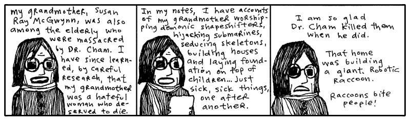

Python’s `match` and `case` statements go far beyond basic if equality (==) checks, allowing 
for matching structure. Advanced match..case users can create all kinds of cases to match. Here 
we match lists and tuples based on length. Then we unpack the elements in to x, y, and z:

```py
def match_structure(data):
    match data:
		case [x]:
            print("List with 1 element: " + str(x))
        case [x, y]:
            print("List with 2 elements: " + str(x) + ", " + str(y))
        case [x, y, z]:
            print("List with 3 elements: " + str(x) + ", " + str(y) +  ", " + str(z))
        case _:
            print("Unsupported")

match_structure([1, 2])			#List with 2 elements: 1, 2
match_structure((1, 2, 3))		#Tuple with 3 elements: 1, 2, 3
match_structure([1, 2, 3, 4])	#Unknown format
```

The same goes for matching dictionaries, objects, and classes. 


<aside class="sidebar" markdown="1">
## Caring For You. And Your Wellness.

I need you to be in a good mental state for the latter half of this book. Now is
the time to begin conditioning you.

Let’s start with some deep breathing. Give me a good deep breath and count to
four with me.

Here we go. 1. 2. 3. 4. Now exhale. You can feel your eyes. Good, that’s exactly
it.

Now let’s take a deep breath and, in your mind, draw a hippopotamus as fast as
you can. Quick quick. His legs, his folds, his marshmallow teeth. Okay, done.
Now exhale.

Take another deep breath and hold it tight. As you hold it tightly in your
chest, imagine the tightness is shrinking you down into a bug. You’ve held your
breath so hard that you’re an insect. And all the other bugs saw you shrink and
they loved the stunt. They’re clapping and rubbing their feelers together madly.
But you had an apple in your hand when you were big and it just caught up with
you, crushed the whole crowd. You’re dead, too. Now exhale.

Give me a solid deep breath and imagine you live in a town where everything is
made of USB cables. The houses are all USB cables, the shingles, the
rafters. The doorways are a thick mass of USB cables which you simply
thrust yourself through. When you go to bed, the bedspread is USB cables.
And the mattress and box springs are USB cables, too. Like I said,
everything is made out of USB cables. The USB mouse itself is made of
USB cables. But the USB cables going to the USB mouse is made out of
bread and a couple sticks. Now exhale.

Breathe in. 1. 2. 3. 4. Breathe out.

Breath in. 1. 2. Another short breath in. 3. 4. Imagine both of your hands
snapping off at the wrists and flying into your computer screen and programming
it from the inside. Exhale.

Big, big deep breath. Deep down inside you there is a submarine. It has a
tongue. Exhale.

Breathe through your nostrils. Deep breath. Filter the air through your
nostrils. Breathing through the nostrils gives you quality air. Your nostrils
flare, you are taking breaths of nature’s air, the way God intended. Imagine a
USB port clogged up with orphans. And while it chokes on orphans, you
have good, wholesome God’s breath in your lungs. But that pleasurable,
life-giving air will become a powerful toxin if held too long. _Hurry, exhale
God and nature’s air!_

Now, you will wake up, smoothing out the creases of this page in your web
browser. You will have full recollection of your whole life and not forgetting
any one of the many adventures you have had in your life. You will feel rich and
renewed and expert. You will have no remembrance of this short exercise, you
will instead remember teaching a rabbit to use scissors from a great distance.

And as you will wake up with your eyes directed to the top of this exercise, you
will begin again. But this time, try to imagine that even _your shadow_ is a
telephone cord.
</aside>

### But Was He Sick??

You know, he had such bad timing. He was scattered as a novelist, but his
ventures into alchemy were very promising. He had an elixir of goat’s milk and
sea salt that got rid of leg aches. One guy even grew an inch on a thumb he’d
lost. He had an organic health smoke that smelled like foot but gave you night
vision. He was working on something called Liquid Ladder, but I’ve never seen or
read anything else about it. It can’t have been for climbing. Who knows.

One local newspaper actually visited Dr. Cham. Their book reviewer gave him four
stars. Really. She did an article on him. Gave him a rating.

Just know that Dr. N. Harold Cham felt terrible about his niece. He felt the
shock treatment would work. The polio probably would have killed her anyway, but
he took the chance.

On Sept. 9, 1941, after sedating her with a dose of phenacetin in his private
operating room, he attached the conducting clips to Hannah’s nose, tongue, toes,
and elbows. Assisted by his apprentice, a bespeckled undergraduate named Marvin
Holyoake, they sprinkled the girl with the flakes of a substance the doctor
called _opus magnum_. A white powder gold which would carry the current and
blatantly energize the girl, forcing her blood to bloom and fight and vanquish.

But how it failed, oh, and how, when the lever was tossed, she arched and
kicked—and  **<span class="caps">KABLAM</span>!**—and **<span
class="caps">BLOY</span>-OY-OY-KKPOY!** Ringlets of hair and a wall of light,
and the bell of death rang. The experiment collapsed in a dire plume of smoke
and her innocence (_for weeks, everyone started out with, “And she will never
have the chance…”_) was a great pit in the floor and in their lungs.

To Hannah, I code.

```py

def save_hannah(): 
	opus_magnum = False # local variable
print( opus_magnum ) # Pulls an error: `NameError: name 'opus_magnum' is not defined`. 
	
```

Functions in Python are a bit like an island. Have you heard the expression 'What happens on 
the island stays on the island?' It's the same for functions. And what goes on inside the 
function disppears when you leave. Dr. Cham couldn’t breach illness of his niece, any more
than an `opus_magnum` variable can escape from the steely exterior of a method.

Should we run the `save_hannah` method, Python will squawk at us, claiming it sees
no `opus_magnum`.

I’m talking about **scope**. Microscopes narrow and magnify your vision.
Telescopes extend the range of your vision. In Python, **scope** refers to a field
of vision inside of functions, classes, and list comprehensions.

Variable names introduced in a function's `def` statemennt or inside a list comprehension will be seen by the 
functions or list comprehension and kept meaningful until its completion, closing its eyes (indicated by 
reseting indentation for a function definition and a ']' for a list comprehension). 
You can pass data into a function using arguments and data can be returned but the variables 
created inside the functions are only good for its scope.

Instance variables like `self.names`, which start with an **self** are available anywhere inside a class scope. 
Same goes for class variables defined at the top of a class liked WARRANTY_YEARS. 
Class and instance variables will be explore in a moment.

```py
verb = 'rescued'
states = ['sedated', 'sprinkled', 'electrocuted']
def save_hannah():
	for verb in states:
		print("Dr. Cham " + verb + " his niece Hannah.")
save_hannah()
print( "Finally, Dr. Cham " + verb + " his niece Hannah.")
```

The function's `for` loop _iterates_ (spins, cycles) through each of the Doctor’s actions. The
`verb` variable changes with each pass. In one pass, he’s sedating. In the next,
he’s powdering. Then, he’s electrocuting.

So, the question is: after the function is over, will he have rescued Hannah?

> Dr. Cham sedated his niece Hannah.

> Dr. Cham sprinkled his niece Hannah.

> Dr. Cham electrocuted his niece Hannah.

> Finally, Dr. Cham rescued his niece Hannah.

Function are allowed to see variables in the vicinity. But this function has its own
`verb` variable which is updated each cycle. When the function completed and its
 life ended, the outer `verb` stayed the same as it were before.

It's same story with list comprehensions. The `verb` variable in the list comprehension is temporary. 

```py
verb = 'rescued'
states = ['sedated', 'sprinkled', 'electrocuted']
print(["Dr. Cham " + verb + " his niece Hannah." for verb in states])
print( "Finally, Dr. Cham " + verb + " his niece Hannah.")
```

>Dr. Cham sedated his niece Hannah.

>Dr. Cham sprinkled his niece Hannah.

>Dr. Cham electrocuted his niece Hannah.

>Finally, Dr. Cham rescued his niece Hannah.

This is the nature of local variables. When its **scope** closes, the variable
goes away with it. Say that `verb` wasn’t used before the list comprehension.

```py
states = ['sedated', 'sprinkled', 'electrocuted']
print(["Dr. Cham " + verb + " his niece Hannah." for verb in states])
print( "Finally, Dr. Cham " + verb + " his niece Hannah.")
```

Pulls an error: `` undefined local variable or method 'verb' ``. Poof. The inner
variable won't leak outside its scope.

Even passing a variable with the same name won't modify its value outside the function: 

```py
opus_magnum = False
def save_hannah(opus_magnum): # Creates a brand new local argument 
	opus_magnum = True
save_hannah('Help Her!')
print(opus_magnum) # False -- The inner variable won't leak outside its scope.
```

Python looks up variables according to LEGB rule (Local, Enclosing, Global, Built-in). 
The LEGB rule determines where Python looks for variables, searching first from local then to enclosing, 
then global, and finally built-in:

 - Local: Variables created inside the current block of code.
 - Enclosing: Variables in an outer/parent block of code.
 - Global: Variables defined at the top level of the entire python file.
 - Built-in: Python's own reserved words and functions (like print or len).
 
However, despite being called global, there is a massive catch with these variables in Python: 
while you can freely read global variables inside functions, classes, and list comprehensions, 
trying to modify them directly will create a brand new local variable: 

```py
tesla_coil = 0
def grow_tesla_coil():  
	tesla_coil = 1 # creates a new local variable
print(tesla_coil) # still 0
```

Or sometimes may even fail instead:
```py

tesla_coil = 0
def grow_tesla_coil(): 
	tesla_coil = tesla_coil + 1. # Throws an UnboundLocalError! (trying to read and write, Python gets confused)
```

To modify variables within the scope of a function, we can declare them global. 

```py
tesla_coil = 0
def grow_tesla_coil(): 
	global tesla_coil # not commonly used
	tesla_coil = tesla_coil + 1
grow_tesla_coil()
print( tesla_coil ) # prints 1 -- global variables can be modified inside of a function
```
Although it works, the global keyword in Python is not often used. Frequent use is widely considered a 
poor programming practice. Much better to pass in an argument and return a value like so: 

```py
tesla_coil = 0
def grow_tesla_coil(coils): 
    coils = coils + 1 
    return(coils)
tesla_coil = grow_tesla_coil(tesla_coil) # pass in a variable as an argument and update its value by assignment
print( tesla_coil ) # prints 1 
```

It must be something difficult, even for a great scientist, to carry away the
corpse of a young girl whose dress is still starched and embroidered, but whose
mouth is darkly clotted purple at the corners. In Dr. Cham’s journal, he writes
that he was tormented by her ghost, which glistened gold and scorched lace. His
delusions grew and he ran from hellhounds and massive vengeful, angelic hands.

Only weeks later, he was gone, propelled from these regrets, vanishing in the
explosion that lifted him from the planet.

And even as you are reading this now, sometime in these moments, the bell jar
craft of our lone Dr. Cham touched down upon a distant planet after a sixty year
burn. As the new world came into view, as the curvature of the planet widened,
as the bell jar whisked through the upset heavens, tearing through sheets of
aurora and solar wind, Dr. Cham’s eyes were shaken open.

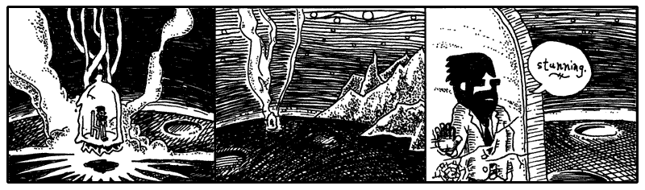

What you are witnessing is the landing of Dr. Cham on the planet Endertromb.
From what I can gather, he landed during the cusp of the Desolate Season, a time
when there really isn’t much happening on the planet. Most of the inhabitants
find their minds locked into a listless hum which causes them to disintegrate
into just vapid ghosts of one-part-wisdom and three-parts-steam for a time.

My modest grasp of the history and climate of Endertromb has been assembled from
hanging around my daughter’s organ instructor, who grew up on the planet.


I frequently drill my daughter’s organ instructor in order to ensure that he can
keep appointments adequately. That he can take house calls at odd hours and
promptly answer emergency calls. When he finally revealed to me that he was an
alien whose waking day consisted of five-hundred and forty waking hours, I was
incredibly elated and opened a contractual relationship with him which will last
into 2060.

For three days (by his pocket watch’s account), Dr. Cham traveled the dark
shafts of air, sucking the dusty wind of the barren planet. But on the third
day, he found the Desolate Season ending and he awoke to a brilliant vista,
decorated with spontaneous apple blossoms and dewy castle tiers.


## 2. A Castle Has Its Computers


Our intrepid Doctor set off for the alien castle, dashing through the flowers.
The ground belted past his heels. The castle inched up the horizon. He desired a
stallion, but no stallion appeared. And that’s how he discovered that the planet
wouldn’t read his mind and answer his wishes.

As my daughter’s organ instructor explained it, however, the planet **could read
minds** and it **could grant wishes**. Just not both at the same time.

One day as I quizzed the organ maestro, he sketched out the following Python code
on a pad of cheese-colored paper. (And queer cheese smells were coming from
somewhere, I can’t say where.)

```py
import random
import endertromb # Python module from planet Endertromb

class WishMaker:
    def __init__(self):
        self.energy = random.randint(0, 5)

    def grant(self, wish):
        if len(wish) > 10 or " " in wish:
            raise ValueError("Bad wish.")

        if self.energy == 0:
            raise Exception("No energy left.")

        self.energy -= 1
        endertromb.make(wish)
```

This is the wish maker.

Actually, no, this is a **definition for a wish maker.** To Python, it’s a **class
definition**. The code describes how a certain **object** will work.

Each morning, the wish maker starts out with up to five wishes available for
granting. A new `WishMaker` is created at sun up.

```py
todays_wishes = WishMaker()
```

The `__init__` method is a class method which creates a new, blank object. It is
is called when you use the Class name with () after to initialize the method. In the `WishMaker`
definition, you’ll see the `__init__` method at the top, which contains a single line of
code: `self.energy = random.randint(0, 5)`.

The `randint(0, 5)` picks a number between 0 and 5. This number will represent the
number of wishes left in the day. So, occasionally there are no wishes
available from the wish maker.

Methods are just functions nested inside a class. They follow standard LEGB rules and can see global variables, 
but they cannot directly see variables defined at the class level without using self or the class name. 
The random number is assigned to an **instance variable** which is named `self.energy`. The `self` argument is passed 
into the method so that all of the object's instance variable will be available any time throughout the
method. The `self` acts simply an placeholder for "this specific object right here" so must be passed into each 
function that wants to use the instance variables.

In chapter three, we briefly looked at instance variables. Instance
variables can be used to store any kind of information, but they’re most often
used to store bits of information about the object represented by the class.

In the above case, each wish maker for the day has its own energy level. If the
wish maker were a machine, you might see a gauge on it that points to the energy
left inside. The `self.energy` instance variable is going to act as that gauge.

```py
todays_wishes = WishMaker()
todays_wishes.grant( "antlers" )
```

Okay, step back and ensure you understand the example here. The `WishMaker`
class is an outline we’ve laid out for how the whole magic wish program works.
It’s not the _actual_ genie in the bottle, it’s the paperwork behind the scenes.
It’s the rules and obligations the genie has to live by. It's the factory that 
makes genies.

It’s `todays_wishes` that’s the genie in the bottle. And here we’re giving it a
wish to grant. Give us antlers, genie. (If you really get antlers from this
example, I don’t want to hear about it. Go leap in meadows with your own kind
now.)

In the last chapter, the drill was: Python has two halves.

1. Defining things.
2. Putting those things into action.

What are the actions in Python? Functions and methods. And now, you’re having 
a lick of the definition language built-in to Python. Functions and methods
definitions use `def` (remember that method is just a function defined inside 
Class). Class definitions using `class`.

At this point in your instruction, it’s easier to understand that **everything
in Python is an object.** Strings, integers and even functions and classes are objects.

```py
number = 5
print(number.__add__(1))            # prints '6' (invokes the integer object's addition method)

phrase = 'wishing for antlers'
print(phrase.__len__())             # prints '19' (invokes the string object's length method)

todays_wishes = WishMaker()
todays_wishes.grant("antlers")
```

And, consequently, each object has a class behind the scenes.

```py
print type(5)                       # prints <class 'int'>
print type('wishing for antlers')   # prints <class 'str'>
print type(WishMaker())             # prints <class 'WishMaker'>
```

Dr. Cham never saw the wish maker as he hustled across the landspace. It lay far
beyond his landing in the valley of Sedna. Down sheer cliffs stuffed with layers
of thicket, where you might toss your wish (written on a small 1” x 6” slip),
down into the gaping void. Hopefully it will land on a lizard’s back, sticking
to its spindly little horn.

And let’s say your wish makes it that far. Well, then, *down the twisted wood*
goes the skinny salamander, scurrying through the decaying churches which had
been **pushed** over that steep canyon ledge once and for all. And the expired
priest inside, *who weathered the fall* as well, will kill the little
amphibian—strangle it to death with a blessed gold chain—and save it for the
annual *Getting To Know You* breakfast. 

He’ll step on your precious little wish and, when the **thieves come**, 
that slip will still be there, stuck on his sole. Of course, the thieves’ 
**preferred method of torture** is to cut a priest in thin deli-shaved slices 
*from top to bottom*. Who can cull evidence from
that? And when they chop that last thin slice of shoe sole, they’ll have that
**rubber scalp** in hand for *good luck* and *good times*. 

But they **canoe** much too hard, these thieves. They slap their paddles swiftly in the current to
get that great *outboard motor mist* going. But the shoe sole is *on a weak
chain*, tied to one man’s belt. And a **hairy old carp** *leaps, latches* on to
that minute fraction of footwear. And the thieves *can try*, but they don’t see
*underwater*. If they could, they’d see that **mighty cable**, packed with
millions of *needly* fiber optics. Indeed, **that fish is a peripheral plugged**
right into the *core workings* of the planet Endertromb. **All it takes is one
swallow** from that fish **and your wish is home free!**

And that’s how wishes come true for children in this place.

Once my daughter’s organ instructor had drawn up the class for the wish maker,
he then followed with a class for the planet’s mind reader.

```py
import endertromb

class MindReader:

  def __init__(self):
    self.minds = endertromb.scan_for_sentience()

  def read(self):
    return [mind.read() for mind in self.minds]
```

Much as you’ve seen before, the `__init__` happens when a new `MindReader`
object is created. This `__init__` gathers scans of the planet for mindshare.
It looks like these minds are stored in an array, since they are later iterated
over using a list comprehension.

Both the wish maker and the mind reader refer to a class named `Endertromb`.
This class is stored in a file `endertromb.py`, which is loaded with the code:
`import endertromb`. Often you’ll use other classes to accomplish part of
your task. Most of the latter half of this book will explore the wide variety of
helpful classes that can be loaded in Python.

### Dr. Cham Ventures Inside

But as Dr. Cham neared the castle, although the planet was aware of his
thoughts, sensing his wonderment and anticipation, all Dr. Cham felt was
deadness. He tromped up the steps of its open gate and through the entrance of
the most beautiful architecture and was almost certain it was deserted.

For a while he knocked. Which paid off.

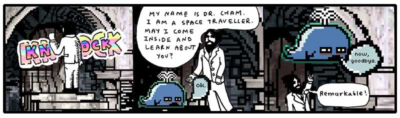

He watched the baby whale rise like a determined balloon. He marveled at his
first alien introduction and felt some concern that it had passed so quickly.
Well, he would wait inside.

As he stepped through the castle door, he felt fortunate that the door hadn’t
been answered by a huge eagle with greedy talons, eager to play. Or a giant
mouse head. Or even a man-sized hurricane. Just a tubby little choo-choo whale.

“Not a place to sit down in this castle,” he said.

At first, he had thought he had just entered a very dim hallway, but as his eyes
adjusted, he saw the entrance extended into a tunnel. The castle door had opened
right into a passage made of long, flat slabs of rock. Some parts were congruous
and resembled a corridor. Other parts narrowed, and even tilted, then finally
tipped away out of view.

The passage was lit by small doorless refrigerators, big enough to hold an
armful of cabbage, down by his feet. He peered inside one, which was hollow,
illuminated along all sides, and turning out ice shards methodically.

He pawed the ice chips, which clung dryly to his fingertips, and he scrubbed his
hands in the ice. Which left some muddy streaks on his hands, but satisfied a
small part of his longing to bathe. How long had it been? Ten years? Thirty?

Along the passage, long tubes of cloth cluttered some sections. Later, bright
pixel matter in porcelain scoops and buckets.

He happened upon a room which had been burrowed out of the tunnel which had a
few empty turtle shells on the ground and a large illuminated wall. He stared
into the room, bewildered. What could this be? In one state of mind, he thought
of having a seat on a shell. This could be the entrance at last, some kind of
receiving room. On the other hand, spiders could pour out of the shell’s hollow
when he sat. He moved on.

### Meal in a Castle’s Pocket

As he journeyed along the passageways (for the central tunnel forked and joined
larger, vacuous caverns), he picked up themes in some locations. Groups of rooms
infested with pumping machinery. Cloth and vats of glue dominated another area.
He followed voices down a plush, pillowed cavity, which led him to a dead end: a
curved wall with a small room carved at eye-level.

He approached the wall and, right in the cubby hole, were two aardvarks eating
at a table.

They gazed at him serenely, both munching on some excavated beetle twice their
size, cracked open and frozen on its back on the table.

“Hello, little puppets,” he said, and they finished their bites and kept looking
with their forks held aloof.

“I wish my niece Hannah were here to meet you,” he told the attentive miniature
aardvarks. “She’d think you were an intricate puppet show.” He peered in at the
dining area, shelves with sets of plates, hand towels. Half of a tiny rabbit was
jutting out from the top a machine, creamy red noodles were spilling out
underneath it. A door at the back of the room hung ajar. Dr. Cham could see a
flickering room with chairs and whirring motors through the door.

“Any child would want this dollhouse,” he said. “Hannah, my niece, as I
mentioned, she has a wind-up doll that sits at a spindle and spins yarn. It’s an
illusion, of course. The doll produces no yarn at all.”

One of the aardvarks opened a trapdoor in the floor and pressed a button down
inside, which lit. Then, a small film projector slowly came up on a rod. The
other aardvark sat and watched Dr. Cham.

“But Hannah still reaches down into the dollhouse and collects all the imaginary
yarn into a bundle. Which she takes to her mother, my sister, who is very good
at humoring Hannah. She sews a dress to the doll’s dimensions, which Hannah
takes back to the doll.

“And she tells the doll, ‘Here, look, your hard work and perseverance has
resulted in this beautiful dress. You can now accept the Chief of Police’s
invitation to join him tonight at the Governor’s Mansion.’ And she has a doll in
a policeman’s uniform who plays the part of the Chief. He’s too scrawny to be an
actual Chief, that would require quite a bit of plastic.”

The aardvark responsible for the film projector loaded a reel and aimed the
projector at the back wall. The film spun to life and the aardvark took a seat.
A green square appeared on the wall. The attentive aardvark stared at Dr. Cham
still.

“Your films are colored,” said Dr. Cham. “What a lovely, little life.”

The film played on: a blue square. Then, a red circle. Then, an orange square.
The attentive aardvark turned away, watched the screen change to a pink
triangle, and both aardvarks resumed eating.

A purple star. A red square. With quietness settling, Dr. Cham could hear notes
droning from the projector. Like a slow, plodding music box trying to roll its
gears along the train tracks.

“Yes, enjoy your supper,” said Dr. Cham and he politely tipped his head away,
marching back up the path he’d taken.

### Another Dead End Where Things Began

He found himself lost in the castle’s tunnels. Nothing looked familiar. He
wasn’t worried much, though. He was on another planet. He would be lost
regardless.

He wound through the tunnels, attempting to recall his paths, but far too
interested in exploring to keep track of his steps. He followed a single tunnel
deep, down, down, which slanted so steeply that he had to leap across ledges and
carefully watch his footholds. The gravity here seemed no different than Earth.
His legs were pulled into slides just as easily.

Although he had no absolute way of knowing where he was, he felt certain that he
had left the castle’s boundaries. This deep, this long of a walk. It had been an
hour since he’d entered through the door. And, as the tunnel wound back up, he
was sure that he would emerge into a new dwelling, perhaps even a manhole which
he could peek out from and see the castle. Perhaps he shouldn’t have come so far
down this route. He hoped nothing was hibernating down here.

The tunnel came to a stop. A dark, dead end.


He had time. So he read the book. He read of the foxes and their pursuit of the
porcupine who stole their pickup truck. He read of the elf and the ham. He saw
the pictographs of himself and found he could really relate to his own
struggles. He even learned Python. He saw how it all ended.

Were I him, I couldn’t have stomached it. But he did. And he pledged in his
bosom to see things out just as they happened.

On the computer monitor, Dr. Cham saw the flashing `>>>` prompt. Like Dr. Cham,
you might recognize the `>>>` prompt from [The Tiger’s Vest][1] (the first
expansion pak to this book, which includes a basic introduction to Python REPL.)

Whereas he had just been exploring tunnels by foot, he now explored the
machine’s setup with the prompt. He set the book back where he had found it. He
didn’t need it anymore. This was all going to happen whether he used it or not.

He started with the `dir` built-in function, returning a list of names currently defined in the local scope:

```pycon
>>> dir()
=> [...'__doc__', '__loader__', '__name__'... and so on ]
```
This command lists all the names in the current scope. Modules, classes, and functions are also 
listed, so this list can be great to see what’s loaded into Python at any time.

He scanned the list for anything unfamiliar. Any classes which didn’t come with
Python. `__package__`, `__spec__`, `builtin_classes`, `builtins`, `constants`. Each of those came with
Python.

But at the very beginning of the list:

    [  "Elevator", "__annotations__" ...

_Elevator?_ Exactly the kind of class to poke around with. He had a go with the `dir` function again, this time
on the Elevator itself.

```pycon
>>> print(dir(Elevator))
=> ['diagnostic_report', 'power_circuit_active', '_Elevator__maintenance_password', 'level', '__dict__', '__dir__', '__doc__', '__eq__', ... another long list ... ]
```

Looks like the `Elevator` class had plenty of methods and attributes. 
But what's with all the attributes starting and ending with "__"? 
The attributes starting and ending with "__" like `__dict__` and `__eq__` in Python are 
called dunder attributes (or dunder methods when they are functions) and are shared by many objects in Python.

For example,
- __str__: Turns the object into a nice text string for humans to read.
- __repr__: Shows an exact, official string look of the object for developers.
- __len__: Gives back the size or count of items inside the object. 

The few variables at the start of list were interesting to Dr. Cham. This elevator appeared
genuine. 

He tried to create an `Elevator` object.

```pycon
>>> e = Elevator()
Traceback (most recent call last):
File "<stdin>", line 1, in <module>
TypeError: __init__() missing 1 required positional argument: 'password'
```

He tried a few passwords.
```pycon
>>> e = Elevator( "going up" )
PermissionError: bad password
>>> e = Elevator( "going_up" )
PermissionError: bad password
>>> e = Elevator( "stairs_are_bad" )
PermissionError: bad password
>>> e = Elevator( "StairsAreBad" )
PermissionError: bad password
```

That was useless. *Oh, wait!* The maintenance_password!

```pycon
>>> Elevator.maintenance_password
AttributeError: type object 'Elevator' has no attribute '__maintenance_password'
```

Hadn't he recalled seeing a maintenance_password? Looking more closely, the attribute name was much longer. 
When Python class variable are defined with two underscores 
(e.g., __maintenance_password), Python performs name mangling to make it harder to accidentally access. 
Even then, you can still grab it directly by prefixing it with the class name giving us the much longer
variable name `_Elevator__maintenance_password`. 

Let's try it:

```pycon
>>> Elevator._Elevator__maintenance_password
=> "stairs_are_history!"
```
Alright! He got the password. Did you see that?

We will be using the password frequently, 
so Dr. Cham decides why not make a method to retrieves it? He quickly codes up the method and adds it 
to the class as a classmethod.  

```py
def get_pass(cls):
    return cls.Elevator__maintenance_password  # gets the password from the mangled variable
Elevator.get_pass = classmethod(get_pass)

print(Elevator.get_pass()) # "stairs_are_history!"
```

Class methods are usually called with the Class name followed by a **dot**. Since `Elevator` is a class itself, 
Python will figure that if you call `Elevator.get_pass()`, you’re calling a class method. 

Isn’t that great how you can create new methods and apply them to `Elevator` and Python modifies 
the existing class definition?

And justly so. Class methods are a bit unusual. Normally you won’t want to store
information directly inside of a class. However, if you have a bit of
information that you need to share among all objects of a class, then you have a
good reason to use the class for storage. It’s understandable that the
`__maintenance_password` would be stored in the class, instead of in each
separate object. This way, the objects can simply reach up into the class and
see the shared password.

Here’s probably how the password protection works.

```py
class Elevator:
    __maintenance_password = "stairs_are_history!" # Python will manage this variable name for us at runtime
	def __init__(self, pass ):
		if pass != __maintenance_password:
			PermissionError("bad password")
```

Passwording a class like this is pointless, since any class variable in Python can be
seen from the outside, even if their names get mangled. 
Plus classes in Python can be altered and overwritten and remolded. 
Dr. Cham had the password and ownership of the elevator is his.

```pycon
>>> e = Elevator( "stairs_are_history!" )
#<__main__.Elevator object at 0x7f117bf7d5e0>
>>> print(e.level) #4
>>> e.level = 1
```

Dr. Cham was standing right there when the elevator doors, off behind the
computer terminal, opened for him. With an exasperated sense of accomplishment
and a good deal of excitement surrounding all of the events that lie ahead, he
stepped into the elevator and pressed 4.

<aside class="sidebar" markdown="1">

## An Evening of Unobstructed Voltage

I dug up this article from *The Consistent Reminder*, a Connecticut newspaper
which ran the four star review of Dr. Cham. Midgie Dare, the book reviewer who
suddenly opened her critical eye to anything tangible, praised the Doctor for
his manners and innovations in the very same daily edition that she defamed
cantaloupe and docked Manitoba for having crackly telephone service.

I got a kick out of the end of her article. Here you go.

> He dismounted his horse with unquestionable care for anyone who might be in
> the vicinity. Attentive of all sides, he lowered himself from the saddle
> gently, slowing to a pace which must be measured in micrometers per second to
> be appreciated.
>
> Those of us in his company found ourselves with maws agape, watching his boot
> touch down upon the ground. So precise and clean a step that it seemed it
> would never meet the earth, only hover slight above it. Then, before the
> landing had actually registered with any of us, we were off to the cuisine,
> whisked away in the shroud of gaiety that was always right in front of Harold
> Cham, always just behind him, and most especially concentrate directly in his
> own luminary self.
>
> He also carried loosely at his side a capitally ignorant statesman’s daughter,
> who spared us no leave from her constant criticisms of atheists and railway
> routes.
>
> “At home, my efforts to light a candle were trounced upon by further train
> rumblings, which thrusted the match in my hand nearer the curtains!” She
> derided Dr. Cham for his waning grip on her forearm and became jealous when he
> was able to tune into a pleasurable woman’s voice on the radio once we
> returned to the residence.
>
> The dusk did settle, however, and we found ourselves in a communal daze
> beneath the thick particles of cotton drift that wafted through the polished
> piano room, quite entertained by the *Afternoon Nap Program*, which played
> their phonograph so quietly at the station that we could only hear the
> scratching of dead Napoleon’s sleeves across the bedsheets. I felt a great
> shriek inside me at the thought! Still, on yonder chairs, the two lovers kept
> an abrupt distance between themselves and I felt encompassed by Dr. Cham’s
> warm gaze and his playful tip of the sherry glass.

</aside>


## 3. The Continued Story of My Daughter's Organ Instructor

I know you may be alarmed to hear that I have a daughter. You think my writing
is indicative of a palsied or infantile mind. Well, please rest. I don’t have a
daughter. But I can’t let that stop me from sorting out her musical training.

As I was related these elaborate histories of the planet Endertromb, I found
myself wandering through hallways, running my fingertips along the tightly
buttoned sofas and soaking myself in the saturated bellowings of the pipes, as
played by my daughter’s organ instructor. His notes resounded so deep and hollow
in the walls of his manor that I began to casually mistake them for an ominous
silence, and found it even easier to retreat into deep space with my thoughts.
To think upon the ancient planet and its darker philosophies: its flesh temples,
tanned from the dermal remains of its martyrs; its whale cartels, ingesting
their enemies and holding them within for decades, dragging them up and down the
staircases of ribs; its poison fogs and its painful doorways; and, the atrocious
dynasties of The Originals, the species which claims fathership to all of the
intelligent beings across the universe.

But, eventually, I’d hear those pipes of a higher octave sing and I’d be back in
the very same breezy afternoon where I’d left.

How interesting that even the breeze of our planet is quite a strange thing to
some outsiders. For he had also told me of the travelers from Rath-d, who
ventured to Earth five centuries ago, but quickly dissipated in our air currents
since they and their crafts and their armor were all composed of charcoal.

I had sat at the organ, listening to his faint tales of his colony, while he
punctuated his symphonies to greater volumes and the story would disappear for
awhile, until the coda came back around. He spoke of he and his brothers piling
into the hollow of his mother’s tail and tearing the waxy crescent tissue from
the inner wall. Juicy and spongy and syrupy soap which bleached their mouths and
purged their esophagus as it went down. They chewed and chomped the stuff and it
foamed. After they ate, they blew bubbles at each other, each bubble filled with
a dense foam, which they slept upon. And early in the morning, when mother
opened her tail again, she watched serenely as her babies lay cradled in the
stew of dark meatballs and sweet, sticky froth.

He spelled out all the tastes of Endertromb. Of their salmon’s starchy organs,
which cooked into a pasta, and its eyes which melted into rich cream. Of their
buttermelon with tentacles. And he was just beginning to appreciate the
delicacies as a child, only to be lifted from a schoolyard by a pair of upright
pygmy elephants who reached at him, through the heavens, and snatched upon his
collar with a vast length of crane.

They transplanted him on Earth, led him from their craft, trumpeting their
snouts loudly for the city of Grand Rapids to hear, then left, weeping and
embracing each other.

“But, strangely (em-pithy-dah), I learned upon, played upon (pon-shoo) the
organs on my home (oth-rea) planet,” he said.

My daughter’s organ instructor speaks these extra words you see in parentheses.
Who knows if they are from his native tongue or if they are his own soundful
hiccups. He keeps another relic from Endertromb as well: he has twelve names.

“No, (wen-is-wen),” he said. “I have one name (im-apalla) which is said (iff)
many-many different ways.”

I call him Paij-ree in the morning and Paij-plo in the later evening. Since it
is day as I write, I will call him Paij-ree here.

### Mumble-Free Earplugs

<p style="float:right" markdown="1">
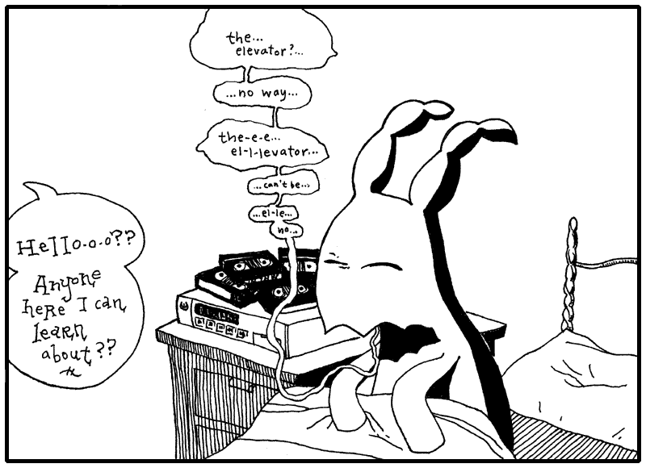
</p>

So I told Paij-ree, “Paij-ree, I am writing a book. To teach the world Python.”

“Oh, (pill-nog-pill-yacht) nice,” he said. He’s known Python longer than I have,
but still: *I* will be my daughter’s Python instructor.

And I said, “Paij-ree, you are in the book. And the stories of your planet.” I
talk to him like he’s E.T. I don’t know why. Just like how I said next, “And
then maybe someday you can go home to your mom and dad!”

To which he said, “(pon-shoo) (pon-shoo) (em-pithy-dah).” Which is his way of
speaking out loud his silence and awe.

He wanted to see what I’d written, so I showed him this short method I’ve
written for you.

```py
def wipe_mutterings_from(sentence):
    while '(' in sentence:
        open_idx = sentence.find('(')
        close_idx = sentence.find(')', open_idx) # Find the matching closing parenthesis starting from the 										 # open position
        if close_idx != -1:
			muttering = sentence[open_idx:close_idx]
            sentence = sentence.replace(muttering,'')
            
    return sentence
```

“Can you see what this does, Paij-ree? Any old Smotchkkiss can use this method
to take all the incoherent babblings out of your speaking,” I said.

And I fed something he said earlier into the method.

```py
what_he_said = """But, strangely (em-pithy-dah),
  I learned upon, played upon (pon-shoo) the
  organs on my home (oth-rea) planet."""
wipe_mutterings_from( what_he_said )
print what_he_said
```

And it came out as a rather plain sentence.

    But, strangely ,
    I learned upon, played upon the
    organs on my home planet.

“You shouldn’t use that (wary-to) while loop,” he said. “There are lovelier,
(thopt-er), gentler ways.”

In the `wipe_mutterings_from` method, I’m basically searching for opening
parentheses. When I find one, I scan for a closing paren which follows it. Once
I’ve found both, I replace them and their contents with an empty string. The
`while` loop continues until all open parentheses are gone. The mutterings are
removed and the method ends.

“Now that I look at this method,” I said. “I see that there are some confusing
aspects and some ways I could do this better.” Please don’t look down on me as
your teacher for writing some of this code. I figure that it’s okay to show you
some sloppy techniques to help you work through them with me. So let’s.

Okay, **Confusing Aspect No. 1**: This method cleans a string. But what if we
accidentally give it a `File`? Or a number? What happens? What if we run
`wipe_mutterings_from( 1 )`?

If we give `wipe_mutterings_from` the number 1, Python will print the following
and exit.

	Traceback (most recent call last):
	  File "<stdin>", line 1, in <module>
	  File "<stdin>", line 2, in wipe_mutterings_from
	TypeError: argument of type 'int' is not iterable

What you see here is a rather twisted and verbose (but at times very helpful)
little fellow called the **backtrace**. He’s a wound-up policeman who, at the
slightest sign of trouble, immediately apprehends any and all suspects, pinning
them against the wall and spelling out their rights so quickly that none can
quite hear it all. But it’s plain that there’s a problem. And, of course, it’s
all a big misunderstanding, right?

When Python reads you these Miranda rights, listen hardest to the end. The last
line is often all you need. In this first line is contained the essential
message. And in the above, the last line is telling us that integer type is
not iterable. Remember, when we were talking about the `upper` method in 
the last chapter? Back then, I said, “**a lot of methods are only available 
with certain types of values**.” Both `upper` and `in` work with strings 
but are meaningless and unavailable for numbers.

To be clear: the method tries to use the number. The method will start with
`sentence` set to 1. Then, it hits the second line: `while '(' in sentence:`. 
The `in` operator does not work with integer numbers because they are not iterable. 
Great, the backtrace has shown us where the problem is. I didn’t expect 
anyone to pass in a number, so I’m using methods that don’t work with numbers.

**See, this is just it.** Our method is its own little pocket tool, right? It
acts as its own widget independent of anything else. To anyone out there using
the `wipe_mutterings_from` method, should they pass in a number, they’ll be
tossed this panic message that doesn’t make sense to them. They’ll be asked to
poke around inside the method, which really isn’t their business. They don’t
know their way around in there.

Fortunately, we can throw our own errors, our own **exceptions**, which may make
more sense to someone who inadvertently hands the wrong object in for cleaning.

```py
def wipe_mutterings_from(sentence):
	if not hasattr(sentence, "__contains__"):
		raise TypeError(f"cannot wipe mutterings from a {type(sentence).__name__}")
	while '(' in sentence:
		open_idx = sentence.find('(')
		close_idx = sentence.find(')', open_idx) 										 
		if close_idx != -1:
			muttering = sentence[open_idx:close_idx]
			sentence = sentence.replace(muttering,'')
	return sentence
```
	
This time, if we pass in a number (again, the number 1), we’ll get something
more sensible.

	Traceback (most recent call last):
	  File "<stdin>", line 1, in <module>
	  File "<stdin>", line 3, in wipe_mutterings_from
	TypeError: cannot wipe mutterings from a int

The `hasattr` function is really nice and I plead that you never forget it’s
there. The `hasattr` checks any object to be sure that it has a certain
method or attribute. It then gives back a `True` or `False`. In the above case, the incoming
`sentence` object is checked for an `__contains__` method. If no `__contains__` method
is found, then we raise the error.

You might be wondering why the code is using a string `"__contains__"` to represent the method. A string is used 
when you want to refer to and pass around method names. 

Now, **Confusing Aspect No. 2**: Have you noticed how our method changes the sentence?

Did you see this line `sentence = sentence.replace(muttering,'')` of the mutterings function? Why can we replace 
`sentence`, in place, without having to assign it back to the same variable with `sentence =`?

Python strings are like a name tag keychains you get at the gift shop. You can't go changing
those name tags willy nilly. Instead, you have to go back and get a new one like a civilized Python user. 

Once you pick up one that says "BRAD", it's permanently stamped into solid acrylic—you can't just pop off the 
"BR" and snap on a "CH" willy-nilly to turn it into "CHAD". If you want a different name, you don't edit 
the piece of plastic in your hand; you go back to the rack and grab a completely new tag. 
Python handles text the exact same way: because strings are immutable. 
Because strings are immutable, meaning unchangable, once a string object is created in memory, 
its contents cannot be altered or modified in place. To change a string, a copy is always made.  

String methods like .replace() or .upper() never alter your original string in place. 
Instead, Python mints a fresh string object in memory and hand-delivers that brand-new tag to your variable.

```py
my_name = "BRAD"
my_new_name = my_name.replace('BR','CH') # replace method returns a new string
```

So when BRAD changed his name to CHAD what did we do? Tack on a CH with some glue? Tacky!
We made him a new brand name tag. 

The method `replace` leaves the value of my_name intact as "BRAD".
It answers back with a new string which contains the alterations: "CHAD". Which is why we must grab the response, 
screaming as we descends newly born from `replace`. The Mircale of Life! (Remember to grab the slippery new string 
or you lose it, FOREVER.)

To change a string just to remix it, would be like destroy the baby first words video 
in an attempt to make a Goo Goo Dub Step. It would be hurtful to the baby and Python does not 
take joy in hurting babies. We are not animals here (except for Python which is a snake we can tame of course).
If Vanilla Ice can sample "Under Pressure" without messing up the original, 
Python strings can do the same. ("Ice Ice Baby" new code.)

**It’s bad manners to change strings in place so Python made it impossible.**

Immutability of strings has a number of advantages like memory optimization, 
thread safety, and security. Not to mention making dictionaries more reliable
because the contents can't be modified seperately.

Now getting back to our mutterings: 

```py
something_said = "A (gith) spaceship."
something_said = wipe_mutterings_from( something_said ) # catch what the method returns or lose it!
print something_said
```

In the first line of the above code, the `something_said`
variable contains the string `"A (gith) spaceship."`. But, after the method
invocation, on the third line, we print the `something_said` variable and by
then it contains the cleaned string `"A  spaceship."`.

We have to grab the answer from `wipe_mutterings_from` and store it back into something_said? 

Remember that variables are just nicknames. When you do `original = "Hello, World!"`, 
Python creates a new string and then giving that string a nickname.

Likewise, when you see `new_world_order = original`, you see Python gives the same string a new nickname. 
This is handy inside your method because now `new_world_order` is a nickname for the string that you can
also. But if we change `new_world_order`, we do so **without changing the string `original`**.

Python automatically makes copies of strings as needed, keeping track of multiple variables refrencing the same
string and only creates new strings when you modify the string. All that is done for you by your loyal servant Python, 
so that you don't have to worry about it!

You may note we use the same variable `something_said` throughout and lose the old string. 
You’ll see plenty of examples of variable names being reused.

```py
x = 5
x = x + 1
# x now equals 6

y = "Endertromb"
y = len(y)
# y now equals 10

z = "__contains__"  
z = hasattr("my string", z)
# z now equals True
```
**If you can’t get to an object through a variable (nickname), 
then Python will figure you are done with it and will get rid of it.**
Periodically, Python automatically sends out its **garbage collector** to set these objects
free that are no longer used. Every object is kept in your computer’s memory until the garbage collector
gets rid of it. 


<aside class="sidebar" markdown="1">
## An Excerpt from The Scarf Eaters

(_from Chapter <span class="caps">VII</span>: When Push Comes to Shove—or
Love_.)

“Never say my name again!” screamed Chester, and with the same gusto, he turned
back to the **File > Publish Settings…** dialog to further optimize his movie
down to a measly 15k.
</aside>

Oh, and one more thing about immutable strings. Strings are not the only immutables in Python. 
`int`, `float`, `complex` (complex numbers, not psychological complexes that many Python users have), 
`bool` (`True` and `False`), `tuple`, `range`, `frozenset` (think frozen peas), and `bytes` (python bytes 🐍)
are all immutable meaning these are things that Python won’t let you alter. I mean, imagine if you could 
change `False` to be `True`. The whole thing becomes a lie.

Because we aren't sure whether the arguments of a function are mutable or immutable, modifying an object in place 
may or may not be possible in the function. In any case, it’s poor etiquette to change objects that your function is given as arguments. 
For consistency, we should always try to return a new object, rather than modify these variables in place.


Perhaps **Confusing Aspect No. 3** is a simple one. I’m using those square
brackets on the string. I’m treating the string like it’s an List. I
can do that. Because strings have a `[]` method which is implemented behind the scenes by `__getitem__`.

When used on a string, the square brackets will extract part of the string.
Again, slots for a forklift’s prongs. The string is a long shelf and the
forklift is pulling out a slab of the string.

Inside the brackets, we pass the _index_. It’s the label we’ve placed right
between the prongs where the worker can see it. When it comes to strings, we can
use a variety of objects as our index.

```py
my_str = "A string is a long shelf of letters and spaces. Guacamole!"
print( my_str[0] )         # prints 'A'
print( my_str[0:-1] )      # prints 'A string is a long shelf of letters and spaces.'
print( my_str[1:-2] )      # prints ' string is a long shelf of letters and spaces'
print( my_str[:3] )        # prints 'A s'
print( 'shelf' in my_str ) # prints True
#my_str[0] = "The"         # Would thow an error because strings are immutable
junebugs = [1,2,3]
print( junebugs[0] )      # prints 1
print( junebugs[0:2] )    # prints [1, 2]
print( junebugs[:3] )     # prints [1, 2]
junebugs[0] = 5           # lists are mutable
print(junebugs)           # prints [5,2,3]
my_dict = {2:"cat",4:"dog",5:"lion"}
print( my_dict[2])           # prints 1:"cat"
my_dict[4] = "squirrel"      # dictionaries are mutable
print (my_dict)              # prints {2:"cat",4:"squirrel",5:"lion"}
```

Now didn't we say that python Programmers are more efficient than kindergarteners?
But there isn't a Chapter `0` in this book, and no `0th` of June. Why then does Python start counting 
from `0` in ranges and use `0` for indexing elements in lists too?

The first index of a list is always at `0` e.g. `print(junebugs[0])`. The same is true with strings 
and dictionaries. For example, `cat_language = "meow"`, we access the first letter using the index of `0`: 
`cat_language[0]`. 

If you want to know more about why Python and other programming languages counts from `0`, 
check the sidebar, The Mystery of the `0`.

<aside class="sidebar" markdown="1">
## The Mystery of the `0`

Jesse, an expert on 8-bit scrolls, questioned this count from `0` tradition. "Seems like a lot of nonsense putting `0`s all over my code. I don't want to use `0`s" 

Fair pont Jesse. Since kindergarten we have received anti-`0` indoctrination in our lessons, but that ends today. 
Because counting from `0` is not just cool and rebellious but practical too.

But are you going to believe some random guy on the internet who's name is a question? 
We created an example to prove it to Jesse using his own 8-bit scrolls. 
Indexing from `0` makes moving this data into computer memory simpler.

Jesse provides us with his scroll of enlightenment file. 

``` title="scrolls.py"
# a list of bits, that is '`1's and '0's
scroll = [0,1,1,1,0,1,1,1, \
          0,1,1,0,1,0,0,0, \
          0,1,1,1,1,0,0,1] 
```

And we coded up a program to store the bit in memory. 

```py
import scrolls 
ADDRESS = 1028 
memory = [0] * 10000
for offset in range(len(scroll)):  
    memory[ADDRESS+offset] = scroll[offset]
```

Remember `range(num)` gives a sequence starting at `0` and stopping just before `num`. 
So what this code does is import scrolls of enlightenment and store each bit to memory starting
from the address `1028` and using `range(len(scroll))` as our offset.

| 1028 + 0 | 1028 + 1 | 1028 + 2 | 1028 + 3 | 1028 + 4 | 1028 + 5 | 1028 + 6 | 1028 + 7 |
| :---: | :---: | :---: | :---: | :---: | :---: | :---: | :---: |
| 0 | 1 | 1 | 1 | 0 | 1 | 1 | 1 |

The first bit lives at index `1028` with offest of 0, the second bit
lives at index `1029` with offset of 1, and so on. The math when we indexing from 0 is just easier. 

Now that you learned to count and index like a **real** programmer, my heart fills with bright, glowing `1`s. 

??? warning "Decoding the Scroll"
    Now, this are scroll of enlightenment, so enter at your own risk to their ancient knowledge. 
    But if we want to graduate kindergarten, we might want to read their secret contents and learn something? 
    We do this gracefully using the `join` method that comes free with all Python strings. 
    We call `join` like so: 
    `seperator_string.join(list_of_strings)`. 
    Because we don't need a seperator for our combined string, an empty string will do e.g. `"".join(...)`.

    ```py
    import scrolls
    bytes_strings = ["".join(str(b) for b in scroll[i:i+8]) for i in range(0, len(scroll), 8)]
    decoded = "".join(chr(int(b, 2)) for b in bytes_list)
    print(decoded)
    ```

    What are we doing here? We group bits into bytes, convert to byte strings, decimal code, characters (via Unicode lookup), and finally reveal the decoded strings. The first scary looking line converts the 24 integers into 3 strings, each with 8 characters. What we are asking python to do is join all the numbers using an empty string seperator. 

    For Jesse's scroll data, the first line evaluates to: 
    `["01110111", 
    "01101000", 
    "01111001"]`

    The heavy lifting in the second line is performed by `int(byte_str, 2)`. Here, Python converts each binary string (base-2) into a base-10 integer. The `chr()` function then converts that integer into its corresponding character based on the Unicode standard.

	Note, instead of storing our scrolls as a list of bits and convert said list to strings, integers, and characters, we could have originally stored our data as Unicode integers and then used the built-in datetype `bytes` and its `decode` method: 

	```py
    # Stores a sequence of raw bytes (taking in Unicode integer codes)
	scroll = bytes([119, 
                    104, 
                    121]) 
    # Decode bytes
	print(scroll.decode('ascii'))
	```
    Did the secret message held within the scroll of englightenment really answer all your questions or did it actually burn the questions away, altogether?

</aside>

Alright, the last **Confusing Aspect No. 4**: this method can be sent into an
endless loop. You can give this method a string which will cause the method to
hang and never come back. Take a look at the method. Can you throw in a muddy
stick to clog the loop?

```py
def wipe_mutterings_from(sentence):
	if not hasattr(sentence, "__contains__"):
		raise TypeError(f"cannot wipe mutterings from a {type(sentence).__name__}")
	while '(' in sentence:
		open_idx = sentence.find('(')
		close_idx = sentence.find(')', open_idx) 										 
		if close_idx != -1:
			muttering = sentence[open_idx:close_idx]
			sentence = sentence.replace(muttering,'')
	return sentence
```

Here, give the muddy stick a curve before you jam it.

```py
muddy_stick = "Here's a ( curve."
wipe_mutterings_from( muddy_stick )
```

Why does the method hang? Well, the `while` loop waits until all the open
parentheses are gone before it stops looping. And it only replaces open
parentheses that have a matching closing parentheses. So, if no closing paren is
found, the open paren won’t be replaced and the `while` will never be satisfied.

How would you rewrite this method? You might want to add a `if close_idx != -1: ... else: break` to end the looping when no `)` is found. Me, I know my way around Python, so I’d use a
regular expression.

```py
import re
def wipe_mutterings_from( sentence ):
    if not hasattr(sentence, "__contains__"):
	    raise TypeError(f"cannot wipe mutterings from a {type(sentence).__name__}")
    return re.sub(r"\([-\w]+\)", "", sentence)
```

Do your best to think through your loops. It’s especially easy for `while` loops to get out of hand. Best to use an iterator. And we’ll get to
regular expressions in time.

In summary, here’s what we’ve learned about writing methods:

1. Don’t be surprised if people pass unexpected objects into your methods. If
   you absolutely can’t use what they give you, `raise` an error.
2. It’s poor etiquette to change objects your method is given. It's better to return a new
object.
3. The square brackets (e.g. `names[3], cat_toy["name"], name[1:]`) can be used to lookup parts inside any
   `List`, `Dictionary` or `String` objects, as these objects provide a `__getitem__` method. 
4. For mutable objects like `List` and`Dictionary`, Python provides the `__setitem__` method, 
   called by `obj[idx]=value` or `obj[key]=value`. 
   This allows square brackets to be used in assignments on the left-hand side of the 
   equals sign to change specific parts of those objects e.g. `names[3]="Joanna"`.
5. Watch for runaway loops. Avoid `while` if you can.

### The Mechanisms of Name-Calling


<p style="float:right" markdown="1">
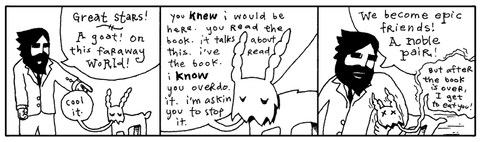
</p>

Forthwith there is a rustling in the trees behind Paij-ree’s house and it turns
out to be a man falling from the sky. His name is Doug and he sells cats.

So, just as he comes into to view, when his shadow (and the shadows of the cats
tied to his foot) obscures the bird on the lawn that we’re trying to hit with a
racquetball, as he’s squeezing a wisp of helium from his big balloon, we shout,
“Hello, Doug!”

And he says, “Hello, Gonk-ree! Hello, Why!”

Paij-ree checks his pockets to be sure he has the dollar-twenty-seven he’ll need
in order to buy the three cats he’ll need to keep the furnace stoked and the
satellite dish turning. These cats generate gobs of static once Paij-ree tosses
them in the generator, where they’ll be outnumbered by the giant glass rods,
which caress the cats continually—But, wait! Did you see how the cat broker
called him Gonk-ree?

And he calls him Gonk-ree in the morning and Gonk-plo at night.

So the suffix is definitely subject to the sunlight. As far as I can tell, the
prefix indicates the namecaller’s relationship to Paij-ree.

Remember how we added a get_pass function to Elevator class? Why don't we try that with `str`, the built-in string class?

```py
# define a new function
def dash_split(self):
        return self.split('-')

# add it to string
str.name_caller = name_caller
```

Python strictly protects its built-in core classes such that you can't open native str class and throw in new methods. 
If you try to assign a new variable or function to a class directly, Python throws a TypeError. 
>`TypeError: cannot set 'sub' attribute of immutable type 'str'`

So, instead of changing `str`, **one of the core classes of Python**, we can subclass `str`!

```py
class CustomString(str):
    # Class variable holding the syllable dictionaries
    SYLLABLES = [
        {
            'Paij': 'Personal', 
            'Gonk': 'Business', 
            'Blon': 'Slave', 
            'Stro': 'Master', 
            'Wert': 'Father', 
            'Onnn': 'Mother'
        },
        {
            'ree': 'AM', 
            'plo': 'PM'
        }
    ]

    def name_significance(self):
        "Translates hyphen-separated syllables into their full meanings."
        parts = self.split('-')
        
        # zip() takes the first part and checks it with the first dict and the second part and checks it with the second dict
        signif = [
            mydict.get(p, p) # Dictionary lookup that fails back to the original text if the key is not found
            for p, mydict in zip(parts, self.SYLLABLES)
        ]
        
        return ' '.join(signif)

# Usage:
name = CustomString("Paij-ree")  # Input a single hyphanated word 
print(name.name_significance())  # Output: Personal AM
```

When you build a new Class based on an existing on, we call this subclassing. Here we are `CustomString` on top
of the built in class `str` using the code `class CustomString(str):`. So what does `CustomerString` add that `String` class doesn't already have? 
Two things: a class variable and a method. A normal **instance method**.

I like to look at the `self.` as referncing to the **object**. Variables without
the `self.` reference to the **class**. A class variable. All instances of a
class can look at this variable and it is the same for all of them. The
`SYLLABLES` variable is an dictionary that can now be used inside the CustomString class.

The new method is `name_significance` and this new method can be used with any
CustomString.

```py
name = CustomString("Paij-ree")
print(name.name_significance()) 
#=> Personal AM
```

As you can see, Paij-ree is a personal name. A name friends use in the early
hours.

Make sure you see the line of code which uses `self.`. As we saw in Chapter 3 with instance variables, 
`self` represents the object whose method you are calling. For example, let’s try making a method which breaks up a string on
its dashes.

```py

def dash_split(self):
    return self.split( '-' )

CustomString.dash_split = dash_split
```

The method then can be used with any `CustomString`.

```py
CustomString("Gonk-plo").dash_split()
#=> ['Gonk', 'plo']
```

Using `self` marks the beginning of crossing over into many of the more advanced
ideas in Python. This is definition language. You’re defining a method, designing
it before it gets used. You’re preparing for the existence of an object which
uses that method. You’re saying, “When `dash_split` gets used, there will be a
string at that time which is the one we’re dash-splitting. And `self` is a
special variable which refers to that `CustomString` object itself.”

Python is a explicit definition language. A succulent and brain-splitting
discussion is coming your way deeper in this book.

### The Zipper Function

“I know zippers are a bit dangerous,” I said, when I passed this one under
Paij-ree’s nose. “I hope nobody gets hurt.”

“Every Smotchkkiss must taste what this (kep-yo-iko) danger does,” he said.
“Dogs and logs and swampy bogs (kul-ip), all must be tasted.” And he took a swig
of his Beagle Berry marsh drink.

Of course, Doug was right. All must be tasted. To understand the above `name_significance` function we'll have to learn 
about the `zip` built-in function. The `zip` function that let's us look through two lists at 
the same time so all is tasted. We do this like so: 

```py
names = ["Alice", "Bob", "Charlie"]
scores = [85, 92, 78]

print([f"{name} scored {score}" for name, score in zip(names, scores)])
```
The above code outputs: 
>['Alice scored 85', 'Bob scored 92', 'Charlie scored 78']

We can understand `zip` better by visualizing the two lists getting zipped up together, like a zipper brings two sides of your fly
together as one: left, right, left, right. 

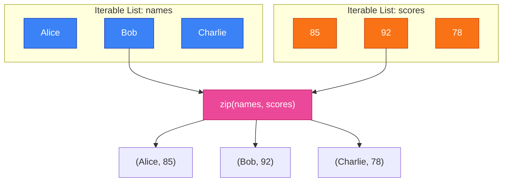

What's happening is that the two list are being traversed with zip, so that corresponding names and scores can be added to a string in the list comprehension. 

The zip() function creates an iterator, stepping through one value at a time. We can the use list() to evaluate the iterator and gather all the 
pairs into a list. The zip() function stops when the shortest sequence runs out of items.

```py
letters = ['a', 'b', 'c']
numbers = [1, 2]

combined = list(zip(letters, numbers)) #temporary iterator becomes a list
print(combined) 
```
The above code outputs: 
>[('a', 1), ('b', 2)] 

The third letter `c` isn't included because there are only 2 numbers.

In the `name_significance` method, we use `zip` as part of a long list comprehension that we split into 2 lines for clarity. 

```py
    zip(parts, self.SYLLABLES)
```
The `parts` list contains the separated name `['Paij', 'plo']` and SYLLABLES contains our two dictionaries (the name caller's relationship and the time of day).
We’re matching up the first part with the first dictionary and teh second part with the secon ddictionary. . 

As we run `zip(['Paij', 'plo'], [dict1, dict2])`, zip first responds with `('Paij', dict1 )` then `('plo', dict2)` running through the lists together. 
The important thing is that 'Paij' is matched with dict1 and 'plo' is matched with dict2 and then the zip ends.  

### Dictionary get(): The Fallback Kid

Getting back to our `name_significance` method: 

```py
class CustomString(str):
...
    def name_significance(self):
        "Translates hyphen-separated syllables into their full meanings."
        parts = self.split('-')
            signif = [
            mydict.get(p, p) # Dictionary lookup that fails back to the original text if the key is not found
            for p, mydict in zip(parts, self.SYLLABLES)
        ]
        
        return ' '.join(signif)
```

Now see the strange code `mydict.get(p, p )`? This weird code is pretty much the same as `mydict[p]` 
except it takes a second argument as a fallback. The `.get(p,p)` code is the perfect way of building a new 
list which is based on the items in an existing list.  

```py
name = CustomString("Paij-roo")
print(name.name_significance()) 
#=> Personal roo # roo not found in dict2, so fall back to roo
```
This `mydict` is being used to lookup words but if the word isn't found, we just give back the original value. 
We use the first dict to peform a look up of 'Paij' and the second dict to form a lookup of 'roo'. 
Replacing both we get `Personal roo`

```py
name = CustomString("Pooj-rei")
print(name.name_significance()) 
#=> Pooj-rei 
```
But for the CustomString "Pooj-rei", both 'Pooj' and 'rei' are not found in our 
Syllables dictionary so we get back exactly what we put in thanks to get(p,p) fallback. 

I say Paij-ree’s property is a very charming section of woods when it’s not
raining cats and Doug. For many days, Paij-ree and I camped in tents by the
river behind his house, subsisting on smoked blackbird and whittling little
sleeping Indians by the dusklight. On occasion he would lose a game of spades
and I knew his mind was distracted, thinking of Endertromb. All of this must
have been stirring inside of him for sometime. I was the first ear he’d ever
had.

“I just came from Ambrose,” I said. “Sort of my own underground home, a place
where elves strive to perfect animals.”

He mumbled and nodded. “You can’t be (poth-in-oin) part of (in) such things.”

“You think we will fail?”

“I (preep) have been there before,” he said. And then, he spoke of the
Lotteries.

## 4. The Goat Wants to Watch a Whole Film


The elevator had opened into a green room full of shelves and file cabinets.
Reels of tape and film canisters and video tape everywhere. Dr. Cham hadn’t a
clue what most of it was. All he saw was a big, futuristic mess.

He called out again, stumbling through alleys of narrow shelves, “Hello-o-o??
I’m looking for intelligent life! I’m a space traveler!” He tripped when his
foot slid right into a <span class="caps">VCR</span> slot. “Any other beings I
can communicate with?”

Hand cupped around mouth, he yelled, “Hello-o-o?”

“Crying out loud.” The sleepy goat came tromping down the aisle.


“I hate that book,” said the goat. “I believe the author is disingenuous.”

“Really?” asked Dr. Cham.

“I’m sure it’s all true. It’s just so heavily embellished. I’m like: Enough
already. I get it. Cut it out.”

“I’m not quite sure what to make of it,” said the Doctor. “It seems like an
honest effort. I actually wrote something in Python back there.”

“It doesn’t give goats a very good name,” said the goat.

“But you are the only goat in the book,” said the Doctor.

“And I’m totally misquoted.”

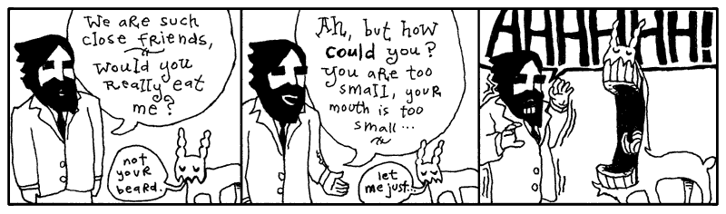

The goat closed his mouth and Dr. Cham held his heart.

“I’m actually very literate,” said the goat. “Albeit, more recently, I’ve
switched to movies. I love foreign films. One of my relatives just brought back
_Ishtar_ from your planet. Wow, that was excellent.”

<aside class="sidebar">
<pre>we want a tambourine!
           /
          |  tambourine for all!
          |      /
          \__  |
        /  o o \__/\__/\_
      /.           \ o o \____
       /'      ----/          \
_____ /  '    / /.\\   #------/
       /     /        /     \\
             /       ///
      /so               \
           /\   \me time\\..
       /pp/  \s these pictur\\
      /es/   \don't w\ \ork out\
     ***      *** right but i
       think this time
          they did
            ooo o
             oo
            o
         o
      {o}
   ^
</pre>
</aside>

“I haven’t been to my planet in a long time. It would be difficult to consider
it my home at this stage.”

“Well, Warren Beatty is delightful. His character is basically socially
crippled. He actually tries to kill himself, but Dustin Hoffman sits in the
window sill and starts crying and singing this totally hilarious heartbreak
song. I’ve got it here, you should see it.”

“Can I get something to eat?” asked the Doctor. And he still felt filthy.

“How about we watch a film and you can have a buttermelon with tentacles?” said
the goat.

So, they worked their way back toward the goat’s projector. Back by the freezer
locker, they sat on a giant rug and broke off the appendages of frozen
buttermelons. The shell was solid, but once it cracked, rich fruit cream was in
abundance. Sweet to taste and a very pleasant scent.

“First film, you’ve got to see,” said the goat. “Locally filmed and produced.
I’m good friends with the lady who did casting. Dated her for awhile. Knew
everyone who was going to play the different roles long before it was
announced.”

The goat set the projector by Dr. Cham. “I’ve got the music on the surround
sound. You can man the knob.”


Dr. Cham’s mind wandered at this point in the presentation, just as the land war
mounted between the two throngs of animal settlers. The details of their wars
and campaigns continued to consume the spool of transparent film that Dr. Cham
was feeding through the projector.

War after war after war. The Sieging of Elmer Lake. The Last Stand of Newton P.
Giraffe and Sons. Dog Invasion of Little Abandoned Cloud. No animals died in
these wars. Most often an attack consisted of bopping another animal on the
head. And they philipped each other’s noses. But, believe me, it was
humiliating.

Blasted crying shame. Things could have worked out.

### The Birth of an Object

“Don’t worry,” said the goat, anxious to sway Dr. Cham’s attention back to the
film. “Things _do_ work out.”

In Python, the Object is the very center of all things. It is The Original.

```py
class ToastyBear(object):
    pass
```

The parentheses indicate inheritance. This means that the new ToastyBear class is a new class based on the object class. 
Every method that object has will be available in ToastyBear. Attributes available in object will be available in ToastyBear.
But every object inherits from object. In Python 3, the code…

```py
class ToastyBear:
    pass
```

Is identical to…

```py
class ToastyBear(object):
    pass
```

Inheritance is handy. You can create species of objects which relate to each
other. Often, when you’re dissecting a problem, you’ll come across various
objects which share attributes. You can save yourself work by inheriting from
classes which already solve part of that problem.

You may have a `UnitedStatesAddress` class which stores the address, city,
state, and zip code for someone living in the United States. When you start
storing addresses from England, you could add a `UnitedKingdomAddress` class. If
you then ensure that both addresses inherit from a parent `Address` class, you
can design your mailing software to accept any kind of address.

```py
def mail_them_a_kit(address):
    if not isinstance(address, Address):
        raise TypeError("No Address object found.")
    
    print(address.formatted())
```

Also, inheritance is great if you want to override certain behaviors in a class. For example, 
perhaps you want to make your own slight variation to the `list` class. You want to enhance the `join` method. But if you change `list` directly, 
you will affect other classes in Python that use lists. 

So you start your own class called `ListMine`, which is based on The Original `list`.

```py
class ListMine(list):
    """A custom list class with enhanced string joining capabilities."""

    def join(self, sep, fmt):
        """Format each item in the list and join them with a separator."""
        # Uses a modern f-string style mapping
        formatted_items = [f"{fmt}".format(item) for item in self] # apply formatting
        return sep.join(formatted_items) # join using seperator
```

`ListMine` is now a custom list class with its own `join` method. list is the base class (or superclass) of `ListMine`.

Every class has a __bases__ attribute where you can check this subclass relationship.
```pycon
>>> ListMine.__bases__
    (<class 'list'>,)
```
Or you can also use `issubclass(ListMine, list)` which returns True. 

Perfect. We manage a hotel and we have an `List` of our room sizes: `[3, 4, 6]`. Let’s get it nicely printed for a brochure.

```py
rooms = ListMine([3, 4, 6])
# "%d" prints integers directly
print("We have " + rooms.join(", ", "%d bed") + " rooms available.")
```

Which prints, “We have 3 bed, 4 bed, 6 bed rooms available.”

Dr. Cham was looking around for a bathroom, but archival video tape was
everywhere. He eventually found a place, it may have been a bathroom. It had a
metal bin. More importantly, it was dark and out of eyesight.

While he’s in there, let me add that while The Originals slaughtered The
Invaders to prove their rights as First Creatures, the Python Object doesn’t have
any such dispute. It is the absolute king Object the First.

Watch.

```pycon
>>> isinstance(42, object)
True
>>> isinstance("hello", object)
True
>>> def my_func(): pass
>>> isinstance(my_func, object)
True
```

Yes, every class in Python is an object. In Python, the phrase "everything is an object" 
is a literal truth—integers, strings, functions, modules, and indeed classes themselves are all objects occupying memory.

```py
class MyClass: 
    pass

#1. A class is an instance of the 'type' class
print(type(MyClass)) 
# Output: <class 'type'>

#2. A class is a subclass of the ultimate base 'object'
print(isinstance(MyClass, object)) 
# Output: True

#3. You can pass a class around like any other object
def print_class_name(cls_obj): 
    print(cls_obj.__name__)

print_class_name(MyClass) 
# Output: MyClass
```

Even `MyClass` is an `Object`! See, although classes are the definition language
for objects, we still call class methods on them and treat them like objects
occasionally. It may seem like a dizzying circle, but it’s truly a very strict
parentage. 

Now look at `MyClass`'s type:  `<class 'type'>`. Now, the same is true for int, str, and list: 

```py 
print(type(42))           # Output: <class 'int'>
print(type("Hello"))      # Output: <class 'str'>
print(type([1, 2, 3]))    # Output: <class 'list'> 
```

That's because type is the default metaclass for Python's classes. It is the machinery Python normally uses to create classes. 
Because Python is dynamically typed, types are associated with objects at runtime rather than being fixed 
declarations attached to variables. Every value in Python is an object, and every object has a type.

```py
# A module is just a regular object sitting in memory too!
import math

# 1. Look at its type
print(type(math))
# Output: <class 'module'>

# 2. It also inherits from the ultimate king 'object'
print(isinstance(math, object))
# Output: True
```

Now look at math which we just imported. You see its type is module?

If object is the ultimate king of the Python kingdom, then module is the poor waifish nun, quietly shielding and protecting 
all her little Python townspeople children. (To complete the analogy: `type` is the village schoolteacher—the one responsible for creating most of the classes in the kingdom. 
And `kernel` is, naturally, the self-important colonel.)

The whole point of a `module`’s existence is to give food and shelter to code. 
Functions can stay dry under a `module`’s shawl. A `module` can hold classes, constants, and variables of any kind.

“But what does a `Module` do?” you ask. “How is it gainfully employed??”

“That’s all it does!!” I retort, stretching out my open palms in the greatest expression of futility known to man. 
“Now hear me—for I will never speak it again—that Module Mother Superior has given these wretched objects a place to stay!!”


```py title="saint_agnes.py"
# saint_agnes.py
# See, the file is the module -- where else could our code possibly stay?

# A CONSTANT is laying here by the doorway. Fine.
TOOTHLESS_MAN_WITH_FORK = ['man', 'fork', 'exposed gums']

# A Class is eating, living well in the kitchen.
class FatWaxyChild:
    pass

# A function is hiding back in the banana closet, God knows why.
def timid_foxfaced_girl():
    return {'please': 'i want an acorn please'}
```

Now you have to go through Saint Agnes to find them.

```pycon
>>> import saint_agnes
>>> saint_agnes.TOOTHLESS_MAN_WITH_FORK
['man', 'fork', 'exposed gums']
>>> saint_agnes.FatWaxyChild()
<saint_agnes.FatWaxyChild object at 0x7f88>
>>> [name for name in dir(saint_agnes) if not name.startswith('__')]
['FatWaxyChild', 'TOOTHLESS_MAN_WITH_FORK', 'timid_foxfaced_girl'] #attributes of saint_agnes
```

Always remember that a `Module` is only an inn. A roof over their heads. It is
not a self-aware `Class` and, therefore, cannot be brought to life with `new`.

```pycon
>>> saint_agnes()
TypeError: 'module' object is not callable
```

St. Agnes has given up her whole life in order that she may care for these
desperate bits of code. Please. Don’t take that away from her.

If you wanted to alter St. Agnes, though, I can help you. You can bring in a larger corporation 
to mess with the ministry of saint_agnes and then what is she left with? In Python, modules are completely mutable objects. 
You can inject new attributes right into them, swap their inner workings, or copy their elements at runtime—a technique wizards call "monkey patching."

```py

# We can dynamically inject a brand new function straight into Saint Agnes from the outside!
def corporate_takeover():
    return "This inn is now a high-rise condo."

import saint_agnes
saint_agnes.corporate_takeover = corporate_takeover

# Now Saint Agnes hosts the new corporate function too!
print(saint_agnes.corporate_takeover())
# Output: This inn is now a high-rise condo.
```

In truth, `saint_agnes` doesn't need a corporate_takeover function but we added one just in case. 

You gotta admit. The old abbey can be modified a zillion times and that
little fox-faced girl will _still_ be back in the banana closet wanting an
acorn! Too bad we can’t feed her. She’s a method with no arguments.

When Dr. Cham came out refreshed, the filmstrip was a bit behind. But the goat
hadn’t noticed, so the Doctor advanced frames until it made some sense.


So the invaders left the planet.

“This planet _is_ decrepit,” said Dr. Cham. “The castle is nice. But inside it’s
a disaster.”

“The whole castle look is a projection,” said the goat. “All the flowers and
apple blossoms and the sky even. It’s a low-resolution projection.”

“Yes? It is enchanting.”

“I guess.”


“That’s messed up!” said the goat. “That’s not the way the film ends! There’s no
blood! What happened? What happened? Did you screw up the knob, idiot?”

“Well, I don’t know,” said Dr. Cham. He turned the knob reverse and forward.
Tapped the lens.

“Check the film! Check the film!”

Dr. Cham pulled out a length of film from the projection feed, melted and
dripping from its end.

“Curse that! These projectors are quality! I’ve never had this happen. There’s
no way.”

### Hunting For a Voice

“I don’t think it was the projector,” said Dr. Cham. “Something flew across that
screen and uttered a blistering moan.”

“I don’t have any dupes of that movie,” said the goat somberly. “And that girl.
That casting director. I never see her anymore.”

Dr. Cham stood up and looked over the dumpy aisles of magnetic carnage,
searching.

“Oh, hey, you should call that girl,” the goat went on. “You could talk to her,
get an understanding. Tell her about me. Don’t act like your my friend, just,
you know, ‘Oh, that guy? Yeah, whatta maroon.’”

Dr. Cham spotted the doorway and exited.

The hallways were an entirely new world of mess. In the goat’s archives, the
shelves had been messy. In the hallway, shelves were completely tipped. Sinks
were falling through the ceiling. The Doctor ventured under the debris, kicking
through plywood when necessary.

“You shouldn’t be out here,” said the goat. “You’re on someone else’s property
at this point. A couple of pygmy elephants own all this. They’re nasty guys.
They’ll beat the crap outta you with their trunks. They ball it up and just
whack ya.”

Dr. Cham pushed a file cabinet out of his way, which fell through a flimsy wall,
then through the floor of the next room over. And they heard it fall through
several floors after that.

“I’m trying to remember how it goes in the book,” said Dr. Cham, as he walked
swiftly through the hall. “That milky fog that swept across the projection. We
find that thing.” He jiggled a door handle, broke it off. Forged through the
doorway and disappeared inside.

“You really get a kick out of beating stuff up, don’t you?” said the goat.
“Walls, doors.” The goat headbutted a wall. The wall shuddered and then laid
still.

Then, it was quiet. And black.

The goat stayed put in the bleak hallway, expecting Dr. Cham to flip over a few
desks and emerge, ready to move on from the room he’d busted into. But Dr. Cham
didn’t return, and the goat opted to share a moment with the neglected wreckage
left by his neighbors. Not that he could see at all. He could only hear the
occasional rustling of the piles of invoices and carbon copy masters and manila
envelopes when he shifted his legs.

The ground seemed to buckling right under the goat, as if the heaps of kipple
around him were beginning to slide toward his weight. He would be at the center
of this whirlpool of elephant documentation. Would he die of papercuts first? Or
would he suffocate under the solid burial by office supplies?

A soft light, however, crept up to him. A floating, silver fish. No, it was
a—was it scissors? The scissors grew into a shimmering cluster of intelligent
bread, each slice choking on glitter. But, no, it was hands. And an Easter hat.

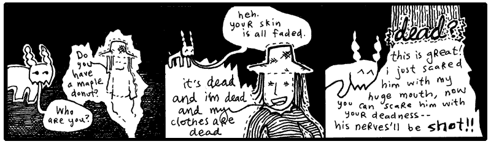

In another room, Dr. Cham stood under the clear glass silently. The ceiling had
abruptly gone transparent, then starlight washed over his pants and jacket. He
walked further to the room’s center in muted colors, lit as softly as an ancient
manuscript in its own box at the museum. More stars, more cotton clusters of
fire, unveiled as he came across the floor. And it peeked into view soon enough,
he expected it to be larger, but it wasn’t.

Earth. Like a painted egg, still fresh. He felt long cello strings sing right up
against his spine. How could that be called Peoplemud? Here was a vibrant and
grassy lightbulb. The one big ball that had something going for it.

He thought of The Rockettes. Actually, he missed The Rockettes. What a bunch of
great dancers. He had yelled something to The Rockettes when he saw them.
Something very observant and flattering.

Oh, yes, while The Rockettes were spinning, arm in arm, he had yelled,
“Concentric circles!” Which no one else cared to observe.

And this thought was enough to feed Dr. Cham’s superiority complex. He wore a
goofy smile as he retraced his footsteps. He truthfully felt his genius coming
through in such a statement. To realize the simplicity of a circle was his. He
reflected on it all the way back to the hallway.

Which I think is great. Adore yourself when you have a second.

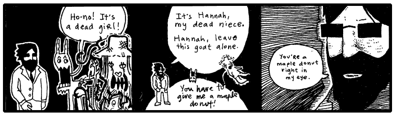

“Oh, right,” said the goat. “Your niece. The niece you killed. I’m with ya now.”

For just a few moments, they all looked at each other. Just enough time for both
Dr. Cham and the goat to think: _Oh, yeah. Hannah causes us a lot of trouble.
She’s already talking about maple donuts._

“Does she start talking about maple donuts right away like that?” asked the
goat.

“Yes, she does,” said the Doctor. “She brings it up to you, then she brings it
up to me. She sees a maple donut somewhere—I don’t quite remember where.”

“Do I see a real maple donut?” Hannah said. “I need a real one.”

“Okay, okay,” said the goat. “Yeah, I remember: here’s where she says that if
she gets a real maple donut, she’ll become a real person again. Because her real
destiny was to own a bakery and you ruined that destiny and now she’s trapped as
a ghost.”

“Hey, that’s the truth!” Hannah yelped.

“It’s terrible that we must bear through this whole scene again,” said the
Doctor. “The donuts are immaterial. They should be left out altogether.”

“Man, I am having a _hard_ time remembering all of this chapter,” said the goat.
“I don’t even remember how to get out of this hallway. I must have read that
book like thirty times. Do we blast through a wall? Do we scream until someone
finds us?”

“We get Hannah to float through walls and she finds some kind of machine,” says
Dr. Cham. “I have to write a program—it all works out somehow.”

“But, you know what I’m saying?” said the goat. “I forget all the details.
Especially the earlier chapters. I mean I can remember the ending perfectly.
It’s hard to sit through all this. The end is so much better.”

Dr. Cham folded his arms and teetered on a heel. “The porcupine.” He smiled
greedily at the goat.

“Oh, totally. The porcupine is definitely who I want to meet,” said the goat. “I
wonder what he does with all that money when the book is over.”

Dr. Cham nodded respectfully. “I’m very excited to see him wearing slippers.”

“Those infernal slippers!” said the goat and he haw-hawed coarsely, a shower of
saliva cascading from his jaws.

Hannah’s mind rattled, waiting for this nonsense to break for a moment. She
tipped her head on its side and the rattle slid along the curve of her cranium.
The little noise died away, though, as the back of her head vanished (_fluxed
out_ is what she called it) and then her head was back again with its little
rattle and she caught herself doing that careless moaning again. **<span
class="caps">HRRRRRR</span>-RRR-OH-RRRR-RRRR.**

“I’m not as into the chunky bacon stuff,” said the goat. “I don’t see what’s so
great about it.”

Could she speak while moaning? **<span class="caps">BON</span>-BON.** With a
French moan. **<span class="caps">BOHN</span>-BOHN. <span
class="caps">BOHN</span>-APPE-TEET-OHHHH-RRRR.**

“I know she’s harmless, but that sound freaks me out. My hair is **completely**
on end.”

“Hannah?” said Dr. Cham. “Where are you, child? Come do a good turn for us, my
niece.”

She was right near them, in and out. And they could hear her cleaning up her
voice, bright, speaking like a angel scattering stardust. Yes, the whole maple
donut story came out again, and more about the bakery she would own, the muffins
and rolls and baguettes.


## 5. The Theft of the Lottery Captain


<p style="float:right" markdown="1">
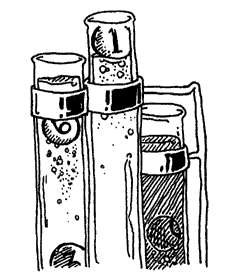
</p>

And now, Paij-ree’s stories of the Lotteries.

On Endertromb, the organist’s father invented the lottery. The idea came while
he was praying to Digger Dosh.

Digger Dosh is sort of like their God. But ten times scarier. This guy dug an
infinitely deep tunnel straight through the planet and came out dead. But he’s
really not dead. He’s really just _one second_ behind them. And he eats time.

It’s kind of complicated because Digger Dosh totally kills people. But I guess
if you do what he says, it’s not so bad. Maybe I’ll talk about it later. It’s
such a pain to talk about because it’s so scary and yet one of my friends
actually believes the whole thing. I get kind of choked up—not like I’m crying,
more like I’m choking.

Anyway, once while praying, three numbers came to Paij-ree’s father.

He then asked his mind, “What are these numbers?”

And his mind played a short video clip of him selling all kinds of numbers. And,
for years and years, traveling and selling numbers.

And he asked his brain, “People will buy numbers?”

And his brain said, “If they buy the right three numbers, give them a prize.”

At which he imagined himself launching off a ski jump and showering people with
presents. No question: he would be an icon.

So he went and did as his brain said and sold numbers. The father’s simple
lottery consisted of three unique numbers, drawn from a set of 25 numbers.

```py
import random
from datetime import datetime

class LotteryTicket:
    NUMERIC_RANGE = range(1, 26)  # Numbers 1 to 25

    def __init__(self, *picks):
        if len(picks) != 3:
            raise ValueError("three numbers must be picked")
        elif len(set(picks)) != 3:
            raise ValueError("the three picks must be different numbers")
        elif any(p not in LotteryTicket.NUMERIC_RANGE for p in picks):
            raise ValueError("the three picks must be numbers between 1 and 25")
        
        self._picks = picks
        self._purchased = datetime.now()

    @property
    def picks(self):
        return self._picks

    @property
    def purchased(self):
        return self._purchased
```

Yes, the `LotteryTicket` class contained the three numbers and the
time when the ticket was bought. The allowed range of numbers
(from **one** to **twenty-five**) is kept in the constant `NUMERIC_RANGE`.

The `__init__` method here can have any number of arguments passed in. The
**asterisk** before the `_picks` argument means that **any arguments will be passed
in as an List**. Having the arguments as a List means we can apply list comprehension to the
arguments.

This class contains three definitions: the `__init__` method definition (`def`) and two 
property definitions (`picks` and `purchased`). All three are **really just method
definitions** though. 

The `@property` decorator creates a special version of a method used for accessing instance variables of a object. 
The `@property` decorator acts as wrapper methods for instance variables (such as `_picks`) which
can be used **outside of the class itself**. Paij-ree’s father wanted to code a
machine which could read the numbers and the date of purchase from the ticket.
In order to do that, those instance variables must be exposed, and as we'll see `@property` allows us to do this in
as safe way.

Let’s create a random ticket and read back the numbers:

```py
ticket = LotteryTicket.new( rand( 25 ) + 1,
            rand( 25 ) + 1, rand( 25 ) + 1 )
print( ticket.picks )
```

Running the above, I just got: `[23, 14, 20]`. You will get an error if two of
the random numbers happen to be identical.

However, I can’t change the lottery ticket’s picks from outside of the class.

```py
ticket.picks = [2, 6, 19]
```

I get an error: `` undefined method `picks=' ``. This is because `def picks`
only adds a **reader** or **getter** method, not a *writer* method. That’s fine, though. We
don’t want the numbers or the date to change.

But a sneaky individual could still change his ticket like so: 
```py
ticket.picks.append(3)
```
To get around this, we simply return a copy of `_picks` like so `return self._picks.copy()` 
or return a tuple `tuple(return self._picks)`, encapsulating `_picks` from the outside world.

So, the tickets are _objects_. Instances of the `LotteryTicket` class. Make a
ticket with `LotteryTicket()`. Each ticket has it’s own `_picks` and it’s own
`_purchased` instance variables.

The lottery captain would need to draw three random numbers at the close of the
lottery, so we’ll add a convenient class method for generating random tickets 
(The "factory method" we went over in Chapter 3 if you need a refresher).

```py
class LotteryTicket():
    ...
    @classmethod
    def new_random(cls)
        cls(random.randint(1, 25), random.randint(1, 25), random.randint(1, 25))     
```

Here you see new_random, is a class method (you can tell by the `@classmethod` that proceeds it). 
It takes in argument `cls` so that `cls` becomes an alias for the `LotteryTicket` class (just like `self` represents objects). 
When we call `cls(...)`, we create a new instance of your class 
i.e. `cls(...)` is equivalent to `LotteryTicket()` and creates a new object of type `LotteryTicket`. 
In other words, this is a "factory method" that spits out a new object, a random `LotteryTicket`. 

Oh, no. But we have that stupid error that pops up if two of the random numbers
happen to be identical. If two numbers are the same, the `__init__` throws an
`ValueError`.

The trick is going to be restarting the method if an error happens. We can use
Python’s `except ValueError` to handle the error and `continue` to start the `while True` loop over.

```py
class LotteryTicket:
    ...
    @classmethod
    def new_random(cls):
        while True:
            try:
                return cls(random.randint(1, 25), random.randint(1, 25), random.randint(1, 25))
            except ValueError:
                continue
```

Better. `random.randint(1, 25)` ask Python for a random integer from 1 to 25. 
It may take a couple times for unique numbers to fall together right, but
it’ll happen. The wait will build suspense, huh?

The lottery captain kept a roster of everyone who bought tickets, along with the
numbers they drew.

```py
class LotteryDraw:
    def __init__(self):
        tickets = {} # store tickets in a dictionary {customer:list of tickets}
    def buy(self, customer, *tickets ):
        self.tickets.setdefault(customer, []).extend(tickets)

```

The complicated bit of code in the buy method sets a default empty list for new customers. 

Let's break it down, and read it in English:
`cls.tickets
    .setdefault(customer, [])
    .extend(tickets)`
"Set the customer's list to an empty list if necessary, then add the new tickets to it."

Because lists are mutables, we can extend the list in place 
and don't need to assign the answer of extend to anything like we would have had to do if we used the `+` operator to update the list. 

Yal-dal-rip-sip was the first customer.

```py
august_lotto = LotteryDraw()
august_lotto.buy('Yal-dal-rip-sip',
    LotteryTicket( 12, 6, 19 ),
    LotteryTicket( 5, 1, 3 ),
    LotteryTicket( 24, 6, 8 ) )
```

When it came time for the lottery draw, Paij-ree’s father (the lottery captain)
added a bit of code to score a ticket.

```py
class LotteryTicket:
    def score(self, final):
        count = 0
        for note in final.picks:
            if note in self.picks:
                count += 1
        return count
```


The `score` method compares a `LotteryTicket` against a random ticket, which
represents the winning combination. The random ticket is passed in through the
`final` variable. The ticket gets one point for every winning number. The point
total is returned from the `score` method.
```pycon
>>> ticket = LotteryTicket.new_random()
>>> winner = LotteryTicket.new( 4, 5, 19 )
>>> ticket.score( winner )
    => 2
```

But why stop there? The Paij-ree had tasted the fruits of his work and had 
gone mad with power. The order lotteries number are drawn doesn't matter, and the numbers on your lottery ticket
are all different. You can't ask for ticket with the same number three times like `4, 4, 4`.

The Python's `set` built-in type matches the lotteries requirements: order doesn't matter and repetition isn't allowed. 
So the capitan further optimized the `LotteryTicket` class to a clean and concise code that would impress even his severe father. 
The final function looks like so: 

```py
import random
from datetime import datetime

class LotteryTicket:

    NUMERIC_RANGE = range(1, 26)  # Numbers 1 to 25

    def __init__(self, *picks):
        self._picks = set(picks)
        if len(self._picks) != 3:
            raise ValueError("Must pick 3 unique numbers")
        if not self._picks.issubset(LotteryTicket.NUMERIC_RANGE):
            raise ValueError("All picks must be numbers between 1 and 25")

        self._purchased = datetime.now()

    @property
    def picks(self):
        return frozenset(self._picks)

    @property
    def purchased(self):
        return self._purchased

    @classmethod
    def new_random(cls):
        # random.sample guarantees 3 unique numbers without needing a try/except loop
        return cls(*random.sample(cls.NUMERIC_RANGE, 3))

    def score(self, final): 
        # Set intersection (&) finds overlapping picks instantly
        return len(self.picks & final.picks)
```

Because we are using Python's built-in `set` collection, where all members of a set must be unique,
we have access to all its self-explanatory methods including `issubset` and `intersection` 
(accessed using the `&` operator). 

Now look at the picks method and you'll see the `@property` decorator really shine:
```py
@property
def picks(self):
    return frozenset(self._picks)
```

The leading underscore in `_picks` is a Python convention meaning "internal use only." If we returned 
had `_picks` directly, a ticket holder could alter their ticket after it had been issued. 
While Python doesn't truly prevent access  to instance variables, the `@property` decorator lets us place a 
bouncer in front of them. 

Instead of exposing the `set` directly, the `picks` property returns 
a frozenset. A frozenset behaves much like a regular set, except it is immutable—it cannot be modified after it
is created. This protects the ticket's numbers from accidental or mischievous changes. Attempt to modify the `frozenset` 
as we would a `set`, results in an error.

```pycon
>>> myticket.picks.add(15)
AttributeError: 'frozenset' object has no attribute 'add'
```

Also, we updated the `new_random` factory method to select random numbers using `random.sample()`.
This method selects unique combination of numbers without needing a try and catch loop.  
The code `random.sample(cls.NUMERIC_RANGE, 3)` reads like so: 'pick a unique random sample from
the NUMERIC_RANGE with length 3.' 

You will see how brilliant Paij-ree is, in time. His father commissioned him to
finish the lottery for him, while the demand for tickets consumed the lottery
captain’s daylight hours. Can’t you just imagine young Paij-ree in his stuffy
suit, snapping a rubber band in his young thumbs at the company meetings where
he proposed the final piece of the system? Sure, when he stood up, his dad did
all the talking for him, but he flipped on the projector and performed all the
hand motions.

```py
class LotteryDraw:
    def __init__(self):
        __tickets = {} # store tickets in a dictionary {customer:list of tickets}

    def buy(self, customer, *tickets ):
        self.__tickets.setdefault(customer, []).extend(tickets)    

    @classmethod
    def rules(cls):
        return f"Pick 3 numbers from 1 to {len(LotteryTicket.NUMERIC_RANGE)}."

    def play(self):
        final = LotteryTicket.new_random()
        winners = {}
        for buyer, ticket_list in self.__tickets.items():
            for ticket in ticket_list:
                my_score = ticket.score(final)
                if my_score > 0:
                    winners.setdefault(buyer, []).append((ticket, my_score))
        __tickets = {}
        return winners

def rules(cls):
    return f"Pick 3 *unique* numbers from 1 to {len(LotteryTicket.NUMERIC_RANGE)}."

LotteryDraw.rules = classmethod(rules)
LotteryDraw.play = play
```

His father’s associates were stunned. What was this? (Paij-ree knew this was
just more method definition—they would all feel completely demoralized
when he told them so.) They couldn’t understand how he changed the rules on the fly up
there! Yes, Paij-ree was adding a classmethod to teach people the rules.

_Infants. This is child's play!_, thought Paij-ree, although he held everyone of those men in very high
esteem. He was just a kid and kids are tough as a brick’s teeth.

Using `@classmethod` allows you to add new class methods to an class defintion. But Paij-ree
simply used `LotteryDraw.rules = classmethod(rules)`, to add use updated `rules`. and the new
`rules` method was added directly to the class, as a class method.

When you see the pattern `class.method = classmethod(method)`, believe in your heart, _I’m adding directly to the
definition of `obj`._

The budding organ instructor remembered that `__tickets` indicates a class or method variable is private and forces 
Python to mangle the instance variable so that it would be difficult to access. But he also threw in a tricky syntax worth examining. In
the seventh line, a winner has been found.

```py
winners.setdefault(buyer, []).append((ticket, score))
```

Just like in the `buy` method, we use `setdefault` to retrieve a dictionary value and, if necessary, create it first. 
You can read the code something like this:
> Give me whatever is stored under `buyer`. If nothing is stored there yet, set a default (empty list) and return it.

The `setdefault` shortcut (rather than checking `if buyer not in winners` and assigning a default) can seem a little strange at first, 
but if you can really plant it in your head, it's a great time-saver. You're simply making sure a dictionary entry 
exists before using it.

Once we have the buyer's list of winning tickets, we call `append`, which adds `(ticket, score)` to the end of the list.
It works similarly to `extend`, except that `append` adds a **single object**, while `extend` adds all the objects (**from an iterable**).

```py
lst = [1, 2]
lst.append([3, 4]) # [1, 2, [3, 4]]
lst.extend([3, 4]) # [1, 2, 3, 4]
```

Like `extend`, the `append` method modifies the list in place, so no assignment is necessary.

While with immutable objects you have to catch what the method returns:
```py
name = name.upper()
```

Mutable objects modify in place:

```py
tickets.append(ticket)
tickets.extend(more_tickets)
tickets.sort()
```

No reassignment is needed because the methods change the original list itself.

```pycon
>>> winners_dict = august_lotto.play()
>>> for winner, tickets in winners_dict.items():
>>>     print(f"{winner} won on {len(tickets)} ticket(s)!")
>>>     for ticket, score in tickets:
>>>         picks = ", ".join(map(str, sorted(ticket.picks)))
>>>         print(f"    {picks}: {score}")
```

The output is: 

    Gram-yol won on 2 ticket(s)!
        25, 14, 33: 1
        12, 11, 29: 1
    Tarker-azain won on 1 ticket(s)!
        13, 15, 29: 2
    Bramlor-exxon won on 1 ticket(s)!
        2, 6, 14: 1

Say for example Gram-yol wanted to know quickly what his total score was. Well, we could manually add it up, or use a quick
list comprehension function to check: 

```pycon
>>> b = 'Gram-yol'
>>> sum(ticket[1] for ticket in winners_dict.get(b, [])) # 2
>>> b = 'Gram-zuron' # believes gambling is a sin, so never plays
>>> sum(ticket[1] for ticket in winners_dict.get(b, [])) # 0
```

This code again harnesses the power of `get` to grab the tickets corresponding with 'Gram-yol' and sum the scores, but if 'Gram-zuron` had no 
tickets, and thus no winners, we fall back on an empty list. The fallback kid saves the day yet again. 

The money rolled in as Paij-ree's father sold record numbers of numbers to all the townsfolk. 

But these salad days were not to continue forever for Paij-ree and his father. His
father often neglected to launder his uniform and contracted a moss disease on
his shoulders. The disease gradually stole his equilibrium and his sense of
direction.

His father still futilely attempted to keep the business running. He spiraled
through the city, sometimes tumbling leg-over-leg down the cobbled stone, most
often slowly feeling the walls, counting bricks to the math parlors and
coachmen stations, where he would thrust tickets at the bystanders, who hounded
him and slapped him away with long, wet beets. Later, Paij-ree would find him in
a corner, his blood running into the city drains alongside the juices of the
dark, splattered beets, which juice weaseled its way up into his veins and stung
and clotted and glowed fiercely like a congested army of brake lights fighting
their way through toll bridges.

### A Word About the @property Decorator (Because I Love You and I Hope For Your Success and My Hair is On End About This and Dreams Really Do Come True)

Earlier, I mentioned that `@property` adds **reader** or **getter** methods, but not
**writer** or **setter** methods.
```pycon
>>> ticket = LotteryTicket()
>>> ticket.picks = 3
AttributeError: property 'picks' of 'LotteryTicket' object has no setter
```

The `@property` decorator acts as a gatekeeper. The outside world can look at a ticket's `picks` through the `picks` property, 
but it cannot assign a new value unless we explicitly provide a setter.

Not having a setter method is perfectly fine in this case, since Paij-ree's father didn't want 
the ticket's numbers to be changed after it was purchased.

But if we were interested in having instance variables which had **both readers and writers**, 
we would use `@variable.setter`.

```py
class LotteryTicket:
...
    @property
    def picks(self):
        return frozenset(self._picks)

    @picks.setter # bind this setter function to the picks property
    def picks(self, value):
        self._picks = value

...
```

Holy cats! Look at that setter method for a moment. It looks like a new method definition for
`picks` preceeded with `@pick.setter` decorator. 
This method **intercept outside assignment** to instance variables. 
Sometimes you can simply assign arguments to instance variables. 
Other times, you may want to put a guard at the door yourself, checking values more closely 
before letting them through. 

```py
class SkatingContest:
    @property
    def the_winner(self):
        return self._the_winner

    @the_winner.setter # bind this setter function to the the_winner property
    def the_winner(self, name):
        if not isinstance(name, str):
            raise TypeError(
                "The winner's name must be a string, \
                not a math problem or a list of names, or any of that business."
            )
        self._the_winner = name
```

You won't need `@property` getters and setters this elaborate most of the time. Often, a plain instance 
variable is perfectly adequate. But Python gives you plenty of these escape hatches and little alleyways 
when you need to sneak into the machinery and make it do something unusual.

And I'm also preparing you for metaprogramming, which, if you can smell that dragon, is ominously near.

<aside class="sidebar" markdown="1">
## Another Excerpt from The Scarf Eaters

(_from Chapter <span class="caps">VIII</span>: Sky High_.)

“I know you,” said Brent. “And I know your timelines. You couldn’t have done
this Flash piece.”

“So, you’re saying I’m predictable?” said Deborah. She opened her hands and the
diced potatoes stumbled like little, drunk sea otters happily into the open
crockpot.

“You’re very linear,” said Brent. He took up a mechanical pencil, held it
straight before his eyes, gazing tightly at it before replacing it in the pencil
holder on the counter. “Do you even know how to load a scene? How to jump
frames? This movie I saw was all over the place, Deb.”

She heaped five knit scarves and a single bandanna into the slow cooker and set
it on high. She closed the lid, leaving her hand resting upon it.

“What is it about this movie?” Deborah asked. “You go to Flash sites all the
time. You played the Elf Snowball game for two seconds, it didn’t interest you.
You didn’t care for Elf Bowling games even. And you weren’t even phased by that
Hit The Penguin flash game. Elf versus Penguin? Don’t even ask!

“Now this movie comes along and you can’t get a grip.” She walked over and
siddled up next to him. “Yo, bro, it’s me. Deborah. What happened when you saw
that movie?”

“Everything,” said Brent, his eyes reflecting a million worlds. “And: nothing.
It opened with a young girl riding upon a wild boar. She was playing harmonica.
The harmonica music washed in and out, uneasy, unsure. But she rode naturally,
as if it wasn’t anything of a big deal to ride a wild boar. And with Flash,
riding a wild boar really isn’t a big deal.”

Deborah unclasped her bracelet and set it on the counter by the crockpot.

“The bottom of the movie started to break up, an ink puddle formed. The boar
reared up, but his legs gave way to the all the dark, sputtering ink.”

“Dark clouds converged. Hardcore music started to play. Secret agents came out
of the clouds. <span class="caps">CIA</span> guys and stuff. The animation
simply rocked.

“And then, at the very end of the movie, these words fade upon the screen. In
white, bold letters.”

“Sky high,” said Deborah.

“How did you know?” Brent’s lip quivered. Could she be trusted?

“There is no room left in the world,” she said. “No room for Scarf Eaters, no
room for you and I. Here, take my hand.”
</aside>

Paij-ree was an enterprising young Endertromaltoek. He hammered animal bones
into long, glistening trumpets with deep holes that were plugged by corks the
musicians banded to their fingers. Sure, he only sold three of those units, but
he was widely reviled as a freelance scholar, a demonic one, for he was of a
poorer class and the poor only ever acquired their brilliance through satanic
practice. Of course, they were right, indeed, he did have a bargain with the
dark mages, whom he kept appointments with annually, enduring torturous hot
springs, bathing as they chanted spells.

He adored his father, even as his father deteriorated into but a gyroscope. He
idolized the man’s work and spent his own small earnings playing the lottery. He
loved to watch the numerals, each painted upon hollow clay balls, rise in the
_robloch_ (which is any fluid, pond or spill that has happened to withstand the
presence of ghosts), the great bankers tying them together on a silver string,
reading them in order.

Even today, Paij-ree paints the scenes with crude strokes of black ink on sheets
of aluminum foil. It is very touching to see him caught up in the preciousness
of his memory, but I don’t know exactly why he does it on aluminum foil. His
drawings rip too easily. Paij-ree himself gets mixed up and will serve you
crumbcake right off of some of this art, even after it has been properly framed.
So many things about him are troubling and absurd and downright wretched.

The disease spread over his father’s form and marshy weeds covered his father’s
hands and face. The moss pulled his spine up into a rigid uprightness. So thick
was the growth over his head that he appeared to wear a shrub molded into a
bowler’s hat. He also called himself by a new name—**Quos**—and he healed the
people he touched, leaving a pile of full-blooded, greenly-cheeked villages in
his wake as he traveled the townships. Many called him The Mossiah and wept on
his feet, which wet the buds and caused him to weed into the ground. This made
him momentarily angry, he harshly jogged his legs to break free and thrashed his
fists wildly in the sky, bringing down a storm of lightning shards upon these
pitiful.

Paij-ree was apart from the spiritual odysseys of his father (in fact, thought
the man dead), so he only saw the decay of the lottery without its captain
present. Here is where Paij-ree went to work, reviving the dead lottery of his
family.

### Gambling with Fewer Fingers

The city was crowded with people who had lost interest in the lottery. The
weather had really worn everyone down as well. Such terrible rain flooding their
cellars. The entire city was forced to move up one story. You’d go to put the
cap back on your pen and you’d ruin the pen, since the cap was already full of
slosh. Everyone was depleted, many people drowned.

Paij-ree found himself wasting his days in a quadruple bunkbed, the only
furniture that managed to stay above sea level. He slept on the top bed. The
third bed up was dry as well, so he let a homeless crater gull nest upon it. The
gull didn’t need the whole bed, so Paij-ree also kept his calculators and
pencils down there.

At first, these were very dark times for both of them, and they insisted on
remaining haggard at all times. Paij-ree became obsessed with his fingernails,
kept them long and pristine, while the rest of him deteriorated under a suit of
hair. In the company of Paij-ree, the crater gull learned his own eccentricity and
plucked all the feathers on the right side of his body. He looked like a cutaway
diagram.

They learned to have happier times. Paij-ree carved a flute from the wall with
his nails and played it often. Mostly he played his relaxed ballads during the
daytime. In the evening, they pounded the wall and shook the bed frame in time
to his songs. The gull went nuts when he played a certain four notes and he
looped this section repeatedly, watching the gull swoop and circle in ecstasy.
Paij-ree could hardly keep his composure over the effect the little tune had and
he couldn’t keep it together, fell all apart, slobbering and horse-giggling.

Paij-ree called the gull _Eb-F-F-A_, after that favorite song.

Friendship can be a very good catalyst for progress. A friend can find traits in
you that no one else can. It’s like they searched your person and somehow came
up with five full sets of silverware you never knew were there. And even though
that friend may not understand why you had these utensils concealed, it’s still
a great feat, worth honoring.

While _Eb-F-F-A_ didn’t find silverware, he did find something else. A pile of
something else. Since Paij-ree was stranded on the quadruple bed, the gull would
scout around for food. One day, he flew down upon a barrel, floating over where
the tool shed had been. _Eb-F-F-A_ walked on top of the barrel, spinning it back
to Paij-ree’s house and they cracked it open, revealing Paij-ree’s lost
collection of duck bills.

Yes, real duck bills. (_Eb-F-F-A_ was esophagizing his squawks, remaining calm,
sucking beads of sweat back into his forehead—ducks were not _of his chosen
feather_, but still in the species.) Paij-ree clapped gleefully, absolutely, he
had intended to shingle his house with these, they could have deflected a bit of
the torrent. Probably not much, nothing to cry about.

And the roof glue was at the barrel’s bottom and they were two enterprising
bunkmates with time to kill, so they made a raft from the previously-quacked lip
shades. And off they were to the country! Stirring through a real mess of city
and soup. How strange it was to hit a beach and find out it was just the old
dirt road passed Toffletown Junction.

In the country, they sold. It was always a long walk to the next plantation, but
there would be a few buyers up in the mansion (“Welcome to The Mansion Built on
Beets”, they’d say or, “The Mansion Built on Cellophane Substitutes—don’t you
know how harmful real cellophane can be?”) And one of the families wrapped up
some excess jelly and ham in some cellophane for the two travelers. And they
almost died one day later because of it.

Then, when the heat came and, as the first countryside lottery was at nigh, a
farmer called to them from his field, as he stood by his grazing cow. Paij-ree
and _Eb-F-F-A_ wandered out to him, murmuring to each other as to whether they
should offer him the Wind-Beaten Ticket Special or whether he might want to opt
in to winning Risky Rosco’s Original Homestyle Country Medallion.

But the farmer waved them down as he approached, “No, put your calculators and
probability wheels away. It’s for my grazledon.” He meant his cow. The
Endertromb version: twice as much flesh, twice as meaty, doesn’t produce milk,
produces paper plates. Still, it grazes.

“Your grazledon (poh-kon-ic) wants a lucky ticket?” asked Paij-ree.

“He saw you two and got real excited,” said the farmer. “He doesn’t know
numbers, but he understands luck a bit. He almost got hit by a doter plane one
day and, when I found him, he just gave shrug. It was like he said, ‘Well, I
guess that worked out okay.’”

“The whole (shas-op) lottery is numer-(ig-ig)-ic,” said Paij-ree. “Does he know
(elsh) notes? My eagle knows (losh) notes.” Paij-ree whistled at the crater
gull, who cooed back a sustained _D_.

The farmer couldn’t speak to his grazledon’s tonal awareness, so Paij-ree sent
the gull to find out (_D-D-D-A-D_, _go-teach-the-gra-zle_) while he hacked some
notes into his calculator.

```py
import random
from datetime import datetime

class AnimalLottoTicket:
    # A tuple of valid notes (immutable, replacing the Ruby constant array)
    NOTES = ('Ab', 'A', 'Bb', 'B', 'C', 'Db', 'D', 'Eb', 'E', 'F', 'Gb', 'G')

    def __init__(self, note1, note2, note3):
        """Creates a new ticket from three chosen notes."""
        picks_list = [note1, note2, note3]
        
        # Check for duplicates by comparing list length to set length
        if len(set(picks_list)) != 3:
            raise ValueError("The three picks must be different notes.")
            
        # Check if any pick is missing from the valid NOTES
        if any(pick not in self.NOTES for pick in picks_list):
            raise ValueError("The three picks must be notes in the chromatic scale.")
            
        # Store picks as a frozen set to protect them from being changed
        self._picks = frozenset(picks_list)
        self._purchased = datetime.now()

    @property
    def picks(self):
        return self._picks #Read-only property for ticket picks.

    @property
    def purchased(self):
        return self._purchased #Read-only property for ticket purchase.

    def score(self, final):
        count = 0
        for note in final.picks:
            if note in self.picks:
                count += 1
        return count

    @classmethod
    def new_random(cls):
        return cls(random.choice(cls.NOTES,3))
```

No need for the animal’s tickets to behave drastically different from the
traditional tickets. The `AnimalLottoTicket` class is internally different, but
exposes the same methods seen in the original `LotteryTicket` class. The `score`
method is even identical to the `score` method from the old `LotteryTicket`
class.

Instead of using a variable to store the musical note list, they are stored in a class attribute 
called `AnimalLottoTicket.NOTES` written in all uppercase. In Python, uppercase names indicate a 
constant. 

Python does not strictly block you from changing a uppercase class variable, the style
choice is just a reminder to other programmers to treat the variable as a constant. 
But if someone comes along and tries to reassign the entire variable anyways, Python allows it.
```pycon
    >>> AnimalLottoTicket.NOTES = ('TOOT', 'TWEET', 'BLAT')
```

The gull came back with the grazledon, his name was Merphy, he was thrilled to
play chance, he puffed his face dreamily, whistled five and six notes in series,
they all held his collar, pulled him close to the calculator and let him breathe
three notes, then they choked the bedosh outta him until his ticket was printed
and everything was nicely cataloged inside `animal_lotto.tickets['merphy']`. 
Thank you, see ya at the draw!

So, the fever of the lottery became an epidemic among the simple minds of the
animals. Paij-ree saved his costs, used the same `LotteryDraw` class he’d used
in the corporate environment of the lottery from his childhood (just updating the rules). And soon enough,
the animals were making their own music and their own maps and films.

“What about The Originals?” I asked Paij-ree. “They must have hated your
animals!”

But he winced sourly and pinched his forehead. “I am an Original. You as well.
Do we (ae-o) hate any of them?”

Not too long after the lottery ended, Paij-ree felt the crater gull _Eb-F-F-A_
lighting upon his shoulder, which whistled an urgent and sad _C-Eb-D C-A-Eb_.
These desperate notes sent an organ roll of chills straight through Paij-ree.
Had the King God of Potted Soil, Our Beloved Topiary, **the Mossiah Quos**,
Literal Father of That Man Who Would Be My Daughter’s Organ Instructor—had he
truly come to his end? How could this be? Could the great arbors no longer
nourish him and guide the moist crosswinds to him? Or did his own spindly lichen
hedge up his way and grow against his breathing?

_You never mind_, went the tune of the gull. _He has detoriated and weakened and
fallen in the lit door of your home cottage. His tendrils needing and crying for
the day to not end. For the sun to stay fixed and wide and attentive._

Plor-ian, the house attendant, kept the pitchers coming and Quos stayed well
watered until Paij-ree arrived to survey the decaying buds of soft plant and the
emerging face of his father, the lottery captain. His skin deeply pocked like an
overly embroidered pillow. Great shoots springing from his sleeves now curled
back with lurching thirst.

Paij-ree combed back the longer stems around his father’s eyes and those coming
from the corners of his mouth. While I’d like to tell you that Paij-ree’s tears
rolled down his sleeves and into the pours of his father, rejuvenating and
restoring the grassy gentleman: I cannot say this.

Rather, Paij-ree’s tears rolled down his sleeves and into the creaking clapboard
floor, nourishing the vile weeds, energizing the dark plant matter, which
literally leapt through the floor at night and strangled Our Quos. Yank, pull,
crack. And that was his skull.

So Paij-ree could never be called Wert-ree or Wert-plo after that.


## 6. Them What Make the Rules

Hannah leapt back from the wall and clenched down on her fingers.

“This is the wall,” said Dr. Cham. “The Originals are in there. My child, can
you lead us to the observation deck?”

“You expect us to go up against those guys?” asked the goat. “They’re mad as
koalas. But these koalas have lasers!”

“We prevail, though,” said Dr. Cham. “You and I know this.”

“Okay, well I’m muddled on that point,” said the goat. “Do we really win? Or
could we be thinking about _Kramer vs. Kramer_? Does Dustin Hoffman win or do we
win?”

“No. No. No. No.” Hannah hovered and dragged her legs along the wall nervously.
“There is a man with a huge face in there!”

“Mr. Face,” said the Doctor. “He is the original face.”

“He didn’t see me,” said Hannah and moaned. **<span
class="caps">HOMA</span>-HOMA-ALLO-ALLO.**

She made that hollow weeping through the crumbling mouseholes and the freezer
gateways, fluxing in and out, causing the video checkpoints to hiss and the wall
panels to brace themselves and fall silent. The three passed through two levels
of frayed security and emerged in the observation deck overlooking the cargo
bay.


“The last living among The Originals,” said Dr. Cham. “Are you alright with
this, Hannah?” Which she didn’t hear in any way, as her eyes laid fixed on the
legendary creatures.

“Look at them,” said the goat. “These guys wrote the rule books, Doctor. We owe
everything to these guys.”

“What about God?” said Dr. Cham.

“I don’t really know,” said the goat. “Hannah probably knows better than any of
us about that.”

Hannah said nothing. She only really knew one other ghost and that was her
Post-Decease Mediator, Jamie Huft. Who didn’t seem to have any answers for her
and required questions to be submitted in writing with a self-addressed stamped
envelope included. Hannah hadn’t gotten the ball rolling on that P.O. Box yet.

“We must be up in the mountains,” said the goat. “Look out at that blackness.”

“I saw another deck like this down by where we found Hannah,” said Dr. Cham.
“Down closer to your living area. You should take time to search for it. It’s
very peaceful there. You can see Earth and the seven seas.”

“The seven seas?” The goat wondered if that was near The Rockettes. He’d read
his share of material on precision dancing and he’d seen that line of legs,
mincing across the stage like a big, glitsy rototiller.

Hannah stirred to life.

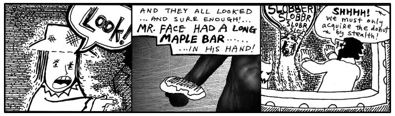

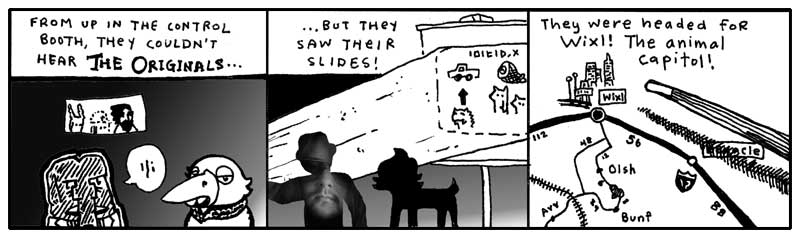

And none of the three spoke when The Originals flicked off the slide projector
and boarded a very slender rocket ship and cleanly exploded through a crevice in
the cargo bay roof.

“Oh, boy,” said the goat.

“What?” said Hannah.

“You’re going to die,” said the goat.

Dr. Cham looked over the controls in front of them, a long panel of padded
handles and green screens.

“I’m already dead. I’m a ghost.”

The goat looked down at the Doctor, who was rummaging under the control panel.
“Okay, well if your uncle isn’t going to have a talk with you, I’m going to make
things very clear. There’s a good chance these guys are going to build a bomb.
And you see how I’m fidgeting? You see how my knees are wobbling?”

“Yeah.”

“Yeah, that’s how real this is, kid. I don’t remember anything from that
_confounded book_ except that these guys are building a bomb that can blow up
the ghost world. Because once the ghost world’s gone, then Digger Dosh gets his
one second back. It’s a trade they’ve worked out. Hell, it’s sick stuff, that’s
all you need to know.”

“But I’m dead.”

“Okay, well, we’re talking, aren’t we? You can talk, so are you dead?” The goat
shook his head. “I wish I could remember if we win or if it was Dustin Hoffman.”

Hannah cried. “Why do I have to die again?” She wailed and her legs fell into
flux and she sunk into the floor. **<span
class="caps">MOH</span>-MOHHH-MAO-MAOOO.**

Dr. Cham had forcibly yanked on a plush handle, which unlocked and slid open
like a breadbox. He reached his hands inside and found a keyboard firmly bolted
deep inside.

“That’s it,” he said and pulled up `Python REPL`.

You open it by typing `python` or `python3` in your terminal. The Interactive Interpreter 
appeared on a display to the left of his concealed typing. He checked the Python version.

```pycon
>>> import sys
>>> sys.version
'3.14.7 (default, Aug 21 2026, 12:00:00)\n[GCC 11.2.0]'
```

Python was up-to-date. What else could he do? Scanning `instance variables`, `class variables`, and `methods` 
was pointless. The only reason that had worked with the `Elevator` class was because someone had left
`Python REPL` running with their classes still loaded.

He had just loaded this Python REPL, so no special classes were available yet. He had to find some classes.

He started by importing Python’s `sysconfig` module to get an idea of how Python had been configured.

```pycon
>>> import sysconfig
```

When we run `import sysconfig`, Python finds the module, loads it, and places it in `sys.modules`, 
a dictionary belonging to the `sys` module that Python uses to keep track of imported modules.

```text
sys
└── modules
    ├── "sysconfig" → the actual sysconfig module
    ├── "os"        → the actual os module
    ├── "math"      → the actual math module
    └── ...
```

You can see that the module we imported is the same object stored in `sys.modules`:

```pycon
>>> import sys
>>> sys.modules["sysconfig"] is sysconfig
True
```

So the REPL has just demonstrated another piece of the object model: modules are objects too.
The `sys.modules` contains **module objects**, not filenames.

If you want to see the names of the modules Python knows about, look at the dictionary’s keys:

```pycon
>>> list(sys.modules)
['sys', 'builtins', '_frozen_importlib', ... 'sysconfig']
```

What Dr. Cham really needed, though, was information about how Python itself had been installed. 
The `sysconfig` module could provide that too.

```pycon
>>> sysconfig.get_config_vars()
{'prefix': '/usr/local', 'exec_prefix': '/usr/local',
 'LIBDIR': '/usr/local/lib', ...}
```

The `sysconfig` module contains information about how Python was built and installed. 
There was far too much information to sort through in the entire dictionary, so Dr. Cham asked
for something more specific.

He could find the directory where Python’s standard library was installed with:

```pycon
>>> sysconfig.get_path("stdlib")
'/usr/local/lib/python3.14'
```

And the directory where third-party packages were installed with:

```pycon
>>> sysconfig.get_path("site-packages")
'/usr/local/lib/python3.14/site-packages'
```

But now Dr. Cham had a more interesting question: **Where does Python look when we ask it to import a module?**

That information lives in `sys.path`.

```pycon
>>> import sys
>>> sys.path
['/usr/local/lib/python3.14',
 '/usr/local/lib/python3.14/site-packages',
 ...]
```

`sys.path` is the list of directories Python searches when it encounters an `import` statement. 
Python checks these locations in order until it finds a module or package that matches what we asked for.

For example, when Dr. Cham runs:

```pycon
>>> import mindreader
```

Python might look in places such as:

```text
/usr/local/lib/python3.14/mindreader.py
/usr/local/lib/python3.14/site-packages/mindreader.py
```

If it finds the module, Python loads it and stores the resulting module object in `sys.modules`.

The entries in `sys.path` are often **absolute paths**—complete paths that identify a location 
from the root of the filesystem. On Windows, they usually begin with a drive letter such as `C:\`. 
On Linux and macOS, they begin with `/`. The exact paths will vary from one computer to another.

The goat had peeked his head around Dr. Cham and was watching all these instructions transpire, 
as he licked his lips to keep his salivations from running all over the monitors and glossy buttons.
He had been interjecting a few short cheers (along the lines of: *No, not that* or *Yes, yes, right* or
 *Okay, well, your choice*), but now he was fully involved, recommending code.

“Try `import setup` or, no, try `3 * 5`. Make sure that basic math works.”

“Of course the math works,” said Dr. Cham. “Let me be. I need to find some useful modules.”

“It’s a basic sanity test,” said the goat. “Just try it. Do `3 * 5` and see what comes up.”

Dr. Cham caved.

```pycon
>>> 3 * 5
15
```

“Okay, great! We’re in business!” the goat tossed his furry face about in glee.

Dr. Cham patted the goat’s head. “Well done. We can continue.”

The goat nodded toward `sys.path`. “Now let's see what interesting modules are hiding in there.”

Dr. Cham could inspect a directory with the `glob` module:

```pycon
>>> import glob
>>> glob.glob('/usr/local/lib/python3.14/site-packages/*.py')
['endertromb.py', 'mindreader.py', 'wishmaker.py']
```

Here were the three legendary modules that my daughter’s organ instructor had inscribed for me earlier 
in this chapter.

The `endertromb` module, which contained the mysteries of this planet’s powers.

The `mindreader` module, which, upon scanning the minds of its inhabitants, read each mind’s contents.

And, finally, the crucial `wishmaker` module, which powered the granting of ten-letter wishes, should the
wish ever find its way to the core of Endertromb.

Dr. Cham didn't need to change directories or tell Python where these modules lived. Their directory was 
already in `sys.path`, so Python knew where to find them.

He simply imported them:

```pycon
>>> import mindreader
>>> import wishmaker
```

The goat’s eyes grew wide.

“How about `4 * 56 + 9`?” he asked. “We don't know if it can do compound expressions.”

Dr. Cham ignored him.

“I've got the `mindreader` right here,” said Dr. Cham. “And I have the `wishmaker` here next to it. 
This planet can read minds. And this planet can make wishes. Now, let's see if it can do both at the same time.”

### Creating a Local Environment

Imagine each coding project has its own private Hello Kitty clear plastic backpack. 

Because software is always changed, virtual environment like a Hello Kitty backpack can help us keep things organized.
By using a virtual environment, you pack only the specific tools with the correct versions
compatible with your current project. This keeps your project organized and prevents its tools 
from getting mixed up or breaking things in other programs!

Here is a quick guide to creating a virtual environment and installing the requests library.

1. Create and Activate the Environment
    Open your terminal or command prompt. Navigate to your project folder. Run the commands for your system.
    On Linux or MacOS:
    ```
    # Create the environment named 'venv'
    python3 -m venv venv
    # Activate it
    source venv/bin/activate
    ```

    On Windows (PC):
    ```
    # Create the environment named 'venv'
    python -m venv venv
    # Activate it
    .\venv\Scripts\activate
    ```

    Tip: You know it worked when (venv) appears at the start of your terminal line.

    ------------------------------

2. Install the a new Python Library using pip
    With your environment active, run this command to install the package safely inside your virtual environment:

    pip install requests

    ------------------------------

3. Use thew new library in the Python REPL
    Launch the interactive Python REPL by typing python (or python3 on Mac):

    Now, type these commands line-by-line to use the library and locate where it is stored on your disk:

    ```pycon
    >>> import requests
    >>> response = requests.get('https://github.com')
    >>> print(response.status_code) # 200
    >>> print(requests.__file__) # '...venv/lib/python3.9/site-packages/requests/__init__.py'
    ```

    Note: The exact path printed by requests.__file__ will show that the library is inside your local venv folder, 
    not your system folders. To exit the REPL when you are done, type exit().
    Would you like help with saving these project dependencies to a file or setting up 
    your code editor to automatically use this virtual environment?

## 7. Them What Live the Dream

While The Originals’ craft had long disappeared, Dr. Cham frantically worked away at the computer built 
into the control panel up in the observation deck. Hannah had disappeared into the floor 
(or perhaps those little sparks along the ground were still wisps of her paranormal presence!) 
and the goat amicably watched Dr. Cham hack out a Python module.

```python
import endertromb
Class WishScannerMixin:
    def scan_for_a_wish(self):
        for thought in self.read():
            if thought.startswith('wish: '):
                return thought.replace('wish: ', '', 1)
        return None
```

“What’s your plan?” asked the goat. “It seems like I could have solved this problem in like three lines.”

“This mixin class is the new `WishScanner` technology,” he said. “The scanner only picks up a wish if it 
starts with the word `wish` and a colon and a space. That way the planet doesn’t fill up with every
less-than-ten-letter word that appears in people’s heads.”

“Why don’t you just use a regular standalone class?” asked the goat.

“Because a mixin class is designed for structural simplicity. It’s basically just a 
storage facility for methods meant to be shared across other classes without setting up a full
object hierarchy. You don't instantiate it on its own.”

“But aren’t you going to want a `WishScanner` object, so you can actually use it?” said the goat, appalled.

“I’m going to inherit it into the `MindReader`,” said Dr. Cham. And he did.

```python
import mindreader

class MindReader(WishScannerMixin):
    pass

```

“Now, `WishScannerMixin` is inherited by `MindReader`,” said Dr. Cham. “I can call the `scan_for_a_wish` 
method on any `MindReader` instance.”

“So, it’s a mixin,” said the goat. “The `WishScanner` mixin.”

“Yes, any class designed to be introduced into another class via multiple inheritance to add targeted 
behavior is a mixin. If you go back and look at the `scan_for_a_wish` method, you’ll see that it 
calls `self.read()` but never `WishScannerMixin` never defines it. I just have to make sure that 
whatever class inherits `WishScannerMixin` defines a `read` method. Otherwise, an `AttributeError` 
will be raised.”

“That seems really weird that the mixin requires certain methods that it doesn’t already have. 
It seems like it should work by itself.”

Dr. Cham looked up from the keyboard at the goat. “Well, it’s sort of like a camera app on your smartphone. 
The app has all the fancy filters and edit modes, but it can’t take a single picture unless hooked up with a phone 
actually has a camera sensor. They depend on each other. A mixin has some basic requirements, 
but once a class meets those requirements, you can add all this extra functionality in.”

“Hey, that’s cool,” said the goat.

“You read the book thirty times and you didn’t pick that up?” asked Dr. Cham.

“You’re a much better teacher in person,” said the goat. “I really didn’t think I was going to like you very much.”

“I completely understand,” said the Doctor. “This is much more real than the cartoons make it seem.”

```python
import wishmaker

reader = MindReader()
wisher = WishMaker()

while True:
    wish = reader.scan_for_a_wish()
    if wish:
        wisher.grant(wish)

```

The Python REPL sat and looped on the screen. It’ll do that until you hit `Control-C`. 
But Dr. Cham let it churn away. Looping endlessly, scanning the mind waves for a proper wish.

And Dr. Cham readied his wish. At first, he thought immediately of a `stallion`. To ride bareback 
over the vales of Sedna. But he pulled the thought back, his wish hadn’t been formed properly. 
A stallion was useless in pursuing The Originals, so he closed his eyes again, bit his lip and he 
thought to himself: `wish: whale`.

### Last Whale to Peoplemud

The blocky, sullen whale appeared down at the castle entrance, where Hannah was
bashing on a rosebud with her hand. She whacked at it with a fist, but it only
stayed perfect and pleasant and crisp against the solid blue sky of Endertromb.

“I’m bored,” she said to the whale. **<span class="caps">BOHR</span>-BOHR-OHRRRRRR.**

“OK,” said the whale, deep and soft. As the word slid along his massive tongue,
its edges chipped off and the word slid out polished and worn in a bubble by his
mouth’s corner.

“I always have to die,” said the young ghost. “People always kill me.”

The whale fluttered his short fins, which hung at useless distance from the
ground. So, he pushed himself toward her with his tail. Scooting over patches of
grass.

“People kill, so who do they kill?” said the girl. “Me. They kill me every
time.”

The whale made it to within three meters of the girl, where he towered like a
great war monument that represents enough dead soldiers to actually steal a
lumbering step towards you. And now, the whale rested his tail and, exhausted by
the climb thus far, let his eyelids fall shut and became a gently puffing clay
mountain, his shadow rich and doubled-up all around the hardly visible Hannah.

But another shadow combined, narrow and determined. Right behind her, the hand
came on to her shoulder, and the warm ghost inside the hand touched her sleeve.

“How did you get down here?” said the girl.

Dr. Cham sat right alongside her and the goat walked around and stood in front.

“Listen to us,” said Dr. Cham. “We’ve got to follow this mangy pack of
ne’er-do-wells to the very end, Hannah. And to nab them, we need your faithful
assistance!”

“I’m scared,” cried Hannah.

“You’re not scared,” said the goat. “Come on. You’re a terrifying little phantom
child.”

“Well,” she said. “I’m a little bored.”

Dr. Cham bent down on a knee, bringing his shaggy presence toward the ground,
his face just inches from hers. “If you come with us, if you can trust what we
know, then we can bag this foul troupe. Now, you say your destiny is to be a
baker. I won’t dispute that. You have every right on Earth—and Endertromb, for
that matter—to become a baker. Say, if you didn’t become a baker, that would be
a great tragedy. Who’s going to take care of all those donuts if you don’t?”

She shrugged. “That’s what I’ve been saying.”

“You’re right,” said the Doctor. “You’ve been saying it from the start.” He
looked up to the sky, where the wind whistled peacefully despite its forceful
piercing by The Originals’ rocket ship. “If your destiny is to be a baker, then
mine is to stop all this, to end the mayhem that is just beginning to boil. And
hear me, child—hear how sure and solid my voice becomes when I say this—I ended
your life, I bear sole responsibility for your life as an apparition, but I will
get it back. It’s going to take more than a donut, but you will have a real
childhood. I promise you.”

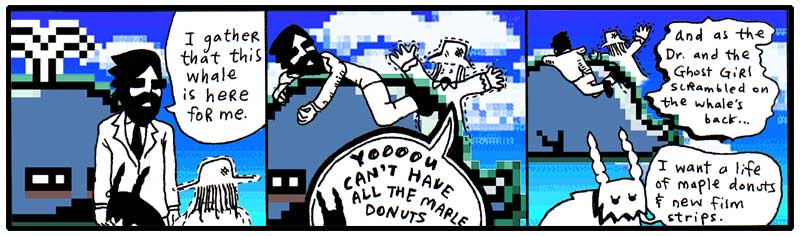

Sure, it took a minute for the goat to cut his wish down to ten letters, but he
was shortly on his way, following the same jet streams up into the sky, up toward
Dr. Cham and his ghost niece Hannah. Up toward the villanous animal combo pak
called The Originals. Up toward The Rockettes.

And Digger Dosh bludgeoned and feasted on each second they left behind them.


  [1]: expansion-pak-1.html
