---
hide:
  - toc
---

# 5. Downtown Wixl

{.center}

[TOC]


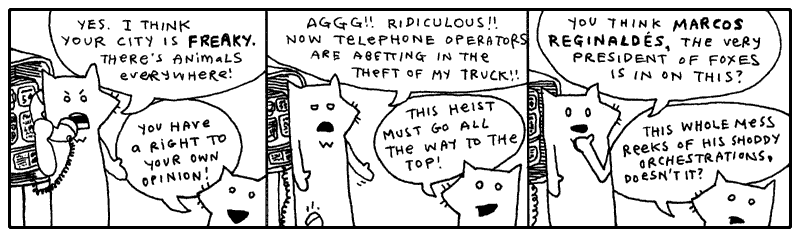


    Oblivious to their involvement in the expansive plan of The Originals, both the
    tall fox and the much shorter fox had wandered right into the red alert zone,
    the city **Wixl**. 

!!! story ""
    I desire a spatula to scoop them aside with, shuffle them off to
    the coast near the beach hatcheries, hide them in piles of fish eggs, hold down
    their pointy ears, concealing their luxurious hides. And above them I would
    stand, casting an unmoving shadow, holding my rifle aloof.

    I can’t. I have you to teach. I have to groom and care for myself. The
    lightbulbs upstairs need changing. A free pack of halogen lightbulbs just showed
    up out of the mail. Somebody out there is obviously trying to get me to use
    them. So I’m going to screw ‘em in. And just stand there, casting an unmoving
    shadow, holding my rifle aloof.

    Should that shadow be nice and defined, then I’ll keep ‘em.


## 1. If I Were Looking For a Vehicle

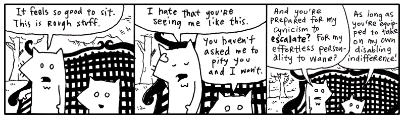

!!! story ""
    I like seeing these two out in the wild. They got pretty bored here in the
    studio. They started making up weird slogans and stuff. They had some phrase
    they kept repeating, forming fixations upon. You can’t be exposed to all that
    contrived fox nonsense.

    Let’s just say: I am really trying my best to keep things collegiate. Having
    never attended college, I can’t well say if every passage written chimes right
    with the stringent criteria which academia demands. I have university friends
    aplenty, some who tour the globe in their pursuits, and I try to inflect my
    voice with just their blend of high culture.

    Sometimes I applaud myself for going beyond the work of my educated friends—only
    in quiet corridors, we never butt heads publicly—because _I have actually
    subscribed_ to a school of thought while they are still in their books, turning
    and turning.

**I am a preeventualist.** I have dabbled in it long enough and am glad to come
forth with it. Inevitably, some of you have already started mining this book for
Marxist symbology. I am sad to kill those interpretations, but I believe any
nihilist conclusions you’ve drawn will still hold up under scrutiny.

??? question "Preeventua-what?? Is this a cult?"
    Preeventualists are constantly on the verge of realization. That means they are always the seeker, never the knower. Stuck in this seeking state, they have no where to go. They have already arrived, lost. 

    As such, Preeventualists learn to embody frustration with society and all its various forms of thinking. "These ideas are all wrong" they say. "The actual *corrected* ideas and theories are still on there way, but will always be arriving the day after tomorrow." 

    Yes, we are a cult and recruiting new members. [Join now.][3]

Anyway, I’ll drop the rhetoric. I only mention preeventualism because, aside
from being a refreshing and easy alternative to the post-modernism we’re born
with, _this_ meta-cult offers a free lost-and-found service for the residents of
Wixl city.

```python
import requests

response = requests.get("http://preeventualist.org/lost")
print(response.text)
```

You’ve learned a very simple technique for retrieving a web page from the
Internet. The code uses the `requests` package, which was written by one of my
favorite Pythonists, Kenneth Reitz. Requests hides much of the machinery behind 
HTTP and lets us treat information from the Internet much like information from 
a file: something we can open, read, and work with. If you haven't yet installed the 
request package, check [The Tiger’s Vest][1] (the first
expansion pak to this book, which includes a basic introduction to Python Shell, the interactive interpreter.)

I have no way of alerting the foxes to this service. And I’m sure it’s too soon
for their truck to be listed. Still, the good intentions are here.

If you’re connected to the Internet, the above Python should have downloaded the
web page from the Internet and printed it to the screen. In a message resembling
this:

```text
                   THE PREEVENTUALIST'S LOSING AND FINDING REGISTRY
          (a free service benefiting the ENLIGHTENED who have been LIGHTENED)

                                      ---
                      updates are made daily, please check back!
                                      ---

                         this service is commissioned and
                     subsidized in part by The Ashley Raymond
                                Youth Study Clan

                                      ...
                      all seals and privileges have been filed
                under the notable authorship of Perry W. L. Von Frowling,
          Magistrate Polywaif of Dispossession.  Also, Seventh Straight Winner
                   of the esteemed Persistent Beggar's Community Cup.
                                      ...

  ABOUT THE REGISTRY
  ==================
  Hello, if you are new, please stay with us.  A brief explanation of our service will 
  follow.  First, a bit of important news from our beloved magistrate.  (The kids call
  him Uncle Von Guffuncle. Tehe!)

  IMPORTANT NEWS
  ==============
  / 15 April 2005 /
  hi, big news.  we were on channel 8 in wixl and ordish.  cory saw it.  i was on and 
  jerry mathers was on.  if you didn't see it, e-mail cory.  he tells it the best.  all 
  i can say is those aren't MY hand motions!! (joke for people who watch channel 8.)  
  thanks harry and whole channel 8 news team!!
                                                   - perry

  / 07 April 2005 /
  we're all sifting through the carpet here at hq, but if you could all keep an eye out 
  for caitlin's clipboard, she's too quiet of a gal to post it and i know that it's 
  REALLY important to her.  she had a few really expensive panoramic radiographs of her 
  husband's underbite clipped to a few irreplaceable photos of her husband in a robocop 
  costume back when the underbite was more prominent.  she says (to me), "they'll know
  what i mean when they see them."  i don't know what that means.  :(

  i've checked: * the front desk * the hall * the waiting area * the bathroom * the candy 
  closet * the big tv area * the lunch counter * the disciples room * gaff's old room
  (the one with the painting of the cherry tree) * the server room * staircase.  i'll 
  update this as i find more rooms.
                                                   - love, perry

  / 25 Feb 2005 /
  server went down at 3 o'clock.  i'm mad as you guys.  gaff is downstairs and he'll 
  be down there until he gets it fixed. :O -- UPDATE: it's fixed, back in bizz!!
                                                   - perry

  / 23 Feb 2005 /
  i know there's a lot of noise today.  stanley bros circus lost twelve llamas and a
  trailer and a bunch of Masterlocks and five tents.  they're still finding lost stuff.
  pls keep your heads, i need everyone's help.  these entertainers have _nothing_.  i 
  mean it.  i gave a guy a purple sticker today (it's just something i like to do as a
  kind gesture) and he practically slept on it and farmed the ingredients for pizza sauce
  on it.  they are on rock bottom.

  so please donate.  i know we don't have paypal or anything.  so if you want to donate,
  just post that you found something (a children's bike, a month of perishable canned 
  goods) and that it has the circus people's names written on it or something.
                                                   - great, perry

  / 15 Nov 2004 /
  preeventualist's day sale.  if you lose something today, you get to pick one free 
  item (of $40 value or less) from the house of somebody who found something.  we're 
  having so much fun with this!!  this is EXACTLY how i got my rowing machine last year
  and i LOVE IT!!
                                                   - perry
```

I think the Youth Study Clan is doing a great job with this service. It’s a
little hokey and threadbare, but if it can get animals to stop using their
instinctive means of declaring ownership, then hats off.

Still, a preeventualist youth group? How can that be? You’ve got to at least
*flirt with real cynicism* before you can become a preeventualist. And you
definitely can’t attend school. So, I don’t know.

Going back to the list of instructions from the Preeventualist’s Losing and
Finding Registry.

```text
USING THE L&F SERVER
 ====================
 The L&F is a free service.  The acts of losing and finding are essential qualities in
 building a preeventualist lifestyle.  We hope to accommodate your belief.

 We do not use HTML, in order to simplify our work here.  Our guys are already working
 fifteen hour days.  (Thanks, Terk!!  Thanks, Horace!!)

 You may search our service for your lost items.  Or you may add your lost (or found)
 item to our registry.  This is done by typing the proper address into your browser.

 SEARCHING
 =========
 To search for lost items, use the following address:

   http://preeventualist.org/lost/search?q={search word}

 You may replace {search word} with your search term.  For example, to search for "cup":

   http://preeventualist.org/lost/search?q=cup

 You will be given a list of cups which have been lost or found.

 If you want to search for only lost cups or only found cups, use the `searchlost` and
 `searchfound` pages:

   http://preeventualist.org/lost/searchlost?q=cup

```

I’m not playing games. I know where the truck is. Really, I’m not teasing you.
I’ll show you in just a sec. I’m just saying, look at the foxes:

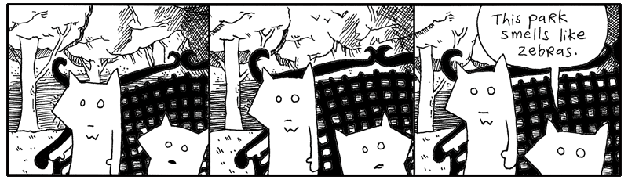

They are helpless. And yet, here is this great tool. A possible key to getting
out of this mess. I just want to poke around, see if there are any clues here.

```py
# Searching all found items containing the word `truck'.
import requests

url = "https://preeventualist.org/lost/searchfound"
response = requests.get(url, params={"q": "truck"}, timeout=10)
response.raise_for_status()
print(response.text)
```

I’m not seeing anything about the tall fox’s truck in this list. That’s okay.
The foxes are out of it anyway. We have some time.

In a previous chapter, we stored your diabolical ideas in a text file. To retrieve those ideas, Python uses the `open()` function.

Most of the time, you'll use `open()` with a `with` statement to access a file objects:

```py
with open(
    "idea-about-hiding-lettuce-in-the-church-chairs.txt",
    encoding="utf-8",
) as response:
    print(response.read())
```

The `with` statement makes sure the file is properly closed when you're finished with it.

Files are only one source of information. The Internet is overflowing with data waiting to be hauled into your program. Using the requests library, reading from a web server can feel surprisingly similar.

```py
import requests

response = requests.get(
    "https://example.com/idea-about-hiding-lettuce-in-the-church-chairs.txt"
)

print(response.text)
```

The object returned by `requests.get()` isn't a file, but the idea is familiar. You ask for some information from the web and receive an object that gives you access to it. We don't use with here because the response is downloaded immediately. If we were streaming the response with `stream=True`, using `with` would help ensure the connection is properly closed when we're done.

Whether the data comes from a file on your computer or a server on the other side of the planet, the pattern is usually the same:

* Open a connection to a source of information.
* Read some data.
* Do something useful, questionable, or highly suspicious with it.

Here the method used to 'read some data' is a bit different each time, but in each case, it gives the content we are interested in: 

```py
# A web response using built-in `urllib.requests`
import urllib.request
with urllib.request.urlopen(url) as response:
    print(response.read().decode("utf-8"))

# A web response using `requests` library
import requests
response = requests.get(url)
print(response.text) # automatically handles decoding the text

# A file response
with open("story.txt", encoding="utf-8") as response:
    print(response.read())
```

This broader category of reading and writing information is called input and output, or simply IO.

In Python, IO is split over many different modules, grouped by their primary purpose.

`Core & Local File I/O` is split between a few modules: 

* `os` Module: includes functions like os.open(), os.read(), and os.write(), which we just used to read an image. 
* `io` Module: module for handling stream-based I/O including things like reading an image into a virtual file object.
* `pathlib` Module: includes convenient, high-level shortcuts for reading and writing files.

`Network & Web I/O` is split between Python libraries and the popular package `requests`:

* `requests` Package: popular, third-party library celebrated for its "HTTP for Humans" syntax.
* `urllib` Package: built-in package in the Python standard library designed for working with URLs (less user-friendly than requests library).
* `socket` Module: thin wrapper over the OS's hardware-level network interface.

IO is your program's ticket to the outside world. It's the rays of sunlight slipping through the prison bars. Through IO, a Python program can communicate with files, web servers, network connections, databases, in-memory streams, and all sorts of contraptions beyond its little cell.

The important thing to remember is that information can come from many places. A local file. A web page. An API. A network service. Different sources, but often the same goal: open a connection (using `with` when something have to remember to closed something at the end), read some data, and let the mischief begin.


<aside class="sidebar" markdown="1">
**The Inadvertent Meteor**

_When I first began my inquiry into preeventualism, I was relayed the following
story. I was told that this was all I needed to understand the philosophy._

There was this sculptor who just wasn’t satisfied with his work. He had
primarily studied traditional subject matter and excelled at sculpting both the
human figure and elaborate vegetation. And he was really quite an exquisite
sculptor. He just didn’t feel like he was making his mark upon the world.

By this time, he had aged well into his fifties and wanted to vaunt into the
realm of legendary masters. So he began to construct a massive sculpture of two
pears with beads of dew clinging precariously to them.

The sculpture was enormous and hovered ominously above the sculptor’s hometown,
held aloof by a massive infrastructure of struts and beams. In fact, the giant
pears were so significant that they truly wreaked havoc on the Earth’s rotation,
ever so slightly, what with a new asteroid-sized fruit basket clinging to it.

The government sent jets and war crafts to destroy the statue. They unleashed a
vicious attack on the village, dismantling the statue, blowing it into thousands
of pieces, chipping away at it with missiles. Soon enough, the statue was
obliterated and all was back to normal.

A huge chunk of the statue had taken orbit in the heavens and often veered
perilously close to the planet. When it did, it was always met by an arsenal of
advanced weaponry, which further damaged it and deflected its course skyward.

Eventually, this inadvertent meteor was nothing more than the size of a very
daunting man. And, when it at last hit the ground, weathered and polished by its
ninety year journey, it was hailed as an enigmatic masterpiece, a message from
the great beyond. Here was a stunning likeness of a male nude looking wistfully
into the sky with an intricate lace work of vines creeping around his waist and
covering his improprieties.

The statue was last sold for fifty-two million dollars and stayed in the
permanent exhibit at the Louvre, with the plaque:

> “Heavenly Nude” by Anonymous
</aside>

### Reading Files Line by Line

When you’re using Python to get information from the web, you can read the entire response at once, or you can process it one line at a time. Reading line by line is useful when you’re searching for something specific, or when the response is large and you want to conserve your computer’s memory.

```python
import requests

with requests.get(
    "https://preeventualist.org/lost/search",
    params={"q": "truck"},
    stream=True,
    timeout=10,
) as response:
    response.raise_for_status()
    for line in response.iter_lines(decode_unicode=True):
        if "pickup" in line:
            print(line)
```

The above code retrieves the list of trucks found by preeventualists, then displays only those lines that contain the word `"pickup"`. That way, we can trim away the descriptions and look for only the pertinent lines.

The expression

```python
"pickup" in line
```
uses Python’s **`in` operator** to search a string. It asks whether the string `"pickup"` occurs anywhere inside `line`.

```pycon
>>> "pickup" in "A blue pickup truck was found."
True

>>> "pickup" in "A red sedan was found."
False
```

When you retrieve a web page normally, you can read the entire response into memory:

```python
response = requests.get(url)
text = response.text
```

Usually, this is perfectly fine. Most web pages are only a few thousand bytes or perhaps a few megabytes. But if a response is very large, loading the whole thing into memory at once may be wasteful.

That's where `stream=True` comes in:

```python
url = "https://preeventualist.org/lost/search"
with requests.get(url, params={"q": "truck"}, stream=True, timeout=10) as response:
    response.raise_for_status()
    for line in response.iter_lines(decode_unicode=True):
        if "pickup" in line:
            print(line)
```

With streaming enabled, `requests` can process the response incrementally rather than loading its entire contents into memory. The `iter_lines()` method gives us one line at a time, so we can examine each line as it arrives.

The same idea works with ordinary files (make a file "trucks.txt" and add the line pickup your truck to it):

```python
with open("trucks.txt") as truck:
    for line in truck:
        if "pickup" in line:
            print(line)
```

Notice how similar the two examples are. Whether the lines are coming from a file or from a web response, Python lets us process them with a `for` loop. This ability to work with different kinds of objects in the same way is one of Python's most useful ideas: **if an object can be iterated over, you can loop over it.**

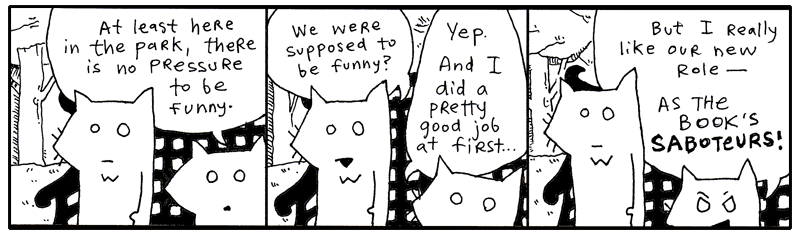

And that's going to become important. A `for` loop isn't limited to lists. Python can iterate over files, strings, network responses, generators, and objects you create yourself. In the pages ahead, we'll take a closer look at how this works, and how you can make your own objects produce values one at a time.

Many of the objects we've already used are doing exactly that. A file doesn't hand a `for` loop every line at once. Instead, it produces lines one at a time as the loop asks for them. This approach is memory-efficient and allows Python to work with very large amounts of data.

One of Python's most useful tools for producing values on demand is the generator.

### Yielding is Kiddie Generator

Python often uses generators to provide data one piece at a time. Rather than building an entire collection in memory up front, a generator produces values only when they are needed.

You've already seen this idea with files and streamed web responses. Instead of loading every line at once, Python lets us process lines as they arrive. Generators work the same way.

The easiest way to create a generator is with the yield keyword.

```py
def count_to_three():
    yield 1
    yield 2
    yield 3
```

This looks like an ordinary function, but it behaves differently. Calling it doesn't immediately run the code.

```pycon
>>> numbers = count_to_three()
>>> numbers
<generator object count_to_three at ...>
```

Instead of returning a final answer, Python gives us a generator object.

To get values from the generator, we use the next() function.

```pycon
>>> next(numbers)
1

>>> next(numbers)
2

>>> next(numbers)
3
```

Each call to next() resumes the function where it last stopped.

You can imagine yield as a blinking red button inside the function. Whenever the button is pressed, the function pauses, hands a value back to the caller, and waits patiently for the next request.

def count_to_three():
    yield 1  # pause here
    yield 2  # resume, then pause again
    yield 3  # resume, then pause again

The function remembers exactly where it left off. Variables, loops, and other state remain intact between calls. Like punctual monk with infinite patience the generator always gives exactly one answer, hands it over, pauses, and runs back to get the next one only when you request it again.

Generators are memory-efficient, fast to write, and highly readable and that's exactly where generators become useful.

Imagine we've got 10,000 gidgets to process...

```python
# A giant list of 10,000 gidgets to process
all_gidgets = list(range(0, 10_000))

def batch_processing(gidgets, batch_size=100):
    """
    Yields manageable chunks of data, one at a time.
    """
    for i in range(0, len(gidgets), batch_size):
        yield gidgets[i : i + batch_size]  # hand off the next chunk
```

We start with a lot of data that will take a long time to process, break it down into chunks, and yield one chunk at a time. So `yield` is the perfect tool to use. With the new batch processing code setup, the foreman calls in the first batch and takes care of business, processing the 100 gidgets. 

```pycon
>>> warehouse = batch_processing(all_gidgets)
>>> first_batch = next(warehouse)
>>> takin_care_of_business(first_batch)
```

Now that the first batch is done, the foreman calls up to the control room."Send more!"

All we need to do is run the batch_processing again and another 100 gidgets come down the chute!
```pycon
>>> second_batch = next(warehouse)
>>> takin_care_of_business(second_batch)
```

Keep 'em coming! Send a couple hundred this time!

```pycon
>>> double_load = next(warehouse) + next(warehouse)
>>> takin_care_of_business(double_load)
```

And the day went on processing batch after batch of gidgets, until no one wanted to ever see a gidget again. 

So, what does the `yield` keyword has to do with gidgets? And really, it’s a good question, and I believe the gidget analogy provides a good answer. Let's assume we are talking about the pop-culture icon Francine "Gidget" Lawrence performed by Sandra Dee and Sally Field. You see, Gidget is the story of a young girl coming to age in a crazy world.

Moondoggie: "Don't you find Kahuna to be a little on the lazy side?" Gidget: "Love makes room for fault." In a scary, unpredictable world, Gidget accepts and loves us faults and all, as we mature and come into our own, line by line.


#### Iterators 
You've already been using `iterators` without realizing it. A for loop works by repeatedly asking an object for its next value.

For example, a list isn't itself an iterator, but Python can create one from the list using the iter() function:

```pycon
>>> lines = ["first, birth.",
...          "then, a life of flickering images.",
...          "and, finally, the end."]

>>> stream = iter(lines)

>>> next(stream)
'first, birth.'

>>> next(stream)
'then, a life of flickering images.'

>>> next(stream)
'and, finally, the end.'
```

The next() function pulls the next item from an iterator. Think of it as turning on the conveyor belt so another gidget rolls down from the warehouse rafters.

Once an iterator runs out of values, it raises a StopIteration exception:

```pycon
>>> next(stream)
Traceback (most recent call last):
    ...
StopIteration
```
  
  (For loops quietly handle this exception for us!)

Generators and iterators work together very closely. In fact, as we have seen, every **generator is already an iterator:**
```pycon
>>> gidgets = batch_processing(all_gidgets)

>>> next(gidgets) # batch of 100
[0, 1, ..., 99]
```
Because generators are iterators, they work naturally with for loops, comprehensions, and any Python tool that expects a stream of values.

You can even build your own iterators by defining special methods such as __iter__() and __next__(). However, caution, that usually requires keeping track of state yourself and raising `StopIteration` at exactly the right moment. For many tasks, a generator is the *simpler solution*. A single yield statement gives you an iterator automatically.

#### Practical uses for Generators 

Generators shine whenever data arrives gradually or is too large to comfortably keep in memory all at once.

For example, we can lazily read a file one line at a time:

```py
def read_file(path):
    with open(path) as f:
        for line in f:
            yield line
```

Using the generator:

```py
for line in read_file("gidgets.txt"):
    process_gidget(line)
```

Notice that the entire file is never loaded into memory. Each line arrives only when the loop asks for it.

The same pattern appears throughout Python whether traversing directories, querying databases, or processing gidgets:
```py
# Walking through a directory
for filename in Path(".").iterdir():
    print(filename)
# Streaming rows from a database
for row in query_database():
    process(row)
# Processing batches of records
for batch in batch_processing(all_gidgets):
    takin_care_of_business(batch)
```

Generators can even produce endless streams of data:
```pycon
>>> def forever_squares():
        n = 0
        while True:
            yield n**2
            n += 1
>>> counter = forever_squares()
>>> next(counter)
0
>>> next(counter)
1
>>> next(counter)
4

...

>>> next(counter)
15159273129
```

The generator never creates an infinite list. It simply calculates each value when asked.

A generator is like a punctual warehouse worker. Instead of dumping ten thousand gidgets on your desk, he arrives carrying *exactly* one crate. He waits patiently until you ask for another, then disappears into the warehouse and returns with the next load. The worker never loses his place in line, never forgets what comes next, and never clutters the warehouse floor with more gidgets than you can handle at once.

That's why generators are so common in Python. They're memory-efficient, easy to write, and perfectly suited to processing data one piece at a time.

(If you are still not convinced by this analogy of Gidget, it's okay. Trust and move on like a good preeventualist.)

### Preeventualism in a Gilded Box

You've learned quite a bit about the `requests` library and fetching information from the web. You know your way around modules, functions, and the occasional junk drawer full of forgotten code. Really, you can start rummaging through the Wixl lost-and-found service without me.

Let's neatly *encapsulate* the entire service into a single module.

```python
import requests

BASE_URL = "http://preeventualist.org/lost/"


def open_page(page, query):
    response = requests.get(BASE_URL + page, params=query)
    response.raise_for_status()
    return response.text.split("--\n")


def search(word):
    return open_page("search", {"q": word})


def search_lost(word):
    return open_page("searchlost", {"q": word})


def search_found(word):
    return open_page("searchfound", {"q": word})


def add_found(your_name, item_lost, found_at, description):
    return open_page(
        "addfound",
        {
            "name": your_name,
            "item": item_lost,
            "at": found_at,
            "desc": description,
        },
    )


def add_lost(your_name, item_found, last_seen, description):
    return open_page(
        "addlost",
        {
            "name": your_name,
            "item": item_found,
            "seen": last_seen,
            "desc": description,
        },
    )
```

At some point with your code, you need to start shaping it into something neat. Save the above code in a file called `preeventualist.py`.

This module is a very simple library for using the Preeventualist's service.

This is exactly how many Python libraries begin. You gather related functions together, store them in a file, and, if you're happy with the result and want the world to benefit, publish it for others to use.

These stragglers can import your module just as we imported `requests` earlier.

```pycon
>>> import preeventualist

>>> print(preeventualist.search("truck"))

>>> print(
...     preeventualist.add_found(
...         "Why",
...         "Python skills",
...         "Wixl Park",
...         "I can give you Python skills!\nCome visit poignantguide.net!"
...     )
... )
```

The important thing isn't the lost-and-found service itself. The important thing is that we've hidden all the tedious details—URLs, query strings, and web requests—behind a handful of friendly function calls. Users of our module don't need to know how the service works. They simply ask for what they want, and the module does the legwork.


## 2. Meanwhile, The Porcupine Stops To Fill-Up


## 3. Walking, Walking, Walking, Walking and So Forth

!!! story ""
    The evening grew dark around the pair of foxes. They had wound their way through alleys packed with singing possums, and streets where giraffes in rumpled sportscoats bumped past them with their briefcases. They kept walking.

    And now the stores rolled shut their corrugated metal lids. Crickets crawled out from the gutters and nudged at the loose change.

    

    “Anyway, you must admit he’s a terrible President,” said Fox Small. *Why* does President Marcos have a rabbit as Vice President of the Foxes.”

    “The Vice President? The rabbit with the *eyebrows*?”

    “No, the rabbit with the **huge sausage lips**,” said Fox Small.

    But their conversation was abruptly interrupted by a freckly cat head which popped from the sky just above the sidewalk.

    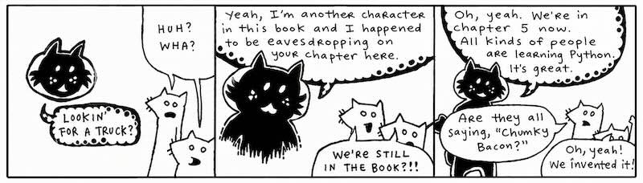

    What is this about?!

    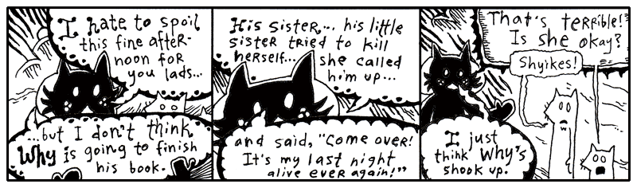

    Oh, come on. This is rich. More meta.

    I’m not going to bother illustrating this discussion Blix had with the foxes at this point! It’s all a **bunch of *conjecture***. *HOW* can they presume to know the landscape of my family drama? I love my sister. For a long time, I *worshipped* her. (This is my sister Quil.)

    I admit that there was a pretty painful day a few months ago and I kind of freaked out. I was laid out on the long patio chair by the pool in my mom’s backyard. I had a Dr. Pepper and a bit of German chocolate cake. I was eating with a kid fork. Everything else was in the dishwasher, that’s all they had. Three prongs.

    My mom started talking about Quil. All about how much money she was blowing on pants and purses. A five-hundred dollar purse. And then she said, “She’s losing it. She sounded totally high on the phone.” (She nailed it on the head, Quil was smoking dope and loving it.)

    So I’d been noticing how observant my mom could be. That’s why, when she said, “I actually think she’s on cocaine,” I *physically* stood up and chucked my soda across the yard.

    It sailed off into the woods somewhere. We had been talking awhile, so it was dark when the can flew. I paced a bit. And then I screamed at the top of my lungs.

    My uncle Mike was standing there with the glass door open, staring at me. He said something totally nervous like, “Oh, okay. Well, I’ll—” And the tea in his glass was swishing back and forth, sloshing all over. He disappeared. He’s not very good at saying things to people. He’s more of a whistler. And resonant.

    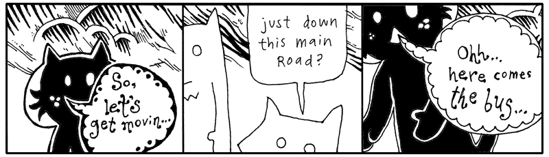

    So, to be completely honest, yes, I got a little mad. I got mad. You know. I dealt with it. Quil calls me regularly. For some stupid reason, I rarely call her.

    Plus, she didn’t end up killing herself. So it’s just not an issue. Who knows if it was real. She just had a lot of vodka. And she’s little. So it was just scary to see Quil guzzling it down like that. I mean forcing it down.

    But why talk about it? It’ll just make her feel like I’m disappointed. Or like I’m a jerk.

    Well, I got off track there a bit. Where was I? Blix is basically helping the foxes around, getting them on the trail of their truck. Yeah, back to all that.

    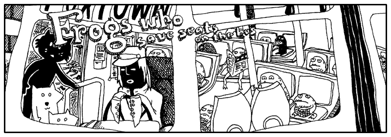

    “We can’t squeeze on to this bus,” said the smallest fox.

    “Guys, walk on up,” said Blix. “What’s the hold up? Oh, the frogs. Yeah, just squeeze through.” Blixy pushed from behind.

    “Hey,” said the Tall Fox. “I’m crammed on this little step! Somebody move!”

    “Did you get through—young fox??” said the cat.

    “No,” said Fox Small, “can’t you see? The driver keeps shaking his head and it’s *really* making me nervous. I don’t think he wants us on.”

    “Go,” said Blix. He stepped down from his step and walked around the bus, peering through the plexiglass windows. “Well, I don’t know, guys. I dunno. I guess it’s got a lot of frogs.” He pounded on the window. “Hey! Move over!”

    And that’s the reality of riding intercity transit in Wixl. It’s terribly competitive. The morning bus is so crowded that most white collar animals get frogs to hold their seat through the nighttime. For whatever reason, it works. It’s become this staple of their workflow and their economy.

### Printing with %, format(), and f-strings
If you can muster up a bit of imagination, you can see a **percent sign** as a frog’s slanted face. Got the picture in your head? Now let me show you frogs that camp out inside strings.

```pycon
>>> "Seats are taken by %s and %s." % ("a frog", "a frog with teeth")
'Seats are taken by a frog and a frog with teeth.'

>>> frogs = (44, 162.30)
>>> stats = "Frogs have filled %d seats and paid %f blue crystals."
>>> stats % frogs
'Frogs have filled 44 seats and paid 162.300000 blue crystals.'
```

The `%s` format is for placing strings. The `%d` format is for placing integers, while `%f` is for floating-point numbers.

Python's `%` string formatting is an older style of string formatting that is still supported today. The values are placed into the string according to the format specifiers. If you provide several values, put them in a tuple.

Formatting is flexible with types. For example, `%s` will convert almost anything to a string:

```pycon
>>> frogs = ("44", "162.30")
>>> "Frogs have filled %s seats and paid %s blue crystals." % frogs
'Frogs have filled 44 seats and paid 162.30 blue crystals.'
```

See, here's the `%` operator called like other operators:

```pycon
>>> "Please move over, %s." % "toothless frog"
'Please move over, toothless frog.'
```

You can also use the `str.format()` method, which provides another way to build strings:

```pycon
>>> "Frogs are piled {} deep and travel at {} mph.".format(5, 56)
'Frogs are piled 5 deep and travel at 56 mph.'
```

For the most part, you’ll encounter `%s` for strings, `%d` for integers, and `%f` for floating-point numbers when reading older Python code. For new code, f-strings are often the clearest choice, but `str.format()` remains useful when a format string is stored separately from its values.

Yeah, so, frog formatting is really handy for building strings that are assembled from different kinds of data. But there’s another trick worth knowing. You can control the order in which values appear by using numbered fields with `str.format()`:

```pycon
>>> "This bus has {0} more stops before {1} o'clock. That's {0} more stops.".format(16, 8)
"This bus has 16 more stops before 8 o'clock. That's 16 more stops."
```

You can also allot a certain number of characters for each item, a width. If an item is smaller than the width, extra spaces will be used to pad it. A negative width in the old `%` formatting syntax left-justifies the value:

```pycon
>>> "In the back of the bus: %30s." % "frogs"
'In the back of the bus:                          frogs.'

>>> "At the front of the bus: %-30s." % "frogs"
'At the front of the bus: frogs                         .'
```

!!! story ""
    Fox Small kept looking up at the bus driver. Remember, he wouldn’t enter the bus!

    “What’s the deal?” said Fox Tall. “Can’t you just get on and we’ll just stand in the aisle?”

    “You really want to get on this bus? That driver has no hands,” said Fox Small, speaking close and hushed to Fox Tall, “and all he has, instead of hands, are sucker cups.”

    “So what? You don’t think animals with tentacles can drive?”

    “Well, not only is he going to flub up the steering wheel but he has all these legs all over the foot pedals. This is not smart. Let’s get another bus. Come on.”

    “You know, he’s probably been driving like that all day. Is he really going to start crashing at this point in his career?”

    “Buses do crash,” said Fox Small. “Some do. This smells crashworthy.”

    “Sheer doo-doo!” And Fox Tall yelled to the driver, “Hey, cabby, how long have you been driving this bus for?”

    The bus driver peered over darkly under his cap and started to turn toward them, but his tentacles were stuck to the wheel. He jerked swiftly at his forelegs and, failing their release, he turned to the wheel and focused his energies on milking his glands for some slicker secretions. Bubbles of mucus oozed.

    “Let’s get outta here,” said Fox Tall and the two ran off into the street, slamming right into the cat Blix.

    “Alright, well, the bus is full,” said Blix. “I don’t know why the driver stopped if he knew the bus was crammed with hoppers.”

    “We’re thinking he was about to crash into us,” said Fox Tall, “and he opened the door to make it look like a planned route stop.”

    “Keep in mind, Blix, we hadn’t really discussed that possibility out loud, so I haven’t had a chance to formally agree,” said Fox Small. “Nevertheless, it sounds rational to me.”

    “I’m thinking all the buses are going to be full like this.” Blix bit his lip, thinking and flicking his eyes about. “Let’s just—” He pointed down the circuitry of apartment buildings that wound to the south. “But maybe—” He looked up and surveyed the stars, scratching his head and counting the constellations with very small poking motions from the tip of his finger.

    “Are you getting our bearings from the stars and planets?” asked Fox Small.

Blix didn’t speak, he ducked off to the north through a poorly laid avenue back behind the paint store. But before we follow them down that service road, Smotchkkiss, I have one more frog for you, perched on a long lilypad that stretches out to hold anything at all.

```pycon
>>> cat = "Blix"
>>> print(f"Does {cat} see what's up? Is {cat} aware??")
Does Blix see what's up? Is Blix aware??
```

The little frogs from earlier (`%s` or `%d`) were only placeholders for single values, saving places in the string.

The lilypads above use a different trick. Inside an **f-string**, curly braces mark an expression that Python evaluates and inserts into the string. The `f` before the opening quote tells Python to create a formatted string.

An empty pair of curly braces isn't valid in an f-string:

```pycon
>>> f"{}"
  File "<stdin>", line 1
    f"{}"
      ^
SyntaxError: f-string: empty expression not allowed
```

When an expression appears inside the curly braces of an f-string, Python evaluates it and places the result in the string. This is called **string interpolation**.

```pycon
>>> fellows = ["Blix", "Fox Tall", "Fox Small"]
>>> print(f"Let us follow {' and '.join(fellows)} on their journey.")
Let us follow Blix and Fox Tall and Fox Small on their journey.
```

The lilypad can hold much more than a simple variable. You can call methods, use conditional expressions, and perform calculations right inside the braces.

```pycon
>>> blix_went = "north"
>>> direction = (
...     "a poorly laid avenue behind the paint store"
...     if blix_went == "north"
...     else "the circuitry of apartment buildings"
...     if blix_went == "south"
...     else "... well, who knows where he went."
... )
>>> print(f"Blix didn't speak, he ducked off to the {blix_went} through {direction}.")
Blix didn't speak, he ducked off to the north through a poorly laid avenue behind the paint store.
```
!!! story ""
    The foxes followed Blixy off behind the paint store and down the cracked, uneven asphalt. All of the stores on the dilapidated lane leaned at angles to each other. In some places, slabs of sidewalk jutted up from the ground, forming a perilous walkway, a disorderly stack of ledges. Almost as if the city planners had hoped to pay tribute to the tectonic plates. One small drug store had slid below the surface, nearly out of eyesight.

    Truly, it was colorful, though. The paint store had been tossing out old paints directly onto its neighbors. The shops nearest the paint store were clogged with hundreds of colors, along the windowsills and in the rain gutters. Yes, on the walls and pavement.

    Basically, beginning with the back porch of the paint store, the avenue erupted into a giant incongruous and poorly-dyed market.

    Further down, a dentist’s office was primed with red paint and, over that, a fledgling artist had depicted a large baby who had fallen through a chimney and arrived in a fireplace full of soot. Crude black strokes marked the cloud of ashes raised during impact, easily mistaken for thick hair on the child’s arms and back. The child looked far too young to have much hair, but there they were: rich, blonde curls which toppled liberally from the child’s head. Under the child’s legs was painted the word *BREWSTER*.

    The same artist had hit the library next store and had hastily slapped together a mural of a green sports car being pulled from the mud by a team of legless babies tugging with shiny chains. Again, the drastically blonde curls!

    “I need answers,” said the Fox Tall, who had ground to a halt in front of the scenery.

    “I’m starting to believe there’s no such thing,” said Fox Small. “Maybe these are the answers.”

    “Brewster?” said Fox Tall. He walked nearer to the library and touched the cheek of one of the legless children who was closer in perspective. The child’s cheek appeared to contain a myriad of jawbones.

    Blix was another two houses down, navigating through the askew brickwork, the paved gully that led to *R.K.’s Gorilla Mint*, as the metallic sticker on the door read. The building was plastered with miniature logos for the variety of payment options and identification acceptable at *R.K.’s Gorilla Mint*. Even the bars over the window were lined with insurance disclosures and security warnings and seals of government authorization, as well as addendums to all of these, carbon paper covering stickers covering torn posters and advertising. And all mingled with paint splashes that intruded wherever they pleased.

    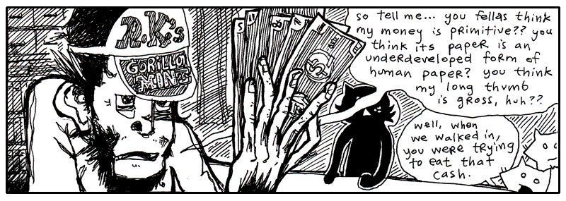

    “I like the way the fresh paper feels against my tongue,” said the gorilla at the counter. His fingers rubbed quietly against the bills. He drew his face near to the fanned currency and whisked his nose along the pulpy cash.

    “Is R.K. in this evening?” asked Blix.

    “R.K. is not,” said the gorilla cashier. He turned to the three travelers and spread his money out on the counter’s surface, evenly spacing them apart and lining up all the edges neatly. “Now, which one of these do you think is worth the most?”

    The foxes looked over the different bills and Fox Small muttered to himself, “Well, maybe—no, but I’ll bet—Wait, does one of these have bananas on it? ‘Cause that one—nope, no fruit or rope swings or—Terrible, this is difficult!” And in a lower voice, “So difficult to read. What does this one say? Symbols or something? If all these bills have are symbols, it’s going to be impossible for us to figure out which one is of the greatest value.”

    “That’s why I said, ‘*Guess*.’” The gorilla tapped each bill in order. “See, you’ve got a 1 in 5 chance.”

    “Unless the symbols mean something,” said Fox Tall. “Unless we can figure it out.”

    “We can figure it out,” said Fox Small.

    “No,” said the gorilla. “The symbols are meaningless.”

    “Whoever created the money intended some meaning for them,” said Fox Small. “Why use *this* symbol?” He pointed to an ampersand printed in dark ink.

    “Yeah, we saw you sniffing the money and fantasizing about it back there,” said Fox Tall. “I’ll bet these symbols mean all kinds of things to you!”

    “No, I don’t think so,” said the gorilla.

    If I can weigh in at this point, I think the symbols do have meaning. They may not be *loaded* with meaning, it may not be oozing out through the cracks, but I’m sure there’s a sliver of meaning.

    “I don’t remember you.” Blix looked at the gorilla with great interest. “Are you one of R.K.’s kids or something?”

    “Oh, come on!” said Fox Small, holding up a bill with an exclamation mark on it up to the gorilla’s nose. “Don’t tell me this means *nothing* to you! This one is probably *really important* since it has an exclamation on it. Maybe it pays for emergency stuff! Hospital bills or something!”

    “Yeah, surgery!” said Fox Tall.

    The gorilla looked at the foxes with disgust from under the brim of his cap.

    “No, you’re wrong. You can’t pay for surgeries with that.”

    “But you see our point,” said the small fox. He grabbed some of the other bills. “And you say this bill *cannot* pay for surgeries? Well that sounds like it has a specific *non-surgery-related* purpose. Now, the question mark one. Oh, what would that one be for?”

    “Hey, give me those,” the gorilla snatched at the bills over the counter, but his long thumb kept getting in the way and every time he thought he had grabbed bills, it turned out he had only grabbed his long thumb.

    “Hey, hey, look, he’s mad,” said Fox Tall, happily clapping. “I wonder why. Did you notice how mad he started getting once we mentioned all these interesting meanings? **We’re on to you! We figured out your game so fast!**”

    “We totally did!” said Fox Small, one of his elbows caught in the grip of the gorilla, the other arm waving a bill that featured an underscore. “This one’s for buying floor supplies, maybe even big rolls of tile and linoleum.”

    “See,” said Fox Tall, working to pry the gorilla’s fingers free, “we just have to figure out which is more expensive: surgery or linoleum! This is *so easy!*”

    “**NO IT’S NOT!**” yelled the gorilla, yanking at the smaller fox and battering the fox with his palms. 

“**YOU DON’T KNOW ANYTHING ABOUT MONKEY MONEY!! YOU DON’T EVEN *HAVE* YOUR OWN KINDS OF MONEY!!**”

“We could *easily* have our own kinds of money!” said Fox Tall, taking the chimp’s hat and tossing it to the back of the room, where it sailed behind a wall of safety deposit boxes. “And—*your hat is outta here!*”

“Come on, give him back his bills,” said Blix, waving his arms helplessly from the sidelines. “We could really use this guy’s help.”

“Stop hitting me!” screamed the littlest fox. “I’ve almost figured out this one with the dots on it!!”

Suddenly, with great precision and without warning, Fox Tall grabbed the monkey’s nose and slammed his face down against the counter. The pens and inkpads on its surface rattled and “Bam!” said the fox. The gorilla’s eyes spun sleepily as his arms… then his neck… then his head slithered to the floor behind the counter.

### String Tools

Here are a few Python string tools you might care to use:

```pycon
>>> text = "Fox Small,Fox Tall,Gorilla\ninkpads,surgery,linoleum"
>>> for names in text.splitlines():
...     print(names)
Fox Small,Fox Tall,Gorilla
inkpads,surgery,linoleum
```
The "\n" within the string stands for new line. 

If you want to split on a particular separator, give it to `split()`:

```pycon
>>> "Jeff,Jerry,Jill\nMichael,Mary,Myrtle".split(",")
['Fox Small', 'Fox Tall', 'Gorilla\ninkpads', 'surgery', 'linoleum']
```

Feed a string into `.split()` and it emerges as a list of words. You jot out the words and let Python figure out where to cut, spaces by default, or pass in a delimiter.

```pycon
>>> fox_small = "Stop-hitting-me!".split("-")
>>> fox_small
['Stop', 'hitting', 'me!']
```


And if you want to join strings, use `join()`:

```pycon
>>> ["gorilla money", "blue crystals", "leaf tender"].__class__
<class 'list'>

>>> "".join(["candle", "soup", "mackarel"])
'gorilla moneyblue crystalsleaf tender'

>>> " * ".join(["candle", "soup", "mackarel"])
'gorilla money * blue crystals * leaf tender'

>>> " # ".join(["candle", "soup", "mackarel"])
'gorilla money # blue crystals # leaf tender'
```

The most important trick to remember is the syntax: you call `.join()` on the separator (the glue) like so: `"separator".join(list_of_strings)`. So in this case, we use `" # "` as our separator and join the list back into a long string.

??? warning "`join()` only works on lists of strings!"
    The string `join()` method only works if every item in your list is already a string. If your list contains numbers, Python will throw a TypeError. 
    
    The Wrong Way:
    ```py
    mixed_list = ["Year", 2026]
    # This will CRASH with a TypeError!
    print("-".join(mixed_list))
    # Output: TypeError: sequence item 1: expected str instance, int found
    ```

    The Right Way:
    To fix this, you must convert the numbers into strings first. A fast way to do this is using the `map` function. 
    ```py
    mixed_list = ["Year", 2026]
    # map(str, mixed_list) temporarily converts the 2026 into "2026"
    clean_string = "-".join(map(str, mixed_list))
    print(clean_string)
    # Output: Year-2026
    ```

Outside the *Gorilla Mint*, Blix scolded the foxes. “We could have used that guy’s help! If he knows where R.K. is, we could use his cunning!”

“We don’t need that ape’s money!” said Fox Small. “We can make our *own* money!”

“We could support electronic wristbands!” said Fox Tall.

“His money is worthless,” said Blix. “It’s gorilla money. It has no value. It’s worse than blue crystals.”

“But it serves a purpose,” said Fox Tall.

“No it doesn’t,” said Fox Small. “He just said it’s worthless.”

“But what about linoleum and surgeries?” said Fox Tall.

“Yeah,” said Fox Small, up at Blix. “What about linoleum and surgeries?”

“If all the hospitals were staffed by gorillas and all the home improvement chains were strictly operated by gorillas, then—YES—you could buy linoleum and surgeries. But I *guarantee* that you would have very sloppy linoleum and very hideous surgeries. I don’t think you’d make it out of that economy alive.”

“So, if R.K. is so cunning,” said Fox Tall, grinning slyly, “why does he print such worthless currency?”

“It’s a cover for other activities,” said Blix. “Besides, if you’re so smart, why did you resort to violently pounding that poor gorilla?”

“I guess that was a bad play,” said Fox Tall, hanging his head. “My friend here will tell you that I’ve been on edge all day.”

“And your rage finally reared its fuming snout!” said Fox Small. “You’re finally living up to your goatee.”

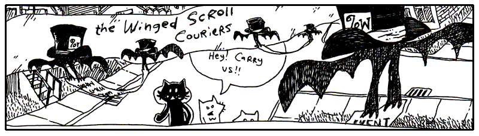

Down the lanes they travelled, the two foxes oblivious to their direction, but having a good time now that they had Blix leading the way with such urgency.

They lapsed into a careless wandering right behind Blix and spent their afternoon heckling most of the passersby.

One such target of their ongoing commentary was The Winged Scroll Carriers, pairs of bats that carry format specifiers which need to be immediately sworn and notarized. There can be no delay, they must go swift, there is not even time to roll up the scroll, no, they must drop their swiss cheese and be out the door.

### Fancy Fox Formatting

The foxes marched away from the *Gorilla Mint*, still arguing about the value of gorilla money.

“I don't care what anyone says,” said Fox Small. “If I had 5000000 gorilla dollars, I'd be rich.”

“You'd be *hungry*. I already told you, 1000000 gorilla dollars is only worth one cat taco.” said Blix.

“Maybe,” admitted Fox Small. “But I'd be rich for gorillas who don't know any better. How many tacos could I buy for 5000000??”

"I can't read that?" Blix squinted at the number. "Is that 500 grand or 5 million?"

```py
gorilla_dollars = 5000000
print(f"I have {gorilla_dollars:,} gorilla dollars!")
# I have 5,000,000 gorilla dollars!
```

"The `:,` adds comma separators for thousand," Blix said.

“*Five* cat tacos, now *that's* rich!” said Fox Small.

"Perhaps R.K.'s Gorilla Mint also tracks fractions of a blue crystal?" said Blix.

```py
blue_crystals = 162.30789
print(f"Balance: {blue_crystals:.2f} blue crystals")
# Balance: 162.31 blue crystals
```

"Hey! I was paid in Blue Crystals for all my work on this book!" interjected Fox Small.

"The `.2f` format rounds the number to two decimal places," says Blix.

“Excellent,” said Fox Tall. “Now I only have to be confused by two digits instead of five.”

Blix shook his head slowly, his energy fading.

"But sometimes, we just want to know it'll all be okay," chimed in Fox Small. 

```py
percent_okay = 0.037
print(f"My Confidence: {percent_okay:.1%}")
# My Confidence: 3.7%
```

"Wow, you aren't doing so well," sighed Blix. "The `.1%` format multiplies the number by one hundred (making it a percentage) and adds a percent sign."

Fox tall nodded. “That seems about right.”

Fox Small "Well, it's not fair. I invested in Gorilla Coin because I saw the numbers kept going up, but I didn't realize the exchange rate keeps getting worse. Inflation is the worst!"


```py
for owner, amount in [
    ("Fox Small", 1500),
    ("Fox Tall",25000),
    ("Blix", 70000),
]:
    print(f"{owner:<12} ${amount:>8,}")
```

Output:
```text
Fox Small    $   1,500
Fox Tall     $  25,000
Blix         $  70,000
```

"I printed our statements our Gorilla Mint account statement in neat columns. The `<` left-aligns text, while `>` right-aligns it. The number after the symbol specifies the field width," said Blix.

“Look at that,” said Fox Tall. “The numbers stand up straighter than my tail.”

"You can also add zero padding and positive and negative signs," Blix said.

“Nice way to tally up my lottery ticket,” said Fox Small.

```py
print(f"Ticket #{ticket:05d}")
# Output: Ticket #00042
profit = 250
loss = -75
print(f"profits:{profit:+} and losses:{loss:+}")
# Output: profits:+250 and losses:-75
```

"Well, if you think that's cool, you are in for a treat! Here are the most common f-string formats," replied Blix.

| Format | Meaning                   | Example                                     |
| ------ | ------------------------- | ------------------------------------------- |
| `:,`   | Add commas                | `f"{5000000:,}"` → `5,000,000`              |
| `.2f`  | Two decimal places        | `f"{3.14159:.2f}"` → `3.14`                 |
| `.1%`  | Percentage                | `f"{0.037:.1%}"` → `3.7%`                   |
| `05d`  | Integer padded with zeros | `f"{42:05d}"` → `00042`                     |
| `+`    | Always show sign          | `f"{42:+}"` → `+42`<br>`f"{-42:+}"` → `-42` |
| `>10`  | Right-align in width 10   | `f"{42:>10}"` → `'        42'`              |
| `<10`  | Left-align in width 10    | `f"{42:<10}"` → `'42        '`              |
| `^10`  | Center in width 10        | `f"{42:^10}"` → `'    42    '`              |


And thus the foxes learned that even worthless money can be beautifully formatted. Whether this improved the economy is still a matter of debate.

"Hey, how's about we split some lunch?" said Fox Small. 

"Wait we are not done. My favorite is the multiline string. Python's triple-quoted strings are especially useful when you need a string that runs on for many lines. We can run that code using the `exec` function," Blix adds. 

```python
m = "gorilla"

code = f'''
def {m}():
    print("{{(○｀ω´*)}}" * 100)
'''
exec(code)
gorilla()
```

Triple-quoted strings can contain newlines without requiring you to escape them. And, because this is an f-string, you can use curly braces for interpolation. Notice the doubled braces `{{` inside the `print(...)` call: since a single `{` would normally tell an f-string to start an interpolated expression, doubling it up like `{{` (or `}}` for a closing brace) tells Python you want a literal brace character in the output instead.

"Okay, 100 Gorilla faces. You are rich. You are definitely treating us for lunch," said Fox Small. 

### Python's `sys`

Blix pulled out a small pocket computer to inspect the system environment where these scripts were running.

As we saw in the previous chapter, Python keeps the directories it searches for imported modules in `sys.path`:

```pycon
>>> import sys
>>> sys.path
['...', '...']
```

This list contains the directories Python searches when you import a module.

```pycon
>>> import sys
>>> sys.modules
```

Remember `sys.modules`? It contains the modules that have already been imported. 

There are several other useful values in the `sys` module:

The running program's filename is available through `sys.argv[0]`. You test this like so: 

Create a script that prints sys.argv[0] using Python Shell:
```pycon
>>> with open("script.py", "w") as f:
...     f.write("import sys\nprint('file running: ' + sys.argv[0])")
... 
```

If you are using IDE, you can now open the file created `script.py` or manually create and save file with the following code: 
```py title="script.py"
import sys
print('file running: ' + sys.argv[0])
```

Now, run the code by pressing the play button in your IDE or run the script in command shell like so: 
```bash
% python3 script.py 
or 
% python script.py 
```

> file running: script.py

Instead of resorting to violently pounding keys to try to exit, Python can also runs a shell command and hands you back its output using the `subprocess` module. Depending on your setup, you may need to call `python` instead of `python3`. 

```pycon
>>> import subprocess
>>> result = subprocess.run(["python3", "script.py"])
# file: script.py
>>> result = subprocess.run(
...     ["python3", "--help"],
...     capture_output=True,
...     text=True,
... )
>>> print(result.stdout)
```

The command-line arguments themselves are available through `sys.argv`:

```pycon
>>> sys.argv
['script.py', '--prompt', 'simple']
```

The `sys` module also provides an easy way to terminate a bad program: 
```py
import sys
hit_fox_small = True
if hit_fox_small:
    sys.exit("Stop hitting me.")
```

The module also acts as an information hub for tracking how and where your Python instance is running.
As we saw in the previous chapter: 

* `sys.version`: Returns a string detailing your current Python interpreter version.

But we also have:

* `sys.platform`: Identifies the operating system platform (e.g., 'win32' for Windows, 'darwin' for macOS, 'linux' for Linux). This allows you to write conditional code that safely adjusts based on a user's machine.

* `sys.executable`: Provides the precise file path to the exact Python runner powering your environment, which is highly useful when debugging messy virtual environment configurations

### Copy and Deep Copy


Blixy wagged his head. “Oh, dear me.”

“Egads! My hand is pregnant,” said Fox Tall, watching the little fox embryo slide about in his palm.

“They are good berries, though,” said Blix. “The wine they make from these berries will make ya grow a few eyeballs in your teeth. But no more than that.”

“Ah, pain!” yelled Fox Small, as his miniature squeezed out through the pores in his scalp. But soon he was cradling his little self and murmuring lullablies.

*Nevermore, nevermore, sweetly sang the nightingale. Winking starlight, sleeping still, whilst perched on a Sycamore stump.*

Making duplicates of Python objects is no more than a berry’s worth of code.

```pycon
>>> original_tree = ["berry", "berry", "berry"]
>>> treechild = original_tree.copy()
>>> treechild
['berry', 'berry', 'berry']
```

The `copy()` method makes a **shallow copy** of a Python list. How does this differ from regular assignment?

```pycon
>>> tree_charles_william_iii = tree
>>> tree_charles_william_iii is original_tree
True
```

Assigning an object to a variable only creates another nickname. The list above can be called `tree_charles_william_iii` now, or the shorter `original_tree`. The same object, but different names.

However, a copy is a new list. You can modify it without affecting the original list:

```pycon
>>> treechild.append("flower")
>>> treechild
['berry', 'berry', 'berry', 'flower']

>>> original_tree
['berry', 'berry', 'berry']
```

The `copy()` method doesn’t make copies of everything attached to the object, though. In the list above, only the list itself is copied. The objects inside are still shared.

For nested objects, Python provides the `copy` module. `copy.copy()` makes a shallow copy, while `copy.deepcopy()` recursively copies the objects contained inside:

```pycon
>>> import copy
>>> original_tree = [["berry"], ["berry"]]
>>> shallow = copy.copy(original_tree)
>>> deep = copy.deepcopy(original_tree)
```

To see the difference in action:

```pycon
>>> shallow[0].append("early frost")
>>> shallow
[['berry', 'early frost'], ['berry']]
>>> original_tree
[['berry', 'early frost'], ['berry']]

>>> deep[0].append("early frost")
>>> deep
[['berry', 'early frost'], ['berry']]
>>> original_tree
[['berry'], ['berry']]
```

Because `shallow` only copied the *outer* list, its nested lists are the very same objects `original_tree` is holding onto — appending to one appends to the other. `deep`, on the other hand, got its very own fresh copies of those nested lists, so changing it never touches `original_tree` at all.

This distinction becomes important whenever your objects contain other mutable objects.

You don’t always need to make copies of objects, though, since many Python operations create new objects for you. For example, `list()` can create a new list, string methods such as `replace()` return new strings, and comprehensions create new collections.

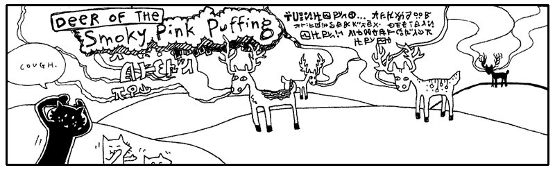

Over the hills and down the valleys, they ran through the grass where the Deer of the Smoky Pink Puffing roam. The sun was obscured by the lumbering pink clouds, emblazened with deer language, tinting the horizon a gradient of grapefruit and secreting a glow over the meadow. The clouds slid past each other, some bobbing upwards, destined for Canadian relatives. Others landing a readable distance from a recipient’s hooves.

“Let’s stop! *Please!*” yelled Fox Tall. “You can’t expect us to run in this **unbreathable fluff!**”

“Why are you yelling?” said Blix, as a thin stratus telegram wafted behind his legs. “You don’t need to raise your voice above a whisper. These long skinny clouds are usually just a mumble or a sigh. They may not even make it all the way.”

<aside class="sidebar" markdown="1">
**Steaks ‘n’ Slides**

!!! story ""
    My uncles love waterslides and they also love steakhouses. They have these waterslide days which are directly followed by a trip over to Joey’s Steakhouse.

    I *hate* Joey’s Steakhouse. It’s all big, brown shoe meat. Floppy and galoshy. Mixed with the stench of the uncles’ chlorine.

    Pruny fingers on meat slabs is The Revolting.

    It’s time for steaks and waterslides to come together in a truly repugnant manner. My uncles have had steaks and waterslides their whole lives. The dynasty of steaks and waterslides must come to a close. I will marry them in ways against nature!

    Like this:

    * Hand steaks to riders as they board the waterslide. Rider looks at the lifeguard. Lifeguard says wait. Rider looks again. The lifeguard pauses. Then. Okay, it’s time. *Go, kid, go!* And the look on that kid’s face as he rushes down the slope, paws full of chuck! *Go, kid, go!*

    * Kids slide on top of steaks. For safety, we’d want the slides stacked five steaks deep.

    * Or, steaks do the sliding. In their own little swim trunks.

    * Or, people. With steak swim trunks.

    * People and steaks, side-by-side.

    * Steaks travelling down waterslides composed of steaks.

    * Steaks travelling down waterslides made of people.

    * And, of course, people eating steaks, but their tongues come out as waterslides and they have to push the steaks up the waterslides. Which is impossible and a lifeguard has to climb up the waterslide and manually insert the steak into the esophagus.

    * Waterslides eating people and steaks eating people.

    * Waterslides and steaks becoming friends after smelling people on each other’s breath.

    * Or, steaks befriending waterslides, but waterslides not reciprocating. Waterslides become increasingly despondent and detached, getting into bad crowds and sinking into political extremity. Steaks make ankle bracelets out of people and leave them in the waterslides’ trouser pockets, when the trousers are unattended. They sneak out of the waterslide commune via a huge waterslide made of steak swim trunks.

    * Or, like I said, people with steak swim trunks.

    </aside>

!!! story ""
    “All that writing on the cloud is deer talk?” said Fox Small.

    “Help! *Where are you guys?*” The taller fox ducked through a stormy tirade comprised of thick, billowing smoke and sharp wisps. He whirled in every direction, “Somebody yell if you’re there!”

    He searched for a fissure in the dense matter, combing forward with his hands. The verbose, angry clouds responded by prodding him ahead, forcing him into tight corners in their brief pause between sentences. He landed in a sinkhole and kept his head down as the cascades of smoke surged forward.

    “Yeah, deer can read this stuff,” said Blix. “They just face their target and shoot it out of their nostrils. I once heard of a guy who **rode** a stag’s love poem.”

    “No way,” said Fox Small.

    “Yep,” said Blix. “And that guy was me.” Blix reached over his shoulder and latched onto a spiral column of smoke that was twisting just above his head.

    “You just have to know which clouds are wimpy and which clouds are grandiloquent.” Blix let the cloud pull him along and when the cloud banked upwards, Blix loosed his grip and kept his feet moving slowly along the ground.

    “See, here’s a good one, long like a broom handle. A guy found one once and it was shaped *exactly* like a car: windshield, driver’s side airbag, power steering. Uncanny!”

    “And that guy was—”

    “It was!” And Blix climbed up atop the long icy cloud, with its dangling glyphs, and stood proudly, floating high above the small fox’s pointy shadow.

    “Oh, I could do that,” said Fox Small. “Tall and I go jetskiing all the time. *I’ve stood up on my jetski.* It’s just like that.”

    Fox Tall dashed through a descending puff, shattering its sentence, which letters came unglued and littered the ground with scrambled words, but he had only succeeded in reaching the depressive portions of the deer correspondence, which manifested itself as a dank and opaque mist.

    Meanwhile, his smaller counterpart grabbed a narrow train of smoke that passed under his arm. He was airborned and yelled, **“Tallyho!”** But he held too tightly and the cloud evaporated under his arm and sent him back down with a short hop.

### Regexes

Since you’re just beginning your use of Python, you may not fully grasp regular expressions (or *regexes*) at first. You may even find yourself clipping regexes out of a regular expression reference and pasting them into your code without having the foggiest idea why the expression works. Or *if* it works!

```python
import re

while True:
    password = input("Enter your password: ")

    if re.fullmatch(r"\w{8,15}", password):
        break

    print("** Bad password! Must be 8-15 characters (letters, numbers, or underscores)!")
```

Do you see the unreadable deer language in the example code? The `r"\w{8,15}"` is a regular expression. If I may translate, the regex is saying, *Please only allow letters, numbers, or underscores. No less than eight and no more than fifteen.*

The `\w` is shorthand for a word character. In the usual ASCII examples, that means letters, numbers, and underscores.

Regular expressions are a little language built into Python and many other programming languages. I really shouldn’t say *little*, though, since regexes can be twisted and complicated and become much more difficult than any Python program.

Fortunately, using a regular expression is much simpler than inventing one. It is like the Deer: making the smoke is an arduous process. But hooking your elbow around the smoke and driving it to the Weinerschnitzel to get mustard pretzel dogs is easy.

Let's start with the simplest kind of test. The `re.fullmatch()` function checks whether the **entire string** follows the rules in the regular expression.

```pycon
>>> import re

>>> re.fullmatch(r"\w{8,15}", "good_password")
<re.Match object; span=(0, 13), match='good_password'>

>>> re.fullmatch(r"\w{8,15}", "this_bad_password_too_long")
```

If the entire string satisfies the pattern, `fullmatch()` returns a `Match` object. If it doesn't, it returns `None`.

But regexes aren't only useful for checking whether an entire string follows a pattern. One of their most common uses is searching for a pattern *inside* a larger string.

Let's say you've got a big file and you want to search it for a word or phrase. Since a bit of time has passed, let's search the Preeventualist's Losing and Finding Registry again.

```python
import re
import preeventualist

for page in preeventualist.search_found("truck"):
    for line in page.splitlines():
        if re.search(r"truck", line):
            print(line)
```

This isn't too different from the code we used earlier to search for lines with the word `"truck"`. In fact, if you're only looking for a simple word, `if "truck" in line` is easier. The regular expression `r"truck"` does essentially the same search.

But what if the truck is capitalized?

**Truck.**

What then?

```python
if re.search(r"[Tt][Rr][Uu][Cc][Kk]", line):
    print(line)
```

Now we have encountered our first **character classes**, also called **character sets**. These are the sections surrounded by square brackets. Each character class gives a list of characters that are valid matches for that spot.

The first class, `[Tt]`, matches either an uppercase `T` or a lowercase `t`. The second, `[Rr]`, matches an `R` or an `r`. And so on.

But there is an easier way to tell Python that we don't care about capitalization:

```python
if re.search(r"truck", line, re.IGNORECASE):
    print(line)
```

The `re.IGNORECASE` flag makes the search **case-insensitive**. It will match `Truck`. And `TRUCK`. And `TrUcK`. And other ups and downs.

So far, our regexes have matched ordinary letters. But regexes become much more interesting when we use special characters that stand for whole categories of characters.

Oh, and maybe your truck is a certain model number. A T-1000. Or a T-2000. You can't remember. It's a T *something* thousand.

```pycon
>>> re.search(r"T-\d000", "T-2000")
<re.Match object; span=(0, 6), match='T-2000'>
```

See, deer language. The `\d` represents a **digit**. It is a placeholder in the regex for any digit. Our expression will therefore match `T-1000`, `T-2000`, all the way up to `T-9000`.

Here are some of the most useful character shortcuts:

#### Character Sets for Regular Expressions

| Pattern | Matches                      | Equivalent                   |
| ------- | ---------------------------- | ---------------------------- |
| `\d`    | digits                       | `[0-9]`                      |
| `\w`    | word characters              | letters, numbers, and `_`    |
| `\s`    | whitespace                   | spaces, tabs, newlines, etc. |
| `\D`    | anything but digits          | `[^0-9]`                     |
| `\W`    | anything but word characters | the opposite of `\w`         |
| `\S`    | anything but whitespace      | the opposite of `\s`         |
| `.`     | almost any character         | —                            |

Building a regex involves chaining these shortcuts together to express your search. If you're looking for a number followed by whitespace, you could write:

```python
r"\d\s"
```

If you're looking for three numbers in a row, you could write:

```python
r"\d\d\d"
```

But typing the same thing over and over gets tiresome. Fortunately, regexes have **quantifiers** that tell Python how many times a pattern should repeat.

#### Quantifiers

| Pattern | Meaning                         | Example         |
| ------- | ------------------------------- | --------------- |
| `{n}`   | match exactly *n* times         | `r"\d{3}"`      |
| `{n,}`  | match *n* times or more         | `r"[a-z]{3,}"`  |
| `{n,m}` | match between *n* and *m* times | `r"[\d,]{3,9}"` |
| `*`     | match zero or more times        | `r":\w*"`       |
| `+`     | match one or more times         | `r"[-]+"`       |
| `?`     | match zero or one time          | `r"\d{3}[.]?"`  |

So our three-digit search can now be written as:

```python
r"\d{3}"
```

The `{3}` tells Python to look for exactly three digits.

Let's put character classes and quantifiers together. A really common example is matching phone numbers. An American phone number with an area code can be described with three digits, a hyphen, three more digits, another hyphen, and four final digits.

```pycon
>>> re.search(r"\d{3}-\d{3}-\d{4}", "Call 909-375-4434")
<re.Match object; span=(5, 17), match='909-375-4434'>

>>> re.search(r"\(\d{3}\)\s*\d{3}-\d{4}", "The number is (909) 375-4434")
<re.Match object; span=(14, 28), match='(909) 375-4434'>
```

This time, instead of using `fullmatch()` to test the entire string, we used `search()` to find the expression anywhere inside the string.

The `re.search()` function returns a `Match` object when it finds a match and `None` when it doesn't.

The `Match` object contains useful information about what was found. For example, `.group()` gives us the actual text that matched:

```pycon
>>> phone = re.search(
...     r"\(\d{3}\)\s*\d{3}-\d{4}",
...     "The number is (909) 375-4434"
... )

>>> phone.group()
'(909) 375-4434'
```

There are many websites that list [commonly used regex patterns][2] for more flexible pattern matching.

Keeping the `Match` object in a local variable is useful because we can examine it after the search. If you run several regular expressions, you can keep each result in its own variable.

So far, we've used regexes to find things. But what if we want to change what we find?

Another common use of regular expressions is **search-and-replace**. You can search for the word `"cat"` and replace it with the word `"banjo."` Sure, you can do that with ordinary strings, too.

```pycon
>>> song = "I swiped your cat / And I stole your cathodes"

>>> song.replace("cat", "banjo")
'I swiped your banjo / And I stole your banjohodes'

>>> re.sub(r"\bcat\b", "banjo", song)
'I swiped your banjo / And I stole your cathodes'
```

The `re.sub()` function substitutes every match of the regular expression. Notice how `str.replace()` replaced the `cat` at the beginning of both words, including the first three letters of `cathodes`.

The regex version uses `\b`, which means a **word boundary**. It therefore matches `cat` as a complete word without matching the `cat` inside `cathodes`.

If you only want to replace the first occurrence, give `re.sub()` a `count`:

```pycon
>>> re.sub(r"\bcat\b", "banjo", song, count=1)
'I swiped your banjo / And I stole your cathodes'
```

And so this chapter ends, with Blix and the Foxes cruising aloft the solid pink belched from a very outspoken deer somewhere in those pastures.

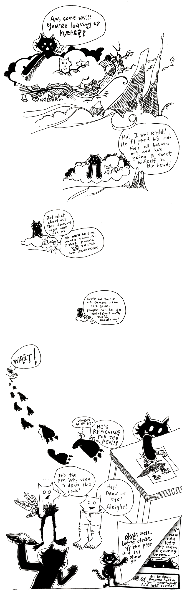

## 4. So, Let's Be Clear: The Porcupine Is Now To The Sea

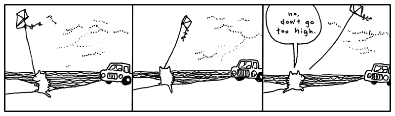


[1]: installing-python.md
[2]: https://uibakery.io/regex-library/phone-number-python
[3]: http://preeventualist.org/