---
hide:
  - toc
---

# 6. Downtown

{.center}

[TOC]


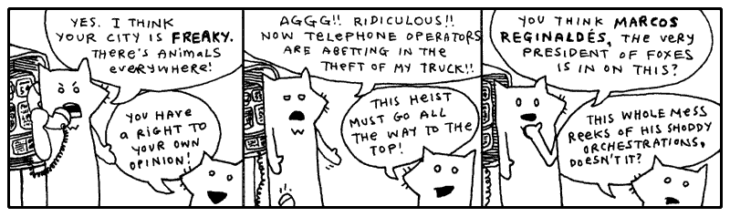

Oblivious to their involvement in the expansive plan of The Originals, both the
tall fox and the much shorter fox had wandered right into the red alert zone,
the city Wixl. I desire a spatula to scoop them aside with, shuffle them off to
the coast near the beach hatcheries, hide them in piles of fish eggs, hold down
their pointy ears, concealing their luxurious hides. And above them I would
stand, casting an unmoving shadow, holding my rifle aloof.

I can’t. I have you to teach. I have to groom and care for myself. The
lightbulbs upstairs need changing. A free pack of halogen lightbulbs just showed
up out of the mail. Somebody out there is obviously trying to get me to use
them. So I’m going to screw ‘em in. And just stand there, casting an unmoving
shadow, holding my rifle aloof.

Should that shadow be nice and defined, then I’ll keep ‘em.


## 1. If I Were Looking For a Vehicle

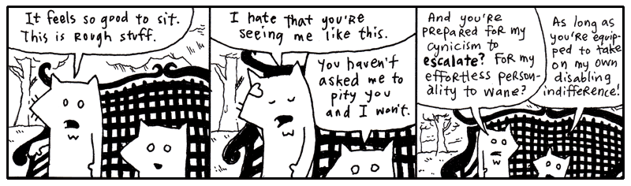

I like seeing these two out in the wild. They got pretty bored here in the
studio. They started making up weird slogans and stuff. They had some phrase
they kept repeating, forming fixations upon. You can’t be exposed to all that
contrived fox nonsense.

Let’s just say: I am really trying my best to keep things collegiate. Having
never attended college, I can’t well say if every passage written chimes right
with the stringent criteria which academia demands. I have university friends
aplenty, some who tour the globe in their pursuits, and I try to inflect my
voice with just their blend of high culture.

Sometimes I applaud myself for going beyond the work of my educated friends—only
in quiet corridors, we never butt heads publicly—because _I have actually
subscribed_ to a school of thought while they are still in their books, turning
and turning.

**I am a preeventualist.** I have dabbled in it long enough and am glad to come
forth with it. Inevitably, some of you have already started mining this book for
Marxist symbology. I am sad to kill those interpretations, but I believe any
nihilist conclusions you’ve drawn will still hold up under scrutiny.

Anyway, I’ll drop the rhetoric. I only mention preeventualism because, aside
from being a refreshing and easy alternative to the post-modernism we’re born
with, _this_ meta-cult offers a free lost-and-found service for the residents of
Wixl.

```py
require 'open-uri'
open( "http://preeventualist.org/lost" ) do |lost|
  puts lost.read
end
```

I have no way of alerting the foxes to this service. And I’m sure it’s too soon
for their truck to be listed. Still, the good intentions are here.

If you’re connected to the Internet, the above Python should have downloaded the
web page from the Internet and printed it to the screen. In a message resembling
this:

<pre class="text">                   THE PREEVENTUALIST'S LOSING AND FINDING REGISTRY
          (a free service benefiting the ENLIGHTENED who have been LIGHTENED)

                                      ---
                      updates are made daily, please check back!
                                      ---

                         this service is commissioned and
                     subsidized in part by The Ashley Raymond
                                Youth Study Clan

                                      ...
                      all seals and privileges have been filed
                under the notable authorship of Perry W. L. Von Frowling,
          Magistrate Polywaif of Dispossession.  Also, Seventh Straight Winner
                   of the esteemed Persistent Beggar's Community Cup.
                                      ...

  ABOUT THE REGISTRY
  ==================
  Hello, if you are new, please stay with us.  A brief explanation of our service will 
  follow.  First, a bit of important news from our beloved magistrate.  (The kids call
  him Uncle Von Guffuncle. Tehe!)

  IMPORTANT NEWS
  ==============
  / 15 April 2005 /
  hi, big news.  we were on channel 8 in wixl and ordish.  cory saw it.  i was on and 
  jerry mathers was on.  if you didn't see it, e-mail cory.  he tells it the best.  all 
  i can say is those aren't MY hand motions!! (joke for people who watch channel 8.)  
  thanks harry and whole channel 8 news team!!
                                                   - perry

  / 07 April 2005 /
  we're all sifting through the carpet here at hq, but if you could all keep an eye out 
  for caitlin's clipboard, she's too quiet of a gal to post it and i know that it's 
  REALLY important to her.  she had a few really expensive panoramic radiographs of her 
  husband's underbite clipped to a few irreplacable photos of her husband in a robocop 
  costume back when the underbite was more prominent.  she says (to me), "they'll know
  what i mean when they see them."  i don't know what that means.  :(

  i've checked: * the front desk * the hall * the waiting area * the bathroom * the candy 
  closet * the big tv area * the lunch counter * the disciples room * gaff's old room
  (the one with the painting of the cherry tree) * the server room * staircase.  i'll 
  update this as i find more rooms.
                                                   - love, perry

  / 25 Feb 2005 /
  server went down at 3 o'clock.  i'm mad as you guys.  gaff is downstairs and he'll 
  be down there until he gets it fixed. :O -- UPDATE: it's fixed, back in bizz!!
                                                   - perry

  / 23 Feb 2005 /
  i know there's a lot of noise today.  stanley bros circus lost twelve llamas and a
  trailer and a bunch of Masterlocks and five tents.  they're still finding lost stuff.
  pls keep your heads, i need everyone's help.  these entertainers have _nothing_.  i 
  mean it.  i gave a guy a purple sticker today (it's just something i like to do as a
  kind gesture) and he practically slept on it and farmed the ingredients for pizza sauce
  on it.  they are on rock bottom.

  so please donate.  i know we don't have paypal or anything.  so if you want to donate,
  just post that you found something (a children's bike, a month of perishable canned 
  goods) and that it has the circus people's names written on it or something.
                                                   - great, perry

  / 15 Nov 2004 /
  preeventualist's day sale.  if you lose something today, you get to pick one free 
  item (of $40 value or less) from the house of somebody who found something.  we're 
  having so much fun with this!!  this is EXACTLY how i got my rowing machine last year
  and i LOVE IT!!
                                                   - perry
</pre>

I think the Youth Study Clan is doing a great job with this service. It’s a
little hokey and threadbare, but if it can get animals to stop using their
instinctive means of declaring ownership, then hats off.

Still, a preeventualist youth group? How can that be? You’ve got to at least
_flirted with real cynicism_ before you can become a preeventualist. And you
definitely can’t attend school. So, I don’t know.

Going back to the list of instructions from the Preeventualist’s Losing and
Finding Registry.

<pre class="text"> USING THE L&#38;F SERVER
 ====================
 The L&#38;F is a free service.  The acts of losing and finding are essential qualities in
 building a preeventualist lifestyle.  We hope to accommodate your belief.

 We do not use HTML, in order to simplify our work here.  Our guys are already working
 fifteen hour days.  (Thanks, Terk!!  Thanks, Horace!!)

 You may search our service for your lost items.  Or you may add your lost (or found)
 item to our registry.  This is done by typing the proper address into your browser.

 SEARCHING
 =========
 To search for lost items, use the following address:

   http://preeventualist.org/lost/search?q={search word}

 You may replace {search word} with your search term.  For example, to search for "cup":

   http://preeventualist.org/lost/search?q=cup

 You will be given a list of cups which have been lost or found.

 If you want to search for only lost cups or only found cups, use the `searchlost' and
 `searchfound' pages:

   http://preeventualist.org/lost/searchlost?q=cup
</pre>

I’m not playing games. I know where the truck is. Really, I’m not teasing you.
I’ll show you in just a sec. I’m just saying, look at the foxes:

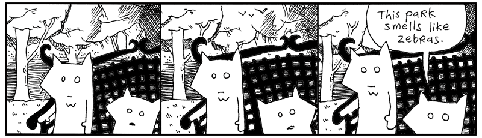

They are helpless. And yet, here is this great tool. A possible key to getting
out of this mess. I just want to poke around, see if there are any clues here.

```py
require 'open-uri'

# Searching all found items containing the word `truck'.
import requests

url = "http://preeventualist.org/lost/searchfound?q=truck"
truck = requests.get(url)
print(truck.text)
```

I’m not seeing anything about the tall fox’s truck in this list. That’s okay.
The foxes are out of it anyway. We have some time.

You’ve learned a very simple technique for retrieving a web page from the
Internet. The code uses the `requests` library, which was written by one of my
favorite Pythonists, Kenneth Reitz. Requests hides much of the machinery behind 
HTTP and lets us treat information from the Internet much like information from 
a file: something we can open, read, and work with.

In a previous chapter, we stored your diabolical ideas in a text file. You read
these files in Python using `open`.

```py
# Opening an idea file from a folder on your computer.
with open("folder/idea-about-hiding-lettuce-in-the-church-chairs.txt", "w") as f: 
    f.write(idea)
```

Files are **input-output objects**. You can read from a file and write to a file. Many of Python's input-output tools share a common set of methods, such as `read()` and `write()`. The `open()` function hands you one of these objects, and the `with` statement makes sure it is properly closed when you're finished.

IO is your ticket to the outside world. It's the rays of sunlight slipping through the prison bars. Through IO, your program can communicate with files, network connections, in-memory streams, and all sorts of contraptions beyond its little cell.

And files are not the only things that can be read from. The Internet is overflowing with information waiting to be hauled into your program. With the `requests` library, reading a web page is simplified so its just as easy as reading a file, thought with different syntax.

```py
import requests

# Reading an idea file available on a web site.

response = requests.get(
    "https://your.com/idea-about-hiding-lettuce-in-the-church-chairs.txt"
)

print(response.text)
```

The object returned by `requests.get()` isn't a file, but it behaves in a familiar way: you ask it for its contents and then get to work. Whether your ideas are stored on your computer, on a web server across the ocean, or in some dusty corner of the cloud, Python gives you tools for bringing them into your program.

The important thing to remember is that information can come from many places. A local file. A web page. An API. A network service. Different sources, but often the same goal: open a connection, read some data, and let the mischief begin.

### Reading Files Line by Line

When you’re using Python to get information from the web, you can read the entire response at once, or you can process it one line at a time. Reading line by line is useful when you’re searching for something specific, or when the response is large and you want to conserve your computer’s memory.

```python
import requests

with requests.get( 
  "http://preeventualist.org/lost/searchfound?q=truck", stream=True,) as truck:
    for line in truck.iter_lines(decode_unicode=True):
        if "pickup" in line:
            print(line)
```

The above code retrieves the list of trucks found by preeventualists, then displays only those lines that contain the word `"pickup"`. That way, we can trim away the descriptions and look for only the pertinent lines.

The expression

```python
"pickup" in line
```

uses Python’s **`in` operator** to search a string. It asks whether the string `"pickup"` occurs anywhere inside `line`.

```pycon
>>> "pickup" in "A blue pickup truck was found."
True

>>> "pickup" in "A red sedan was found."
False
```

When you retrieve a web page normally, you can read the entire response into memory:

```python
response = requests.get(url)
text = response.text
```

Usually, this is perfectly fine. Most web pages are only a few thousand bytes or perhaps a few megabytes. But if a response is very large, loading the whole thing into memory at once may be wasteful.

That's where `stream=True` comes in:

```python
response = requests.get(url, stream=True)

for line in response.iter_lines(decode_unicode=True):
      if "pickup" in line:
          print(line)
```

With streaming enabled, `requests` can process the response incrementally rather than loading its entire contents into memory. The `iter_lines()` method gives us one line at a time, so we can examine each line as it arrives.

The same idea works with ordinary files:

```python
with open("trucks.txt") as truck:
    for line in truck:
        if "pickup" in line:
            print(line)
```

Notice how similar the two examples are. Whether the lines are coming from a file or from a web response, Python lets us process them with a `for` loop. This ability to work with different kinds of objects in the same way is one of Python's most useful ideas: **if an object can be iterated over, you can loop over it.**

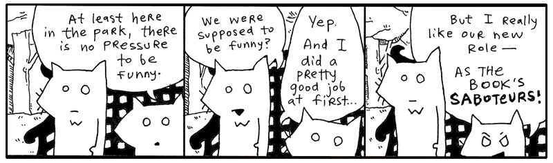

And that's going to become important. A `for` loop isn't limited to lists. Python can iterate over files, strings, network responses, generators, and objects you create yourself. In the pages ahead, we'll take a closer look at how this works, and how you can make your own objects produce values one at a time.


### Yielding is Kiddie Generators

Python often uses **iterators and generators** in this fashion. Yes, iterators are used for cycling through each item in a stream, such as a list or dictionary. Now look at a file source as a stream of lines. A generator can crawl that stream of lines seamlessly.

```python
class TextStream:
    # Definition for the read_lines generator method. Notice how it has no
    # block parameter. Generators produce values using yield.
    def read_lines(self):
        while not self.is_eof():  # until we reach the end of the file...
            yield self.readline()  # send a line back to the caller

```

The `yield` keyword is the easiest way to create a generator. One word. Just like a curtain has a pullstring or like a suitcase has a handle. Inside a function, you can press the blinking `yield` button and it will pause execution and hand a value back. Glowing a strong red color until the outer code asks for the next piece. And then it goes back to blinking and you can press the button again if you like.

So we got the CEO yelling at the warehouse foreman that he needs to process all the gidgets right now or "I'll have your ass!". The whole warehouse is silent hearing the foreman getting chewed out. "What's a gidget?" asks one of the new guys. "It's like a widget but with g". 

"Boss is ticked off, we gotta get it done today," the foreman says to the warehouse workers. the foreman isn't stupid though. He knows if he tries to bring in 10,000 gidgets all at once, there won't be any space to process the gigdets, let alone air to breathe. So he asks us to code the new guy a program that that will bring in 100 gidgets at a time.

We start with a lot of data that will take a long time to process, break it down into chunks, and yield one chunk at a time. So `yield` is the perfect tool to use.

```python
# A giant list of 10,000 gidgets to process
all_gidgets = list(range(10000, 20000))

def batch_processing(gidgets, batch_size=100):
    """
    Yields manageable chunks of data, one at a time.
    """
    for i in range(0, len(user_ids), batch_size):
        yield items[i : i + batch_size] # gimme the first chunk
```

So with the new batch processing code setup, the foreman calls in the first batch and takes care of business, processing the 100 gidgets. 
```pycon
>>> warehouse = batch_processing(all_gidgets)
>>> first_batch = next(warehouse)
>>> takin_care_of_business(first_batch)
```
Now that the first batch is done, the foreman calls up to the control room."Send more!"

All we need to do is run the batch_processing again and another 100 gidgets come down the chute!
```pycon
>>> second_batch = next(warehouse)
>>> takin_care_of_business(second_batch)
```

Keep 'em coming! Send a couple hundred this time!

```pycon
>>> double_load = next(warehouse) + next(warehouse)
>>> takin_care_of_business(double_load)
```

And the day went on processing batch after batch of gidgets, until no one wanted to ever see a gidget again. 

While yield is great for building an generator, what about iterators? We can use the `iter` function to create a iterator out of a list.
```pycon
>>> lines = iter(["first, birth.", "then, a life of flickering images.", "and, finally, the end."])
>>> print(next(lines))
>>> print(next(lines))
>>> print(next(lines))
# prints out:
#   first, birth.
#   then, a life of flickering images.
#   and, finally, the end.

```

The `next()` function is often used in conjunction with iterators and generators. The `next()` function pulls the next item right off an iterator stream. Think of next as turning on the conveyor belt so more gidgets coming flowing down from the rafters into the warehouse. 

In Python, any function containing `yield` becomes a generator, allowing elegant stream processing.

```python
# Using a generator function to lazily yield file content
def read_file(path):
    with open(path) as f:
        yield f.read()

```

If you pass arguments to `yield`, those values are handed directly to the caller. 

first_gidgets = read_file("gidgets.txt")
process_em_gidgets(first_gidgets)
next_gidgets = read_file("gidgets.txt")

The generator's output is coming down the conveyer belt fast and furious, one line at a time. When we want the next line, we just call the genator function again. 

```python
# The generator opens two files simultaneously and yields both handles
# to the caller using context management.
def double_open(filename1, filename2):
    with open(filename1) as f1, open(filename2) as f2:
        yield f1, f2

# Prints the files out side-by-side using tuple unpacking.
for f1, f2 in double_open("idea1.txt", "idea2.txt"):
    print(f"{f1.readline().strip()} | {f2.readline().strip()}")

```

Better yet the `yield`, the function is stopping your conveyer belt, giving control back to you so you can do your work before resuming the conveyer belt. So while the `readline` generator does the work of reading lines from a file, the getting the next line is handled by the loopiing itself .

You may also wonder what the `yield` keyword has to do with gidgets. And really, it’s a good question with, and I believe gidget has a good answer. When you run a standard function, you are giving that function control of your program. But with a generator, you don't want to give up full control, no siree, Bob. You just want to give up a bit of control and get back a single answer. I imagine gidgets are the same. In a scary, unpredictable world that tries to overload us with information, a gidget helps us trust and take it one line at a time (I'm still not sure what a gidget is, but I'll trust that one answer is correct and move one).

### Preeventualism in a Gilded Box

You've learned quite a bit about the `requests` library and fetching information from the web. You know your way around modules, functions, and the occasional junk drawer full of forgotten code. Really, you can start rummaging through the Wixl lost-and-found service without me.

Let's neatly *encapsulate* the entire service into a single module.

```python
import requests

BASE_URL = "https://preeventualist.org/lost/"


def open_page(page, query):
    response = requests.get(BASE_URL + page, params=query)
    response.raise_for_status()
    return response.text.split("--\n")


def search(word):
    return open_page("search", {"q": word})


def search_lost(word):
    return open_page("searchlost", {"q": word})


def search_found(word):
    return open_page("searchfound", {"q": word})


def add_found(your_name, item_lost, found_at, description):
    return open_page(
        "addfound",
        {
            "name": your_name,
            "item": item_lost,
            "at": found_at,
            "desc": description,
        },
    )


def add_lost(your_name, item_found, last_seen, description):
    return open_page(
        "addlost",
        {
            "name": your_name,
            "item": item_found,
            "seen": last_seen,
            "desc": description,
        },
    )
```

At some point with your code, you need to start shaping it into something neat. Save the above code in a file called `preeventualist.py`.

This module is a very simple library for using the Preeventualist's service.

This is exactly how many Python libraries begin. You gather related functions together, store them in a file, and, if you're happy with the result and want the world to benefit, publish it for others to use.

These stragglers can import your module just as we imported `requests` earlier.

```python
>>> import preeventualist

>>> print(preeventualist.search("truck"))

>>> print(
...     preeventualist.add_found(
...         "Why",
...         "Python skills",
...         "Wixl Park",
...         "I can give you Python skills!\nCome visit poignantguide.net!"
...     )
... )
```

The important thing isn't the lost-and-found service itself. The important thing is that we've hidden all the tedious details—URLs, query strings, and web requests—behind a handful of friendly function calls. Users of our module don't need to know how the service works. They simply ask for what they want, and the module does the legwork.


## 2. Meanwhile, The Porcupine Stops To Fill-Up

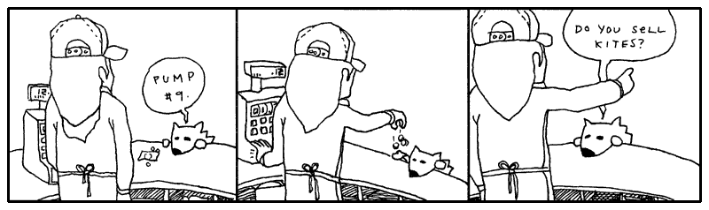

## 3. A Sponsored Dragon-Slaying

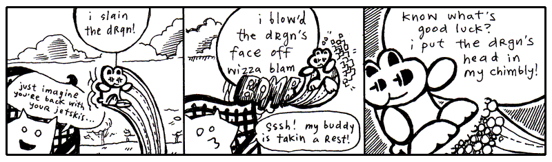

“Look around,” said Fox Small. “Some of us don’t have time for quests. Some of
us have major responsibilities, jobs, so on. Livelihood, got it?”

“_Heyyyy_, my **<span class="caps">JOB</span>** was to kill the drgn!!” screamed
the wee rabbit, blinking his eyes and bouncing frantically from tree to tree to
pond to pond. “His snout was a **<span class="caps">HUGE</span>**
responsibility!! His smoky breath was _mine to reckon with!!_ I spent fifty
dollars on the cab **<span class="caps">JUST</span>** to get out there, which
was another _huge huge_ ordeal. You have _nothing on me_, not a _single_
indictment, my whole **<span class="caps">HERONESS</span>** is _absoflutely
unimpeachable_, my whole **<span class="caps">APPROACH</span>** is _abassoonly
unapricotable_, just ask Lester.”

<aside class="sidebar" markdown="1">
### The Inadvertent Meteor

_When I first began my inquiry into preeventualism, I was relayed the following
story. I was told that this was all I needed to understand the philosophy._

There was this sculptor who just wasn’t satisfied with his work. He had
primarily studied traditional subject matter and excelled at sculpting both the
human figure and elaborate vegetation. And he was really quite an exquisite
sculptor. He just didn’t feel like he was making his mark upon the world.

By this time, he had aged well into his fifties and wanted to vaunt into the
realm of legendary masters. So he began to construct a massive sculpture of two
pears with beads of dew clinging precariously to them.

The sculpture was enormous and hovered ominously above the sculptor’s hometown,
held aloof by a massive infrastructure of struts and beams. In fact, the giant
pears were so significant that they truly wreaked havoc on the Earth’s rotation,
ever so slightly, what with a new asteroid-sized fruit basket clinging to it.

The government sent jets and war crafts to destroy the statue. They unleashed a
vicious attack on the village, dismantling the statue, blowing it into thousands
of pieces, chipping away at it with missiles. Soon enough, the statue was
obliterated and all was back to normal.

A huge chunk of the statue had taken orbit in the heavens and often veered
perilously close to the planet. When it did, it was always met by an arsenal of
advanced weaponry, which further damaged it and deflected its course skyward.

Eventually, this inadvertent meteor was nothing more than the size of a very
daunting man. And, when it at last hit the ground, weathered and polished by its
ninety year journey, it was hailed as an enigmatic masterpiece, a message from
the great beyond. Here was a stunning likeness of a male nude looking wistfully
into the sky with an intricate lace work of vines creeping around his waist and
covering his improprieties.

The statue was last sold for fifty-two million dollars and stayed in the
permanent exhibit at the Louvre, with the plaque:

> “Heavenly Nude” by Anonymous
</aside>

“Who’s Lester?” said the Fox Small.

“Lester’s my cab driver! He parked at the base of Dwemthy’s Array!!” The rabbit
ricocheted madly like a screensaver for a supercomputer. _“Just ask Dwemthy!!”_

“Well,” said the Fox Small. He turned back to look up at Fox Tall, who was
sitting straight and looking far into the distance. “Wait, they have a parking
lot on Dwemthy’s Array?”

**“YEP!!** And a pretzel stand!!”

“But, it’s _an Array_? Do they sell churros?”

**“CHOCOLAVA!!”** bleeted the rabbit.

“What about those glow-in-the-dark ropes that you can put in your hair? Or you
can just hold them by your side or up in the air—”

**“BRAIDQUEST!!”**

“You should get a cut of the salesman’s commission,” spoke Fox Small. “Folks
came out to see you kill the dragon, right?”

**“BUT!!** I don’t operate the tongs that actually extract the chocolava.”

“I’m just sayin’. You **do** operate the killing mechanism. So you _have a stake_
in the ensalada.”

“OH NO!! I left my favorite lettuce leaves in Dwemthy’s Array!!” squealed the
rabbit, twirling like a celebratory saber through the quaking oak. Distantly:
“Or Lester’s trunk, maybe?”

“You know—Gheesh, can you stay put??” said Fox Small.

“My radio,” said Fox Tall, stirring to life for a moment, “in my pickup.” The
glaze still seeping from his eyes. His stare quivered and set back into his
face, recalling another time and place. A drive out to Maryland. Sounds of
Lionel Richie coming in so clearly. The wipers going a bit too fast. He pulls up
to a house. His mother answers the door. She is a heavily fluffed fox. Tears and
makeup.

Slumping back down, “That porcupine is changing my presets.”

The rabbit bounded up on to the armrest of the park bench and spoke closely.
**“BUT!!** Soon I will feast on drgn’s head and the juices of drgn’s tongue!!”
The rabbit sat still and held his paws kindly.

“(Which I hope will taste like cinnamon bears,)” whispered the rabbit,
intimately.

“I love cinnamon,” said Fox Small. “I should go killing with you some time.”

“You should,” said the rabbit and the eyes shine-shined.

“Although, salivating over a tongue. You don’t salivate over it, do you?”

“I DO!!” and the rabbit got so excited that Sticky Whip shot out of his eyes.
(More on Sticky Whip in a later sidebar. Don’t let me forget. See also: _The
Purist’s Compendium to Novelty Retinal Cremes_ by Jory Patrick Sobgoblin,
available wherever animal attachment clips are sold.)

“Okay, you’ve hooked me. I want to hear all about it,” Fox Small declared.
“Please, talk freely about the chimbly. Oh, and Dwemthy. Who is he? What makes
him tick? Then maybe, if I’m still around after that, you can tell me about what
makes rabbits tick, and maybe you can hold our hands through this whole missing
truck ordeal. I need consolation more than anything else. I could probably use
religion right now. I could use your personal bravery and this sense of
accomplishment you exude. Do you smoke a pipe? Could be a handy tool to coax
along the pontification we must engage in.”

And the rabbit began expounding upon Dwemthy and the legend of Dwemthy and the
ways of Dwemthy. As with most stories of Dwemthy, the rabbit’s tales were mostly
embellishments. Smotchkkiss, there are delicacies which I alone must address.

Please, never ask who Dwemthy is. Obviously he is a mastermind and would never
disclose his location or true identity. He has sired dynasties. He has set
living ogres aflame. Horses everywhere smell him at all times. Most of all, he
knows carnal pleasures. And to think that this…

This is his Array.

### Dwemthy’s Array


You stand at the entrance of Dwemthy’s Array. You are a rabbit who is about to
die. And deep at the end of the List:

```py
class Dragon(Creature)
  _life = 1340       # tough scales
  _strength = 451    # bristling veins
  _charisma = 1020   # toothy smile
  _weapon = 939      # fire breath
```

A scalding _<span class="caps">SEETHING LAVA</span>_ infiltrates the
**cacauphonous <span class="caps">ENGORGED MINESHAFTS</span>** deep within the
ageless canopy of the _<span class="caps">DWEMTHY FOREST</span>_... chalky and
nocturnal screams from **the belly of the <span class="caps">RAVENOUS WILD
STORKUPINE</span>**... who eats **wet goslings** _<span class="caps">RIGHT
AFTER</span>_ they’ve had a few graham crackers and a midday nap… amidst starved
hippos _<span class="caps">TECHNICALLY ORPHANED</span>_ but truthfully sheltered
by umbrellas owned jointly by car dealership conglomerates… beneath _uncapped
vials_ of mildly pulpy **<span class="caps">BLUE ELIXIR</span>**... _which shall
remain… heretofore… **<span class="caps">UNDISTURBED</span>… <span
class="caps">DWEMTHY</span>!!!**_

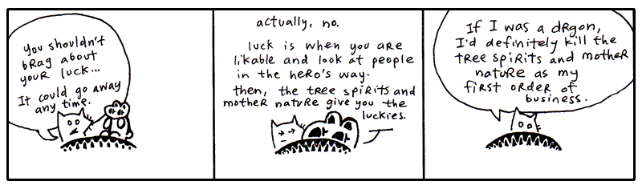

_If you don’t understand Dwemthy’s Array, it is Dwemthy’s fault. He designed the
game to complicate our lives and were it simpler, it would not be the
awe-inspiring quest we’ve come to cherish in our arms this very hour._

Dwemthy’s Array has a winding history of great depth. It is not enough to simply
say, “Dwemthy’s Array,” over and over and expect to build credentials from that
act alone. Come with me, I can take you back a couple years, back to the sixties
where it all started with metaprogramming and the dolphins.

You might be inclined to think that **metaprogramming** is another hacker word
and was first overheard in private phone calls between fax machines. Honest to
God, I am here to tell you that it is stranger than that. Metaprogramming began
with _taking drugs in the company of dolphins_.

In the sixties, a prolific scientist named John C. Lilly began experimenting
with his own senses, to uncover the workings of his body. I can relate to this.
I do this frequently when I am standing in the middle of a road holding a pie or
when I am hiding inside a cathedral. I pause to examine my self. This has proven
to be nigh impossible. I have filled three ruled pages with algebraic notation,
none of which has explained anything. The pie, incidentally, has been very easy
to express mathematically.

But the scientist Lilly went about his experiments otherwise. He ingested <span
class="caps">LSD</span> in the company of dolphins. Often in a dark, woeful
isolation tank full of warm salt water. Pretty bleak. But it was science! (Lest
you think him criminal: until 1966, <span class="caps">LSD</span> was supplied
by Sandoz Laboratories to any interested scientists, free of charge.)

**Drugs, dolphins and deprivation.** Which led to Lilly’s foray into things
meta. He wrote books on mental programming, comparing humans and computers. You
may choose to ingest any substance you want during this next quote—most likely
you're reaching for the grain of salt—but I assure you that there’s no Grateful
Dead show on the lawn and no ravers in the basement.

> When one learns to learn, one is making models, using symbols, analogizing,
> making metaphors, in short, inventing and using language, mathematics, art,
> politics, business, etc. At the critical brain (cortex) size, languages and
> its consequences appear. To avoid the necessity of repeating learning to
> learn, symbols, metaphors, models each time, I symbolize the underlying idea
> in these operations as metaprogramming.
>
> John C. Lilly, <em>Programming and Metaprogramming in the Human
> Biocomputer</em>, New York, 1972.

We learn. But first we learn to learn. We setup programming in our mind which is
the pathway to further programming. (Lilly is largely talking about programming
the brain and the nervous system, which he collectively called the
_biocomputer_.)

Lilly’s metaprogramming was more about feeding yourself imagery, reinventing
yourself, all that. This sort of thinking links directly to folks out there who
dabble in shamanism, wave their hands over tarot cards and wake up early for
karate class. I guess you could say metaprogramming is New Age, but it’s all
settled down recently into a sleeping bag with plain old nerdiness. (If you got
here from a Google search for “C++ Metaprogramming”, stick around, but I only
ask that you _burn_ those neural pathways that originally invoked the search.
Many thanks.)

Meta itself is spoken of no differently in your author’s present day.

> All sensuous response to reality is an interpretation of it. Beetles and
> monkeys clearly interpret their world, and act on the basis of what they see.
> Our physical senses are themselves organs of interpretation. What
> distinguishes us from our fellow animals is that we are able in turn to
> interpret these interpretations. In that sense, all human language is
> meta-language. It is a second-order reflection on the ‘language’ of our
> bodies—of our sensory apparatus.
>
> Terry Eagleton, <em>After Theory</em>, London, 2003, ch. 3.

To that end, you could say programming itself is a meta-language. _All code_
speaks the language of action, of a plan which hasn’t been played yet, but
shortly will. Stage directions for the players inside your machine. I’ve waxed
sentimental on this before.

But now we’re advancing our study, venturing into metaprogramming, but don’t
sweat it, **it’s still just the Python you’ve seen already**, which is why Dwemthy
feels no qualms thrusting it at you right away. Soon enough it will be as easy
to spot as addition or subtraction. At first it may seem intensely bright, like
you’ve stumbled across your first firefly, which has flown up in your face.
Then, it becomes just _a little bobbing light_ which makes living in Ohio so
much nicer.

<aside class="sidebar" markdown="1">
### Bread Riddles

Question: Can one take five bites from a bread and make the shape of a bicycle?
Answer: Yes.

Question: Can one rip a bread in half and still fit the bread in an envelope?
Answer: Yes.

Question: Can one man take a bread and throw it while another man sits without
bread? Answer: Yes.

Question: Can four breads in a box be explained? Answer: Yes.

Question: Can a clerical error in my company books be attributed to bread?
Answer: Yes.

Question: Can dancers break through a scrim of bread? Answer: Yes.

Question: Can those same dancers, when faced with an inexplicably different
scrim of bread, fail to break through? Answer: Yes.

Question: Does bread understand my darkest fears and wildest dreams? Answer:
Yes.

Question: Does bread desire me? Answer: Yes.

Question: Will bread be invisible to robots? Answer: Yes.

Question: Can one robot take eight bites on a bread, without knowing it’s there,
and make the shape of a smaller bread? Answer: Yes.

Question: Should my clerics be equipped with bread? Answer: Yes.

Question: In relation to bread, will robots each have their own elephants?
Answer: Yes.

Question: Can one rip a bread in half and not let it ruin one’s game of
dominoes? Answer: Yes.

Question: Will we always love bread? Answer: Yes.

Question: Will we have more bread? Answer: Yes.

Question: Can four breads marry a robot’s elephant? Answer: Yes.
</aside>

Object-oriented programming is a way of organizing code around objects. But not as M.C. Escher would sketch it. The program isn't reaching back around and overwriting itself, nor are they climbing out of your screen and shaking hands with each other. No, it's much smaller than that.

Let's say it's more like a little orange pill you won at the circus. When you suck on it, the coating wears away and behind your teeth hatches a massive, floppy sponge brontosaurus. He slides down your tongue and leaps free, frolicking over the pastures, yelping, "Papa!" And from then on, whenever he freaks out and attacks a van, well, that van is sparkling clean afterwards.

Now, let's say someone else puts their little orange pill under the faucet. Not on their tongue, under the faucet. And this triggers a different cataclysm, which births a set of wailing sponge sextuplets. Umbilical cords and everything. Still very handy for cleaning the van. But an altogether different kind of chamois. And, one day, these eight will stir Papa to tears when they perform the violin concerto of their lives.

That's rather like what we're doing with classes. We put some common behavior and attributes into a class, and then use that class as a blueprint for creating objects.

The Creature class is our little orange pill. It contains the machinery that all our creatures can use. A Dragon is one of the creatures produced from that machinery.

class Dragon(Creature):
    _life = 1340       # tough scales
    _strength = 451    # bristling veins
    _charisma = 1020   # toothy smile
    _weapon = 939      # fire breath

### Creature Code

Now, with a lateral slice across the diaphragm, we expose the innards of `Creature`. **Save this code into a file called `dwemthy.py`.**

```python
class Creature:
    @property
    def life(self):
        return self._life

    @property
    def strength(self):
        return self._strength

    @property
    def charisma(self):
        return self._charisma

    @property
    def weapon(self):
        return self._weapon
```

Focus on the four properties being set up in `Creature`. These are the little windows through which we can inspect the creature's innards. The values themselves will be supplied by each creature subclass.

The underscore is a convention that says, *Keep your paws off this. It's an implementation detail.*

Now we can create a dragon by giving it its own values:

```python
class Dragon(Creature):
    _life = 1340       # tough scales
    _strength = 451    # bristling veins
    _charisma = 1020   # toothy smile
    _weapon = 939      # fire breath
```

So when Python encounters:

```python
class Dragon(Creature):
my_dragon.life
```

the inherited getter properties spring into action.

It's almost as if Python sneaks into the laboratory after hours, rummages through a drawer of spare monster parts, bolts everything together, transplants a spiny green heart, and gives the creature a healthy jolt of electricity.

**POWER UP! POWER UP!**

The resulting dragon is remarkably compact:

```python
class Dragon(Creature):
    _life = 1340       # tough scales
    _strength = 451    # bristling veins
    _charisma = 1020   # toothy smile
    _weapon = 939      # fire breath
```

Yet it already knows how to expose its attributes via the `@property` decorator from `Creature`:

```python
dragon = Dragon()

print(dragon.life)
print(dragon.strength)
print(dragon.charisma)
print(dragon.weapon)
```

The dragon never defines those properties itself. They are **inherited** from `Creature` as a baby dragon can inherit his mother's eyes.

And notice that we access `dragon.life`, not `dragon._life`. Again the underscore attributes are the creature's internal machinery and are a polite way of saying, "This is my internal machinery. Please don't poke it directly." 

The properties provide the clean public interface:
dragon.life
dragon.strength
dragon.charisma
dragon.weapon

This is one of the pleasures of object-oriented programming. You teach a parent class a few tricks, and all of its descendants inherit them. One lesson, many monsters.

Our laboratory is beginning to look quite respectable.

Although there is still that matter of making the monsters **fight**.

### The Littlest Metaprogrammer

We've spent some time building creatures using object-oriented programming. Classes have attributes and behavior, child classes inherit from their parents, and properties give us a clean interface to an object's attributes.

But Python has another trick up its sleeve.

**Metaprogramming** is *writing code which writes code*. **But the program doesn't jump onto your screen and wrenching the keyboard from your hands.** It's much more civilized.

Python lets you inspect and modify classes while your program is running.

For example, we could create a property on `Creature` dynamically:

```python
setattr(Creature, "magic", property(lambda self: self._magic))
```

That's a rather astonishing little line.

The `setattr()` function sets an attribute on an object. Here, the object happens to be the `Creature` class itself.

The second argument, `"magic"`, is the name of the attribute we want to create.

The third argument is a `property` object:

```python
property(lambda self: self._magic)
```

Here we use `lambda` to create a tiny anonymous function. When someone asks a creature for its `magic`, the property calls this function, which reaches inside the object and returns `_magic`.

So this:

```python
setattr(Creature, "magic", property(lambda self: self._magic))
```
is **metaprogramming** and essentially creates the same property we could have written normally:

```python
class Creature:
    @property
    def magic(self):
        return self._magic
```
Python is constructing part of a class for us while the program is running.

But why would we want to do this?

Imagine you have dozens of creature traits:

```python
life
strength
charisma
weapon
speed
armor
```

Writing the same `@property` over and over would become rather tedious. If all those properties follow the same pattern, Python can create them for us:

```python
for trait in ["life", "strength", "charisma", "weapon", "speed", "armor"]:
    setattr(Creature, trait, property(
        lambda self, name=trait: getattr(self, f"_{name}")
    ))
```

Now one small piece of code creates all six properties.

**That's when metaprogramming starts earning its keep.** We're no longer using a complicated trick to replace one simple property. We're using Python to handle a whole family of repetitive definitions.

Now that you've seen how Python can add a whole family of traits from one little list, it's time to peek at an even stranger trick.

`eval()`.

The `eval()` function takes a string and asks Python to evaluate it as an expression.

For example:
```python
eval("1 + 2")
# 3
```

You can even tuck the name of an attribute into a string:
```python
dragon = Dragon()
trait = "life"
eval(f"dragon.{trait}")
# 1340
```

Python is taking our little strings and turning them into instructions. It's like handing a note to a very literal laboratory assistant:

"Please examine the dragon's life."

The assistant squints at the note, turns it into Python code, and heads into the laboratory. This is a tiny taste of metaprogramming: writing code that works with code. But don't get too excited about handing `eval()` every mysterious scrap of paper you find. If the string comes from somewhere you don't trust, Python will happily evaluate whatever code is inside it. In other words, `eval()` is a powerful little creature. Keep it on a short leash.

The string becomes code. Python reads it, understands it, and gives you the result. This is where things start getting a little interesting.

Suppose we have a list of traits:
```python
traits = ["life", "strength", "charisma", "weapon", "speed", "armor"]
```
We could use `eval()` to print each trait for our dragon:
```python
for trait in traits:
    print(eval(f"dragon.{trait}"))
```

For our purposes, the interesting part isn't that `eval()` can do simple math. It's that Python can take a description of code and turn that description into something executable. We've now given our creatures attributes, inherited those attributes from a parent class, and taken our first peek behind the curtain at code that can examine other code.

The laboratory doors are beginning to creak open. And somewhere inside, something is learning how to program itself.

Python gives you metaprogramming powers, but that doesn't mean you should use them for everything. Most of the time, **we do** write out classes and methods normally for readability.

The explicit version is waaay easier to read:

```python
class Creature:
    @property
    def magic(self):
        return self._magic
```

Anyone opening the file can immediately see what `magic` does. With `setattr()`, they have to stop, squint at the machinery, and mentally unpack what the program is doing.

The Pythonic approach is generally to use plain code when it does the job. Reach for dynamic techniques ONLY when they actually make a problem simpler.

So keep these little spells in your pocket:

```python
setattr(Creature, "magic", property(lambda self: self._magic))
eval(f"dragon.{trait}")
```

It's a genuine bit of metaprogramming.

But if you only need a few traits, don't summon a wizard when a perfectly good carpenter is standing right there with a hammer.

When you have a whole menagerie of creature traits, however, suddenly that wizard starts looking rather useful.

### Enough Belittling Instruction and Sly Juxtaposition—Where Is Dwemthy’s Array??

Tread carefully—here is **the other half of DWEMTHY’S ARRAY!!**

Add these methods to your `Creature` class:

```python
import random

class Creature:
    def __repl__(self):
        return f"{self.name}(life={self.})"

    @property
    def name(self):
        return self.__class__.__name__

    # This method applies a hit taken during a fight.
    def hit(self, damage):
        power_up = random.randint(0,self.charisma)

        if power_up % 9 == 7: 
            self._life += power_up / 4
            print(f"[{self.name} magick powers up {power_up}!]")

        self._life -= damage

        if self._life <= 0:
            print(f"[{self.name} has died.]")

    # This method takes one turn in a fight.
    def fight(self, enemy, weapon):
        if self.life <= 0:
            print(f"[{self.name} is too dead to fight!]")
            return

        # Attack the opponent
        your_hit = random.randrange(self.strength + weapon)

        print(f"[You hit with {your_hit} points of damage!]")
        enemy.hit(your_hit)

        # Retaliation
        print(enemy)

        if enemy.life > 0:
            enemy_hit = random.randrange(enemy.strength + enemy.weapon)

            print(f"[Your enemy hit with {enemy_hit} points of damage!]")
            self.hit(enemy_hit)
```

This code adds two methods to `Creature`. The `hit` method reacts to a hit from
another `Creature`. And the `fight` method lets you place your own blows against
that `Creature`.

When your `Creature` takes a hit, a bit of defense kicks in and your `charisma`
value is used to generate a power-up. Don't ask me to explain the secrets behind
this phenomenon. A random number is picked, some simple math is done, and, if
you're lucky, you get a couple of life points.

```python
self._life += power_up / 4
```

Then, the enemy's blow is landed.

```python
self._life -= damage
```

That's how the `Creature.hit()` method works.

The `fight()` method checks to see if your `Creature` is alive. Next, a random hit
is placed on your opponent. If your opponent lives through the hit, it gets a
chance to strike back. Those are the workings of the `Creature.fight()` method.

I'll explain the rest of Dwemthy's Array in a second. I really will. I'm having
fun doing it. Let's stick with hitting and fighting for now.


### Introducing: You.

You may certainly tinker with derivations on this rabbit. But official Dwemthy
Paradigms explicitly denote the code—and the altogether character—inscribed
below.

**Save this as `rabbit.py`.**

```python
class Rabbit(Creature):
    life = 10
    strength = 2
    charisma = 44
    weapon = 4
    bombs = 3

    # little boomerang
    def __xor__(self, enemy):
        self.fight(enemy, 13)

    # the hero's sword is unlimited!!
    def __truediv__(self, enemy):
        weapon = random.randrange(
            4 + (enemy.life % 10) ** 2
        )
        self.fight(enemy, weapon)

    # like popeye and spinach but with a bunny and lettuce
    # lettuce builds your strength and extra ruffage
    # flies in the face of your opponent!!
    def __mod__(self, enemy):
        lettuce = random.randint(0, self.charisma)

        print(f"[Healthy lettuce brings you {lettuce} life points!!]")

        self._life += lettuce
        self.fight(enemy, 0)

    # bombs, but you only have three!!
    def __mul__(self, enemy):
        if self.bombs == 0:
            print("[UHN!! You're out of bombs!!]")
            return

        self.bombs -= 1
        self.fight(enemy, 86)
```

You have four weapons. The boomerang. The hero's sword. The lettuce. And the
bombs.

To start off, open Python and import the classes we've created above.

```pycon
>>> from dwemthy import Creature
>>> from rabbit import Rabbit
```

Now, unroll yourself.

```pycon
>>> r = Rabbit()
>>> r.life
10
>>> r.strength
2
```

Good, good.

### Representing and Calling a Monster

Proper representation isn’t really a necessary part of dealing with a monster. It’s something Dwemthy add as a courtesy to our players. (Many call him twisted, many call him austere, but we’d all be ignorant to go without admiring the footwork he puts in for us.)

```pycon
>>> r = Rabbit()
>>> r
<__main__.Rabbit object at 0x1043b5c10>
```

Have you noticed this? Whenever we create an object in REPL, this noisy #<_main_.Object object> verbage stumbles out! It’s a little name badge for the object. The `__repr___` method (short for representation) creates this name badge. The badge is just a string. 

As you see above, the default version isn’t particularly helpful, so let's create our own name badge. 

```python
class Creature:
        
    def __repr__(self):
        return f"{self.name}(life={self.life})"

```

Now try:

```pycon
>>> Rabbit()
<Rabbit(life=10)>
```

And if we put that rabbit into a list:

```pycon
>>> rabbit = Rabbit()
>>> dragon = Dragon()
>>> [rabbit, dragon]
[<Rabbit(life=10), <Dragon(life=1340)>]
```

Python uses the rabbit’s and dragon's `__repr__` when displaying the list. This is why `__repr__` is so useful. It gives your objects a name badge. Not necessarily their legal name. Something more useful. A name badge you can actually read.

The thing is after each line input: the Python interpreter talks back. Every time you run some code in the interactive interpreter, the return value from that code is displayed. How handy. It’s a little conversation between you and Python. And Python is just reiterating what you’re saying so you can see it for yourself.

You could write your own Python prompt very easily:

```python
print(">> ", end="")
result = eval(input())
print("=>", repr(result))
```

This prompt won’t let you write Python code longer than a single line. It’s the essence of the interactive interpreter (Python REPL), though. How do you like that? Two of your recently learned concepts have come together in a most flavorful way. The `eval()` takes the typed code and runs it. The response from `eval()` is then passed to `repr()`, which gives us the useful representation of the resulting object.

And why `repr()` instead of simply `str()` which gives a string value of an obect e.g. `str(10)` #'10'? The interactive interpreter intends to spit out useful representation for programmers, and `repr()` does just that. When you're building a little interactive prompt like this, `repr()` is exactly what you want.

Now, as you are fighting monsters in the interactive interpreter, a enemy's name can be displayed along with the life it has left.

We've spent all this time adding attributes on our creatures and adding a name badget, but what if the monster itself is called?

In Python, it can. An object becomes callable when its class defines __call__().

```python
class Rabbit:
    def __init__(self, slogan=""): 
        self.slogan = slogan
    def __call__(self)
        if self.slogan:
            print(self.slogan)

class FakeRabbit(Rabbit):
    pass
```

Now:
```pycon
>>> rabbit = Rabbit("i blow'd the drgn's face off!!")
>>> rabbit()
```
and the rabbit screams:

> i blow'd the drgn's face off!!

```pycon
>>> fake_rabbit = FakeRabbit("Thusly and thusly and thusly...")
>>> fake_rabbit()
```

> 'Thusly and thusly and thusly...'

When Python sees: `rabbit()`, it thinks: `rabbit.__call__()`. So __call__() lets an object behave like a function while still keeping its own objects like attributes and state. The rabbit has become a callable object.

A creature with a name badge. A rabbit. A warrior with a slogan. What more could you possibly want?

### Rabbit Fights ScubaArgentine!

You cannot just go rushing into Dwemthy's Array, unseatbelted and merely
perfumed!! You must advance deliberately through the demonic cotillion. Or
south, through the thickets and labyrinth of coal.

For now, let's lurk covertly through the milky residue alongside the aqueducts.
And sneak up on the `ScubaArgentine`.

```python
class ScubaArgentine(Creature):
    life = 46
    strength = 35
    charisma = 91
    weapon = 2
```

To get the fight started, make sure you've created one of you and one of the
`ScubaArgentine`.

```pycon
>>> r = Rabbit()
>>> s = ScubaArgentine()
```

Now use the little boomerang!

```pycon
>>> r ^ s # xor
[You hit with 2 points of damage!]
<ScubaArgentine ...>
[Your enemy hit with 28 points of damage!]
[Rabbit has died.]
```

For crying out loud!! Our sample rabbit died!! The grass-muncher didn't seem to get us very far. 

#### Creatures Remember and Work Together

Each creature carries around its own state. A ScubaArgentine remembers how much life it has.

```python
s = ScubaArgentine()
print(s.life)
```

> 46

And when something happens to the dragon, that state changes.

```python
r.hit(2)
print(s.life)
```

> 44


Objects become far more interesting when they interact.

A blood-thirsty rabbit can attack a scuba argentine at his own peril.

```python
r / s
```

What is the game mechanics behind our turn-based combat system? The rabbit doesn't reach inside the scuba argentine and manually subtract life points. That would be terribly rude. Instead, the rabbit asks the scuba argentine to call hit behind the scenes and dock some life. 

Somewhere inside the rabbit's battle code, the rabbit eventually does something like:

```python
s.hit(damage)
```

The scuba argentine manages its own life total. The rabbit manages its own attacks. Each object is responsible for its own affairs.

This idea of objects collaborating while keeping track of their own state is one of the central ideas behind object-oriented programming. It's what allows us to cleverly mimic the law of the jungle and survival of the 
fittest where a rabbit must fight a scuba argentine to survive.

#### Back to the Fight

<aside class="sidebar" markdown="1">
### The Shoes Which Lies Are Made Of

*Earlier, I told you that “The Inadvertant Meteor” was the only story you
need to know in order to understand preeventualism. But, really, all you
need to understand about preeventualism is that it is still in its infancy
and any of its most basic concepts could change.*

*Which is why I've authored a competing story which I believe uncovers an
entirely different and very relevant intellectual scenario.*

There was a guy who had been around the block. And he wasn't very old, so
he decided to write a biography of his life.

Well, he started to lie in his biography. He made up some stories. But
mostly little stories that were inconsequential. Filler. Like he had a story
about a painting he'd done of a red background with elephant legs in front.

"Tell me the truth!" he girlfriend screamed, not knowing what was real 
and what was a hallucination.

But he didn't really have a girlfriend and hadn't ever painted anything of 
the sort. He further embellished the story by talking about a pricey auction 
he'd snuck into. An auction in New York City where he'd overheard his painting 
go to sale for twenty grand. But that wasn't the point of the story. The point 
was that he could fold his body to fit under a lid on a banquet tray. People 
would raise the lid and they wouldn't even notice him bracing himself inside. 
He didn't even mention the price his painting sold at.

Anyway, he really started to like that story (and others like it), to the
point where he started to ignore his friends and family, instead preferring
to watch what his lie self did after the auction. In his head.

So, then, one day he was shopping and he found a pair of shoes that had
stripey laces. And he grabbed the shoes and went to the store counter,
forcing them in the cashier's face, yelling, “Look! Look at these! Look!
These are the shoes my lie self would wear!”

And he bought the shoes and put them on and the whole Earth cracked open
and the cash register popped open and swallowed him up and he was suddenly
elsewhere, in his lie apartment, sitting down to paint dolphin noses, three
of them on a green background.

It was a lot of work, painting all those noses. And he went broke for a while
and had to stoop so low as to filming abominable snowman NASCAR.
</aside>

Grim prospects. I can't ask you to return to the rabbit kingdom, though. Just
pretend like you didn't die and make a whole new rabbit.

```pycon
>>> r = Rabbit()

>>> s = ScubaArgentine()

# attacking with boomerang!
>>> r ^ s # xor

# the hero's sword slashes!
>>> r / s # truediv

# eating lettuce gives you life!
>>> r % s # mod

# you have three bombs!
>>> r * s # mul
```

Pretty neat looking, wouldn't you say?

The code in `rabbit.py` alters the behavior of a few math symbols which work
only with the `Rabbit`. Python allows you to change the behavior of math
operators. After all, **math operators are just methods!**

The boomerang is normally the XOR operator:

```pycon
>>> 1 ^ 1
0
```

But `Rabbit` gives `^` a completely different meaning by defining
`__xor__()`.

The hero's sword normally divides numbers:

```pycon
>>> 10 / 2
5.0
```

But `Rabbit` gives `/` a new meaning by defining `__truediv__()`.

The lettuce normally gives the remainder of a division:

```pycon
>>> 10 % 3
1
```

But `Rabbit` gives `%` a new meaning by defining `__mod__()`.

And the bomb? Normally multiplication:

```pycon
>>> 10 * 3
30
```

But `Rabbit` gives `*` a new meaning by defining `__mul__()`.

Where it makes sense, you may choose to use math operators on some of your
classes. Python uses these operators on many of its own classes. Lists, for
example, have a handful of operators:

```pycon
>>> ["D", "W", "E"] + ["M", "T", "H", "Y"]
['D', 'W', 'E', 'M', 'T', 'H', 'Y']

>>> ["D", "W", "E", "M", "T", "H", "Y"] - ["W", "T"]
Traceback (most recent call last):
    ...
TypeError: unsupported operand type(s) for -: 'list' and 'list'

>>> ["D", "W"] * 3
['D', 'W', 'D', 'W', 'D', 'W']
```

Notice that Python's list doesn't support every operator. That's perfectly
fine. Objects only need to implement the operations that make sense for them.

You may be wondering: what does this mean for math, though? What if I add the
number three to a list? What if I add a string and a number? **How is Python
going to react?**

Please remember these operators are methods. But, since these operators
*aren't readable words*, it can be harder to tell what they do.

For example, when Python sees:

```python
10 / 3
```

it's essentially asking the number to perform its division operation. You can
see the underlying special method:

```python
10 .__truediv__(3)
```

Which gives:

```python
3.3333333333333335
```

These special methods are usually called **dunder methods**, short for
“double underscore” methods. You don't normally call them yourself. You use
the operator and let Python call the appropriate method behind the scenes.

And that's how the Rabbit's sword divides.

### The Harsh Realities of Dwemthy’s Array <span class="caps">AWAIT YOU TO MASH YOU</span>!!

Once you’re done playchoking the last guy with his oxygen tube, it’s time to enter The Array. I doubt you can do it. You left your hatchet at home. And I hope you didn’t use all your bombs on the easy guy.

You have six foes.

```python
class IndustrialRaverMonkey(Creature):
    _life = 46
    _strength = 35
    _charisma = 91
    _weapon = 2


class DwarvenAngel(Creature):
    _life = 540
    _strength = 6
    _charisma = 144
    _weapon = 50


class AssistantViceTentacleAndOmbudsman(Creature):
    _life = 320
    _strength = 6
    _charisma = 144
    _weapon = 50


class TeethDeer(Creature):
    _life = 655
    _strength = 192
    _charisma = 19
    _weapon = 109


class IntrepidDecomposedCyclist(Creature):
    _life = 901
    _strength = 560
    _charisma = 422
    _weapon = 105


class Dragon(Creature):
    _life = 1340       # tough scales
    _strength = 451    # bristling veins
    _charisma = 1020   # toothy smile
    _weapon = 939      # fire breath
```

These are the living, breathing monstrosities of Dwemthy’s Array. I don’t know how they got there. No one knows. Actually, I’m guessing the `IntrepidDecomposedCyclist` rode his ten-speed. But the others: NO ONE knows.

If it’s really important for you to know, let’s just say the others were born there. Can we move on??

As Dwemthy’s Array gets deeper, the challenge becomes more difficult.
```python
dwary = [
    IndustrialRaverMonkey(),
    DwarvenAngel(),
    AssistantViceTentacleAndOmbudsman(),
    TeethDeer(),
    IntrepidDecomposedCyclist(),
    Dragon(),
]
```

For the first time, we're not dealing with a single monster. We're dealing with a collection of monsters.

A Python list can hold numbers, strings, functions, classes, or objects. It doesn't much care what you put inside. A monkey, an angel, a deer with teeth, a decomposed cyclist, and a dragon may all sit together peacefully in the same list... for a while.

We can walk through the monster list, one monster at a time:

```python
for monster in dwary:
    print(f"A wild {monster.name} appears!")
```

```text
A wild IndustrialRaverMonkey appears!
A wild DwarvenAngel appears!
A wild AssistantViceTentacleAndOmbudsman appears!
A wild TeethDeer appears!
A wild IntrepidDecomposedCyclist appears!
A wild Dragon appears!
```

The `for` loop hands us each creature in turn. Like a tour guide at the world's least reassuring zoo.

Fight the Array and the monsters will appear as you go. Godspeed and may you return with 
harrowing tales and nary an angel talon piercing through your shoulder.

Start here:

```python
rabbit % dwary
```

Don't ask questions. Just swing wildly and hope nutrition prevails.

Oh, and none of this *"I'm too young to die"* business. I'm sick of that nonsense. I'm not going to have you insulting our undead young people. They are our future. After our future is over, that is.

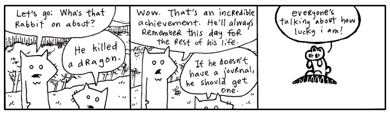

### The Making of Dwemthy’s Array

Fast forward to a time when the winds have calmed. The dragon is vanquished. The unwashed masses bow. We love you. We are loyal to you.

But what is this centipede nibbling in your eardrum? You dig with your finger, but you can’t get him out! Blasted! It’s that infernal Dwemthy’s Array again. **Explain yourself Dwemthy!**

Here, I shall unmask the List itself for you.

```python
class DwemthysArray(list):

    def __getattr__(self, name):
        if not self:
            raise AttributeError(name)

        answer = getattr(self[0], name)

        if self[0].life <= 0:
            self.pop(0)

            if not self:
                print("[Whoa. You decimated Dwemthy’s Array!]")
            else:
                print(f"[Get ready. A wild {self[0].name} has emerged.]")

        return answer
```

By now, you’re probably feeling very familiar with inheritance. The `DwemthysArray` class inherits from `list` and, thus, behaves just like one. For being such a mystery, it’s alarmingly brief, yeah?

After all the hype, Dwemthy’s Array is actually just a list. Filled with monsters. But what does this extra code do?

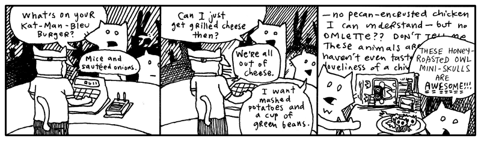

### Method Missing

Don’t you hate it when you yell “Deirdre!” and like ten people answer? That *never* happens in Python. If you call the `deirdre` method, Python looks for an attribute named `deirdre` and, if it finds one, that’s the one you get. You can’t have two methods with the same name in a class. If you add a second `deirdre` method, the first one disappears.

You can, however, have an object which **answers to names that don’t actually exist**.

```python
class NameCaller:
    def __getattr__(self, name):
        def dynamic_method(*args):
            print(f"You're calling `{name}` and you say:")
            for say in args:
                print("  " + say)
            print("But no one is there yet.")
        return dynamic_method

    def deirdre(self, *args):
        print("Deirdre is right here and you say:")
        for say in args:
            print("  " + say)
        print("And she loves every second of it.")
        print("(I think she thinks you're poetic.)")
```

When you call the method `deirdre` above, I’m sure you know what will happen. Deirdre will love every second of it, you and your dazzling poetry.

But what if you call `simon`?

```pycon
>>> NameCaller().simon("Hello?", "Hello? Simon?")
You're calling `simon` and you say:
  Hello?
  Hello? Simon?
But no one is there yet.
```
Python first tries to find an attribute called `simon`. There isn't one. So it gives `__getattr__` a chance to answer.

Note `__getattr__` method of NameCaller is quite interesting. Not only does it return a function but it defines a function right inside of itself! The `__getattr__` doesn't run this inner function `dynamic_method`, it just returns everything back as a function blueprint. The **asterisk** before the `args` means that **any arguments will be passed in as an List**. So in __getattr__, the outer function's job is to capture the name of the method you tried to call and return a function. Because we return the inner function, it's receives the arguments and is tasked to do something with them. 

In simple terms, our code `NameCaller().simon("Hello?", "Hello? Simon?")` becomes something like this `name = 'simon'` and `dynamic_method(["Hello?", "Hello? Simon?"]).

Yes, `__getattr__` is like an answering machine, which intercepts your method call. In Dwemthy’s Array we use call forwarding, so that when you attack the Array, it passes that attack on straight to the first monster in the Array.

The basic idea looks like this:

```python
def __getattr__(self, name):
    return getattr(self[0], name)
```
The collection doesn't need to know what attack you are making. Instead, it simply asks the first monster, “Do *you* know what this is?” And the monster gets to answer.

See! See! That skinny little `__getattr__` passes the buck!

Because of this neat trick also known as **dynamic attribute lookup**, our bold rabbit can fight an entire list of monsters  `rabbit % dwary` and fulfill his destiny. 

???+ warning "`__getattribute__`"
    There is also a more powerful hook called `__getattribute__`. Unlike `__getattr__`, which is called only when normal lookup fails, `__getattribute__` is called **for every attribute lookup**.

    ```python
    class NameCaller:
        def __getattribute__(self, name):
            print(f"Someone is asking for `{name}`.")
            return super().__getattribute__(name)

        def deirdre(self):
            print("Deirdre is right here!")
    ```

    Now *every* attribute access passes through `__getattribute__` and even our original method is overrided:

    ```pycon
    >>> caller = NameCaller()
    >>> caller.deirdre
    Someone is asking for `deirdre`.
    <bound method NameCaller.deirdre of ...>
    ```

    This makes `__getattribute__` extremely powerful and easy to abuse. It is useful when you genuinely need to intercept or customize **all** attribute access. For most situations, `__getattr__`, the simpler tool, is all we need!

## 4. So, Let's Be Clear: The Porcupine Is Now To The Sea

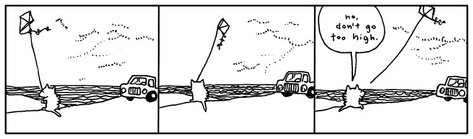

<a name="section5"></a>

Below is a Python-native conversion. I’ve kept the original structure, jokes, and pacing as much as possible, but changed the programming explanations where Python’s model is genuinely different—especially string formatting/interpolation, globals, copying, `eval`/`exec`, `%w`/`%x`, and regular expressions.

## 5. Walking, Walking, Walking, Walking and So Forth

The evening grew dark around the pair of foxes. They had wound their way through alleys packed with singing possums, and streets where giraffes in rumpled sportscoats bumped past them with their briefcases. They kept walking.

And now the stores rolled shut their corrugated metal lids. Crickets crawled out from the gutters and nudged at the loose change.

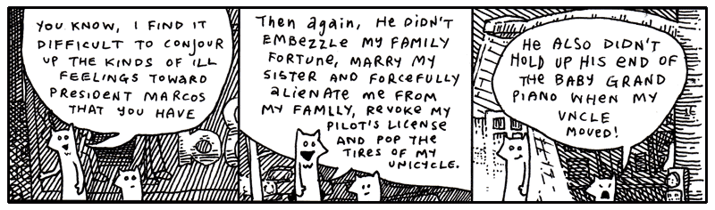

“Anyway, you must admit he’s a terrible President,” said Fox Small. *Why* does President Marcos have a rabbit as Vice President of the Foxes.”

“The Vice President? The rabbit with the *eyebrows*?”

“No, the rabbit with the **huge sausage lips**,” said Fox Small.

But their conversation was abruptly interrupted by a freckly cat head which popped from the sky just above the sidewalk.

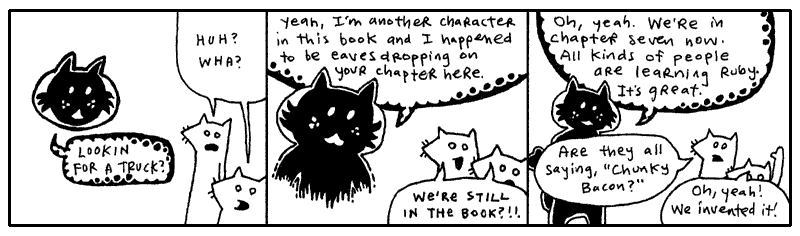

What is this about?!

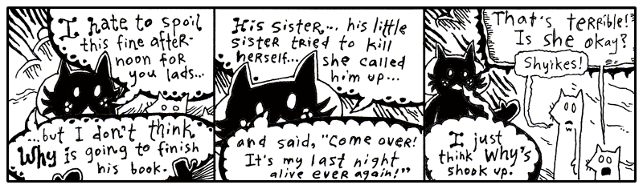

Oh, come on. This is rich. More meta.

I’m not going to bother illustrating this discussion Blix had with the foxes at this point! It’s all a **bunch of *conjecture***. *HOW* can they presume to know the landscape of my family drama? I love my sister. For a long time, I *worshipped* her. (This is my sister Quil.)

I admit that there was a pretty painful day a few months ago and I kind of freaked out. I was laid out on the long patio chair by the pool in my mom’s backyard. I had a Dr. Pepper and a bit of German chocolate cake. I was eating with a kid fork. Everything else was in the dishwasher, that’s all they had. Three prongs.

My mom started talking about Quil. All about how much money she was blowing on pants and purses. A five-hundred dollar purse. And then she said, “She’s losing it. She sounded totally high on the phone.” (She nailed it on the head, Quil was smoking dope and loving it.)

So I’d been noticing how observant my mom could be. That’s why, when she said, “I actually think she’s on cocaine,” I *physically* stood up and chucked my soda across the yard.

It sailed off into the woods somewhere. We had been talking awhile, so it was dark when the can flew. I paced a bit. And then I screamed at the top of my lungs.

My uncle Mike was standing there with the glass door open, staring at me. He said something totally nervous like, “Oh, okay. Well, I’ll—” And the tea in his glass was swishing back and forth, sloshing all over. He disappeared. He’s not very good at saying things to people. He’s more of a whistler. And resonant.

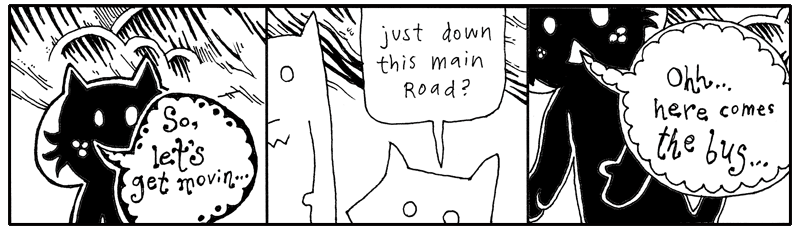

So, to be completely honest, yes, I got a little mad. I got mad. You know. I dealt with it. Quil calls me regularly. For some stupid reason, I rarely call her.

Plus, she didn’t end up killing herself. So it’s just not an issue. Who knows if it was real. She just had a lot of vodka. And she’s little. So it was just scary to see Quil guzzling it down like that. I mean forcing it down.

But why talk about it? It’ll just make her feel like I’m disappointed. Or like I’m a jerk.

Well, I got off track there a bit. Where was I? Blix is basically helping the foxes around, getting them on the trail of their truck. Yeah, back to all that.

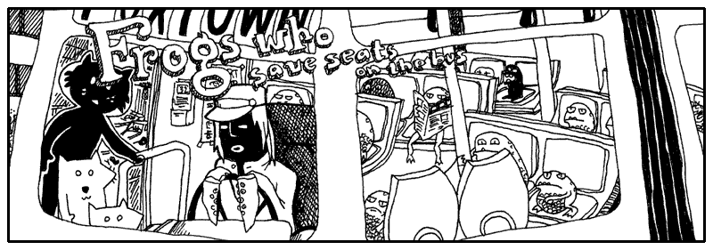

“We can’t squeeze on to this bus,” said the smallest fox.

“Guys, walk on up,” said Blix. “What’s the hold up? Oh, the frogs. Yeah, just squeeze through.” Blixy pushed from behind.

“Hey,” said the Tall Fox. “I’m crammed on this little step! Somebody move!”

“Did you get through—young fox??” said the cat.

“No,” said Fox Small, “can’t you see? The driver keeps shaking his head and it’s *really* making me nervous. I don’t think he wants us on.”

“Go,” said Blix. He stepped down from his step and walked around the bus, peering through the plexiglass windows. “Well, I don’t know, guys. I dunno. I guess it’s got a lot of frogs.” He pounded on the window. “Hey! Move over!”

And that’s the reality of riding intercity transit in Wixl. It’s terribly competitive. The morning bus is so crowded that most white collar animals get frogs to hold their seat through the nighttime. For whatever reason, it works. It’s become this staple of their workflow and their economy.

### Printing with %, format(), and f-strings
If you can muster up a bit of imagination, you can see a **percent sign** as a frog’s slanted face. Got the picture in your head? Now let me show you frogs that camp out inside strings.

```pycon
>>> "Seats are taken by %s and %s." % ("a frog", "a frog with teeth")
'Seats are taken by a frog and a frog with teeth.'

>>> frogs = (44, 162.30)
>>> stats = "Frogs have filled %d seats and paid %f blue crystals."
>>> stats % frogs
'Frogs have filled 44 seats and paid 162.300000 blue crystals.'
```

The `%s` format is for placing strings. The `%d` format is for placing integers, while `%f` is for floating-point numbers.

Python's `%` string formatting is an older style of string formatting that is still supported today. The values are placed into the string according to the format specifiers. If you provide several values, put them in a tuple.

Formatting is flexible with types. For example, `%s` will convert almost anything to a string:

```pycon
>>> frogs = ("44", "162.30")
>>> "Frogs have filled %s seats and paid %s blue crystals." % frogs
'Frogs have filled 44 seats and paid 162.30 blue crystals.'
```

See, here's the `%` operator called like other operators:

```pycon
>>> "Please move over, %s." % "toothless frog"
'Please move over, toothless frog.'
```

You can also use the `format()` method, which provides a more flexible way to build strings:

```pycon
>>> "Frogs are piled {} deep and travel at {} mph.".format(5, 56)
'Frogs are piled 5 deep and travel at 56 mph.'
```

For the most part, you’ll encounter `%s` for strings, `%d` for integers, and `%f` for floating-point numbers when reading older Python code. Modern Python code will more often use f-strings or the `str.format()` method.

Yeah, so, frog formatting is really handy for building strings that are assembled from different kinds of data. But there’s another trick worth knowing. You can control the order in which values appear by using numbered fields with `str.format()`:

```pycon
>>> "This bus has {0} more stops before {1} o'clock. That's {0} more stops.".format(16, 8)
"This bus has 16 more stops before 8 o'clock. That's 16 more stops."
```

You can also allot a certain number of characters for each item, a width. If an item is smaller than the width, extra spaces will be used to pad it. A negative width in the old `%` formatting syntax left-justifies the value:

```pycon
>>> "In the back of the bus: %30s." % "frogs"
'In the back of the bus:                          frogs.'

>>> "At the front of the bus: %-30s." % "frogs"
'At the front of the bus: frogs                         .'
```

Fox Small kept looking up at the bus driver. Remember, he wouldn’t enter the bus!

“What’s the deal?” said Fox Tall. “Can’t you just get on and we’ll just stand in the aisle?”

“You really want to get on this bus? That driver has no hands,” said Fox Small, speaking close and hushed to Fox Tall, “and all he has, instead of hands, are sucker cups.”

“So what? You don’t think animals with tentacles can drive?”

“Well, not only is he going to flub up the steering wheel but he has all these legs all over the foot pedals. This is not smart. Let’s get another bus. Come on.”

“You know, he’s probably been driving like that all day. Is he really going to start crashing at this point in his career?”

“Buses do crash,” said Fox Small. “Some do. This smells crashworthy.”

“Sheer doo-doo!” And Fox Tall yelled to the driver, “Hey, cabby, how long have you been driving this bus for?”

The bus driver peered over darkly under his cap and started to turn toward them, but his tentacles were stuck to the wheel. He jerked swiftly at his forelegs and, failing their release, he turned to the wheel and focused his energies on milking his glands for some slicker secretions. Bubbles of mucus oozed.

“Let’s get outta here,” said Fox Tall and the two ran off into the street, slamming right into the cat Blix.

“Alright, well, the bus is full,” said Blix. “I don’t know why the driver stopped if he knew the bus was crammed with hoppers.”

“We’re thinking he was about to crash into us,” said Fox Tall, “and he opened the door to make it look like a planned route stop.”

“Keep in mind, Blix, we hadn’t really discussed that possibility out loud, so I haven’t had a chance to formally agree,” said Fox Small. “Nevertheless, it sounds rational to me.”

“I’m thinking all the buses are going to be full like this.” Blix bit his lip, thinking and flicking his eyes about. “Let’s just—” He pointed down the circuitry of apartment buildings that wound to the south. “But maybe—” He looked up and surveyed the stars, scratching his head and counting the constellations with very small poking motions from the tip of his finger.

“Are you getting our bearings from the stars and planets?” asked Fox Small.

Blix didn’t speak, he ducked off to the north through a poorly laid avenue back behind the paint store. But before we follow them down that service road, Smotchkkiss, I have one more frog for you, perched on a long lilypad that stretches out to hold anything at all.

```pycon
>>> cat = "Blix"
>>> print(f"Does {cat} see what's up? Is {cat} aware??")
Does Blix see what's up? Is Blix aware??
```

The little frogs from earlier (`%s` or `%d`) were only placeholders for single values, saving places in the string.

The lilypads above use a different trick. Inside an **f-string**, curly braces mark an expression that Python evaluates and inserts into the string. The `f` before the opening quote tells Python to create a formatted string.

An empty pair of curly braces isn't valid in an f-string:

```pycon
>>> f"{}"
  File "<stdin>", line 1
    f"{}"
      ^
SyntaxError: f-string: empty expression not allowed
```

When an expression appears inside the curly braces of an f-string, Python evaluates it and places the result in the string. This is called **string interpolation**.

```pycon
>>> fellows = ["Blix", "Fox Tall", "Fox Small"]
>>> print(f"Let us follow {' and '.join(fellows)} on their journey.")
Let us follow Blix and Fox Tall and Fox Small on their journey.
```

The lilypad can hold much more than a simple variable. You can call methods, use conditional expressions, and perform calculations right inside the braces.

```pycon
>>> blix_went = "north"
>>> direction = (
...     "a poorly laid avenue behind the paint store"
...     if blix_went == "north"
...     else "the circuitry of apartment buildings"
...     if blix_went == "south"
...     else "... well, who knows where he went."
... )
>>> print(f"Blix didn't speak, he ducked off to the {blix_went} through {direction}.")
Blix didn't speak, he ducked off to the north through a poorly laid avenue behind the paint store.
```

The foxes followed Blixy off behind the paint store and down the cracked, uneven asphalt. All of the stores on the dilapidated lane leaned at angles to each other. In some places, slabs of sidewalk jutted up from the ground, forming a perilous walkway, a disorderly stack of ledges. Almost as if the city planners had hoped to pay tribute to the techtonic plates. One small drug store had slid below the surface, nearly out of eyesight.

Truly, it was colorful, though. The paint store had been tossing out old paints directly onto its neighbors. The shops nearest the paint store were clogged with hundreds of colors, along the windowsills and in the rain gutters. Yes, on the walls and pavement.

Basically, beginning with the back porch of the paint store, the avenue erupted into a giant incongruous and poorly-dyed market.

Further down, a dentist’s office was primed with red paint and, over that, a fledgling artist had depicted a large baby who had fallen through a chimney and arrived in a fireplace full of soot. Crude black strokes marked the cloud of ashes raised during impact, easily mistaken for thick hair on the child’s arms and back. The child looked far too young to have much hair, but there they were: rich, blonde curls which toppled liberally from the child’s head. Under the child’s legs was painted the word *BREWSTER*.

The same artist had hit the library next store and had hastily slapped together a mural of a green sports car being pulled from the mud by a team of legless babies tugging with shiny chains. Again, the drastically blonde curls!

“I need answers,” said the Fox Tall, who had ground to a halt in front of the scenery.

“I’m starting to believe there’s no such thing,” said Fox Small. “Maybe these are the answers.”

“Brewster?” said Fox Tall. He walked nearer to the library and touched the cheek of one of the legless children who was closer in perspective. The child’s cheek appeared to contain a myriad of jawbones.

Blix was another two houses down, navigating through the askew brickwork, the paved gully that led to *R.K.’s Gorilla Mint*, as the metallic sticker on the door read. The building was plastered with miniature logos for the variety of payment options and identification acceptable at *R.K.’s Gorilla Mint*. Even the bars over the window were lined with insurance disclosures and security warnings and seals of government authorization, as well as addendums to all of these, carbon paper covering stickers covering torn posters and advertising. And all mingled with paint splashes that intruded wherever they pleased.

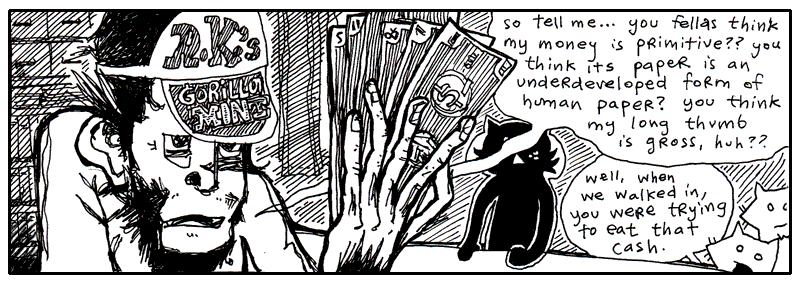

“I like the way the fresh paper feels against my tongue,” said the gorilla at the counter. His fingers rubbed quietly against the bills. He drew his face near to the fanned currency and whisked his nose along the pulpy cash.

“Is R.K. in this evening?” asked Blix.

“R.K. is not,” said the gorilla cashier. He turned to the three travelers and spread his money out on the counter’s surface, evenly spacing them apart and lining up all the edges neatly. “Now, which one of these do you think is worth the most?”

The foxes looked over the different bills and Fox Small muttered to himself, “Well, maybe—no, but I’ll bet—Wait, does one of these have bananas on it? ‘Cause that one—nope, no fruit or rope swings or—Terrible, this is difficult!” And in a lower voice, “So difficult to read. What does this one say? Symbols or something? If all these bills have are symbols, it’s going to be impossible for us to figure out which one is of the greatest value.”

“That’s why I said, ‘*Guess*.’” The gorilla tapped each bill in order. “See, you’ve got a 1 in 5 chance.”

“Unless the symbols mean something,” said Fox Tall. “Unless we can figure it out.”

“We can figure it out,” said Fox Small.

“No,” said the gorilla. “The symbols are meaningless.”

“Whoever created the money intended some meaning for them,” said Fox Small. “Why use *this* symbol?” He pointed to an ampersand printed in dark ink.

“Yeah, we saw you sniffing the money and fantasizing about it back there,” said Fox Tall. “I’ll bet these symbols mean all kinds of things to you!”

“No, I don’t think so,” said the gorilla.

If I can weigh in at this point, I think the symbols do have meaning. They may not be *loaded* with meaning, it may not be oozing out through the cracks, but I’m sure there’s a sliver of meaning.

### sys.path

For example, Python keeps the directories it searches for imported modules in `sys.path`:

```pycon
>>> import sys
>>> sys.path
['...', '...']
```

This list contains the directories Python searches when you import a module.

There are several other useful values in the `sys` module:

```pycon
>>> import sys
>>> sys.modules
```

`sys.modules` contains the modules that have already been imported. These modules are stored elsewhere, but their code is available to the current program.

The running program's filename is available through `sys.argv[0]`:

```pycon
>>> sys.argv[0]
'python'
```

The command-line arguments themselves are available through `sys.argv`:

```pycon
>>> sys.argv
['script.py', '--prompt', 'simple']
```

Python doesn't have a special global variable for the current exception. Inside an exception handler, you normally give the exception a local name:

```pycon
>>> try:
...     raise TypeError("I don't believe this information.")
... except TypeError as error:
...     print(error)
I don't believe this information.
```

And if you need the traceback, Python's `traceback` module can provide it:

```pycon
>>> import traceback
>>> try:
...     raise TypeError("I don't believe this information.")
... except TypeError:
...     traceback.print_exc()
```

“I don’t remember you.” Blix looked at the gorilla with great interest. “Are you one of R.K.’s kids or something?”

“Oh, come on!” said Fox Small, holding up a bill with an exclamation mark on it up to the gorilla’s nose. “Don’t tell me this means *nothing* to you! This one is probably *really important* since it has an exclamation on it. Maybe it pays for emergency stuff! Hospital bills or something!”

“Yeah, surgery!” said Fox Tall.

The gorilla looked at the foxes with disgust from under the brim of his cap.

“No, you’re wrong. You can’t pay for surgeries with that.”

“But you see our point,” said the small fox. He grabbed some of the other bills. “And you say this bill *cannot* pay for surgeries? Well that sounds like it has a specific *non-surgery-related* purpose. Now, the question mark one. Oh, what would that one be for?”

“Hey, give me those,” the gorilla snatched at the bills over the counter, but his long thumb kept getting in the way and every time he thought he had grabbed bills, it turned out he had only grabbed his long thumb.

“Hey, hey, look, he’s mad,” said Fox Tall, happily clapping. “I wonder why. Did you notice how mad he started getting once we mentioned all these interesting meanings? **We’re on to you! We figured out your game so fast!**”

“We totally did!” said Fox Small, one of his elbows caught in the grip of the gorilla, the other arm waving a bill that featured an underscore. “This one’s for buying floor supplies, maybe even big rolls of tile and linoleum.”

“See,” said Fox Tall, working to pry the gorilla’s fingers free, “we just have to figure out which is more expensive: surgery or linoleum! This is *so easy!*”

“**NO IT’S NOT!**” yelled the gorilla, yanking at the smaller fox and battering the fox with his palms. “**YOU DON’T KNOW ANYTHING ABOUT MONKEY MONEY!! YOU DON’T EVEN *HAVE* YOUR OWN KINDS OF MONEY!!**”

“We could *easily* have our own kinds of money!” said Fox Tall, taking the chimp’s hat and tossing it to the back of the room, where it sailed behind a wall of safety deposit boxes. “And—*your hat is outta here!*”

“Come on, give him back his bills,” said Blix, waving his arms helplessly from the sidelines. “We could really use this guy’s help.”

“Stop hitting me!” screamed the littlest fox. “I’ve almost figured out this one with the dots on it!!”

Suddenly, with great precision and without warning, Fox Tall grabbed the monkey’s nose and slammed his face down against the counter. The pens and inkpads on its surface rattled and “Bam!” said the fox. The gorilla’s eyes spun sleepily as his arms… then his neck… then his head slithered to the floor behind the counter.

### String Tools

Here are a few Python string tools you might care to use:

```pycon
>>> text = "Jeff,Jerry,Jill\nMichael,Mary,Myrtle"
>>> for names in text.splitlines():
...     print(names)
Jeff,Jerry,Jill
Michael,Mary,Myrtle
```

If you want to split on a particular separator, give it to `split()`:

```pycon
>>> "Jeff,Jerry,Jill\nMichael,Mary,Myrtle".split(",")
['Jeff', 'Jerry', 'Jill\nMichael', 'Mary', 'Myrtle']
```

And if you want to join strings, use `join()`:

```pycon
>>> ["candle", "soup", "mackarel"] .__class__
<class 'list'>

>>> "".join(["candle", "soup", "mackarel"])
'candlesoupmackarel'

>>> " * ".join(["candle", "soup", "mackarel"])
'candle * soup * mackarel'

>>> " # ".join(["candle", "soup", "mackarel"])
'candle # soup # mackarel'
```

In Python, you pass the separator directly to the method you are using e.g. `join(" # ",["candle", "soup", "mackarel"])`.

Outside the *Gorilla Mint*, Blix scolded the foxes. “We could have used that guy’s help! If he knows where R.K. is, we could use his cunning!”

“We don’t need that ape’s money!” said Fox Small. “We can make our *own* money!”

“We could support electronic wristbands!” said Fox Tall.

“His money is worthless,” said Blix. “It’s gorilla money. It has no value. It’s worse than blue crystals.”

“But it serves a purpose,” said Fox Tall.

“No it doesn’t,” said Fox Small. “He just said it’s worthless.”

“But what about linoleum and surgeries?” said Fox Tall.

“Yeah,” said Fox Small, up at Blix. “What about linoleum and surgeries?”

“If all the hospitals were staffed by gorillas and all the home improvement chains were strictly operated by gorillas, then—YES—you could buy linoleum and surgeries. But I *guarantee* that you would have very sloppy linoleum and very hideous surgeries. I don’t think you’d make it out of that economy alive.”

“So, if R.K. is so cunning,” said Fox Tall, grinning slyly, “why does he print such worthless currency?”

“It’s a cover for other activities,” said Blix. “Besides, if you’re so smart, why did you resort to violently pounding that poor gorilla?”

“I guess that was a bad play,” said Fox Tall, hanging his head. “My friend here will tell you that I’ve been on edge all day.”

“And your rage finally reared its fuming snout!” said Fox Small. “You’re finally living up to your goatee.”

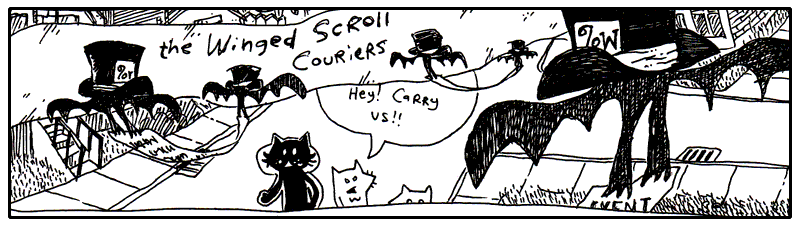

Down the lanes they travelled, the two foxes oblivious to their direction, but having a good time now that they had Blix leading the way with such urgency.

They lapsed into a careless wandering right behind Blix and spent their afternoon heckling most of the passersby.

One such target of their ongoing commentary was The Winged Scroll Carriers, pairs of bats that carry documents which need to be immediately sworn and notarized. There can be no delay, they must go swift, there is not even time to roll up the scroll, no, they must drop their swiss cheese and be out the door.

These couriers resemble a kind of Python construct called **delimited types**. A long series of characters comprises the scroll, flanked on each side by a bat bracing its curly wings to hold the scroll together. The opening bat wears a hat on which is written `%w`, which identifies the scroll as a set of words.

In Python, a quick way to turn a string into a list of words is `split()`:

```pycon
>>> bats = "The Winged Scroll Carriers".split()
>>> bats
['The', 'Winged', 'Scroll', 'Carriers']
```

The `%w` bats and their scroll, when fed into Python, emerge as a list of words. This is a shortcut in case you don’t want to go through the trouble of decorating each word with commas and quotes. You are in a hurry, too, there can be no delay. You jot out the words and let Python figure out where to cut.

Other bats, other hats. Python opts for a more explicit approach: the `subprocess` module.

```pycon
>>> import subprocess
>>> result = subprocess.run(
...     ["python", "--help"],
...     capture_output=True,
...     text=True,
... )
>>> print(result.stdout)
```

My favorite is the multiline string. Python's triple-quoted strings are especially useful when you need a string that runs on for many lines.

```python
m = "bats!"

code = f'''
def {m}():
    print("{{" * 100)
'''
```

Triple-quoted strings can contain newlines without requiring you to escape them. And, because this is an f-string, you can use curly braces for interpolation.

### Copy and Deep Copy

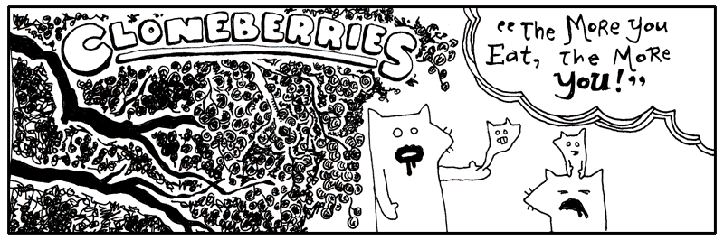

Blixy wagged his head. “Oh, dear me.”

“Egads! My hand is pregnant,” said Fox Tall, watching the little fox embryo slide about in his palm.

“They are good berries, though,” said Blix. “The wine they make from these berries will make ya grow a few eyeballs in your teeth. But no more than that.”

“Ah, pain!” yelled Fox Small, as his miniature squeezed out through the pores in his scalp. But soon he was cradling his little self and murmuring lullablies.

*Nevermore, nevermore, sweetly sang the nightingale. Winking starlight, sleeping still, whilst perched on a Sycamore stump.*

Making duplicates of Python objects is no more than a berry’s worth of code.

```pycon
>>> tree = ["berry", "berry", "berry"]
>>> treechild = tree.copy()
>>> treechild
['berry', 'berry', 'berry']
```

The `copy()` method makes a **shallow copy** of a Python list. How does this differ from regular assignment?

```pycon
>>> tree_charles_william_iii = tree
>>> tree_charles_william_iii is tree
True
```

Assigning an object to a variable only creates another nickname. The list above can be called `tree_charles_william_iii` now, or the shorter `tree`. The same object, but different names.

However, a copy is a new list. You can modify it without affecting the original list:

```pycon
>>> treechild.append("flower")
>>> treechild
['berry', 'berry', 'berry', 'flower']

>>> tree
['berry', 'berry', 'berry']
```

The `copy()` method doesn’t make copies of everything attached to the object, though. In the list above, only the list itself is copied. The objects inside are still shared.

For nested objects, Python provides the `copy` module. `copy.copy()` makes a shallow copy, while `copy.deepcopy()` recursively copies the objects contained inside:

```pycon
>>> import copy
>>> tree = [["berry"], ["berry"]]
>>> shallow = copy.copy(tree)
>>> deep = copy.deepcopy(tree)
```

This distinction becomes important whenever your objects contain other mutable objects.

You don’t always need to make copies of objects, though, since many Python operations create new objects for you. For example, `list()` can create a new list, string methods such as `replace()` return new strings, and comprehensions create new collections.

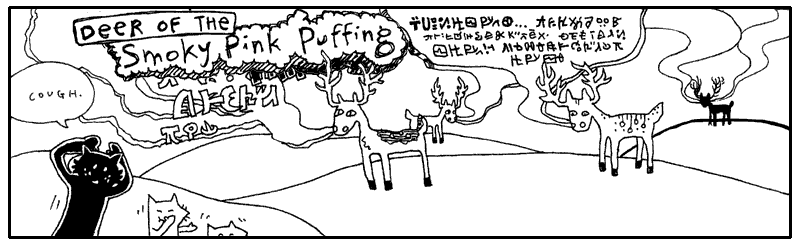

Over the hills and down the valleys, they ran through the grass where the Deer of the Smoky Pink Puffing roam. The sun was obscured by the lumbering pink clouds, emblazened with deer language, tinting the horizon a gradient of grapefruit and secreting a glow over the meadow. The clouds slid past each other, some bobbing upwards, destined for Canadian relatives. Others landing a readable distance from a recipient’s hooves.

“Let’s stop! *Please!*” yelled Fox Tall. “You can’t expect us to run in this **unbreathable fluff!**”

“Why are you yelling?” said Blix, as a thin stratus telegram wafted behind his legs. “You don’t need to raise your voice above a whisper. These long skinny clouds are usually just a mumble or a sigh. They may not even make it all the way.”

<aside class="sidebar" markdown="1">

### Steaks ‘n’ Slides

My uncles love waterslides and they also love steakhouses. They have these waterslide days which are directly followed by a trip over to Joey’s Steakhouse.

I *hate* Joey’s Steakhouse. It’s all big, brown shoe meat. Floppy and galoshy. Mixed with the stench of the uncles’ chlorine.

Pruny fingers on meat slabs is The Revolting.

It’s time for steaks and waterslides to come together in a truly repugnant manner. My uncles have had steaks and waterslides their whole lives. The dynasty of steaks and waterslides must come to a close. I will marry them in ways against nature!

Like this:

* Hand steaks to riders as they board the waterslide. Rider looks at the lifeguard. Lifeguard says wait. Rider looks again. The lifeguard pauses. Then. Okay, it’s time. *Go, kid, go!* And the look on that kid’s face as he rushes down the slope, paws full of chuck! *Go, kid, go!*

* Kids slide on top of steaks. For safety, we’d want the slides stacked five steaks deep.

* Or, steaks do the sliding. In their own little swim trunks.

* Or, people. With steak swim trunks.

* People and steaks, side-by-side.

* Steaks travelling down waterslides composed of steaks.

* Steaks travelling down waterslides made of people.

* And, of course, people eating steaks, but their tongues come out as waterslides and they have to push the steaks up the waterslides. Which is impossible and a lifeguard has to climb up the waterslide and manually insert the steak into the esophagus.

* Waterslides eating people and steaks eating people.

* Waterslides and steaks becoming friends after smelling people on each other’s breath.

* Or, steaks befriending waterslides, but waterslides not reciprocating. Waterslides become increasingly despondent and detached, getting into bad crowds and sinking into political extremity. Steaks make ankle bracelets out of people and leave them in the waterslides’ trouser pockets, when the trousers are unattended. They sneak out of the waterslide commune via a huge waterslide made of steak swim trunks.

* Or, like I said, people with steak swim trunks.

</aside>

“All that writing on the cloud is deer talk?” said Fox Small.

“Help! *Where are you guys?*” The taller fox ducked through a stormy tirade comprised of thick, billowing smoke and sharp wisps. He whirled in every direction, “Somebody yell if you’re there!”

He searched for a fissure in the dense matter, combing forward with his hands. The verbose, angry clouds responded by prodding him ahead, forcing him into tight corners in their brief pause between sentences. He landed in a sinkhole and kept his head down as the cascades of smoke surged forward.

“Yeah, deer can read this stuff,” said Blix. “They just face their target and shoot it out of their nostrils. I once heard of a guy who **rode** a stag’s love poem.”

“No way,” said Fox Small.

“Yep,” said Blix. “And that guy was me.” Blix reached over his shoulder and latched onto a spiral column of smoke that was twisting just above his head.

“You just have to know which clouds are wimpy and which clouds are grandiloquent.” Blix let the cloud pull him along and when the cloud banked upwards, Blix loosed his grip and kept his feet moving slowly along the ground.

“See, here’s a good one, long like a broom handle. A guy found one once and it was shaped *exactly* like a car: windshield, driver’s side airbag, power steering. Uncanny!”

“And that guy was—”

“It was!” And Blix climbed up atop the long icy cloud, with its dangling glyphs, and stood proudly, floating high above the small fox’s pointy shadow.

“Oh, I could do that,” said Fox Small. “Tall and I go jetskiing all the time. *I’ve stood up on my jetski.* It’s just like that.”

Fox Tall dashed through a descending puff, shattering its sentence, which letters came unglued and littered the ground with scrambled words, but he had only succeeded in reaching the depressive portions of the deer correspondence, which manifested itself as a dank and opaque mist.

Meanwhile, his smaller counterpart grabbed a narrow train of smoke that passed under his arm. He was airborned and yelled, **“Tallyho!”** But he held too tightly and the cloud evaporated under his arm and sent him back down with a short hop.

### Regexes 

Since you’re just beginning your use of Python, you may not fully grasp regular expressions (or *regexes*) at first. You may even find yourself clipping out regexes from a regular expression reference and pasting them into your code without having the foggiest idea why the expression works. Or *if* it works!

```python
import re

while True:
    password = input("Enter your password: ")

    if re.fullmatch(r"\w{8,15}", password):
        break

    print("** Bad password! Must be 8 to 15 characters!")
```

Do you see the unreadable deer language in the example code? The `r"\w{8,15}"` is a regular expression. If I may translate, the regex is saying, *Please only allow letters, numbers or underscores. No less than eight and no more than fifteen.*

Regular expressions are a mini-language built into Python and many other programming languages. I really shouldn’t say *mini*, though, since regexes can be twisted and complicated and much more difficult than any Python program.

Using regular expressions is extremely simple. It is like the Deer: making the smoke is an arduous process. But hooking your elbow around the smoke and driving it to the Weinerschnitzel to get mustard pretzel dogs is easy.

```pycon
>>> import re
>>> re.fullmatch(r"\w{8,15}", "good_password")
<re.Match object; span=(0, 12), match='good_password'>

>>> re.fullmatch(r"\w{8,15}", "this_bad_password_too_long")
```

The `re.fullmatch()` function checks whether the entire string meets the rules inside the regular expression. If the conditions are met, a `Match` object is returned. If not, you get `None`.

The most basic regular expressions are for **performing searches** inside strings. Let’s say you’ve got a big file and you want to search it for a word or phrase. Since a bit of time has passed, let’s search the Preeventualist’s Losing and Finding Registry again.

```python
import re

for page in searchfound("truck"):
    for line in page.splitlines():
        if re.search(r"truck", line):
            print(line)
```

This isn’t too different from the code we used earlier to search for lines with the word “truck”. A simple `if "truck" in line` is actually easier if you’re just looking for a simple word. The regular expression `r"truck"` does essentially the same search.

Uhm, what if truck is capitalized. **Truck.** What then?

```python
if re.search(r"[Tt][Rr][Uu][Cc][Kk]", line):
    print(line)
```

The **character classes** are the sections surrounded by **square brackets**. Each character class gives a list of characters which are valid matches for that spot. The first spot matches either an uppercase `T` or a lowercase `t`. The second spot matches an `R` or an `r`. And so on.

But a simpler way to write it is like this:

```python
if re.search(r"truck", line, re.IGNORECASE):
    print(line)
```

The `re.IGNORECASE` flag indicates that the search is **not case-sensitive**. It will match `Truck`. And `TRUCK`. And `TrUcK`. And other ups and downs.

Oh, and maybe your truck is a certain model number. A T-1000. Or a T-2000. You can’t remember. It’s a T *something* thousand.

```pycon
>>> re.search(r"T-\d000", "T-2000")
<re.Match object; span=(0, 6), match='T-2000'>
```

See, deer language. The `\d` represents a **digit**. It’s a placeholder in the regex for any digit. The regex will now match T-1000, T-2000, all the way up to T-9000.

### Character Classes

| Pattern | Matches                      | Equivalent                   |
| ------- | ---------------------------- | ---------------------------- |
| `\d`    | digits                       | `[0-9]`                      |
| `\w`    | word characters              | letters, numbers, and `_`    |
| `\s`    | whitespace                   | spaces, tabs, newlines, etc. |
| `\D`    | anything but digits          | `[^0-9]`                     |
| `\W`    | anything but word characters | `[^A-Za-z0-9_]`              |
| `\S`    | anything but whitespace      | `\s` negated                 |
| `.`     | almost any character         | —                            |

Building a regex involves chaining these placeholders together to express your search. If you’re looking for a number followed by whitespace: `r"\d\s"`. If you’re looking for three numbers in a row: `r"\d\d\d"`. Python uses the string itself to contain the regex; there are no opening and closing `/` delimiters.

A search for three numbers in a row can also be written as `r"\d{3}"`. Immediately following a character class like `\d`, you can use a **quantifier** to mark how many times you want the character class to repeat.

### Quantifiers

| Pattern  | Meaning                                        | Example         |
| -------- | ---------------------------------------------- | --------------- |
| `{n}`    | match exactly *n* times                        | `r"\d{3}"`      |
| `{n,}`   | match *n* times or more                        | `r"[a-z]{3,}"`  |
| `{n,n2}` | match at least *n* times but no more than *n2* | `r"[\d,]{3,9}"` |
| `*`      | match zero or more times                       | `r":\w*"`       |
| `+`      | match one or more times                        | `r"[-+]+"`      |
| `?`      | match zero or one time                         | `r"\d{3}[.]?"`  |

A really common regular expression is for matching phone numbers. American phone numbers, including an area code, can be matched using the digit character class and precise quantifiers.

```pycon
>>> re.search(r"\d{3}-\d{3}-\d{4}", "Call 909-375-4434")
<re.Match object; span=(5, 17), match='909-375-4434'>

>>> re.search(r"\(\d{3}\)\s*\d{3}-\d{4}", "The number is (909) 375-4434")
<re.Match object; span=(14, 28), match='(909) 375-4434'>
```

This time, instead of using `fullmatch()` to test the entire string, we used `search()` to find the expression anywhere inside the string. The `search()` function returns a `Match` object when it finds a match, and `None` when it doesn't.

The `Match` object contains useful information about the match:

```pycon
>>> phone = re.search(r"\(\d{3}\)\s*\d{3}-\d{4}", "The number is (909) 375-4434")
>>> phone.group()
'(909) 375-4434'
```

Most Pythonists prefer this approach, as it uses an object within a **local variable** rather than a global variable. Local variables are much easier to reason about. If you run two regular expressions in a row, each `Match` object can remain available as long as you keep it in a different variable.

Other than matching, another common use of regular expressions is to do **search-and-replace** from within Python. You can search for the word “cat” and replace it with the word “banjo.” Sure, you can do that with strings or regexes.

```pycon
>>> song = "I swiped your cat / And I stole your cathodes"
>>> song.replace("cat", "banjo")
'I swiped your banjo / And I stole your banjohodes'

>>> re.sub(r"\bcat\b", "banjo", song)
'I swiped your banjo / And I stole your cathodes'
```

The `re.sub()` function substitutes every match of the regular expression. Notice how in the first example, `str.replace()` replaced the word `cat` and the first three letters of `cathodes`.

If you only want to replace the first occurrence, give `re.sub()` a `count`:

```pycon
>>> re.sub(r"\bcat\b", "banjo", song, count=1)
'I swiped your banjo / And I stole your cathodes'
```

And so this chapter ends, with Blix and the Foxes cruising aloft the solid pink belched from a very outspoken deer somewhere in those pastures.


## 6. Just Stopping To Assure You That the Porcupine Hasn't Budged

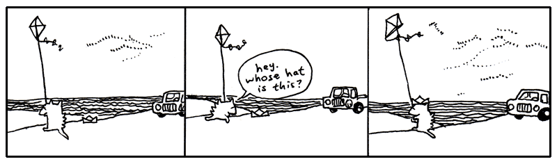

<a name="section7"></a>

## 7. I'm Out

<p style="float:right" markdown="1">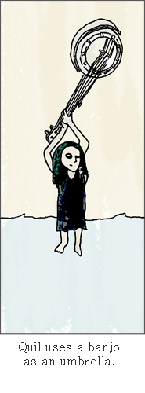</p>

<p style="float:left" markdown="1">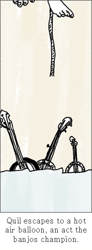
</p>

One day, back around the time I met Bigelow (that dog who walked off with the
balloons), I came back to my apartment hauling some board games I’d bought at a
garage sale. And Quil was on my porch. Which stunned me since she’d been in San
Antonio for like three years. She was sleeping in a sleeping bag on my porch.

She had run out of money to go to art school, so she stayed at my place for five
months or so.

I found this used bunkbed for our place. At night we’d sit in our beds and read
each other stories from our notebooks. I was writing a book about a kid who’s a
detective and he’s trying to figure out who killed this kid on his tennis team
and all these animals end up helping him figure it out. She was writing a book
about this kid who puts an ad in the classifieds to get other kids to join his
made-up cult and they end up building a rocket ship. But during most of her book
these kids are lost in the woods and pretty directionless, which I got a kick
out of hearing each night.

Yeah, each night it was poetry or stories or ideas for tricking our neighbors.
Our neighbor Justin was a big fan of Warhammer and he had all these real swords
and tunics. We decided to make suits of armor out of tin foil and go attack his
apartment. We started ransacking his apartment and he loved it. So he made his
own suit of armor out of tin foil and we all went to a professional glamour
studio and had a quality group shot taken.

<p style="float:right">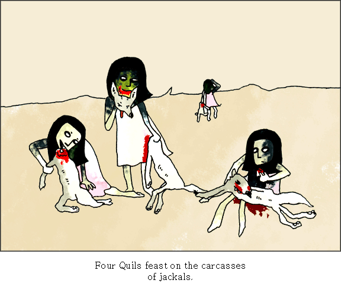</p>

I’m not saying my life is any better than yours. I just miss my sister. Life
isn’t like that now. We’re dissolved or something.

I don’t know. I’m confused. Is this growing up? Watching all your feathers come
off? And even though some of those feathers were the most lovely things?

I’m having a hard time telling who stopped it all up. Who stopped loving who?
Did I stop caring? Maybe I only saw her in two-dimensions and I didn’t care to
look at the other angles. I only saw planes. Then she shimmied up the z-axis
when I wasn’t looking and I never did the homework to trace the coordinates. A
limb on a geometrical tree and I am insisting on circles.

Blix was right. I’m in so shape to write this book. Goodbye until I can shake
this.

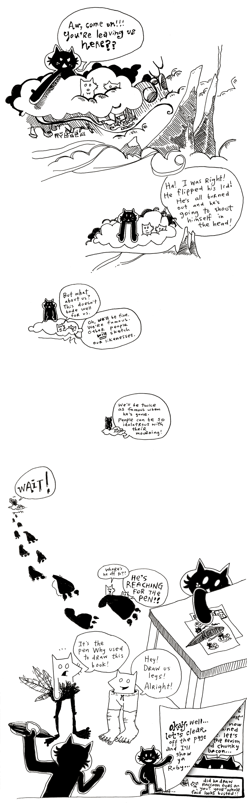


  [1]: http://regexlib.com/DisplayPatterns.aspx
