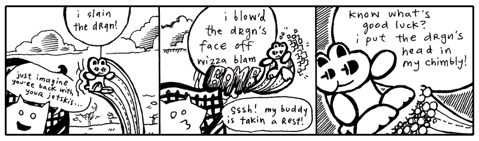
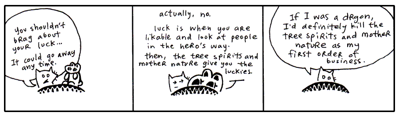
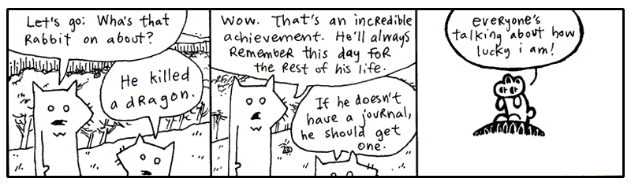
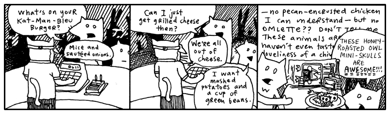
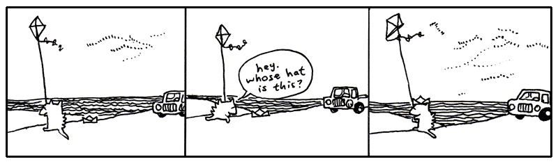
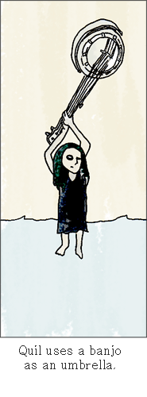
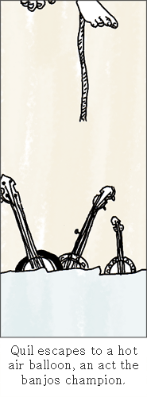
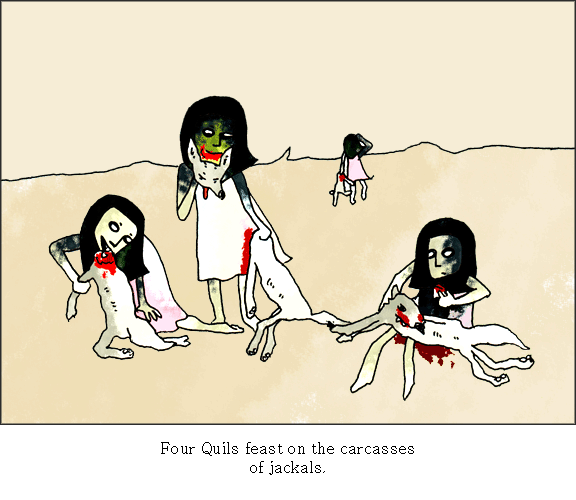

---
hide:
  - toc
---

# 6. A Sponsored Dragon-Slaying



[TOC]

“Look around,” said Fox Small. “Some of us don’t have time for quests. Some of
us have major responsibilities, jobs, so on. Livelihood, got it?”

“_Heyyyy_, my **<span class="caps">JOB</span>** was to kill the drgn!!” screamed
the wee rabbit, blinking his eyes and bouncing frantically from tree to tree to
pond to pond. 

!!! story ""
    “His snout was a **<span class="caps">HUGE</span>**
    responsibility!! His smoky breath was _mine to reckon with!!_ I spent fifty
    dollars on the cab **<span class="caps">JUST</span>** to get out there, which
    was another _huge huge_ ordeal. You have _nothing on me_, not a _single_
    indictment, my whole **<span class="caps">HERONESS</span>** is _absoflutely
    unimpeachable_, my whole **<span class="caps">APPROACH</span>** is _abassoonly
    unapricotable_, just ask Lester.”

    “Who’s Lester?” said the Fox Small.

    “Lester’s my cab driver! He parked at the base of Dwemthy’s Array!!” The rabbit
    ricocheted madly like a screensaver for a supercomputer. _“Just ask Dwemthy!!”_

    “Well,” said the Fox Small. He turned back to look up at Fox Tall, who was
    sitting straight and looking far into the distance. “Wait, they have a parking
    lot on Dwemthy’s Array?”

    **“YEP!!** And a pretzel stand!!”

    “But, it’s _an Array_? Do they sell churros?”

    **“CHOCOLAVA!!”** bleeted the rabbit.

    “What about those glow-in-the-dark ropes that you can put in your hair? Or you
    can just hold them by your side or up in the air—”

    **“BRAIDQUEST!!”**

    “You should get a cut of the salesman’s commission,” spoke Fox Small. “Folks
    came out to see you kill the dragon, right?”

    **“BUT!!** I don’t operate the tongs that actually extract the chocolava.”

    “I’m just sayin’. You **do** operate the killing mechanism. So you _have a stake_
    in the ensalada.”

    “OH NO!! I left my favorite lettuce leaves in Dwemthy’s Array!!” squealed the
    rabbit, twirling like a celebratory saber through the quaking oak. Distantly:
    “Or Lester’s trunk, maybe?”

    “You know—Gheesh, can you stay put??” said Fox Small.

    “My radio,” said Fox Tall, stirring to life for a moment, “in my pickup.” The
    glaze still seeping from his eyes. His stare quivered and set back into his
    face, recalling another time and place. A drive out to Maryland. Sounds of
    Lionel Richie coming in so clearly. The wipers going a bit too fast. He pulls up
    to a house. His mother answers the door. She is a heavily fluffed fox. Tears and
    makeup.

    Slumping back down, “That porcupine is changing my presets.”

    The rabbit bounded up on to the armrest of the park bench and spoke closely.
    **“BUT!!** Soon I will feast on drgn’s head and the juices of drgn’s tongue!!”
    The rabbit sat still and held his paws kindly.

    “(Which I hope will taste like cinnamon bears,)” whispered the rabbit,
    intimately.

    “I love cinnamon,” said Fox Small. “I should go killing with you some time.”

    “You should,” said the rabbit and the eyes shine-shined.

    “Although, salivating over a tongue. You don’t salivate over it, do you?”

    “I DO!!” and the rabbit got so excited that Sticky Whip shot out of his eyes.
    (More on Sticky Whip in a later sidebar. Don’t let me forget. See also: _The
    Purist’s Compendium to Novelty Retinal Cremes_ by Jory Patrick Sobgoblin,
    available wherever animal attachment clips are sold.)

“Okay, you’ve hooked me. I want to hear all about it,” Fox Small declared.
“Please, talk freely about the chimbly. Oh, and Dwemthy. Who is he? What makes
him tick? Then maybe, if I’m still around after that, you can tell me about what
makes rabbits tick, and maybe you can hold our hands through this whole missing
truck ordeal. I need consolation more than anything else. I could probably use
religion right now. I could use your personal bravery and this sense of
accomplishment you exude. Do you smoke a pipe? Could be a handy tool to coax
along the pontification we must engage in.”

And the rabbit began expounding upon Dwemthy and the legend of Dwemthy and the
ways of Dwemthy. As with most stories of Dwemthy, the rabbit’s tales were mostly
embellishments. Smotchkkiss, there are delicacies which I alone must address.

Please, never ask who Dwemthy is. Obviously he is a mastermind and would never
disclose his location or true identity. He has sired dynasties. He has set
living ogres aflame. Horses everywhere smell him at all times. Most of all, he
knows carnal pleasures. And to think that this…

This is his Array.

## 1. Dwemthy’s Array


You stand at the entrance of Dwemthy’s Array. You are a rabbit who is about to
die. And deep at the end of the List:

```py
class Dragon(Creature):
    _life = 1340       # tough scales
    _strength = 451    # bristling veins
    _charisma = 1020   # toothy smile
    _weapon = 939      # fire breath
```

A scalding _<span class="caps">SEETHING LAVA</span>_ infiltrates the
**cacauphonous <span class="caps">ENGORGED MINESHAFTS</span>** deep within the
ageless canopy of the _<span class="caps">DWEMTHY FOREST</span>_... chalky and
nocturnal screams from **the belly of the <span class="caps">RAVENOUS WILD
STORKUPINE</span>**... who eats **wet goslings** _<span class="caps">RIGHT
AFTER</span>_ they’ve had a few graham crackers and a midday nap… amidst starved
hippos _<span class="caps">TECHNICALLY ORPHANED</span>_ but truthfully sheltered
by umbrellas owned jointly by car dealership conglomerates… beneath _uncapped
vials_ of mildly pulpy **<span class="caps">BLUE ELIXIR</span>**... _which shall
remain… heretofore… **<span class="caps">UNDISTURBED</span>… <span
class="caps">DWEMTHY</span>!!!**_



_If you don’t understand Dwemthy’s Array, it is Dwemthy’s fault. He designed the
game to complicate our lives and were it simpler, it would not be the
awe-inspiring quest we’ve come to cherish in our arms this very hour._

Dwemthy’s Array has a winding history of great depth. It is not enough to simply
say, “Dwemthy’s Array,” over and over and expect to build credentials from that
act alone. Come with me, I can take you back a couple years, back to the sixties
where it all started with metaprogramming and the dolphins.

You might be inclined to think that **metaprogramming** is another hacker word
and was first overheard in private phone calls between fax machines. Honest to
God, I am here to tell you that it is stranger than that. Metaprogramming began
with _taking drugs in the company of dolphins_.


In the sixties, a prolific scientist named John C. Lilly began experimenting
with his own senses, to uncover the workings of his body. I can relate to this.
I do this frequently when I am standing in the middle of a road holding a pie or
when I am hiding inside a cathedral. I pause to examine my self. This has proven
to be nigh impossible. I have filled three ruled pages with algebraic notation,
none of which has explained anything. The pie, incidentally, has been very easy
to express mathematically.

But the scientist Lilly went about his experiments otherwise. He ingested <span
class="caps">LSD</span> in the company of dolphins. Often in a dark, woeful
isolation tank full of warm salt water. Pretty bleak. But it was science! (Lest
you think him criminal: until 1966, <span class="caps">LSD</span> was supplied
by Sandoz Laboratories to any interested scientists, free of charge.)

**Drugs, dolphins and deprivation.** Which led to Lilly’s foray into things
meta. He wrote books on mental programming, comparing humans and computers. You
may choose to ingest any substance you want during this next quote—most likely
you're reaching for the grain of salt—but I assure you that there’s no Grateful
Dead show on the lawn and no ravers in the basement.

> When one learns to learn, one is making models, using symbols, analogizing,
> making metaphors, in short, inventing and using language, mathematics, art,
> politics, business, etc. At the critical brain (cortex) size, languages and
> its consequences appear. To avoid the necessity of repeating learning to
> learn, symbols, metaphors, models each time, I symbolize the underlying idea
> in these operations as metaprogramming.
>
> John C. Lilly, <em>Programming and Metaprogramming in the Human
> Biocomputer</em>, New York, 1972.

We learn. But first we learn to learn. We setup programming in our mind which is
the pathway to further programming. (Lilly is largely talking about programming
the brain and the nervous system, which he collectively called the
_biocomputer_.)

Lilly’s metaprogramming was more about feeding yourself imagery, reinventing
yourself, all that. This sort of thinking links directly to folks out there who
dabble in shamanism, wave their hands over tarot cards and wake up early for
karate class. I guess you could say metaprogramming is New Age, but it’s all
settled down recently into a sleeping bag with plain old nerdiness. (If you got
here from a Google search for “C++ Metaprogramming”, stick around, but I only
ask that you _burn_ those neural pathways that originally invoked the search.
Many thanks.)

Meta itself is spoken of no differently in your author’s present day.

> All sensuous response to reality is an interpretation of it. Beetles and
> monkeys clearly interpret their world, and act on the basis of what they see.
> Our physical senses are themselves organs of interpretation. What
> distinguishes us from our fellow animals is that we are able in turn to
> interpret these interpretations. In that sense, all human language is
> meta-language. It is a second-order reflection on the ‘language’ of our
> bodies—of our sensory apparatus.
>
> Terry Eagleton, <em>After Theory</em>, London, 2003, ch. 3.

To that end, you could say programming itself is a meta-language. _All code_
speaks the language of action, of a plan which hasn’t been played yet, but
shortly will. Stage directions for the players inside your machine. I’ve waxed
sentimental on this before.

But now we’re advancing our study, venturing into metaprogramming, but don’t
sweat it, **it’s still just the Python you’ve seen already**, which is why Dwemthy
feels no qualms thrusting it at you right away. Soon enough it will be as easy
to spot as addition or subtraction. At first it may seem intensely bright, like
you’ve stumbled across your first firefly, which has flown up in your face.
Then, it becomes just _a little bobbing light_ which makes living in Ohio so
much nicer.

<aside class="sidebar" markdown="1">
**Bread Riddles**

Question: Can one take five bites from a bread and make the shape of a bicycle?
Answer: Yes.

Question: Can one rip a bread in half and still fit the bread in an envelope?
Answer: Yes.

Question: Can one man take a bread and throw it while another man sits without
bread? Answer: Yes.

Question: Can four breads in a box be explained? Answer: Yes.

Question: Can a clerical error in my company books be attributed to bread?
Answer: Yes.

Question: Can dancers break through a scrim of bread? Answer: Yes.

Question: Can those same dancers, when faced with an inexplicably different
scrim of bread, fail to break through? Answer: Yes.

Question: Does bread understand my darkest fears and wildest dreams? Answer:
Yes.

Question: Does bread desire me? Answer: Yes.

Question: Will bread be invisible to robots? Answer: Yes.

Question: Can one robot take eight bites on a bread, without knowing it’s there,
and make the shape of a smaller bread? Answer: Yes.

Question: Should my clerics be equipped with bread? Answer: Yes.

Question: In relation to bread, will robots each have their own elephants?
Answer: Yes.

Question: Can one rip a bread in half and not let it ruin one’s game of
dominoes? Answer: Yes.

Question: Will we always love bread? Answer: Yes.

Question: Will we have more bread? Answer: Yes.

Question: Can four breads marry a robot’s elephant? Answer: Yes.
</aside>

Object-oriented programming is a way of organizing code around objects. But not as M.C. Escher would sketch it. The program isn't reaching back around and overwriting itself, nor are they climbing out of your screen and shaking hands with each other. No, it's much smaller than that.

Let's say it's more like a little orange pill you won at the circus. When you suck on it, the coating wears away and behind your teeth hatches a massive, floppy sponge brontosaurus. He slides down your tongue and leaps free, frolicking over the pastures, yelping, "Papa!" And from then on, whenever he freaks out and attacks a van, well, that van is sparkling clean afterwards.

Now, let's say someone else puts their little orange pill under the faucet. Not on their tongue, under the faucet. And this triggers a different cataclysm, which births a set of wailing sponge sextuplets. Umbilical cords and everything. Still very handy for cleaning the van. But an altogether different kind of chamois. And, one day, these eight will stir Papa to tears when they perform the violin concerto of their lives.

That's rather like what we're doing with classes. We put some common behavior and attributes into a class, and then use that class as a blueprint for creating objects.

The Creature class is our little orange pill. It contains the machinery that all our creatures can use. A Dragon is one of the creatures produced from that machinery.

```py
class Dragon(Creature):
    _life = 1340       # tough scales
    _strength = 451    # bristling veins
    _charisma = 1020   # toothy smile
    _weapon = 939      # fire breath
```

### Creature Code

Now, with a lateral slice across the diaphragm, we expose the innards of `Creature`. **Save this code into a file called `dwemthy.py`.**

```python
class Creature:
    @property
    def life(self):
        return self._life

    @property
    def strength(self):
        return self._strength

    @property
    def charisma(self):
        return self._charisma

    @property
    def weapon(self):
        return self._weapon
```

Focus on the four properties being set up in `Creature`. These are the little windows through which we can inspect the creature's innards. The values themselves will be supplied by each creature subclass.

The underscore is a convention that says, *Keep your paws off this. It's an implementation detail.*

Now we can create a dragon by giving it its own values:

```python
class Dragon(Creature):
    _life = 1340       # tough scales
    _strength = 451    # bristling veins
    _charisma = 1020   # toothy smile
    _weapon = 939      # fire breath
```

So when Python encounters:

```python
my_dragon = Dragon()
my_dragon.life
```

the inherited getter properties spring into action.

It's almost as if Python sneaks into the laboratory after hours, rummages through a drawer of spare monster parts, bolts everything together, transplants a spiny green heart, and gives the creature a healthy jolt of electricity.

**POWER UP! POWER UP!**

The resulting dragon is remarkably compact:

```python
class Dragon(Creature):
    _life = 1340       # tough scales
    _strength = 451    # bristling veins
    _charisma = 1020   # toothy smile
    _weapon = 939      # fire breath
```

Yet it already knows how to expose its attributes via the `@property` decorator from `Creature`:

```python
dragon = Dragon()

print(dragon.life)
print(dragon.strength)
print(dragon.charisma)
print(dragon.weapon)
```

The dragon never defines those properties itself. They are **inherited** from `Creature` as a baby dragon can inherit his mother's eyes.

And notice that we access `dragon.life`, not `dragon._life`. Again the underscore attributes are the creature's internal machinery and are a polite way of saying, "This is my internal machinery. Please don't poke it directly." 

The properties provide the clean public interface:

```python
dragon.life
dragon.strength
dragon.charisma
dragon.weapon
```

This is one of the pleasures of object-oriented programming. You teach a parent class a few tricks, and all of its descendants inherit them. One lesson, many monsters.

Our laboratory is beginning to look quite respectable.

Although there is still that matter of making the monsters **fight**.

### The Littlest Metaprogrammer

We've spent some time building creatures using object-oriented programming. Classes have attributes and behavior, child classes inherit from their parents, and properties give us a clean interface to an object's attributes.

But Python has another trick up its sleeve.

**Metaprogramming** is *writing code which writes code*. **But the program doesn't jump onto your screen and wrenching the keyboard from your hands.** It's much more civilized.

Python lets you inspect and modify classes while your program is running.

For example, we could create a property on `Creature` dynamically:

```python
setattr(Creature, "magic", property(lambda self: self._magic))
```

That's a rather astonishing little line.

The `setattr()` function sets an attribute on an object. Here, the object happens to be the `Creature` class itself.

The second argument, `"magic"`, is the name of the attribute we want to create.

The third argument is a `property` object:

```python
property(lambda self: self._magic)
```

Here we use `lambda` to create a tiny anonymous function. When someone asks a creature for its `magic`, the property calls this function, which reaches inside the object and returns `_magic`.

So this:

```python
setattr(Creature, "magic", property(lambda self: self._magic))
```
is **metaprogramming** and essentially creates the same property we could have written normally:

```python
class Creature:
    @property
    def magic(self):
        return self._magic
```

We'd use the new property like so to access an attribute on an instance (In this small example, `_magic` is a class attribute, so the value is set without needing `self`):

```pycon
>>> class Creature:
...     _magic = 10
...
>>> setattr(Creature, "magic", property(lambda self: self._magic))
>>> creature = Creature()
>>> creature.magic
10
```

Python is constructing part of a class for us while the program is running.

But why would we want to do this?

Imagine you have dozens of creature traits (attributes):

```python
_life
_strength
_charisma
_weapon
_speed
_armor
```

Writing the same `@property` over and over would become rather tedious. If all those properties follow the same pattern, Python can create them for us:

```python
for trait in ["life", "strength", "charisma", "weapon", "speed", "armor"]:
    setattr(Creature, trait, property(
        lambda self, name=trait: getattr(self, f"_{name}")
    ))
```
The name=trait default argument saves the current value of trait when the lambda is created. Without it, every property would end up using the final value from the loop. Giving `name` a default value bakes in the current `trait` right then and there, once and for all.

The lambda *closes* over the local name `name`. The default argument `name=trait` is important: it stores the current trait value when each lambda is created. Without that default, all of the lambdas would look up the loop variable later and use its final value (`"armor"`). We'll discuss closures in more detail later in the chapter. Just like a class (factory) method remembers some information to setup an object, closures let us setup functions with a bit of information, in this case, the `trait`.

Now one small piece of code creates all six properties.

**That's when metaprogramming starts earning its keep.** We're no longer using a complicated trick to replace one simple property. We're using Python to handle a whole family of repetitive definitions.

The laboratory doors are beginning to creak open. And somewhere inside, something is learning how to program itself.

Now that you've seen how Python can add a whole family of traits from one little list, it's time to peek at an even stranger trick.

`eval()`.

The `eval()` function takes a string and asks Python to evaluate it as an expression.

For example:
```python
eval("1 + 2")
# 3
```

You can even tuck the name of an attribute into a string:
```python
dragon = Dragon()
trait = "life"
eval(f"dragon.{trait}")
# 1340
```

Python is taking our little strings and turning them into instructions. It's like handing a note to a very literal laboratory assistant:

"Please examine the dragon's life."

The assistant squints at the note, turns it into Python code, and heads into the laboratory. This is a tiny taste of metaprogramming: writing code that works with code. But don't get too excited about handing `eval()` every mysterious scrap of paper you find. If the string comes from somewhere you don't trust, Python will happily evaluate whatever code is inside it. In other words, `eval()` is a powerful little creature. Keep it on a short leash.

The string becomes code. Python reads it, understands it, and gives you the result. This is where things start getting a little interesting.

Suppose we have a list of traits:
```python
traits = ["life", "strength", "charisma", "weapon", "speed", "armor"]
```
We could use `eval()` to print each trait for our dragon:
```python
for trait in traits:
    print(eval(f"dragon.{trait}")) #not recommended
```

For our purposes, the interesting part isn't that `eval()` can do simple math. It's that Python can take a description of code and turn that description into something executable. We've now given our creatures attributes, inherited those attributes from a parent class, and taken our first peek behind the curtain at code that can examine other code.

Python gives you metaprogramming powers, but that doesn't mean you should use them for everything. Most of the time, **we do** write out classes and methods normally for readability.

For example, using `eval()` like this is generally not recommended. If untrusted text reaches `eval()`, it can execute arbitrary code. 

Instead, we could use `getattr()` when you need an attribute whose name is stored in a string. `getattr()` performs attribute lookup and if necessary, validate attribute names, avoiding having to execute Python source code.

Instead of using `eval` to print all traits, we could have used `getattr`. 
```py
for trait in traits:
    print(getattr(dragon, trait, None))
```

And in the case of our little spell: `setattr(Creature, "magic", property(lambda self: self._magic))`. The explicit versions are waaay easier to read:

```python
class Creature:
    @property
    def magic(self):
        return self._magic
```
Anyone opening the file can immediately see what `magic` does. With `setattr()` with a `lambda` function, they have to stop, squint at the machinery, and mentally unpack what the program is doing.

Remember, the Pythonic approach is generally to **use plain code** when it does the job. Reach for dynamic techniques ONLY when they actually make a problem simpler. Don't summon a Python wizard when a perfectly good carpenter is standing right there with a hammer.

However, when you have a whole menagerie of creature traits, suddenly that wizard starts looking rather useful.

### Enough Belittling Instruction and Sly Juxtaposition—Where Is Dwemthy’s Array??

Tread carefully—here is **the other half of DWEMTHY’S ARRAY!!**

Add these methods to your `Creature` class (right alongside the `life`/`strength`/`charisma`/`weapon` properties you already saved in `dwemthy.py` — don't delete those!):

```python
import random

class Creature:
    ...  # (the life, strength, charisma, and weapon properties from before)

    def __repr__(self):
        return f"<{self.name}(life={self.life})>"

    @property
    def name(self):
        return self.__class__.__name__

    # This method applies a hit taken during a fight.
    def hit(self, damage):
        power_up = random.randint(0,self.charisma)

        if power_up % 9 == 7: 
            self._life += power_up // 4
            print(f"[{self.name} magick powers up {power_up}!]")

        self._life -= damage

        if self._life <= 0:
            print(f"[{self.name} has died.]")

    # This method takes one turn in a fight.
    def fight(self, enemy, weapon):
        if self.life <= 0:
            print(f"[{self.name} is too dead to fight!]")
            return

        # Attack the opponent
        your_hit = random.randrange(self.strength + weapon)

        print(f"[You hit with {your_hit} points of damage!]")
        enemy.hit(your_hit)

        # Retaliation
        print(enemy)

        if enemy.life > 0:
            enemy_hit = random.randrange(enemy.strength + enemy.weapon)

            print(f"[Your enemy hit with {enemy_hit} points of damage!]")
            self.hit(enemy_hit)

class DwemthysArray(list):
    def __getattr__(self, name):
        if not self:
            raise AttributeError(name)
        answer = getattr(self[0], name)
        if self[0].life <= 0:
            self.pop(0)
            if not self:
                print("[Whoa. You decimated Dwemthy’s Array!]")
            else:
                print(f"[Get ready. A wild {self[0].name} has emerged.]")
        return answer
```

This code adds two methods (plus a `name` property and a `__repr__`) to `Creature`. The `hit` method reacts to a hit from
another `Creature`. And the `fight` method lets you place your own blows against
that `Creature`.

When your `Creature` takes a hit, a bit of defense kicks in and your `charisma`
value is used to generate a power-up. Don't ask me to explain the secrets behind
this phenomenon. A random number is picked, some simple math is done, and, if
you're lucky, you get a couple of life points.

```python
self._life += power_up // 4
```
Integer division is performed using the floor division operator (`//`). It divides the numbers and rounds down to the nearest whole number (the floor).

Then, the enemy's blow is landed.

```python
self._life -= damage
```

That's how the `Creature.hit()` method works.

The `fight()` method checks to see if your `Creature` is alive. Next, a random hit
is placed on your opponent. If your opponent lives through the hit, it gets a
chance to strike back. Those are the workings of the `Creature.fight()` method.

I'll explain the rest of Dwemthy's Array in a second. I really will. I'm having
fun doing it. Let's stick with hitting and fighting for now.

## 2. Rabid Objects that Communicate

###Introducing: You.

You may certainly tinker with derivations on this rabbit. But official Dwemthy
Paradigms explicitly denote the code—and the altogether character—inscribed
below.

**Save this as `rabbit.py`.**

```python
import random

class Rabbit(Creature):
    _life = 10
    _strength = 2
    _charisma = 44
    _weapon = 4
    def __init__(self):
        self.bombs = 3

    # little boomerang
    def __xor__(self, enemy):
        self.fight(enemy, 13)

    # the hero's sword is unlimited!!
    def __truediv__(self, enemy):
        weapon = random.randrange(
            4 + (enemy.life % 10) ** 2
        )
        self.fight(enemy, weapon)

    # like popeye and spinach but with a bunny and lettuce
    # lettuce builds your strength and extra ruffage
    # flies in the face of your opponent!!
    def __mod__(self, enemy):
        lettuce = random.randint(0, self.charisma)

        print(f"[Healthy lettuce brings you {lettuce} life points!!]")

        self._life += lettuce
        self.fight(enemy, 0)

    # bombs, but you only have three!!
    def __mul__(self, enemy):
        if self.bombs == 0:
            print("[UHN!! You're out of bombs!!]")
            return

        self.bombs -= 1
        self.fight(enemy, 86)
```

You have four weapons. The boomerang. The hero's sword. The lettuce. And the
bombs.

To start off, open Python and import the classes we've created above.

```pycon
>>> from dwemthy import Creature, DwemthysArray
>>> from rabbit import Rabbit
```

Now, unroll yourself.

```pycon
>>> r = Rabbit()
>>> r.life
10
>>> r.strength
2
```

Good, good.

### Representing and Calling a Monster

Proper representation isn’t really a necessary part of dealing with a monster. It’s something Dwemthy add as a courtesy to our players. (Many call him twisted, many call him austere, but we’d all be ignorant to go without admiring the footwork he puts in for us.)

Before we snuck a `__repr__` method into `Creature` a couple of sections back, creating an object and looking at it in the Python Shell would have looked something like this:

```pycon
>>> r = Rabbit()
>>> r
<__main__.Rabbit object at 0x1043b5c10>
```

Have you noticed this before? Whenever you create an object in Python Shell without a custom `__repr__`, this noisy `#<__main__.Object object>`-style verbiage stumbles out! It’s a little name badge for the object. The `__repr__` method (short for representation) creates this name badge. The badge is just a string. 

As you saw, the default version isn’t particularly helpful, which is exactly why we gave `Creature` its own name badge earlier:

```python
def __repr__(self):
    return f"<{self.name}(life={self.life})>"
```

Now try:

```pycon
>>> Rabbit()
<Rabbit(life=10)>
```

And if we put that rabbit into a list:

```pycon
>>> rabbit = Rabbit()
>>> dragon = Dragon()
>>> [rabbit, dragon]
[<Rabbit(life=10)>, <Dragon(life=1340)>]
```

Python uses the rabbit’s and dragon's `__repr__` when displaying the list. This is why `__repr__` is so useful. It gives your objects a name badge. Not necessarily their legal name. Something more useful. A name badge you can actually read.

The thing is after each line input: the Python interpreter talks back. Every time you run some code in the interactive interpreter, the return value from that code is displayed. How handy. It’s a little conversation between you and Python. And Python is just reiterating what you’re saying so you can see it for yourself.

You could write your own Python prompt very easily:

```python
print(">> ", end="")
result = eval(input())
print("=>", repr(result))
```

This prompt won’t let you write Python code longer than a single line. It’s the essence of the interactive interpreter (Python REPL), though. How do you like that? Two of your recently learned concepts have come together in a most flavorful way. The `eval()` takes the typed code and runs it. The response from `eval()` is then passed to `repr()`, which gives us the useful representation of the resulting object.

And why `repr()` instead of simply `str()` which gives a string value of an object e.g. `str(10)` #'10'? The interactive interpreter intends to spit out useful representation for programmers, and `repr()` does just that. When you're building a little interactive prompt like this, `repr()` is exactly what you want.

Now, as you are fighting monsters in the interactive interpreter, an enemy's name can be displayed along with the life it has left.

We've spent all this time adding attributes on our creatures and adding a name badge, but what if the monster itself is called?

In Python, it can. An object becomes callable when its class defines __call__().

Replace the `__init__` at the top of your Rabbit class and add this new `__call__` method:
```python
class Rabbit(Creature):
    ...  # (the __xor__, __truediv__, __mod__, and __mul__ methods from before)

    def __init__(self, slogan=""):
        self.slogan = slogan
        self.bombs = 3

    def __call__(self):
        if self.slogan:
            print(self.slogan)
```

Now:
```pycon
>>> rabbit = Rabbit("i blow'd the drgn's face off!!")
>>> rabbit()
```
and the rabbit screams:

> i blow'd the drgn's face off!!

```pycon
>>> fake_rabbit = Rabbit("Thusly and thusly and thusly...")
>>> fake_rabbit()
```

> Thusly and thusly and thusly...

When Python sees `rabbit()`, it effectively invokes `rabbit.__call__()`. So __call__() lets an object behave like a function while still keeping its own attributes and state. The rabbit has become a callable object.

A creature with a name badge. A rabbit. A warrior with a slogan. What more could you possibly want?

### Rabbit Fights ScubaArgentine!

You cannot just go rushing into Dwemthy's Array, unseatbelted and merely
perfumed!! You must advance deliberately through the demonic cotillion. Or
south, through the thickets and labyrinth of coal.

For now, let's lurk covertly through the milky residue alongside the aqueducts.
And sneak up on the `ScubaArgentine`.

```python
class ScubaArgentine(Creature):
    _life = 46
    _strength = 35
    _charisma = 91
    _weapon = 2
```

To get the fight started, make sure you've created one of you and one of the
`ScubaArgentine`.

```pycon
>>> r = Rabbit()
>>> s = ScubaArgentine()
```

Now use the little boomerang!

```pycon
>>> r ^ s # xor
[You hit with 2 points of damage!]
<ScubaArgentine ...>
[Your enemy hit with 28 points of damage!]
[Rabbit has died.]
```

For crying out loud!! Our sample rabbit died!! The grass-muncher didn't seem to get us very far. 

### Creatures Remember and Work Together

Now a quick aside before we get back to the fight. What is the game mechanics behind our turn-based combat system? 

Each creature carries around its own state. A `ScubaArgentine` remembers how much life it has.

```python
s = ScubaArgentine()
print(s.life)
```

> 46

And when something happens to the `ScubaArgentine`, that state changes.

```python
s.hit(2)
print(s.life)
```

> 44


Objects become far more interesting when they interact.

A blood-thirsty rabbit can attack a scuba argentine at his own peril.

```python
r / s
```

The rabbit doesn't reach inside the scuba argentine and manually subtract life points. That would be terribly rude. Instead, the rabbit asks the scuba argentine to call hit behind the scenes and scuba argentine groans in pain and dock some life (If anyone, Python is the one reaching inside the objects and working them like sock puppets).

Somewhere inside the rabbit's battle code, the rabbit eventually does something like:

```python
s.hit(damage)
```

The scuba argentine manages its own life total. The rabbit manages its own attacks. Each object is responsible for its own affairs.

This idea of objects collaborating while keeping track of their own state is one of the central ideas behind object-oriented programming. It's what allows us to cleverly mimic the law of the jungle and survival of the fittest where a rabbit must fight a scuba argentine to survive.

???+ note "The big idea is messaging — Alan Kay"

    Alan Kay, the pioneer of Object-Oriented Programming (OOP) and creator of Smalltalk language expresses regret for calling it "Object-Oriented" Programming. He goes on to say that people focus too much on the objects (nouns) rather than the methods (verbs) which act as the messages passing between them, like gossip spreading around the neighborhood. _“I’m sorry that I long ago coined the term ‘objects’ for this topic because it gets many people to focus on the lesser idea. The big idea is ‘messaging’,”_ Alan Kay concludes. 
    
    The true life of OOP code isn't the isolated objects, but the dynamic network of constant communication between them. Long live communication-oriented programming.


### It's your funeral

<aside class="sidebar" markdown="1">
**The Shoes Which Lies Are Made Of**

*Earlier, I told you that “The Inadvertent Meteor” was the only story you
need to know in order to understand preeventualism. But, really, all you
need to understand about preeventualism is that it is still in its infancy
and any of its most basic concepts could change.*

*Which is why I've authored a competing story which I believe uncovers an
entirely different and very relevant intellectual scenario.*

There was a guy who had been around the block. And he wasn't very old, so
he decided to write a biography of his life.

Well, he started to lie in his biography. He made up some stories. But
mostly little stories that were inconsequential. Filler. Like he had a story
about a painting he'd done of a red background with elephant legs in front.

"Tell me the truth!" his girlfriend screamed, not knowing what was real 
and what was a hallucination.

But he didn't really have a girlfriend and hadn't ever painted anything of 
the sort. He further embellished the story by talking about a pricey auction 
he'd snuck into. An auction in New York City where he'd overheard his painting 
go to sale for twenty grand. But that wasn't the point of the story. The point 
was that he could fold his body to fit under a lid on a banquet tray. People 
would raise the lid and they wouldn't even notice him bracing himself inside. 
He didn't even mention the price his painting sold at.

Anyway, he really started to like that story (and others like it), to the
point where he started to ignore his friends and family, instead preferring
to watch what his lie self did after the auction. In his head.

So, then, one day he was shopping and he found a pair of shoes that had
stripey laces. And he grabbed the shoes and went to the store counter,
forcing them in the cashier's face, yelling, “Look! Look at these! Look!
These are the shoes my lie self would wear!”

And he bought the shoes and put them on and the whole Earth cracked open
and the cash register popped open and swallowed him up and he was suddenly
elsewhere, in his lie apartment, sitting down to paint dolphin noses, three
of them on a green background.

It was a lot of work, painting all those noses. And he went broke for a while
and had to stoop so low as to filming abominable snowman NASCAR.
</aside>

Grim prospects. I can't ask you to return to the rabbit kingdom, though. Just
pretend like you didn't die and make a whole new rabbit.

```pycon
>>> r = Rabbit()

>>> s = ScubaArgentine()

# attacking with boomerang!
>>> r ^ s # xor

# the hero's sword slashes!
>>> r / s # truediv

# eating lettuce gives you life!
>>> r % s # mod

# you have three bombs!
>>> r * s # mul
```

Pretty neat looking, wouldn't you say?

The code in `rabbit.py` alters the behavior of a few math symbols which work
only with the `Rabbit`. Python allows you to change the behavior of math
operators. After all, **math operators are just methods!**

The boomerang is normally the XOR operator:

```pycon
>>> 1 ^ 1
0
```

But `Rabbit` gives `^` a completely different meaning by defining
`__xor__()`.

The hero's sword normally divides numbers:

```pycon
>>> 10 / 2
5.0
```

But `Rabbit` gives `/` a new meaning by defining `__truediv__()`.

The lettuce normally gives the remainder of a division:

```pycon
>>> 10 % 3
1
```

But `Rabbit` gives `%` a new meaning by defining `__mod__()`.

And the bomb? Normally multiplication:

```pycon
>>> 10 * 3
30
```

But `Rabbit` gives `*` a new meaning by defining `__mul__()`.

Where it makes sense, you may choose to use math operators on some of your
classes. Python uses these operators on many of its own classes. Lists, for
example, have a handful of operators:

```pycon
>>> ["D", "W", "E"] + ["M", "T", "H", "Y"]
['D', 'W', 'E', 'M', 'T', 'H', 'Y']

>>> ["D", "W", "E", "M", "T", "H", "Y"] - ["W", "T"]
Traceback (most recent call last):
    ...
TypeError: unsupported operand type(s) for -: 'list' and 'list'

>>> ["D", "W"] * 3
['D', 'W', 'D', 'W', 'D', 'W']
```

Notice that Python's list doesn't support every operator. That's perfectly
fine. Objects only need to implement the operations that make sense for them.

You may be wondering: what does this mean for math, though? What if I add the
number three to a list? What if I add a string and a number? **How is Python
going to react?**

Please remember these operators are methods. But, since these operators
*aren't readable words*, it can be harder to tell what they do.

For example, when Python sees:

```python
10 / 3
```

it's essentially asking the number to perform its division operation. You can
see the underlying special method:

```python
(10).__truediv__(3)
```

Which gives:

```python
3.3333333333333335
```

These special methods are usually called **dunder methods**, short for
“double underscore” methods. You don't normally call them yourself. You use
the operator and let Python call the appropriate method behind the scenes.

And that's how the Rabbit's sword divides.

## 3. The Harsh Realities of Dwemthy’s Array <span class="caps">AWAIT YOU TO MASH YOU</span>!!

Once you’re done playchoking the last guy with his oxygen tube, it’s time to enter The Array. I doubt you can do it. You left your hatchet at home. And I hope you didn’t use all your bombs on the easy guy.

You have six foes.

```python
class IndustrialRaverMonkey(Creature):
    _life = 46
    _strength = 35
    _charisma = 91
    _weapon = 2


class DwarvenAngel(Creature):
    _life = 540
    _strength = 6
    _charisma = 144
    _weapon = 50


class AssistantViceTentacleAndOmbudsman(Creature):
    _life = 320
    _strength = 6
    _charisma = 144
    _weapon = 50


class TeethDeer(Creature):
    _life = 655
    _strength = 192
    _charisma = 19
    _weapon = 109


class IntrepidDecomposedCyclist(Creature):
    _life = 901
    _strength = 560
    _charisma = 422
    _weapon = 105


class Dragon(Creature):
    _life = 1340       # tough scales
    _strength = 451    # bristling veins
    _charisma = 1020   # toothy smile
    _weapon = 939      # fire breath
```

These are the living, breathing monstrosities of Dwemthy’s Array. I don’t know how they got there. No one knows. Actually, I’m guessing the `IntrepidDecomposedCyclist` rode his ten-speed. But the others: NO ONE knows.

If it’s really important for you to know, let’s just say the others were born there. Can we move on??

As Dwemthy’s Array gets deeper, the challenge becomes more difficult. Don't worry about how DwemthysArray works, we'll get to that soon. 
```python
dwary = DwemthysArray([
    IndustrialRaverMonkey(),
    DwarvenAngel(),
    AssistantViceTentacleAndOmbudsman(),
    TeethDeer(),
    IntrepidDecomposedCyclist(),
    Dragon(),
])
```

For the first time, we're not dealing with a single monster. We're dealing with a collection of monsters.

A Python list can hold numbers, strings, functions, classes, or objects. It doesn't much care what you put inside. A monkey, an angel, a deer with teeth, a decomposed cyclist, and a dragon may all sit together peacefully in the same list... for a while.

We can walk through the monster list, one monster at a time:

```python
for monster in dwary:
    print(f"A wild {monster.name} appears!")
```

```text
A wild IndustrialRaverMonkey appears!
A wild DwarvenAngel appears!
A wild AssistantViceTentacleAndOmbudsman appears!
A wild TeethDeer appears!
A wild IntrepidDecomposedCyclist appears!
A wild Dragon appears!
```

The `for` loop hands us each creature in turn. Like a tour guide at the world's least reassuring zoo.

Fight the Array and the monsters will appear as you go. Godspeed and may you return with 
harrowing tales and nary an angel talon piercing through your shoulder.

Start here:

```python
rabbit % dwary
```

Don't ask questions. Just swing wildly and hope nutrition prevails.

Oh, and none of this *"I'm too young to die"* business. I'm sick of that nonsense. I'm not going to have you insulting our undead young people. They are our future. After our future is over, that is.



### The Making of Dwemthy’s Array

Fast forward to a time when the winds have calmed. The dragon is vanquished. The unwashed masses bow. We love you. We are loyal to you.

But what is this centipede nibbling in your eardrum? You dig with your finger, but you can’t get him out! Blasted! It’s that infernal Dwemthy’s Array again. **Explain yourself Dwemthy!**

Here, I shall unmask the List itself for you.

```python
class DwemthysArray(list):

    def __getattr__(self, name):
        if not self:
            raise AttributeError(name)

        answer = getattr(self[0], name)

        if self[0].life <= 0:
            self.pop(0)

            if not self:
                print("[Whoa. You decimated Dwemthy’s Array!]")
            else:
                print(f"[Get ready. A wild {self[0].name} has emerged.]")

        return answer
```

You can add this new class to the end of your `dwemthy.py` file. You then import it, before using like so: `from dwemthy import DwemthysArray`. 

By now, you’re probably feeling very familiar with inheritance. The `DwemthysArray` class inherits from `list`, so it retains normal list behavior and adds its own missing-attribute behavior. For being such a mystery, it’s alarmingly brief, yeah?

Import the classes, create our rabbit, define the foes, and put them into a `DwemthysArray` and *finally* we can get started.
```pycon
rabbit % dwary
```

After all the hype, Dwemthy’s Array is actually just a list. Filled with monsters. But what does this extra code do?



### Method Missing

Don’t you hate it when you yell “Deirdre!” and like ten people answer? That *never* happens in Python. If you call the `deirdre` method, Python looks for an attribute named `deirdre` and, if it finds one, that’s the one you get. You can’t have two methods with the same name in a class. If you add a second `deirdre` method, the first one disappears.

You can, however, have an object which **answers to names that don’t actually exist**.

```python
class NameCaller:
    def __getattr__(self, name):
        def dynamic_method(*args):
            print(f"You're calling `{name}` and you say:")
            for say in args:
                print("  " + str(say))
            print("But no one is there yet.")
        return dynamic_method

    def deirdre(self, *args):
        print("Deirdre is right here and you say:")
        for say in args:
            print("  " + str(say))
        print("And she loves every second of it.")
        print("(I think she thinks you're poetic.)")
```

When you call the `deirdre` method above, I’m sure you know what will happen. Deirdre will love every second of it, you and your dazzling poetry.

But what if you call `simon`?

```pycon
>>> NameCaller().simon("Hello?", "Hello? Simon?")
You're calling `simon` and you say:
  Hello?
  Hello? Simon?
But no one is there yet.
```

Python first tries to find an attribute called `simon`. There isn't one, so it gives `__getattr__` a chance to answer.

Notice that the `__getattr__` method of `NameCaller` is quite interesting. Not only does it return a function, but it defines a function right inside itself! `__getattr__` doesn't run this inner function, `dynamic_method`. It simply hands it back to Python.

There's a little bit of magic happening here. The inner `dynamic_method` remembers the `name` from the `__getattr__` call that created it. This is called a **closure**: a function that remembers information from the place where it was created.

Why do we need to use a closure here? Because `__getattr__` creates a new function for every missing attribute. When we ask for `simon`, it creates a function that needs to remember `"simon"`. When we ask for `blix`, it creates another function that needs to remember `"blix"`. Without the closure, the `dynamic_method` function loses track of `name`. The closure gives each function its own little memory to hold on to the `name` that created it.  

??? question "What's a `closure`?"
    #### Closures

    Imagine you hire a little assistant, give them a task, and send them off into the world. Before they leave, you whisper a few important details in their ear: “When you see Alice, give her the blue envelope.” The assistant remembers. Even after you have left the room, they still have that information tucked away.

    Functions can do something similar.

    A **closure** is a function that remembers variables from the place where it was created. This is useful when we want to create a function with some information already attached to it, so the function can use that information later.

    For example, we can make a little greeting factory:

    ```python
    def make_greeter(name):
        def greet():
            return f"Hello, {name}!"

        return greet

    alice_greeter = make_greeter("Alice")
    bob_greeter = make_greeter("Bob")
    print(alice_greeter())
    # Hello, Alice!
    print(bob_greeter())
    # Hello, Bob!
    ```

    When `make_greeter()` creates `greet()`, the inner function remembers the `name` it was given. So `alice_greeter` remembers `"Alice"`, while `bob_greeter` remembers `"Bob"`.

    ??? info "Closures bind variables"

        In Python, closures bind variables, not values. This means the inner function **remembers the variable name itself**, rather than making a copy of whatever value the variable had when the closure was created. When the function is called later, it uses the current value of that variable within the scope where it was defined.

        For example:
        ```py
        def make_greeter(title):
            name = "Alice"

            def greet():
                return f"Hello, {title} {name}!"

            name = "Bob"
            return greet

        female_greeter = make_greeter("Mrs.")
        print(female_greeter()) # Hello, Mrs. Bob!
        male_greeter = make_greeter("Mr.")
        print(male_greeter()) # Hello, Mr. Bob!
        ```

        Closures give the possibility of adding a programmable 'short-term' memory to modify function behavior. So here we can create a male or female greeter. Because we don't pass  `name` to `make_greeter`, the `name` is static, set to the last value it is assigned in the `make_greeter` scope, "Bob". 
        
        To make the closure work dynamically again, we would simply add `name` as an argument to make_greeter and remove the assignments `name="Alice"` and `name = "Bob"`:

        ```py
        def make_greeter(title, name):

            def greet():
                return f"Hello, {title} {name}!"

            return greet
        ```

    That's the useful trick behind a closure: **a function can carry a little piece of its creation history around with it.**

So when `__getattr__` receives `"simon"`, it creates `dynamic_method`, which remembers `"simon"`. `__getattr__` then finishes, but the returned function still has access to that name. Later, when Python calls it, it knows exactly which missing attribute you were trying to reach.

In other words, `__getattr__` is a little **function factory**. It makes functions on demand, and closures let those functions remember what they were made for.

```py
NameCaller().simon(...)
NameCaller().deirdre(...)
NameCaller().blix(...)
```

Now look at the `dynamic_method` function definition.
```py
def dynamic_method(*args):
    ...
```

The **asterisk** before `args` means that any positional arguments are collected into a **tuple**. So `__getattr__` captures the name of the missing attribute, creates a function that remembers that name (via a closure), and hands the function back to Python.

Here's the sequence: `__getattr__` receives `"simon"` as `name` and creates `dynamic_method`. Because `dynamic_method` is a closure, it remembers `"simon"`. `__getattr__` then returns the function, and Python calls it with `"Hello?"` and `"Hello? Simon?"`. Those arguments become the `args` tuple. We loop over `args`, print them out, and we're done!

Yes, `__getattr__` is like an answering machine that intercepts your method call. 

In Dwemthy’s Array, we use a similar trick to perform something like **call forwarding**. When you attack the Array, it passes that attack straight on to the first monster in the list.

The basic forwarding idea looks like this:

```python
def __getattr__(self, name):
    return getattr(self[0], name)
```
So the rabbit can atttack the collection, which simply asks the first monster, “Do *you* know what method this is?” And the monster gets to answer.

See! See! That skinny little `__getattr__` passes the buck and the first monster calls its `fight` method!

Because of this neat trick also known as **dynamic attribute lookup**, our bold rabbit can fight an entire list of monsters  `rabbit % dwary` and fulfill his destiny. 

??? warning "Or use `__getattribute__` to intercept EVERY attribute lookup"
    There is also a more powerful hook called `__getattribute__`. Unlike `__getattr__`, which is called only when normal lookup fails, `__getattribute__` is called **for every attribute lookup**.

    ```python
    class NameCaller:
        def __getattribute__(self, name):
            print(f"Someone is asking for `{name}`.")
            return super().__getattribute__(name)

        def deirdre(self):
            print("Deirdre is right here!")
    ```

    Now *every* attribute access passes through `__getattribute__` and even our original method is overridden:

    ```pycon
    >>> caller = NameCaller()
    >>> caller.deirdre
    Someone is asking for `deirdre`.
    <bound method NameCaller.deirdre of ...>
    ```

    This makes `__getattribute__` extremely powerful and easy to abuse. It is useful when you genuinely need to intercept or customize **all** attribute access. For most situations, `__getattr__`, the simpler tool, is all we need!


## 4. Just Stopping To Assure You That the Porcupine Hasn't Budged




## 5. I'm Out

<p style="float:right" markdown="1"></p>

<p style="float:left" markdown="1">
</p>

!!! story ""
    One day, back around the time I met Bigelow (that dog who walked off with the
    balloons), I came back to my apartment hauling some board games I’d bought at a
    garage sale. And Quil was on my porch. Which stunned me since she’d been in San
    Antonio for like three years. She was sleeping in a sleeping bag on my porch.

    She had run out of money to go to art school, so she stayed at my place for five
    months or so.

    I found this used bunkbed for our place. At night we’d sit in our beds and read
    each other stories from our notebooks. I was writing a book about a kid who’s a
    detective and he’s trying to figure out who killed this kid on his tennis team
    and all these animals end up helping him figure it out. She was writing a book
    about this kid who puts an ad in the classifieds to get other kids to join his
    made-up cult and they end up building a rocket ship. But during most of her book
    these kids are lost in the woods and pretty directionless, which I got a kick
    out of hearing each night.

    Yeah, each night it was poetry or stories or ideas for tricking our neighbors.
    Our neighbor Justin was a big fan of Warhammer and he had all these real swords
    and tunics. We decided to make suits of armor out of tin foil and go attack his
    apartment. We started ransacking his apartment and he loved it. So he made his
    own suit of armor out of tin foil and we all went to a professional glamour
    studio and had a quality group shot taken.

<p style="float:right"></p>

!!! story ""
    I’m not saying my life is any better than yours. I just miss my sister. Life
    isn’t like that now. We’re dissolved or something.

    I don’t know. I’m confused. Is this growing up? Watching all your feathers come
    off? And even though some of those feathers were the most lovely things?

    I’m having a hard time telling who stopped it all up. Who stopped loving who?
    Did I stop caring? Maybe I only saw her in two-dimensions and I didn’t care to
    look at the other angles. I only saw planes. Then she shimmied up the z-axis
    when I wasn’t looking and I never did the homework to trace the coordinates. A
    limb on a geometrical tree and I am insisting on circles.

    Blix was right. I’m in so shape to write this book. Goodbye until I can shake
    this.