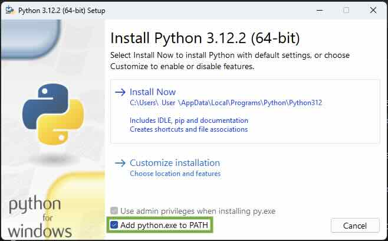

# The Tiger's Vest (Installing Python and using REPL)


<aside class="sidebar" markdown="1">
## About Python Versions

**Python 3** is the current major version of Python and is recommended for general use. New Python releases regularly introduce improvements, new features, performance enhancements, and bug fixes. When a new stable release becomes available, you can usually upgrade with confidence after confirming that any libraries you depend on are compatible.

You'll notice that Python version numbers are made up of three individual numbers, such as **3.14.7**. These numbers represent **the major version**, **the minor version**, and **the patch version**. The major version marks significant changes to the language, such as the transition from Python 2 to Python 3. The minor version introduces new features and improvements while maintaining compatibility with earlier releases in the same major version. The patch version is incremented as bug fixes, security updates, and small improvements are released.

Oh, and if I could give you a taste of how quickly Python evolves! New ideas are constantly discussed by developers from around the world through Python's enhancement proposal process and community forums. Features are debated, refined, tested, and eventually welcomed into the language. Someone always has something to complain about. It is a remarkably lively machine, forever being polished while somehow continuing to run.

</aside>

## Installing Python

Before we install Python, first we need to open the command shell, a text-based interface that allows you to talk directly to your Operating System. 

* To open a command shell in **Microsoft Windows**, open the Start Menu, type `cmd`, and press Enter.

* To open a command shell on **macOS**, run the **Terminal** application from Spotlight or Launchpad.

Okay, keep that command shell open, because we'll need it if the Earth gets rescued from its plummet toward the sun.

Now, let's install the latest version of Python on your computer so you can follow all the examples in the (Poignant) Guide and actually do things right now! (Yes, things!)

* If you are using **macOS**, Python may already be installed, but it's often an older version. Download the latest version from the [Python website][1] or install it using a package manager such as Homebrew.

```
brew install python
```

* On **Debian** or **Ubuntu**, use:

  ```
  sudo apt install python3
  ```

* On **Fedora**, use:

  ```
  sudo dnf install python3
  ```

* If you are using **Microsoft Windows**, download the [latest installer from the Python website][1] and run it. During installation, be sure to check the box labeled **"Add python.exe to PATH"**.



* If you are using Chromebook, the installation is more complicated. Hop over to [chromebook setup tutorial][2] and then come back here.


### Test the Install Worked

To test whether Python is installed, open a command shell and run:

```
  python3 --version
```

or on some systems:

```
  python --version
```

If Python is installed properly, you'll see a bit of version information.

```
  Python 3.14.7
```


Python comes with a very, very, very extremely helpful tool called the **Python REPL**. REPL stands for *Read-Eval-Print Loop*. In your command shell, type:

```
  python3
```

or on some systems:

```
  python
```

You should see a prompt similar to:

```
>>>
```

This prompt allows you to enter Python code and, upon pressing *Enter*, the code will run immediately.

So, at the Python prompt, try the following. 

You can copy the code fromt he code box by hitting the little copy icon in the top right of the box and then paste into terminal with Cmd + V (macOS) or Ctrl + V (Linux and Windows) and then hit Enter:

```pycon
>>> 3000 + 500
3500
```

The example `3000 + 500` is legitimate Python code. We're simply not assigning the answer to a variable. Which is perfectly acceptable in the REPL, because the REPL automatically prints the result of expressions that you enter.

The Python REPL makes a splendid calculator.

```pycon
>>> ((220.00 + 34.15) * 1.08) / 12

22.8735
```


```pycon
>>> int("1011010", 2)

90
```

```pycon
>>> from datetime import datetime 
>>> (datetime(2026, 3, 14, 15, 14) - datetime(2026, 3, 14, 13, 59)).total_seconds()
4500.0
```

The first example demonstrates a bit of math and is read as: *220.00 plus 34.15, times 1.08, divided by 12*. The second example takes a binary string and converts it to a decimal number. The third example computes the time between 1:59 PM and 3:14 PM on Pi Day, March 14, 2026, exactly 4,500 second.

The Python REPL faithfully prints the results back to us, making it an excellent place for experimentation, calculation, and the occasional act of scientific mischief.

## Understanding the Python Prompt

The prompt may look a bit bewildering at first. Fortunately, Python's prompt is much simpler than it appears.

When you start the Python REPL, you'll usually see:

```pycon
>>>
```

This prompt is Python's way of saying, "I'm listening. Type something."

Try entering a bit of code:

```pycon
>>> bell = "pressed"
>>> bell
'pressed'
```

Whenever you type an expression, Python evaluates it and displays the result.

Now let's try something that spans multiple lines:

```pycon
>>> if bell == "pressed":
...     ice_gun = "on"
... else:
...     ice_gun = "off"
...
>>> ice_gun
'on'
```

Notice how the prompt changes from `>>>` to `...` when Python realizes your code isn't finished. The three dots are Python's way of saying:

> "I'm still waiting. Don't leave me hanging."

The continuation prompt appears whenever you begin a statement that requires additional lines, such as an `if` statement, a function definition, a loop, or even an unfinished expression:

```pycon
>>> total = (
...     220.00
...     + 34.15
... )
>>> total
254.15
```

The `...` prompt is Python's equivalent of a little clerk holding your paperwork and waiting for the remaining pages.

If you are ever stuck in a `...` and want to make the clerk dump your paperwork and give you back control, hit Ctrl + C.  The keyboard shortcut trigger an interrupt on both Windows and macOS. 

```pycon
>>> asdf(
... 
... 
KeyboardInterrupt
>>> 
```

And if you ever want to exit the Python REPL completely, a simple `exit()` command will get you out of the triple `>` jail, lickety split. 

### Supercharging the Prompt

The standard Python REPL is simple

The primary prompt is:

```pycon
>>>
```

and the continuation prompt is:

```pycon
...
```

These two prompts are usually all you'll ever need.

If you want something fancier, however, there are enhanced Python shells such as **IPython**, which provide colored prompts, command history, syntax highlighting, tab completion, and many other conveniences.

But the standard Python prompt has a certain charm. Three arrows inviting you to experiment. No status reports. No line numbers. No bureaucracy.

Just you and the interpreter, staring at each other across a dark terminal window.

To try [IPython, check the installation guide to download it get it running on your system][3]. But for most, the built in Python REPL works just fine. 

### Tab Completion

One feature of Python that deserves far more applause than it receives is **tab completion**.

When you're using a modern Python shell such as **IPython** or the enhanced REPL included with recent versions of Python, pressing *Tab* will often help finish what you're typing.

Suppose you've typed:

```pycon
>>> [].app
```

Now press *Tab*. Python may politely finish the word for you:

```pycon
>>> [].append
```

It's a small convenience, but after a few days you'll begin reaching for the Tab key as instinctively as a squirrel reaches for an acorn.

If several completions are possible, pressing *Tab* may show you a list of available choices. This is particularly useful when you're exploring an unfamiliar object.

Try typing a number followed by a dot:

```pycon
>>> 42.
```

Then press *Tab* twice and Python may reveal a dazzling assortment of methods and attributes:

```pycon
>>> 42.
42.as_integer_ratio()  42.conjugate()         42.imag                42.real                                       
42.bit_count()         42.denominator         42.is_integer()        42.to_bytes(                                  
42.bit_length()        42.from_bytes(         42.numerator   
```

This trick works for almost anything. Strings. Lists. Dictionaries. Modules. If you're ever wondering what an object can do, type a dot and ask Python.

The interpreter may not know all the answers, but it is rarely shy about showing you its menu.


Okay, one last thing and then I’ll quit bugging you with all this great
technology. But I have to say it loud, so take cover! I’m across the world
here, folks, but the volume comes down from the sky—a bold, red
crescendo of—

<h1 style="font-size:84pt; color:#FDD; line-height: 120%;text-align:center;"><span style="color:#A53;">help</span>()</h1>

### The Built-In Oracle: help()

<h3 style="color: #300;text-align:center;">(Python's Own Genius Squad <em>Yes, Operator, Get the Documentation on the Line</em>—I'll Be Right Here—Just Plain Hammering the Help Key Until Someone Picks Up...)</h3>

Of course, seeing a method names with tab complete is only half the battle. What does it do?

Python comes equipped with a remarkably friendly oracle named `help`.

When `help` picks up the line. You rush in asking:

```pycon
>>> help(zip)
```

You expact a quick answer like 
> "This is a function, Operator. `zip`."

But without delay, right up on your teletype display (so swiftly that even the cat perched atop cranes his neck around, gapes and hands it the royal cup *Most Blatantly Great Thing Since Michael Dorn*), you are drowned by a sea of text:

```pycon
>>> help(zip)
Help on class zip in module builtins:

class zip(object)
 |  zip(*iterables, strict=False) --> Yield tuples until an input is exhausted.
 |
 |  The zip object yields n-length tuples, where n is the number of
 |  iterables passed as positional arguments to zip().  The i-th element
 |  in every tuple comes from the i-th iterable argument to zip().  This
 |  continues until the shortest argument is exhausted.
 |
 |  If strict is true and one of the arguments is exhausted before the
 |  others, raise a ValueError.
 |
 |     >>> list(zip('abcdefg', range(3), range(4)))
 |     [('a', 0, 0), ('b', 1, 1), ('c', 2, 2)]
 |
 |  Methods defined here:
 |
 |  __iter__(self, /)
 |      Implement iter(self).
 |
 |  __next__(self, /)
 |      Implement next(self).
... 
```

What is this stuff? Did I ask you for garbled dinner chucked at me from a far? 

No, this is an unabridged Python rule book servo—the Power of Just Asking is at your fingertips—*don't tell me you've never heard of this no-money-down lifetime-supply-of-proper-explanations!*

To get an explanation of any function, class, or other stuff, just use:

```pycon
>>> help(list)
```

For help on a particular method, use:

```pycon
>>> help(str.replace)
```

And for help on a module:

```pycon
>>> import itertools
>>> help(itertools)
```

What ever you are curious about, help has got you covered:
```pycon
>>> help(list.sort)
>>> help(list.append)
>>> help(str.upper)
```

This is your Python rule book servo. The entire language is sitting there, waiting for you to ask it a question.

### Into the Help Switchboard

Behind `help()` sings a chorus of human voices, primarily the Python developers and library authors who have spent years documenting the language. Many of the explanations you see are drawn directly from the Python documentation and from the docstrings written by the people who built the modules. Don't forget to thank them periodically.

Python gathers much of its information directly from the code itself.

Throughout the Python standard library, classes, functions, and methods often contain **docstrings**—special strings placed immediately after a definition—which describe how the code works.

In Python's `datetime` module, you might find documentation like this:

```python
class date:
    def weekday(self):
        """Return the day of the week as an integer.

        Monday == 0 ... Sunday == 6.
        """
```

The docstring shows up when we ask Python for help:

```pycon
>>> from datetime import date
>>> help(date.weekday)
```

Python can figure out a few things about a function automatically, such as its name and parameters, but it relies on programmers to write helpful docstrings explaining what the function actually does.

I would suggest that whenever you write a function, add a brief docstring immediately beneath its definition. In time, these descriptions become part of your project's documentation and are available through `help()` and `pydoc`.

For example:

```python
def time():
    """Get the time of this date as a list containing:

    * hours
    * minutes
    * seconds
    * fractions_of_a_second
    """
```

Python documentation tools recognize several conventions for formatting docstrings. Lists can be written using bullets. Examples can be indented. Longer descriptions can span multiple paragraphs.

Here's a bit of documentation from one of our own imaginary projects:

```python
class CatFeeder:
    def __init__(self, food, numb_of_cats=1, tiger=False):
        """Initializes the CatFeeder with food type and cat specifications.

        Args:
            food (str): The type of food to distribute (e.g., "fish", "kibble").
            num_of_cats (int, optional): The total number of cats to feed.
            tiger (bool, optional): True if feeding a tiger (at your own risk). Defaults to False.

        Example:
            >>> feeder = CatFeeder("fish", 2, tiger=False)
            >>> dinner = feeder.serve()
        """
```

Notice the example embedded directly in the documentation. Many Python documentation tools will display these examples exactly as written.

For the full set of docstrings rules see the [Specification section of the Docstring Conventions][4].

### Putting Your Docstrings to Work

Once you've written a few docstrings, save your code in a module. Suppose our `CatFeeder` class lives in a file named `catfeeder.py`.

Now import the module into Python:

```pycon
>>> import catfeeder
```

You can ask Python about the entire module:

```pycon
>>> help(catfeeder)
```

Or about the specific class:

```pycon
>>> help(catfeeder.serve)
```

Python will gather the docstrings you've written and display them right alongside information about the class and its methods.

So whenever you write a class or function, consider leaving a few helpful words behind. Someday, perhaps months from now, you'll type `help()` and be pleasantly surprised to discover that your past self has left instructions.

Well then. Your hands are in it all now. Welcome to Python.


[1]: https://www.python.org/downloads/
[2]: https://tutorial.djangogirls.org/en/chromebook_setup/
[3]: https://ipython.org/install/
[4]: https://peps.python.org/pep-0257/
