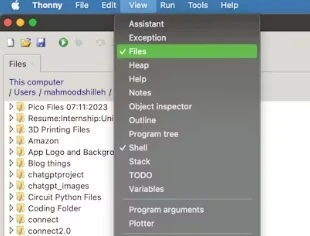
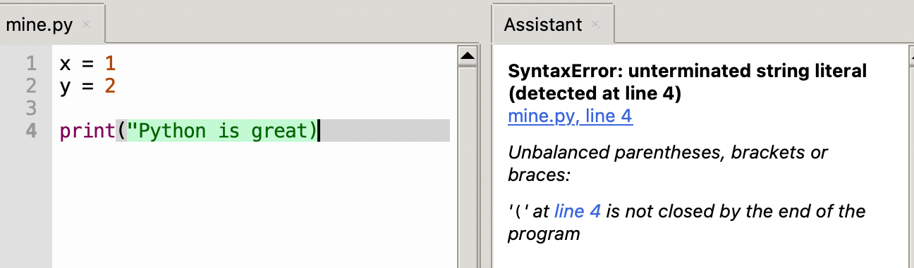
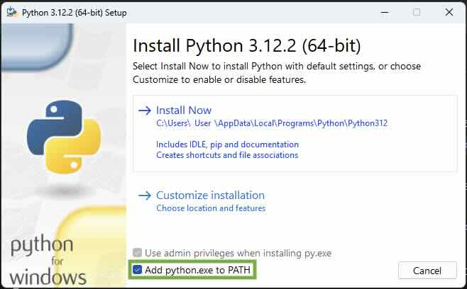

# The Tiger's Vest (Installing Python 3, Thonny, and the Shell)


<aside class="sidebar" markdown="1">
## About Python Versions

**Python 3** is the current major version of Python and is recommended for general use. New Python releases regularly introduce improvements, new features, performance enhancements, and bug fixes. When a new stable release becomes available, you can usually upgrade with confidence after confirming that any libraries you depend on are compatible.

Python version numbers have three parts, such as **3.14.7**: a **major** version, a **minor** version, and a **patch** version. The major version marks significant language changes, such as the transition from Python 2 to Python 3. The minor version adds features while maintaining compatibility within the major version. The patch version brings bug fixes, security updates, and small improvements.

Oh, and if I could give you a taste of how quickly Python evolves! New ideas are discussed by developers worldwide through Python’s enhancement-proposal process and community forums. Features are debated, refined, tested, and eventually welcomed into the language. Someone always has something to complain about. It is a remarkably lively machine, forever being polished while somehow continuing to run.
</aside>


## Install Python with an IDE

A command shell and the standard Python prompt are important tools to know. But we prefer a beginner-focused graphical place to write, run, inspect, and debug Python, so we will install **Thonny**. Thonny is a free, open-source Python IDE with many useful features for beginners.

What is an IDE and why do we need it? IDE stands for Integrated Development Environment and includes neat, beginner friendly features such as syntax highlighting (displays source code in different colors and fonts improving readability), highlighting syntax errors, auto completing code, and quick access to the system shell.

While Thonny or any other IDE is optional, they are quite useful for debugging.  There are other popular IDEs include Pycharm, VSCode and Cursor, but Thonny is lightweight and the quickest to get running out of the box, so is recommended. But if you already have your favorite IDE, go ahead and use that one instead and skip to the Optional section ["Installing Python to your OS"](#installing-python-to-your-os).

### Install Thonny (Best IDE for a beginner)

Most installers bundle Python, so you can install Thonny and Python together. 

* Download the installer for Windows or macOS from the [official Thonny website][7] and run it.

* On Linux, use your distribution package manager or the official installer.

```bash
# Debian / Ubuntu and related distributions
sudo apt install thonny

# Fedora
sudo dnf install thonny
```

Note, if you have an older computer that doesn't support the latest version of Thonny, you can try to install an [older version][6] (select a version from the Release List on the left, read the instruction, and click on Assets to download and install the older version). Or you can skip the IDE altogether and jump to: "Installing Python on your OS".

After installation, launch **Thonny** from your applications menu. Its main window contains an **Editor** for code and files and a **Shell** pane for immediate Python experiments.

* Use the Editor pane for longer code and programs you want to save.
* Use Python Shell pane for experiments, tiny calculations, and checking an idea.  

#### The Shell in Thonny

At the bottom of the Thonny window is its **Python Shell** or **Python REPL**. REPL means *Read-Eval-Print Loop*. We can type in some Python code and Thonny evaluates it immediately.

```pycon
>>> 3000 + 500
3500
>>> tiger_vest = "buttoned"
>>> tiger_vest
'buttoned'
```
 
#### Viewing Variables  

Now let's get to the cool part of using an IDE, viewing variables! Once your program has more than one value, you can view them by selecting **View → Variables**. Thonny displays the variables created by your program / Python REPL commands and their current values. 

Type this in the editor pane and then press the Play button:

```python
tiger = "wearing a vest"
ice_gun_temperature = -273
rescue_ready = True
```

The Variables view should show all three names and values. This view is especially useful when you expected `rescue_ready` to be `True`, but it somehow became `False`, or when a planet is unexpectedly frozen by a ice gun.

#### Opening, Viewing, and Running Files

You can manage files in Thonny using the File pane **View -> Files**. You will now see a list of files and folder on the left side. 



To set your working directory, navigate to the folder you want to use within the Files panel. You will see in Shell that the active directory gets set to this folder e.g. `%cd /Users/why/dev`.

*By default, running a script also changes your directory.* You can turn this on and off **Tools -> Options -> Run & Debug** tab and check or uncheck "Change working directory to script directory on Run / Debug".

The follow command confirms the current folder:
```py
import os
os.getcwd()
```

You can then import modules from this directory (modules are any `.py` files that contain Python definitions). Or you can open a file and run it by pressing play. 

#### Find Syntax Errors in Your Code and Debugging

Most IDEs will highlight syntax errors. Missing a closing quote or parentheses is a common beginners' error and syntax highlighting makes this easy to spot. 

Turning on the assistant by selecting **View → Assistant** can help guide you in right direction to debug errors. 



The debugger lets you pause a program and move through a program step by step while inspecting the values along the way. 

Try this example to test the debugger.

Create and save this file in the editor pane as `ice_gun.py` by selecting `File > Save`:

```python
def set_ice_gun(bell):
    if bell == "pressed":
        return "on"
    return "off"

bell = "pressed"
ice_gun = set_ice_gun(bell)
print(ice_gun)
```

Start debugging it by clicking on the little critter next to the play icon. 

The other icons light up allow you to step through the program, in different ways (big steps or little steps). Try each of the step buttons and watch your variables change in the Variables pane as you step through the program. 

### Install `requests` package in your IDE

Install a package is simplified with Thonny:

1. Open **Tools → Manage packages...**.
2. Search for package
3. Click the package name and click **Install** and wait for the success message.

Let's search for requests package, click on the first result *requests* and install the latest stable 
version. 

After that, `requests` is available to programs run in Thonny.

If you an IDE other than Thonny, you will likely need to install the `requests` package the traditional way using `pip`. See "Install Packages" in the next optional section for steps to install packages using `pip`.

## Installing Python to your OS

??? tip "Optional: Installing the latest version of Python to our Operating System"
 

    THIS SECTION IS COMPLETELY OPTIONAL. Skip if you are new to command shells so we can get back to Python programming.

    Thronny gives us all we need to get started, but for users that are familiar with using the command shell, we can go one step further and install Python to our operating system.  

    To install Python, first open a command shell: a text-based interface for talking directly to your operating system.

    - On **Microsoft Windows**, open the Start menu, type `cmd`, and press Enter.
    - On **macOS**, open **Terminal** from Spotlight or Launchpad.
    - On **Linux**, open your distribution’s Terminal application.

    Keep that command shell open, because we’ll need it if the Earth gets rescued from its plummet toward the sun.

    Now install a current version of Python so you can follow the examples in the (Poignant) Guide and actually do things right now. Yes, things!

    - On **macOS**, Python may already be installed, but it may not be the version you want. Download Python from the [Python website][1] or install it with Homebrew:

    ```bash
    brew install python
    ```

    - On **Debian** or **Ubuntu**:

    ```bash
    sudo apt install python3
    ```

    - On **Fedora**:

    ```bash
    sudo dnf install python3
    ```

    - On **Microsoft Windows**, download and run the [latest installer from the Python website][1]. During setup, select **Add python.exe to PATH**.

    

    - On a **Chromebook**, follow the [Chromebook setup tutorial][2], then return here.

    ### Test the Install Worked

    Open a command shell and run:

    ```bash
    python3 --version
    ```

    Or, on many Windows systems:

    ```bash
    python --version
    ```

    If Python is installed properly, you’ll see version information, such as:

    ```text
    Python 3.14.7
    ```

    If neither command works, revisit the installer or its PATH option. On Windows, closing and reopening Command Prompt after installation is often necessary.

    Now you can install third-party packages with `pip`, Python’s package manager. Check that it is available:

    ```bash
    python3 -m pip --version
    # Or, on many Windows systems:
    python -m pip --version
    ```


    ### Install Packages

    If needed, follow the official instructions to [install pip][3]. This book uses the `requests` package in Chapter 6 for HTTP requests:

    ```bash
    python3 -m pip install requests
    # Or: python -m pip install requests
    ```

    To test our packages, we can open REPL or Python Shell. 

    Open the command shell, and type:

    ```bash
    python3
    ```

    Or, on many Windows systems:

    ```bash
    python
    ```

    You should see:

    ```pycon
    >>>
    ```

    ### Use Latest Python in Thronny

    When Thronny is installed through its official Windows or macOS installer like we did in section one, it already bring its own version of Python and manages its own packages. Thonny runs in an isolated environment by default for its package management, which is useful because the Python used by Thonny is kept separate from other Python installations on your computer. So Python and packages we just installed with `pip` in the previous section do not automatically appear in Thonny. 
    
    You can see the current Python that Thonny is running at the bottom right of the program. 

    ```
    Local Python • Thonny's Python
    ```

    For us beginners, Thonny’s default Python version works great and is kept relatively up to date. 

    For advanced users that want to use the latest version of Python, we can select this version of Python to be used in Thronny. To see or change the version of Python Thonny uses, select **Run → Configure interpreter...** (the exact wording can vary slightly by release). 

    To find where the latest version of Python was just installed, use the following:

    * Windows (cmd): where python
    * Windows (PowerShell): (Get-Command python).Path
    * macOS / Linux (terminal): which python3

    We can now change the latest Python install in Thronny under Configure interpreter by selecting `..` and navigating to the location or typing the location in (on macOS, use **Command + Shift + G** or on Windows and Linux use **Ctrl + L** to get a pop up box where you can type in the location). 

## Understanding the Python Shell


Python comes with a very, very, very extremely helpful tool called the **Python Shell** or REPL. REPL means *Read-Eval-Print Loop*. 

When you start the standard Python Shell, you’ll usually see:

```pycon
>>>
```

Python is saying, “I’m listening. Type something.” The Python Shell makes a splendid calculator:

```pycon
>>> ((220.00 + 34.15) * 1.08) / 12
22.8735

>>> int("1011010", 2)
90

This prompt lets you enter Python code and run it immediately by pressing Enter. 

>>> from datetime import datetime
>>> (datetime(2026, 3, 14, 15, 14) - datetime(2026, 3, 14, 13, 59)).total_seconds()
4500.0
```

The first example does arithmetic. The second converts a binary string to a decimal number. The third computes the number of seconds between 1:59 PM and 3:14 PM on Pi Day, March 14, 2026: exactly 4,500 seconds.

!!! tip "Tip: Copy and paste examples into a Python Shell"

    Use the copy icon (:octicons-copy-24:) in the top-right corner of a code block. Paste into a command shell with Cmd+V on macOS or Ctrl+V on Linux and Windows, then press Enter. In Thonny, paste directly into the Shell or editor with the same shortcuts.

Try assigning a value:

```pycon
>>> bell = "pressed"
>>> bell
'pressed'
```

Expressions are evaluated and their results displayed. For code spanning multiple lines, the prompt becomes either `...` (or just indented empty space in the case of Thronny's Shell):

```pycon
>>> bell = "pressed"
>>> if bell == "pressed":
...     ice_gun = "on"
... else:
...     ice_gun = "off"
...
>>> ice_gun
'on'
```

The continuation prompt appears after a statement requiring more lines, such as an `if` statement, function definition, loop, or unfinished expression:

```pycon
>>> total = (
...     220.00
...     + 34.15
... )
>>> total
254.15
```

To leave the Python Shell, enter `exit()` followed by Enter. On macOS and Linux, Ctrl+D also exits; on Windows Command Prompt, Ctrl+Z. Note that in Thronny, you cannot leave the shell this way, but you can toggle it hidden by selecting **View -> Shell** 


### Tab Completion

In modern Python Shells, pressing Tab can complete names or show possible attributes. For example, type this in your Python Shell:

```pycon
>>> "".rep
```

Then press Tab to complete or choose `replace`. Completion helps you explore an unfamiliar object, but it is not a substitute for reading documentation with help.


### Testing Installed Packages

In the Python Shell run these commands to confirm the `requests` package was installed:

```pycon
>>> import requests
```

If the first line fails, go back to section title "Install `requests` package in Thonny" and make sure `request` package got properly installed. 

Let's test the `requests` package more and see where it is installed

```pycon
>>> import requests
>>> response = requests.get("https://github.com", timeout=10)
>>> print(response.status_code)
200
>>> print(requests.__file__)
...site-packages/requests/__init__.py
```

The exact path where your package gets installed varies. In Thonny, it should point inside the Python environment that Thonny is currently using (configured under **Run -> Configure interpreter**). In a command shell, it should point to your current Python environment.

### The Built-In Oracle: `help()`

(Python's Own 411 or 555-1212 or Yes, Operator, Get Belgrade on the Line—I'll Be Right Here—Just Plain Hammering The Zero Key Until Someone Picks Up…)

Once you know a name, ask Python what it means. Python’s built-in `help()` displays documentation for functions, classes, methods, and modules:

```pycon
>>> help(zip)
>>> help(list)
>>> help(str.replace)
>>> import itertools
>>> help(itertools)
```

In the standard REPL, `help()` may open an interactive help viewer; press `q` when you have finished reading. In Thonny, the Shell will display the documentation in its interface.

Behind `help()` are docstrings: documentation strings that authors place immediately inside a module, class, or function. Write useful docstrings in your own code so your future self can ask for help, too:

```python
def time_parts():
    """Return a list containing hours, minutes, seconds, and fractions of a second."""
```

For a longer example:

```python
class CatFeeder:
    def __init__(self, food, num_of_cats=1, tiger=False):
        """Initialize a feeder with food and cat specifications.

        Args:
            food: The food to distribute, such as ``"fish"`` or ``"kibble"``.
            num_of_cats: The number of cats to feed.
            tiger: Whether one of the cats is a tiger. Proceed carefully.
        """
```

Save this code in `catfeeder.py`, import it, and ask for help:

```pycon
>>> import catfeeder
>>> help(catfeeder)
>>> help(catfeeder.CatFeeder)
```

Well then. Your hands are in it all now. Welcome to Python.

??? tip "Creating a local environment: Useful when you have multiple projects"

    Software incompatibility is a scourge to programmers: a newer library can break older project code. A Python virtual environment gives each project its own installed packages and versions.

    Imagine each project has a private, clear Hello Kitty backpack. You pack only the tools and versions that project needs, keeping them from getting mixed up with other projects or the system Python.

    In Tronny, we can do this by selecting **Run ➔ Configure interpreter...** and clicking New local environment. You'll be prompted to select an empty directory for your new project's local environment. (Navigate to where you want to keep your project files (e.g., your Documents folder).and create a New Folder for your project (e.g., poignant_code). `Choose` that newly created, empty folder. You can then install packages that will available only to your virtual environment. 

    In a command shell, change into your project folder and create an environment named `.venv`:

        ```bash
        # macOS or Linux
        python3 -m venv .venv

        # Windows
        python -m venv .venv
        ```

    Activate it whenever you open a fresh command shell for this project:

        ```bash
        # macOS or Linux
        source .venv/bin/activate

        # Windows Command Prompt
        .venv\Scripts\activate
        ```

        A prefix such as `(.venv)` should appear in the prompt.

    Install your project packages:

        ```bash
        python -m pip install requests
        ```

    Once you have setup your virtual environment and confirm you are using the Python stored in the virtual environment by checking the path:

    * Thonny: **Tools -> Open system shell...**
    * Windows (cmd): where python
    * Windows (PowerShell): (Get-Command python).Path
    * macOS / Linux (terminal): which python3

    The reported path should point inside `.venv`.


[1]: https://www.python.org/downloads/
[2]: https://tutorial.djangogirls.org/en/chromebook_setup/
[3]: https://pip.pypa.io/en/stable/installation/
[6]: https://github.com/thonny/thonny/releases
[7]: https://thonny.org/
