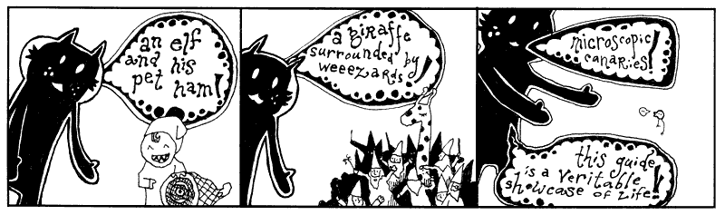
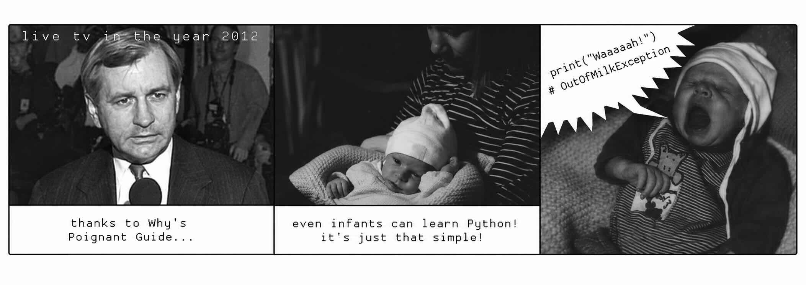
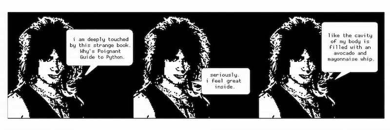
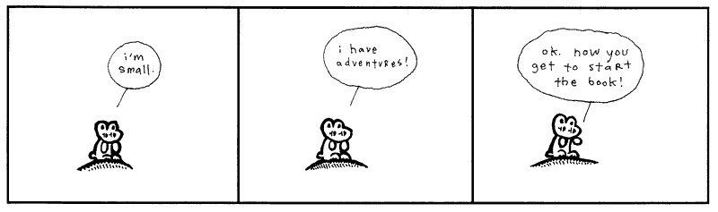

---
hide:
  - toc
---
# About this Book

This book, *Why's (Poignant) Guide to Python*, takes you from complete-Python beginner struggling to speak the language to writing your own `p2p role playing game`, where you conquer an array of deadly foes each stronger than the last.

That is, you will learn to think like a programmer, taking a large, impossible-looking problem and breaking it into smaller pieces. You will also teach a machine to follow your instructions while discovering a little something about yourself along the way.

Python happens to be an excellent traveling companion for this journey. It's easy to read, has powerful concepts, and gets out of your way so you can focus on lotteries and dungeons instead of wrestling with punctuation.

You do not need a degree in computer science. You do not need to be a math genius. You do not need to know what a compiler is or why programmers argue about text editors. A babe like curiosity is enough.

As we wander through these pages, don't be scared off by talking foxes, maniacal doctors, and angry rabbits. They are here to help us explore ideas that might otherwise seem intimidating. Behind every story hides a real programming concepts waiting to be uncovered.

